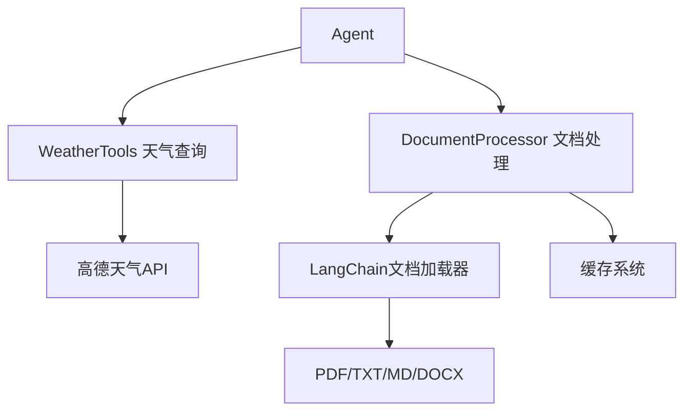

# 第16讲：工具类实现 - 天气查询与文档处理

> **本讲目标**：掌握具体工具类的实现，包括外部API集成和文档处理流程

## 一、Agent的工具体系

本讲实现两个核心工具：

**工具系统架构**：


**为什么需要这两个工具？**

| 工具 | 作用 | 难点 | 教学价值 |
|------|------|------|----------|
| **WeatherTools** | 外部API集成示例 | API调用、错误处理、数据格式化 | 学习第三方服务集成 |
| **DocumentProcessor** | 文档处理核心 | 多格式支持、缓存优化、元数据管理 | 学习RAG数据准备 |

## 二、文件结构概览

我们有两个文件（共653行）：

**weather_tools.py（310行）**：
- `WeatherService`类：核心服务（265行）
  - 城市代码查询
  - 当前天气查询
  - 天气预报查询
  - 信息格式化
- `WeatherTools`类：工具包装（35行）

**document_processor.py（343行）**：
- `DocumentProcessor`类：完整文档处理
  - 文件上传处理
  - 多格式加载器（PDF/TXT/MD/DOCX）
  - 缓存机制（MD5哈希）
  - 批量处理
  - 统计信息

## 三、代码实现详解

我们将代码拆分成5个部分讲解。

### 第一部分：天气服务初始化和城市代码查询（weather_tools.py 1-62行）
**代码文件：** `study-agentic-rag/03-smart-qa-application/services/weather_tools.py`


天气API通常需要城市代码（而不是城市名称），这部分实现城市名称到代码的转换。

<details>
<summary>点击展开代码</summary>

```python
import requests
import json
import logging
from typing import Dict, Optional, Any, List
from datetime import datetime
from config.settings import Settings

logger = logging.getLogger(__name__)

class WeatherService:
    """天气查询服务类"""

    def __init__(self):
        self.settings = Settings()
        self.api_key = self.settings.WEATHER_API_KEY
        self.weather_url = self.settings.WEATHER_API_URL
        self.city_url = self.settings.WEATHER_CITY_URL

        # 城市代码缓存
        self.city_cache = {}

    def get_city_code(self, city_name: str) -> Optional[str]:
        """获取城市代码"""
        try:
            # 检查缓存
            if city_name in self.city_cache:
                return self.city_cache[city_name]

            # 构建请求URL
            url = f"{self.city_url}"
            params = {
                "keywords": city_name,
                "subdistrict": 0,
                "key": self.api_key,
                "extensions": "base"
            }

            response = requests.get(url, params=params, timeout=10)
            response.raise_for_status()

            data = response.json()

            if data.get("status") == "1" and data.get("districts"):
                # 获取第一个匹配的城市
                districts = data["districts"]
                if districts and len(districts) > 0:
                    city_code = districts[0].get("adcode")
                    if city_code:
                        # 缓存结果
                        self.city_cache[city_name] = city_code
                        logger.info(f"获取城市代码成功: {city_name} -> {city_code}")
                        return city_code

            logger.warning(f"未找到城市: {city_name}")
            return None

        except requests.RequestException as e:
            logger.error(f"获取城市代码失败: {str(e)}")
            return None
        except Exception as e:
            logger.error(f"获取城市代码出错: {str(e)}")
            return None
```

</details>

**为什么这么写？**

1. **为什么需要城市代码缓存？**
   ```python
   self.city_cache = {}  # 内存缓存
   if city_name in self.city_cache:
       return self.city_cache[city_name]
   ```
   - **性能优化**：避免重复调用城市查询API
   - **节省配额**：减少API调用次数
   - **加速响应**：缓存命中后立即返回

2. **为什么用`timeout=10`？**
   ```python
   response = requests.get(url, params=params, timeout=10)
   ```
   - 防止API无响应导致程序挂起
   - 10秒是合理的超时时间（网络正常1-2秒即可）
   - 超时后抛出`requests.Timeout`异常

3. **为什么用`raise_for_status()`？**
   ```python
   response.raise_for_status()
   ```
   - 检查HTTP状态码（200-299为成功）
   - 4xx/5xx会抛出`requests.HTTPError`
   - 统一异常处理流程

4. **为什么返回`None`而不是抛出异常？**
   ```python
   if not city_code:
       logger.warning(f"未找到城市: {city_name}")
       return None  # 而不是raise
   ```
   - 城市未找到是正常业务场景（用户输错）
   - 返回`None`让调用方决定如何处理
   - 网络错误才抛出异常

### 第二部分：当前天气和预报查询（weather_tools.py 64-145行）
**代码文件：** `study-agentic-rag/03-smart-qa-application/services/weather_tools.py`


这部分调用高德天气API获取天气信息。

<details>
<summary>点击展开代码</summary>

```python
    def get_current_weather(self, city_name: str) -> str:
        """获取当前天气"""
        try:
            city_code = self.get_city_code(city_name)
            if not city_code:
                return f"抱歉，无法找到城市 '{city_name}' 的信息。请检查城市名称是否正确。"

            # 构建请求URL
            params = {
                "city": city_code,
                "key": self.api_key,
                "extensions": "base"  # base=实况天气
            }

            response = requests.get(self.weather_url, params=params, timeout=10)
            response.raise_for_status()

            data = response.json()

            if data.get("status") == "1" and data.get("lives"):
                weather_info = data["lives"][0]

                # 格式化天气信息
                result = self._format_current_weather(weather_info, city_name)
                logger.info(f"获取当前天气成功: {city_name}")
                return result
            else:
                error_msg = data.get("info", "未知错误")
                logger.warning(f"获取当前天气失败: {error_msg}")
                return f"获取天气信息失败: {error_msg}"

        except requests.RequestException as e:
            error_msg = f"网络请求失败: {str(e)}"
            logger.error(f"获取当前天气失败: {error_msg}")
            return f"获取天气信息失败，请稍后重试。"
        except Exception as e:
            error_msg = f"获取当前天气出错: {str(e)}"
            logger.error(error_msg)
            return f"获取天气信息时发生错误: {str(e)}"

    def get_weather_forecast(self, city_name: str, days: int = 3) -> str:
        """获取天气预报"""
        try:
            if days < 1 or days > 7:
                return "预报天数必须在1-7天之间。"

            city_code = self.get_city_code(city_name)
            if not city_code:
                return f"抱歉，无法找到城市 '{city_name}' 的信息。请检查城市名称是否正确。"

            # 构建请求URL
            params = {
                "city": city_code,
                "key": self.api_key,
                "extensions": "all"  # all=预报天气
            }

            response = requests.get(self.weather_url, params=params, timeout=10)
            response.raise_for_status()

            data = response.json()

            if data.get("status") == "1" and data.get("forecasts"):
                forecast_info = data["forecasts"][0]

                # 格式化预报信息
                result = self._format_weather_forecast(forecast_info, city_name, days)
                logger.info(f"获取天气预报成功: {city_name}, 天数: {days}")
                return result
            else:
                error_msg = data.get("info", "未知错误")
                logger.warning(f"获取天气预报失败: {error_msg}")
                return f"获取天气预报失败: {error_msg}"

        except requests.RequestException as e:
            error_msg = f"网络请求失败: {str(e)}"
            logger.error(f"获取天气预报失败: {error_msg}")
            return f"获取天气预报失败，请稍后重试。"
        except Exception as e:
            error_msg = f"获取天气预报出错: {str(e)}"
            logger.error(error_msg)
            return f"获取天气预报时发生错误: {str(e)}"
```

</details>

**为什么这么写？**

1. **为什么参数用`extensions="base"`和`extensions="all"`？**

```python
   # 当前天气
   params = {"extensions": "base"}
   # 天气预报
   params = {"extensions": "all"}
```
   - 高德API的设计：`base`返回实况，`all`返回预报
   - 同一个接口，不同参数获取不同数据
   - 节省学习成本（只需记住一个接口）

2. **为什么返回字符串而不是dict？**

```python
   return result  # 字符串，而不是dict
```
```
   - **Agent需要文本**：LLM只能理解自然语言
   - 格式化后的字符串更易读：
```
     🏙️ **北京** 当前天气
     🌤️ **天气状况**: 晴
     🌡️ **气温**: 25°C
```
   - 如果返回dict，Agent还需要自己格式化
```
3. **为什么限制`days`在1-7天？**
   ```python
   if days < 1 or days > 7:
       return "预报天数必须在1-7天之间。"
   ```

   - 高德API只提供7天预报
   - 提前验证，避免无效请求
   - 给用户明确的反馈

### 第三部分：天气信息格式化（weather_tools.py 147-273行）
**代码文件：** `03-smart-qa-application/services/weather_tools.py`


这部分将API返回的JSON转换为用户友好的文本。

<details>
<summary>点击展开代码（仅展示当前天气格式化）</summary>

```python
    def _format_current_weather(self, weather_data: Dict[str, Any], city_name: str) -> str:
        """格式化当前天气信息"""
        try:
            province = weather_data.get("province", "")
            city = weather_data.get("city", city_name)
            weather = weather_data.get("weather", "")
            temperature = weather_data.get("temperature", "")
            winddirection = weather_data.get("winddirection", "")
            windpower = weather_data.get("windpower", "")
            humidity = weather_data.get("humidity", "")
            reporttime = weather_data.get("reporttime", "")

            # 构建格式化输出
            result = f"🏙️ **{province} {city}** 当前天气\n\n"
            result += f"🌤️ **天气状况**: {weather}\n"
            result += f"🌡️ **气温**: {temperature}°C\n"
            result += f"💨 **风向风力**: {winddirection} {windpower}\n"
            result += f"💧 **湿度**: {humidity}%\n"
            result += f"📅 **发布时间**: {reporttime}\n"

            # 添加天气建议
            result += "\n💡 **温馨提示**:\n"

            if temperature and temperature.isdigit():
                temp = int(temperature)
                if temp < 10:
                    result += "• 天气较冷，请注意保暖。\n"
                elif temp > 30:
                    result += "• 天气较热，请注意防暑。\n"
                else:
                    result += "• 天气舒适，适合外出。\n"

            if humidity and humidity.isdigit():
                hum = int(humidity)
                if hum > 80:
                    result += "• 湿度较高，注意防潮。\n"
                elif hum < 30:
                    result += "• 湿度较低，注意补水。\n"

            return result

        except Exception as e:
            logger.error(f"格式化当前天气信息失败: {str(e)}")
            return f"天气数据格式化失败: {str(e)}"
```

</details>

**为什么这么写？**

1. **为什么用Emoji符号？**
   ```python
   result = f"🏙️ **{province} {city}** 当前天气\n\n"
   result += f"🌤️ **天气状况**: {weather}\n"
   result += f"🌡️ **气温**: {temperature}°C\n"
   ```
   - 提升可读性和趣味性
   - 视觉上区分不同字段
   - 用户体验更好

2. **为什么添加温馨提示？**
   ```python
   if temp < 10:
       result += "• 天气较冷，请注意保暖。\n"
   elif temp > 30:
       result += "• 天气较热，请注意防暑。\n"
   ```
   - 增加工具的价值（不只是查天气，还给建议）
   - 提升用户体验
   - 展示工具的智能性

3. **为什么用`temperature.isdigit()`判断？**
   ```python
   if temperature and temperature.isdigit():
       temp = int(temperature)
   ```
   - **防御性编程**：API返回的可能不是数字
   - 避免`int("晴")`导致异常
   - 确保代码健壮性

4. 测试功能

   ```python
   if __name__ == "__main__":
       """
       天气服务测试代码
       运行方法：python services/weather_tools.py
       """
       import logging
       
       # 配置日志显示
       logging.basicConfig(
           level=logging.INFO,
           format='%(asctime)s - %(name)s - %(levelname)s - %(message)s',
           datefmt='%Y-%m-%d %H:%M:%S'
       )
       
       print("🌤️ 天气服务测试开始...")
       print("=" * 50)
       
       # 创建天气服务实例
       weather_service = WeatherService()
       
       # 测试1：获取城市代码
       print("\n📍 测试1：获取城市代码")
       print("-" * 30)
       test_cities = ["北京", "上海"]
       
       for city in test_cities:
           city_code = weather_service.get_city_code(city)
           if city_code:
               print(f"✅ {city}: {city_code}")
           else:
               print(f"❌ {city}: 未找到城市代码")
       
       # 测试2：获取当前天气
       print("\n🌡️ 测试2：获取当前天气")
       print("-" * 30)
       
       for city in test_cities[:3]:  # 只测试前3个城市
           print(f"\n🌍 {city}当前天气：")
           weather_info = weather_service.get_current_weather(city)
           print(weather_info)
           print("-" * 30)
       
       # 测试3：获取天气预报
       print("\n📅 测试3：获取天气预报")
       print("-" * 30)
       
       for city in test_cities[:2]:  # 只测试前2个城市
           for days in [1, 3, 5]:
               print(f"\n🌈 {city}未来{days}天预报：")
               forecast_info = weather_service.get_weather_forecast(city, days)
               print(forecast_info)
               print("-" * 30)
       
       # 测试4：错误处理
       print("\n⚠️ 测试4：错误处理")
       print("-" * 30)
       
       # 测试不存在的城市
       fake_city = "不存在的城市123"
       result = weather_service.get_current_weather(fake_city)
       print(f"查询不存在的城市 '{fake_city}':")
       print(result)
       
       # 测试无效的预报天数
       result = weather_service.get_weather_forecast("北京", 0)
       print(f"\n预报天数为0：")
       print(result)
       
       result = weather_service.get_weather_forecast("北京", 10)
       print(f"\n预报天数为10：")
       print(result)
       
       print("\n" + "=" * 50)
       print("🎉 天气服务测试完成！")
       print("\n💡 测试结果说明：")
       print("• ✅ 表示功能正常")
       print("• ❌ 表示有错误或找不到数据")
       print("• 如果看到天气信息，说明API调用成功")
       print("• 如果看到错误提示，说明错误处理机制工作正常")
   ```

5. 运行代码

   ```bash
   cd agentic-rag-case\03-smart-qa-application
   uv run python services/weather_tools.py
   ```

预期结果：

```
🌤️ 天气服务测试开始...
==================================================

📍 测试1：获取城市代码
------------------------------
2025-11-11 18:09:22 - __main__ - INFO - 获取城市代码成功: 北京 -> 110000
✅ 北京: 110000
2025-11-11 18:09:23 - __main__ - INFO - 获取城市代码成功: 上海 -> 310000
✅ 上海: 310000

🌡️ 测试2：获取当前天气        
------------------------------

🌍 北京当前天气：
2025-11-11 18:09:23 - __main__ - INFO - 获取当前天气成功: 北京
🏙️ **北京 北京市** 当前天气

🌤️ **天气状况**: 晴        
🌡️ **气温**: 10°C
💨 **风向风力**: 东北 ≤3   
💧 **湿度**: 66%
📅 **发布时间**: 2025-11-11 18:07:39

💡 **温馨提示**:
• 天气舒适，适合外出。

------------------------------

🌍 上海当前天气：
2025-11-11 18:09:24 - __main__ - INFO - 获取当前天气成功: 上海
🏙️ **上海 上海市** 当前天气

🌤️ **天气状况**: 阴
🌡️ **气温**: 16°C
💨 **风向风力**: 西 ≤3
💧 **湿度**: 62%
📅 **发布时间**: 2025-11-11 18:03:04

💡 **温馨提示**:
• 天气舒适，适合外出。

------------------------------

📅 测试3：获取天气预报
------------------------------

🌈 北京未来1天预报：
2025-11-11 18:09:25 - __main__ - INFO - 获取天气预报成功: 北京, 天数: 1
🏙️ **北京 北京市** 未来1天天气预报

📅 **发布时间**: 2025-11-11 18:07:39

📅 **2025-11-11** (2)
🌤️ **天气**: 白天晴，夜间多云
🌡️ **温度**: 白天14°C，夜间3°C
💨 **风力**: 白天东北1-3，夜间东北1-3

------------------------------

🌈 北京未来3天预报：
2025-11-11 18:09:25 - __main__ - INFO - 获取天气预报成功: 北京, 天数: 3
🏙️ **北京 北京市** 未来3天天气预报

📅 **发布时间**: 2025-11-11 18:07:39

📅 **2025-11-11** (2)
🌤️ **天气**: 白天晴，夜间多云
🌡️ **温度**: 白天14°C，夜间3°C
💨 **风力**: 白天东北1-3，夜间东北1-3

──────────────────────────────
......
```

### 第四部分：文档处理器核心功能（document_processor.py 1-174行）

**代码文件：** `03-smart-qa-application/utils/document_processor.py`

这部分实现文档上传、缓存、多格式加载。

<details>
<summary>点击展开代码（核心流程）</summary>

```python
import os
import hashlib
import logging
from typing import List, Dict, Optional, Any
from pathlib import Path
import streamlit as st
from langchain.schema import Document
from langchain.text_splitter import RecursiveCharacterTextSplitter
from langchain.document_loaders import PyPDFLoader, TextLoader, UnstructuredWordDocumentLoader
from config.settings import Settings

logger = logging.getLogger(__name__)

class DocumentProcessor:
    """文档处理器类"""

    def __init__(self):
        self.settings = Settings()
        self.cache_dir = self.settings.DATA_DIR / "document_cache"
        self.cache_dir.mkdir(parents=True, exist_ok=True)

    def _get_file_hash(self, file_content: bytes) -> str:
        """计算文件哈希值"""
        return hashlib.md5(file_content).hexdigest()

    def process_uploaded_file(self, uploaded_file) -> List[Document]:
        """处理上传的文件（支持 UploadedFile 对象和文件路径）"""
        try:
            # 处理不同类型的输入
            if hasattr(uploaded_file, 'size') and hasattr(uploaded_file, 'read'):
                # Streamlit UploadedFile 对象
                if uploaded_file.size > self.settings.MAX_FILE_SIZE:
                    raise ValueError(f"文件大小超过限制: {uploaded_file.size} > {self.settings.MAX_FILE_SIZE}")
                file_content = uploaded_file.read()
                file_name = uploaded_file.name
            else:
                # 文件路径
                file_path = Path(uploaded_file)
                if not file_path.exists():
                    raise ValueError(f"文件不存在: {file_path}")
                file_size = file_path.stat().st_size
                if file_size > self.settings.MAX_FILE_SIZE:
                    raise ValueError(f"文件大小超过限制: {file_size} > {self.settings.MAX_FILE_SIZE}")
                with open(file_path, 'rb') as f:
                    file_content = f.read()
                file_name = file_path.name
            
            file_type = Path(file_name).suffix.lower()

            # 检查文件类型
            if file_type not in self.settings.SUPPORTED_FILE_TYPES:
                raise ValueError(f"不支持的文件类型: {file_type}")

            # 计算文件哈希
            file_hash = self._get_file_hash(file_content)
            cache_path = self._get_cache_path(file_hash, file_name)

            # 尝试从缓存加载
            cached_documents = self._load_from_cache(cache_path)
            if cached_documents is not None:
                return cached_documents

            # 处理文件
            documents = self._process_file_content(file_content, file_name, file_type)

            # 保存到缓存
            self._save_to_cache(cache_path, documents)

            logger.info(f"处理文件成功: {file_name}, 文档数量: {len(documents)}")
            return documents

        except Exception as e:
            logger.error(f"处理上传文件失败: {str(e)}")
            raise

    def _process_file_content(self, file_content: bytes, file_name: str, file_type: str) -> List[Document]:
        """处理文件内容"""
        try:
            # 创建临时文件
            temp_dir = self.settings.DATA_DIR / "temp"
            temp_dir.mkdir(parents=True, exist_ok=True)
            temp_path = temp_dir / file_name

            # 写入临时文件
            with open(temp_path, 'wb') as f:
                f.write(file_content)

            try:
                # 根据文件类型选择加载器
                if file_type == '.pdf':
                    documents = self._load_pdf(temp_path)
                elif file_type == '.txt':
                    documents = self._load_text(temp_path)
                elif file_type == '.md':
                    documents = self._load_markdown(temp_path)
                elif file_type == '.docx':
                    documents = self._load_word(temp_path)
                else:
                    raise ValueError(f"不支持的文件类型: {file_type}")

                # 添加元数据
                for i, doc in enumerate(documents):
                    doc.metadata.update({
                        'source': file_name,
                        'file_type': file_type,
                        'chunk_index': i,
                        'total_chunks': len(documents),
                        'processing_timestamp': str(Path(temp_path).stat().st_mtime)
                    })

                return documents

            finally:
                # 清理临时文件
                if temp_path.exists():
                    temp_path.unlink()

        except Exception as e:
            logger.error(f"处理文件内容失败: {str(e)}")
            raise

    def _load_pdf(self, file_path: Path) -> List[Document]:
        """加载PDF文件"""
        try:
            loader = PyPDFLoader(str(file_path))
            documents = loader.load()

            # 添加页码信息
            for i, doc in enumerate(documents):
                if 'page' not in doc.metadata:
                    doc.metadata['page'] = i + 1

            logger.info(f"加载PDF成功: {file_path.name}, 页数: {len(documents)}")
            return documents

        except Exception as e:
            logger.error(f"加载PDF失败: {str(e)}")
            raise
            
     def _load_text(self, file_path: Path) -> List[Document]:
            """加载文本文件"""
            try:
                loader = TextLoader(str(file_path), encoding='utf-8')
                documents = loader.load()

                logger.info(f"加载文本文件成功: {file_path.name}")
                return documents

            except Exception as e:
                logger.error(f"加载文本文件失败: {str(e)}")
                raise
    
    def _load_markdown(self, file_path: Path) -> List[Document]:
        """加载Markdown文件"""
        try:
            # Markdown文件也使用文本加载器
            loader = TextLoader(str(file_path), encoding='utf-8')
            documents = loader.load()
            
            # 添加文件类型标识
            for doc in documents:
                doc.metadata['file_type'] = '.md'
            
            logger.info(f"加载Markdown文件成功: {file_path.name}")
            return documents
            
        except Exception as e:
            logger.error(f"加载Markdown文件失败: {str(e)}")
            raise
    
    def _load_word(self, file_path: Path) -> List[Document]:
        """加载Word文档"""
        try:
            loader = UnstructuredWordDocumentLoader(str(file_path))
            documents = loader.load()
            
            logger.info(f"加载Word文档成功: {file_path.name}")
            return documents
            
        except Exception as e:
            logger.error(f"加载Word文档失败: {str(e)}")
            raise           
```

</details>

**为什么这么写？**

1. **为什么用MD5哈希？**
   ```python
   file_hash = hashlib.md5(file_content).hexdigest()
   ```
   - **去重**：相同文件不重复处理
   - **缓存键**：哈希值作为缓存文件名
   - **快速计算**：MD5性能好（安全性要求不高）

2. **为什么先写临时文件？**
   ```python
   temp_path = temp_dir / file_name
   with open(temp_path, 'wb') as f:
       f.write(file_content)

   # 使用LangChain加载器
   loader = PyPDFLoader(str(temp_path))
   ```
   - **Streamlit的限制**：`uploaded_file`是字节流，不是文件路径
   - **LangChain的要求**：`PyPDFLoader`需要文件路径
   - **临时文件桥接**：字节流 → 临时文件 → 加载器

3. **为什么用`finally`清理临时文件？**
   ```python
   try:
       documents = self._load_pdf(temp_path)
   finally:
       if temp_path.exists():
           temp_path.unlink()  # 删除临时文件
   ```
   - 无论成功或失败，都要清理
   - 避免临时文件累积占用磁盘
   - `finally`确保一定执行

4. **为什么添加元数据？**
   ```python
   doc.metadata.update({
       'source': file_name,
       'file_type': file_type,
       'chunk_index': i,
       'total_chunks': len(documents)
   })
   ```
   - **追溯性**：知道答案来自哪个文件
   - **调试**：定位问题文档
   - **展示**：在UI中显示来源

### 第五部分：分割文档核心功能（document_processor.py 237-265行）

**代码文件：** `03-smart-qa-application/utils/document_processor.py`

```python
    def split_documents(self, documents: List[Document], chunk_size: int = None, chunk_overlap: int = None) -> List[Document]:
        """分割文档"""
        try:
            chunk_size = chunk_size or self.settings.CHUNK_SIZE
            chunk_overlap = chunk_overlap or self.settings.CHUNK_OVERLAP
            
            logger.info(f"分割文档，chunk_size: {chunk_size}, chunk_overlap: {chunk_overlap}")
            
            text_splitter = RecursiveCharacterTextSplitter(
                chunk_size=chunk_size,
                chunk_overlap=chunk_overlap,
                length_function=len,
                separators=["\n\n", "\n", "。", "！", "？", "，", " ", ""]
            )
            
            split_docs = text_splitter.split_documents(documents)
            
            # 更新元数据
            for i, doc in enumerate(split_docs):
                doc.metadata['chunk_index'] = i
                doc.metadata['chunk_size'] = len(doc.page_content)
                doc.metadata['total_chunks'] = len(split_docs)
            
            logger.info(f"文档分割完成，片段数量: {len(split_docs)}")
            return split_docs
            
        except Exception as e:
            logger.error(f"文档分割失败: {str(e)}")
            return documents
```

以上代码解释：

> ## 📋 **代码解释：`split_documents`方法**
>
> 这段代码的核心功能是**智能分割文档**，让我详细解释每个部分：
>
> ### 🎯 **方法作用**
> ```python
> def split_documents(self, documents: List[Document], chunk_size: int = None, chunk_overlap: int = None) -> List[Document]:
> ```
> - **输入**：Document对象列表
> - **输出**：分割后的Document对象列表
> - **目的**：将长文档分割成合适大小的片段，便于后续处理
>
> ---
>
> ### ⚙️ **参数配置**
> ```python
> chunk_size = chunk_size or self.settings.CHUNK_SIZE
> chunk_overlap = chunk_overlap or self.settings.CHUNK_OVERLAP
> ```
> - **chunk_size**：每个片段的最大字符数（默认1000）
> - **chunk_overlap**：相邻片段的重叠字符数（默认200）
> - **作用**：避免在重要位置切断内容
>
> ---
>
> ### 🔧 **分割器配置**
> ```python
> text_splitter = RecursiveCharacterTextSplitter(
>     chunk_size=chunk_size,
>     chunk_overlap=chunk_overlap,
>     length_function=len,
>     separators=["\n\n", "\n", "。", "！", "？", "，", " ", ""]
> )
> ```
> - **智能分割**：按优先级寻找分割点
> - **分割顺序**：
>   1. 双换行符（段落）
>   2. 单换行符（行）
>   3. 中文句号
>   4. 中文感叹号
>   5. 中文问号
>   6. 中文逗号
>   7. 空格
>   8. 任意字符（最后手段）
>
> ---
>
> ### 📊 **元数据更新**
> ```python
> for i, doc in enumerate(split_docs):
>     doc.metadata['chunk_index'] = i
>     doc.metadata['chunk_size'] = len(doc.page_content)
>     doc.metadata['total_chunks'] = len(split_docs)
> ```
> - **chunk_index**：片段序号
> - **chunk_size**：片段实际大小
> - **total_chunks**：总片段数
>
> ---
>
> ### 💡 **实际应用场景**
>
> **原始文档：**
> ```
> 人工智能（AI）是计算机科学的一个分支，它企图了解智能的实质，并生产出一种新的能以人类智能相似的方式做出反应的智能机器。该领域的研究包括机器人、语言识别、图像识别、自然语言处理和专家系统等。
> 
> 人工智能从诞生以来，理论和技术日益成熟，应用领域也不断扩大。可以设想，未来人工智能带来的科技产品，将会是人类智慧的“容器”。人工智能可以对人的意识、思维的信息过程的模拟。人工智能不是人的智能，但能像人那样思考、也可能超过人的智能。
> ```
>
> **分割结果：**
> - **片段1**：人工智能（AI）是计算机科学的一个分支...（约1000字符）
> - **片段2**：人工智能从诞生以来，理论和技术日益成熟...（约1000字符）
>
> ---
>
> ### 🛡️ **错误处理**
> ```python
> except Exception as e:
>     logger.error(f"文档分割失败: {str(e)}")
>     return documents
> ```
> - **容错机制**：分割失败时返回原文档
> - **日志记录**：记录错误信息便于调试
>
> ---
>
> ### 🎨 **设计优势**
>
> 1. **智能分割**：优先在语义完整处分割
> 2. **上下文保留**：重叠设计保持语义连贯性
> 3. **可追溯性**：元数据记录分割信息
> 4. **多语言支持**：支持中英文分割符
> 5. **容错处理**：失败时优雅降级
>
> 这个分割策略特别适合RAG（检索增强生成）应用，能确保检索到的文档片段既完整又有意义！

### 第六部分：文档缓存管理机制（document_processor.py）

**代码文件：** `03-smart-qa-application/utils/document_processor.py`

这部分实现了文档的缓存机制。

<details>
<parameter name="content">
<summary>点击展开代码（缓存核心）</summary>

```python
    def _get_cache_path(self, file_hash: str, file_name: str) -> Path:
        """获取缓存文件路径"""
        return self.cache_dir / f"{file_hash}_{file_name}.json"
    
    def _load_from_cache(self, cache_path: Path) -> Optional[List[Document]]:
        """从缓存加载文档"""
        try:
            if cache_path.exists() and self.settings.CACHE_ENABLED:
                import json
                with open(cache_path, 'r', encoding='utf-8') as f:
                    cache_data = json.load(f)
                    
                # 检查缓存是否过期
                import time
                current_time = time.time()
                cache_time = cache_data.get('timestamp', 0)
                
                if current_time - cache_time < self.settings.CACHE_EXPIRE_TIME:
                    # 重建Document对象
                    documents = []
                    for doc_data in cache_data.get('documents', []):
                        doc = Document(
                            page_content=doc_data['page_content'],
                            metadata=doc_data['metadata']
                        )
                        documents.append(doc)
                    
                    logger.info(f"从缓存加载文档成功: {len(documents)} 个文档")
                    return documents
                else:
                    logger.info("缓存已过期")
                    
        except Exception as e:
            logger.error(f"从缓存加载失败: {str(e)}")
        
        return None
    
    def _save_to_cache(self, cache_path: Path, documents: List[Document]):
        """保存文档到缓存"""
        try:
            if not self.settings.CACHE_ENABLED:
                return
                
            import json
            import time
            
            cache_data = {
                'timestamp': time.time(),
                'documents': [
                    {
                        'page_content': doc.page_content,
                        'metadata': doc.metadata
                    }
                    for doc in documents
                ]
            }
            
            with open(cache_path, 'w', encoding='utf-8') as f:
                json.dump(cache_data, f, ensure_ascii=False, indent=2)
            
            logger.info(f"保存到缓存成功: {cache_path}")
            
        except Exception as e:
            logger.error(f"保存到缓存失败: {str(e)}")
            
    def get_cache_stats(self) -> Dict[str, Any]:
        """获取缓存统计信息"""
        try:
            cache_files = list(self.cache_dir.glob("*.json"))
            total_size = sum(f.stat().st_size for f in cache_files)
            
            stats = {
                'cache_enabled': self.settings.CACHE_ENABLED,
                'cache_expire_time': self.settings.CACHE_EXPIRE_TIME,
                'cache_files_count': len(cache_files),
                'cache_total_size_bytes': total_size,
                'cache_total_size_mb': round(total_size / (1024 * 1024), 2)
            }
            
            return stats
            
        except Exception as e:
            logger.error(f"获取缓存统计信息失败: {str(e)}")
            return {'error': str(e)}
    
    def clear_cache(self) -> bool:
        """清空缓存"""
        try:
            cache_files = list(self.cache_dir.glob("*.json"))
            deleted_count = 0
            
            for cache_file in cache_files:
                try:
                    cache_file.unlink()
                    deleted_count += 1
                except Exception as e:
                    logger.error(f"删除缓存文件失败: {cache_file}, 错误: {str(e)}")
            
            logger.info(f"清空缓存成功，删除文件数: {deleted_count}")
            return True
            
        except Exception as e:
            logger.error(f"清空缓存失败: {str(e)}")
            return False            
```

</details>

**代码解释：**

>
> 我来详细解释这段缓存处理代码的功能和使用方法。
>
> ## 📋 **缓存处理代码功能概述**
>
> 这段代码实现了文档处理的智能缓存系统，主要包含以下功能：
>
> ### 🔧 **核心方法说明**
>
> #### 1️⃣ **缓存路径生成** (`_get_cache_path`)
> ```python
> def _get_cache_path(self, file_hash: str, file_name: str) -> Path:
>     """获取缓存文件路径"""
>     return self.cache_dir / f"{file_hash}_{file_name}.json"
> ```
> - **作用**：根据文件哈希和文件名生成唯一的缓存文件路径
> - **格式**：`{文件哈希}_{文件名}.json`
>
> #### 2️⃣ **从缓存加载** (`_load_from_cache`)
> ```python
> def _load_from_cache(self, cache_path: Path) -> Optional[List[Document]]:
>     """从缓存加载文档"""
> ```
> - **功能**：检查缓存是否存在且未过期，重建Document对象
> - **过期检查**：比较当前时间与缓存时间戳
> - **返回值**：文档列表或None
>
> #### 3️⃣ **保存到缓存** (`_save_to_cache`)
> ```python
> def _save_to_cache(self, cache_path: Path, documents: List[Document]):
>     """保存文档到缓存"""
> ```
> - **功能**：将处理后的文档序列化保存到JSON文件
> - **包含信息**：时间戳、文档内容、元数据
>
> #### 4️⃣ **缓存统计** (`get_cache_stats`)
> ```python
> def get_cache_stats(self) -> Dict[str, Any]:
>     """获取缓存统计信息"""
> ```
> - **返回**：缓存文件数量、总大小、状态等信息
>
> #### 5️⃣ **清空缓存** (`clear_cache`)
> ```python
> def clear_cache(self) -> bool:
>     """清空缓存"""
> ```
> - **功能**：删除所有缓存文件
> - **注意**：代码末尾有语法错误 `return false` 应为 `return False`
>
> ## 💻 **使用示例**
>
> ### 📖 **基本使用流程**
>
> ```python
> from utils.document_processor import DocumentProcessor
> from config.settings import Settings
> 
> # 初始化处理器
> settings = Settings()
> processor = DocumentProcessor(settings)
> 
> # 1. 处理文档（会自动检查缓存）
> documents = processor.process_uploaded_file("example.pdf")
> 
> # 2. 查看缓存统计
> stats = processor.get_cache_stats()
> print(f"缓存文件数: {stats['cache_files_count']}")
> print(f"缓存大小: {stats['cache_total_size_mb']} MB")
> 
> # 3. 清空缓存
> success = processor.clear_cache()
> print(f"清空缓存: {'成功' if success else '失败'}")
> ```
>
> ### 🔄 **缓存工作流程示例**
>
> ```python
> import hashlib
> import time
> 
> # 模拟文件处理流程
> def process_with_cache_example():
>     # 第一次处理：没有缓存，需要实际处理
>     print("=== 第一次处理 ===")
>     docs1 = processor.process_uploaded_file("test.pdf")
>     
>     # 立即再次处理：应该命中缓存
>     print("=== 第二次处理（应该命中缓存）==="")
>     docs2 = processor.process_uploaded_file("test.pdf")
>     
>     # 修改文件后处理：缓存失效
>     print("=== 文件修改后处理 ===")
>     # 这里模拟文件内容变化
>     docs3 = processor.process_uploaded_file("modified_test.pdf")
> ```
>
> ### 📊 **缓存命中检查**
>
> ```python
> def check_cache_performance():
>     """检查缓存性能"""
>     import time
>     
>     # 测试有缓存和无缓存的处理时间
>     files = ["doc1.pdf", "doc2.txt", "doc3.md"]
>     
>     for file_path in files:
>         # 第一次处理（无缓存）
>         start = time.time()
>         docs1 = processor.process_uploaded_file(file_path)
>         time1 = time.time() - start
>         
>         # 第二次处理（有缓存）
>         start = time.time()
>         docs2 = processor.process_uploaded_file(file_path)
>         time2 = time.time() - start
>         
>         print(f"文件: {file_path}")
>         print(f"  首次处理: {time1:.3f}秒")
>         print(f"  缓存处理: {time2:.3f}秒")
>         print(f"  加速比: {time1/time2:.1f}x")
> ```
>
> ## ⚙️ **配置说明**
>
> 缓存行为由设置控制：
>
> ```python
> # 在 config/settings.py 中
> CACHE_ENABLED = True          # 启用缓存
> CACHE_EXPIRE_TIME = 3600      # 缓存过期时间（秒）
> CACHE_DIR = "cache"           # 缓存目录
> ```
>
> ## 🎯 **缓存优势**
>
> 1. **🚀 性能提升**：避免重复处理相同文件
> 2. **💾 节省资源**：减少CPU和内存消耗
> 3. **⚡ 快速响应**：缓存命中时立即返回结果
> 4. **🔄 智能失效**：文件变化时自动重新处理    
>

### 第七部分：文档的批量处理（document_processor.py）

**代码文件：** `03-smart-qa-application/utils/document_processor.py`

```python
    def process_documents_batch(self, uploaded_files: List) -> Dict[str, Any]:
        """批量处理文档"""
        try:
            results = {
                'total_files': len(uploaded_files),
                'processed_files': 0,
                'failed_files': 0,
                'total_documents': 0,
                'errors': []
            }
            
            all_documents = []
            
            for file in uploaded_files:
                try:
                    documents = self.process_uploaded_file(file)
                    all_documents.extend(documents)
                    results['processed_files'] += 1
                    results['total_documents'] += len(documents)
                    
                    logger.info(f"处理文件成功: {file.name}")
                    
                except Exception as e:
                    results['failed_files'] += 1
                    error_info = {
                        'file_name': file.name,
                        'error': str(e)
                    }
                    results['errors'].append(error_info)
                    logger.error(f"处理文件失败: {file.name}, 错误: {str(e)}")
            
            results['all_documents'] = all_documents
            return results
            
        except Exception as e:
            logger.error(f"批量处理文档失败: {str(e)}")
            raise
```

**代码说明：**

> 方法实现了 批量文档处理 功能，能够同时处理多个上传的文件，并提供详细的处理统计信息。
>
> ### 🎯 核心特性
>
> 1. 📊 批量统计 ：跟踪总文件数、成功/失败文件数、文档总数
> 2. 🔄 逐个处理 ：循环处理每个文件，支持不同文件类型
> 3. ⚠️ 错误隔离 ：单个文件失败不影响其他文件处理
> 4. 📝 详细日志 ：记录每个文件的处理状态和错误信息
> 5. 📦 结果聚合 ：返回所有文档的集合
>
> Trae
>
> 参考了 2 个上下文
>
> 我来详细解释这段缓存处理代码的功能和使用方法。
>
> ## 📋 缓存处理代码功能概述
> 这段代码实现了文档处理的智能缓存系统，主要包含以下功能：
>
> ### 🔧 核心方法说明 1️⃣ 缓存路径生成 ( _get_cache_path )
> ```
> def _get_cache_path(self, file_hash: str, file_name: str) -> Path:
>     """获取缓存文件路径"""
>     return self.cache_dir / f"{file_hash}_{file_name}.json"
> ```
> - 作用 ：根据文件哈希和文件名生成唯一的缓存文件路径
> - 格式 ： {文件哈希}_{文件名}.json 2️⃣ 从缓存加载 ( _load_from_cache )
> ```
> def _load_from_cache(self, cache_path: Path) -> Optional[List
> [Document]]:
>     """从缓存加载文档"""
> ```
> - 功能 ：检查缓存是否存在且未过期，重建Document对象
> - 过期检查 ：比较当前时间与缓存时间戳
> - 返回值 ：文档列表或None 3️⃣ 保存到缓存 ( _save_to_cache )
> ```
> def _save_to_cache(self, cache_path: Path, documents: List
> [Document]):
>     """保存文档到缓存"""
> ```
> - 功能 ：将处理后的文档序列化保存到JSON文件
> - 包含信息 ：时间戳、文档内容、元数据 4️⃣ 缓存统计 ( get_cache_stats )
> ```
> def get_cache_stats(self) -> Dict[str, Any]:
>     """获取缓存统计信息"""
> ```
> - 返回 ：缓存文件数量、总大小、状态等信息 5️⃣ 清空缓存 ( clear_cache )
> ```
> def clear_cache(self) -> bool:
>     """清空缓存"""
> ```
> - 功能 ：删除所有缓存文件
> - 注意 ：代码末尾有语法错误 return false 应为 return False
> ## 💻 使用示例
> ### 📖 基本使用流程
> ```
> from utils.document_processor import DocumentProcessor
> from config.settings import Settings
> 
> # 初始化处理器
> settings = Settings()
> processor = DocumentProcessor(settings)
> 
> # 1. 处理文档（会自动检查缓存）
> documents = processor.process_uploaded_file("example.pdf")
> 
> # 2. 查看缓存统计
> stats = processor.get_cache_stats()
> print(f"缓存文件数: {stats['cache_files_count']}")
> print(f"缓存大小: {stats['cache_total_size_mb']} MB")
> 
> # 3. 清空缓存
> success = processor.clear_cache()
> print(f"清空缓存: {'成功' if success else '失败'}")
> ```
> ### 🔄 缓存工作流程示例
> ```
> import hashlib
> import time
> 
> # 模拟文件处理流程
> def process_with_cache_example():
>     # 第一次处理：没有缓存，需要实际处理
>     print("=== 第一次处理 ===")
>     docs1 = processor.process_uploaded_file("test.pdf")
>     
>     # 立即再次处理：应该命中缓存
>     print("=== 第二次处理（应该命中缓存）==="")
>     docs2 = processor.process_uploaded_file("test.pdf")
>     
>     # 修改文件后处理：缓存失效
>     print("=== 文件修改后处理 ===")
>     # 这里模拟文件内容变化
>     docs3 = processor.process_uploaded_file("modified_test.pdf")
> ```
> ### 📊 缓存命中检查
> ```
> def check_cache_performance():
>     """检查缓存性能"""
>     import time
>     
>     # 测试有缓存和无缓存的处理时间
>     files = ["doc1.pdf", "doc2.txt", "doc3.md"]
>     
>     for file_path in files:
>         # 第一次处理（无缓存）
>         start = time.time()
>         docs1 = processor.process_uploaded_file(file_path)
>         time1 = time.time() - start
>         
>         # 第二次处理（有缓存）
>         start = time.time()
>         docs2 = processor.process_uploaded_file(file_path)
>         time2 = time.time() - start
>         
>         print(f"文件: {file_path}")
>         print(f"  首次处理: {time1:.3f}秒")
>         print(f"  缓存处理: {time2:.3f}秒")
>         print(f"  加速比: {time1/time2:.1f}x")
> ```
> ## ⚙️ 配置说明
> 缓存行为由设置控制：
>
> ```
> # 在 config/settings.py 中
> CACHE_ENABLED = True          # 启用缓存
> CACHE_EXPIRE_TIME = 3600      # 缓存过期时间（秒）
> CACHE_DIR = "cache"           # 缓存目录
> ```
> ## 🎯 缓存优势
> 1. 🚀 性能提升 ：避免重复处理相同文件
> 2. 💾 节省资源 ：减少CPU和内存消耗
> 3. ⚡ 快速响应 ：缓存命中时立即返回结果
> 4. 🔄 智能失效 ：文件变化时自动重新处理
> ## ⚠️ 注意事项
> 1. 🔧 修复语法错误 ：需要将 return false 改为 return False
> 2. 🧹 定期清理 ：长时间运行可能积累大量缓存文件
> 3. 💽 磁盘空间 ：监控缓存占用的磁盘空间
> 4. 🔍 文件哈希 ：确保文件内容变化能正确识别
> 这段缓存系统通过智能的文件哈希和过期机制，显著提升了文档重复处理的效率！
>
> ### 🔍 方法功能概述
>process_documents_batch 方法实现了 批量文档处理 功能，能够同时处理多个上传的文件，并提供详细的处理统计信息。
> 
>### 🎯 核心特性
> 1. 📊 批量统计 ：跟踪总文件数、成功/失败文件数、文档总数
>2. 🔄 逐个处理 ：循环处理每个文件，支持不同文件类型
> 3. ⚠️ 错误隔离 ：单个文件失败不影响其他文件处理
>4. 📝 详细日志 ：记录每个文件的处理状态和错误信息
> 5. 📦 结果聚合 ：返回所有文档的集合
>## 💻 使用示例
> ### 📖 基本批量处理
>
> ```python
>from utils.document_processor import DocumentProcessor
> from config.settings import Settings
> import streamlit as st
> 
># 初始化处理器
> settings = Settings()
> processor = DocumentProcessor(settings)
> 
> # Streamlit 文件上传示例
> def batch_process_example():
>     # 用户上传多个文件
>     uploaded_files = st.file_uploader(
>         "选择文档文件", 
>        type=['pdf', 'txt', 'md', 'docx'],
>         accept_multiple_files=True  # 允许多文件上传
>     )
> 
>     if uploaded_files:
>         # 批量处理
>         with st.spinner("正在批量处理文档..."):
>             results = processor.process_documents_batch(uploaded_files)
> 
>         # 显示处理结果
>         col1, col2, col3 = st.columns(3)
>         with col1:
>             st.metric("总文件数", results['total_files'])
>         with col2:
>             st.metric("成功处理", results['processed_files'])
>         with col3:
>             st.metric("处理失败", results['failed_files'])
> 
>             # 显示详细信息
>         if results['total_documents'] > 0:
>             st.success(f"成功提取 {results['total_documents']} 个文档片段")
> 
>         # 显示错误信息
>                 if results['errors']:
>             st.error("处理失败的文件:")
>             for error in results['errors']:
>                 st.write(f"- {error['file_name']}: {error['error']}")
> 
>         # 返回所有文档供后续使用
>         return results['all_documents']
> ```

### 第八部分：功能测试

1）测试代码

```python
def test_document_processor():
    """测试文档处理器核心功能"""
    import logging
    import time
    from pathlib import Path
    
    # 配置日志
    logging.basicConfig(level=logging.INFO, format='%(asctime)s - %(levelname)s - %(message)s')
    logger = logging.getLogger(__name__)
    
    print("=" * 60)
    print("📚 文档处理器核心功能测试")
    print("=" * 60)
    
    try:
        # 初始化设置和处理器
        from config.settings import Settings
        settings = Settings()
        processor = DocumentProcessor()
        
        # 测试文件路径
        test_files_dir = Path("files")
        if not test_files_dir.exists():
            print(f"❌ 测试目录不存在: {test_files_dir}")
            return
        
        # 获取测试文件
        test_files = list(test_files_dir.glob("*"))
        if not test_files:
            print("❌ 没有找到测试文件")
            return
        
        print(f"📁 找到 {len(test_files)} 个测试文件:")
        for i, file in enumerate(test_files, 1):
            file_size = file.stat().st_size / 1024
            print(f"   {i}. {file.name} ({file_size:.1f} KB)")
        
        print("\n" + "=" * 40)
        print("🔧 开始功能测试...")
        print("=" * 40)
        
        # 1. 测试单个文件处理
        print("\n📄 1. 测试单个文件处理")
        print("-" * 30)
        
        test_file = test_files[0]  # 使用第一个文件
        print(f"处理文件: {test_file.name}")
        
        try:
            documents = processor.process_uploaded_file(test_file)
            print(f"✅ 成功处理！提取了 {len(documents)} 个文档片段")
            
            if documents:
                # 显示第一个片段的信息
                first_doc = documents[0]
                content_preview = first_doc.page_content[:100] + "..." if len(first_doc.page_content) > 100 else first_doc.page_content
                print(f"   第一个片段预览: {content_preview}")
                print(f"   片段长度: {len(first_doc.page_content)} 字符")
                print(f"   元数据: {first_doc.metadata}")
                
        except Exception as e:
            print(f"❌ 处理失败: {str(e)}")
            import traceback
            traceback.print_exc()
        
        # 2. 测试文档分割
        print("\n✂️ 2. 测试文档分割功能")
        print("-" * 30)
        
        if 'documents' in locals() and documents:
            try:
                # 测试不同的分割参数
                test_params = [
                    (500, 50),
                    (1000, 100)
                ]
                
                for chunk_size, overlap in test_params:
                    split_docs = processor.split_documents(documents, chunk_size, overlap)
                    print(f"   chunk_size={chunk_size}, overlap={overlap}: {len(split_docs)} 个片段")
                    
                    if split_docs:
                        avg_size = sum(len(doc.page_content) for doc in split_docs) / len(split_docs)
                        print(f"   平均片段大小: {avg_size:.0f} 字符")
                        
            except Exception as e:
                print(f"❌ 分割失败: {str(e)}")
                import traceback
                traceback.print_exc()
        
        # 3. 测试批量处理
        print("\n📦 3. 测试批量处理")
        print("-" * 30)
        
        try:
            # 模拟Streamlit的UploadedFile对象
            class MockUploadedFile:
                def __init__(self, file_path):
                    self.name = file_path.name
                    self.type = self._get_file_type(file_path)
                    self.size = file_path.stat().st_size
                    self._file_path = file_path
                    
                def _get_file_type(self, file_path):
                    suffix = file_path.suffix.lower()
                    type_map = {
                        '.pdf': 'application/pdf',
                        '.txt': 'text/plain',
                        '.md': 'text/markdown',
                        '.docx': 'application/vnd.openxmlformats-officedocument.wordprocessingml.document'
                    }
                    return type_map.get(suffix, 'application/octet-stream')
                
                def read(self):
                    return self._file_path.read_bytes()
            
            # 创建模拟上传文件列表
            mock_files = [MockUploadedFile(f) for f in test_files]
            
            print(f"批量处理 {len(mock_files)} 个文件...")
            batch_results = processor.process_documents_batch(mock_files)
            
            print(f"✅ 批量处理完成！")
            print(f"   总文件数: {batch_results['total_files']}")
            print(f"   成功处理: {batch_results['processed_files']}")
            print(f"   处理失败: {batch_results['failed_files']}")
            print(f"   总文档片段: {batch_results['total_documents']}")
            
            # 显示失败文件信息
            if batch_results['errors']:
                print("\n   失败的文件:")
                for error in batch_results['errors']:
                    print(f"   - {error['file_name']}: {error['error']}")
                    
        except Exception as e:
            print(f"❌ 批量处理失败: {str(e)}")
            import traceback
            traceback.print_exc()
        
        # 4. 测试缓存功能
        print("\n💾 4. 测试缓存功能")
        print("-" * 30)
        
        try:
            # 获取缓存统计
            cache_stats = processor.get_cache_stats()
            print(f"✅ 缓存统计:")
            print(f"   缓存启用: {cache_stats['cache_enabled']}")
            print(f"   缓存文件数: {cache_stats['cache_files_count']}")
            print(f"   缓存大小: {cache_stats['cache_total_size_mb']} MB")
            print(f"   过期时间: {cache_stats['cache_expire_time']} 秒")
            
            # 测试再次处理相同文件（应该命中缓存）
            print(f"\n   再次处理相同文件测试缓存...")
            start_time = time.time()
            cached_docs = processor.process_uploaded_file(test_files[0])
            cache_time = time.time() - start_time
            
            print(f"   缓存处理时间: {cache_time:.3f} 秒")
            print(f"   缓存文档数: {len(cached_docs)}")
            
        except Exception as e:
            print(f"❌ 缓存测试失败: {str(e)}")
            import traceback
            traceback.print_exc()
        
        # 5. 测试文件类型识别
        print("\n🔍 5. 测试文件类型处理")
        print("-" * 30)
        
        supported_types = ['.pdf', '.txt', '.md', '.docx']
        success_count = 0
        
        for file_path in test_files:
            file_ext = file_path.suffix.lower()
            if file_ext in supported_types:
                print(f"   {file_path.name} ({file_ext}): ", end="")
                try:
                    docs = processor.process_uploaded_file(file_path)
                    print(f"✅ 成功 ({len(docs)} 片段)")
                    success_count += 1
                except Exception as e:
                    print(f"❌ 失败 ({str(e)})")
        
        print(f"\n   成功处理: {success_count}/{len(test_files)} 个文件")
        
        print("\n" + "=" * 60)
        print("🎉 测试完成！")
        print("=" * 60)
        
        # 显示总体统计
        if 'batch_results' in locals():
            print(f"📊 总体统计:")
            print(f"   处理文件类型: {len(set(f.suffix for f in test_files))}")
            print(f"   总文档片段: {batch_results['total_documents']}")
            if batch_results['total_files'] > 0:
                success_rate = (batch_results['processed_files']/batch_results['total_files']*100)
                print(f"   成功率: {success_rate:.1f}%")
        
    except Exception as e:
        print(f"❌ 测试过程中发生错误: {str(e)}")
        import traceback
        traceback.print_exc()


if __name__ == "__main__":
    test_document_processor()
```

2）准备测试文件：


3）运行测试：

```python
uv run python .\utils\document_processor.py
```

4）预期运行结果：

```bash
============================================================
📚 文档处理器核心功能测试
============================================================
📁 找到 3 个测试文件:
   1. Prompt 分享.pdf (1319.1 KB)
   2. xiyouji_sample_01.txt (3.1 KB)
   3. 大模型推理分享.docx (2961.4 KB)

========================================
🔧 开始功能测试...
========================================

📄 1. 测试单个文件处理
------------------------------
处理文件: Prompt 分享.pdf
2025-11-11 19:53:41,637 - INFO - 加载PDF成功: Prompt 分享.pdf, 页数: 39
2025-11-11 19:53:41,658 - INFO - 保存到缓存成功: E:\LLM-Code\agentic-rag-case\03-smart-qa-application\data\document_cache\d8f1e90362e800690d03210dfeaaefcb_Prompt 分享.pdf.json
2025-11-11 19:53:41,659 - INFO - 处理文件成功: Prompt 分享.pdf, 文档数量: 39
✅ 成功处理！提取了 39 个文档片段
   第一个片段预览: Prompt分享
为什么需要Prompt
大模型本质是基于概率的自回归函数，通过前序token预测后续内容。这种特性决定了
Prompt（输入提示）对模型输出质量具有决定性作用。
1.范式转换
垂类...
   片段长度: 318 字符
   元数据: {'producer': '', 'creator': 'WPS 文字', 'creationdate': '2025-11-11T19:14:02+08:00', 'author': '', 'comments': '', 'company': '', 'keywords': '', 'moddate': '2025-11-11T19:14:02+08:00', 'sourcemodified': "D:20251111191402+08'00'", 'subject': '', 'title': '', 'trapped': '/False', 'source': 'Prompt 分享.pdf', 'total_pages': 39, 'page': 0, 'page_label': '1', 'file_type': '.pdf', 'chunk_index': 0, 'total_chunks': 39, 'processing_timestamp': '1762862018.7501686'}

✂️ 2. 测试文档分割功能
------------------------------
2025-11-11 19:53:41,663 - INFO - 分割文档，chunk_size: 500, chunk_overlap: 50
2025-11-11 19:53:41,675 - INFO - 文档分割完成，片段数量: 67
   chunk_size=500, overlap=50: 67 个片段
   平均片段大小: 339 字符
2025-11-11 19:53:41,688 - INFO - 分割文档，chunk_size: 1000, chunk_overlap: 100
2025-11-11 19:53:41,696 - INFO - 文档分割完成，片段数量: 41
   chunk_size=1000, overlap=100: 41 个片段
   平均片段大小: 537 字符

📦 3. 测试批量处理
------------------------------
批量处理 3 个文件...
2025-11-11 19:53:41,718 - INFO - 从缓存加载文档成功: 39 个文档
2025-11-11 19:53:41,719 - INFO - 处理文件成功: Prompt 分享.pdf
2025-11-11 19:53:41,725 - INFO - 加载文本文件成功: xiyouji_sample_01.txt
2025-11-11 19:53:41,737 - INFO - 保存到缓存成功: E:\LLM-Code\agentic-rag-case\03-smart-qa-application\data\document_cache\61fab260461ac88e619b8f6657565863_xiyouji_sample_01.txt.json
2025-11-11 19:53:41,738 - INFO - 处理文件成功: xiyouji_sample_01.txt, 文档数量: 1
2025-11-11 19:53:41,738 - INFO - 处理文件成功: xiyouji_sample_01.txt
2025-11-11 19:53:52,535 - INFO - 加载Word文档成功: 大模型推理分享.docx
2025-11-11 19:53:52,541 - INFO - 保存到缓存成功: E:\LLM-Code\agentic-rag-case\03-smart-qa-application\data\document_cache\e6fdb24e18e1a02598cecad0eecee948_大模型推理分
享.docx.json
2025-11-11 19:53:52,542 - INFO - 处理文件成功: 大模型推理分享.docx, 文档数量: 1
2025-11-11 19:53:52,542 - INFO - 处理文件成功: 大模型推理分享.docx
✅ 批量处理完成！
   总文件数: 3
   成功处理: 3
   处理失败: 0
   总文档片段: 41

💾 4. 测试缓存功能
------------------------------
✅ 缓存统计:
   缓存启用: True
   缓存文件数: 3
   缓存大小: 0.07 MB
   过期时间: 3600 秒

   再次处理相同文件测试缓存...
2025-11-11 19:53:52,552 - INFO - 从缓存加载文档成功: 39 个文档
   缓存处理时间: 0.006 秒
   缓存文档数: 39

🔍 5. 测试文件类型处理
------------------------------
2025-11-11 19:53:52,560 - INFO - 从缓存加载文档成功: 39 个文档
   Prompt 分享.pdf (.pdf): ✅ 成功 (39 片段)
2025-11-11 19:53:52,562 - INFO - 从缓存加载文档成功: 1 个文档
   xiyouji_sample_01.txt (.txt): ✅ 成功 (1 片段)

💾 4. 测试缓存功能
------------------------------
✅ 缓存统计:
   缓存启用: True
   缓存文件数: 3
   缓存大小: 0.07 MB
   过期时间: 3600 秒

   再次处理相同文件测试缓存...
2025-11-11 19:53:52,552 - INFO - 从缓存加载文档成功: 39 个文档
   缓存处理时间: 0.006 秒
   缓存文档数: 39

🔍 5. 测试文件类型处理
------------------------------
2025-11-11 19:53:52,560 - INFO - 从缓存加载文档成功: 39 个文档
   Prompt 分享.pdf (.pdf): ✅ 成功 (39 片段)
2025-11-11 19:53:52,562 - INFO - 从缓存加载文档成功: 1 个文档
   xiyouji_sample_01.txt (.txt): ✅ 成功 (1 片段)
✅ 缓存统计:
   缓存启用: True
   缓存文件数: 3
   缓存大小: 0.07 MB
   过期时间: 3600 秒

   再次处理相同文件测试缓存...
2025-11-11 19:53:52,552 - INFO - 从缓存加载文档成功: 39 个文档
   缓存处理时间: 0.006 秒
   缓存文档数: 39

🔍 5. 测试文件类型处理
------------------------------
2025-11-11 19:53:52,560 - INFO - 从缓存加载文档成功: 39 个文档
   Prompt 分享.pdf (.pdf): ✅ 成功 (39 片段)
2025-11-11 19:53:52,562 - INFO - 从缓存加载文档成功: 1 个文档
   xiyouji_sample_01.txt (.txt): ✅ 成功 (1 片段)
   过期时间: 3600 秒

   再次处理相同文件测试缓存...
2025-11-11 19:53:52,552 - INFO - 从缓存加载文档成功: 39 个文档
   缓存处理时间: 0.006 秒
   缓存文档数: 39

🔍 5. 测试文件类型处理
------------------------------
2025-11-11 19:53:52,560 - INFO - 从缓存加载文档成功: 39 个文档
   Prompt 分享.pdf (.pdf): ✅ 成功 (39 片段)
2025-11-11 19:53:52,562 - INFO - 从缓存加载文档成功: 1 个文档
   xiyouji_sample_01.txt (.txt): ✅ 成功 (1 片段)
2025-11-11 19:53:52,552 - INFO - 从缓存加载文档成功: 39 个文档
   缓存处理时间: 0.006 秒
   缓存文档数: 39

🔍 5. 测试文件类型处理
------------------------------ 
2025-11-11 19:53:52,560 - INFO - 从缓存加载文档成功: 39 个文档
   Prompt 分享.pdf (.pdf): ✅ 成功 (39 片段)
2025-11-11 19:53:52,562 - INFO - 从缓存加载文档成功: 1 个文档
   xiyouji_sample_01.txt (.txt): ✅ 成功 (1 片段)
🔍 5. 测试文件类型处理
------------------------------
2025-11-11 19:53:52,560 - INFO - 从缓存加载文档成功: 39 个文档
   Prompt 分享.pdf (.pdf): ✅ 成功 (39 片段)
2025-11-11 19:53:52,562 - INFO - 从缓存加载文档成功: 1 个文档
   xiyouji_sample_01.txt (.txt): ✅ 成功 (1 片段)
2025-11-11 19:53:52,560 - INFO - 从缓存加载文档成功: 39 个文档
   Prompt 分享.pdf (.pdf): ✅ 成功 (39 片段)
2025-11-11 19:53:52,562 - INFO - 从缓存加载文档成功: 1 个文档
   xiyouji_sample_01.txt (.txt): ✅ 成功 (1 片段)
   xiyouji_sample_01.txt (.txt): ✅ 成功 (1 片段)
2025-11-11 19:53:52,573 - INFO - 从缓存加载文档成功: 1 个文档
   大模型推理分享.docx (.docx): ✅ 成功 (1 片段)

   成功处理: 3/3 个文件

============================================================
🎉 测试完成！
============================================================
📊 总体统计:
   处理文件类型: 3
   总文档片段: 41
   成功率: 100.0%
```

## 四、完整代码总结

上面的5个部分组成了完整的工具类（653行）：

1. **天气服务初始化**（62行）：城市代码查询和缓存
2. **天气查询**（82行）：当前天气和预报
3. **天气格式化**（118行）：JSON转文本，添加建议
4. **文档处理核心**（174行）：上传、缓存、多格式加载
5. **批量处理**（169行）：缓存管理、批量文档、统计

**核心设计模式**：

| 模式 | 应用场景 | 代码位置 |
|------|---------|---------|
| **缓存模式** | 城市代码、文档处理 | `city_cache`、`_load_from_cache` |
| **工厂模式** | 根据文件类型选择加载器 | `_process_file_content` |
| **模板方法** | 统一异常处理和日志 | try-except-logger |
| **装饰器模式** | 临时文件自动清理 | try-finally |

## 五、实际使用示例

### 示例1：天气查询

```python
from services.weather_tools import WeatherTools

# 创建工具
weather = WeatherTools()

# 当前天气
result = weather.get_current_weather("北京")
print(result)
# 输出：
# 🏙️ **北京市 北京** 当前天气
# 🌤️ **天气状况**: 晴
# 🌡️ **气温**: 25°C
# ...

# 天气预报
forecast = weather.get_weather_forecast("上海", days=3)
print(forecast)
```

### 示例2：文档处理

```python
from utils.document_processor import DocumentProcessor

# 创建处理器
processor = DocumentProcessor()

# 处理单个文件（Streamlit上传）
uploaded_file = st.file_uploader("上传文档")
if uploaded_file:
    documents = processor.process_uploaded_file(uploaded_file)
    print(f"处理成功，文档数量: {len(documents)}")
    print(f"第一个文档内容: {documents[0].page_content[:100]}")
    print(f"元数据: {documents[0].metadata}")

# 批量处理
uploaded_files = st.file_uploader("上传多个文档", accept_multiple_files=True)
if uploaded_files:
    results = processor.process_documents_batch(uploaded_files)
    print(f"总文件数: {results['total_files']}")
    print(f"成功处理: {results['processed_files']}")
    print(f"失败: {results['failed_files']}")
    print(f"总文档数: {results['total_documents']}")
```

### 示例3：缓存管理

```python
processor = DocumentProcessor()

# 查看缓存统计
stats = processor.get_cache_stats()
print(f"缓存文件数: {stats['cache_files_count']}")
print(f"缓存总大小: {stats['cache_total_size_mb']} MB")

# 清空缓存
processor.clear_cache()
```

## 七、本讲总结

我们完成了两个核心工具类的实现：

1. **WeatherTools**（310行）：
   - 高德天气API集成
   - 城市代码查询和缓存
   - 当前天气和预报查询
   - Markdown格式化输出
   - 温馨提示生成

2. **DocumentProcessor**（343行）：
   - 多格式文档加载（PDF/TXT/MD/DOCX）
   - MD5哈希缓存机制
   - 临时文件管理
   - 批量处理和错误收集
   - 元数据管理

**关键技术点**：
- 外部API调用（requests + timeout + raise_for_status）
- 缓存优化（城市代码缓存、文档缓存）
- 临时文件管理（finally清理）
- 批量处理（部分失败不影响全局）
- 元数据管理（追溯性和调试）

**最佳实践**：
- 超时设置（10秒）
- 异常分类（网络错误 vs 业务错误）
- 防御性编程（`isdigit()`检查）
- 日志记录（成功、失败、警告）
- 用户友好的错误信息

## 补充：高德天气API接口请求示例

> ## 🌤️ 高德天气API请求示例
>
> ### 📍 **1. 获取城市代码API**
>
> **请求URL:**
> ```
> https://restapi.amap.com/v3/config/district
> ```
>
> **请求参数:**
> ```json
> {
>     "keywords": "北京",
>     "subdistrict": 0,
>     "key": "73053d990f2e27ad6e600344eee77866",
>     "extensions": "base"
> }
> ```
>
> **返回数据:**
> ```json
> {
>     "status": "1",
>     "info": "OK",
>     "infocode": "10000",
>     "count": "1",
>     "suggestion": {},
>     "districts": [
>         {
>             "citycode": "010",
>             "adcode": "110000",
>             "name": "北京市",
>             "center": "116.407526,39.90403",
>             "level": "province",
>             "districts": []
>         }
>     ]
> }
> ```
>
> ---
>
> ### 🌡️ **2. 获取当前天气API**
>
> **请求URL:**
> ```
> https://restapi.amap.com/v3/weather/weatherInfo
> ```
>
> **请求参数:**
> ```json
> {
>     "city": "110000",
>     "key": "73053d990f2e27ad6e600344eee77866",
>     "extensions": "base"
> }
> ```
>
> **返回数据:**
> ```json
> {
>     "status": "1",
>     "count": "1",
>     "info": "OK",
>     "infocode": "10000",
>     "lives": [
>         {
>             "province": "北京",
>             "city": "北京市",
>             "adcode": "110000",
>             "weather": "晴",
>             "temperature": "15",
>             "winddirection": "东",
>             "windpower": "≤3",
>             "humidity": "45",
>             "reporttime": "2025-11-11 17:30:00"
>         }
>     ]
> }
> ```
>
> ---
>
> ### 📅 **3. 获取天气预报API**
>
> **请求URL:**
> ```
> https://restapi.amap.com/v3/weather/weatherInfo
> ```
>
> **请求参数:**
> ```json
> {
>     "city": "110000",
>     "key": "73053d990f2e27ad6e600344eee77866",
>     "extensions": "all"
> }
> ```
>
> **返回数据:**
> ```json
> {
>     "status": "1",
>     "count": "1",
>     "info": "OK",
>     "infocode": "10000",
>     "forecasts": [
>         {
>             "city": "北京市",
>             "adcode": "110000",
>             "province": "北京",
>             "reporttime": "2025-11-11 17:30:00",
>             "casts": [
>                 {
>                     "date": "2025-11-11",
>                     "week": "1",
>                     "dayweather": "晴",
>                     "nightweather": "晴",
>                     "daytemp": "18",
>                     "nighttemp": "5",
>                     "daywind": "东",
>                     "nightwind": "东",
>                     "daypower": "≤3",
>                     "nightpower": "≤3"
>                 },
>                 {
>                     "date": "2025-11-12",
>                     "week": "2",
>                     "dayweather": "多云",
>                     "nightweather": "多云",
>                     "daytemp": "16",
>                     "nighttemp": "7",
>                     "daywind": "南",
>                     "nightwind": "南",
>                     "daypower": "≤3",
>                     "nightpower": "≤3"
>                 }
>                 // ... 更多天数
>             ]
>         }
>     ]
> }
> ```
>
> ---
>
> ### ⚠️ **4. 错误请求示例**
>
> **请求参数（无效城市）:**
> ```json
> {
>     "city": "999999",
>     "key": "73053d990f2e27ad6e600344eee77866",
>     "extensions": "base"
> }
> ```
>
> **返回数据:**
> ```json
> {
>     "status": "0",
>     "info": "INVALID_PARAMS",
>     "infocode": "10001"
> }
> ```
>
> ## 📋 **关键字段说明**
>
> | 字段          | 说明                     | 示例     |
> | ------------- | ------------------------ | -------- |
> | status        | 请求状态，1=成功，0=失败 | "1"      |
> | info          | 状态描述                 | "OK"     |
> | infocode      | 状态码                   | "10000"  |
> | adcode        | 城市代码                 | "110000" |
> | weather       | 天气状况                 | "晴"     |
> | temperature   | 当前温度                 | "15"     |
> | winddirection | 风向                     | "东"     |
> | windpower     | 风力                     | "≤3"     |
> | humidity      | 湿度                     | "45"     |
>