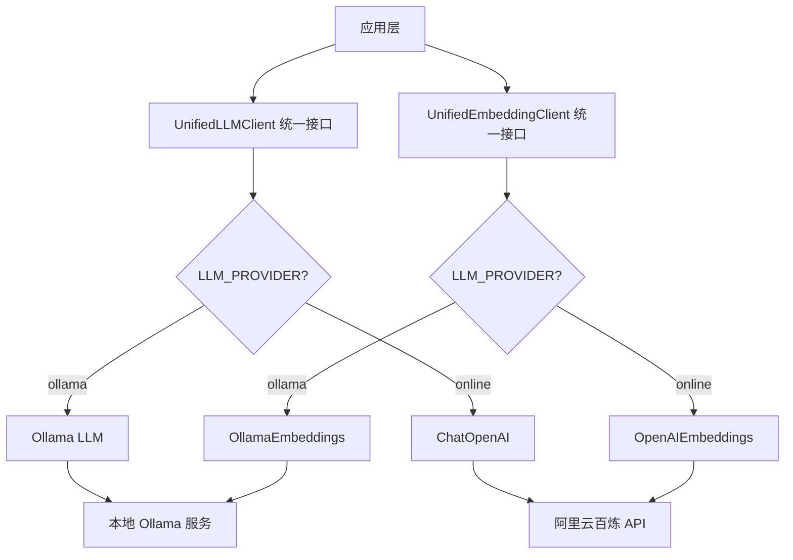

# 双模式LLM集成 - 本地与云端的灵活切换

> **本讲目标**：实现Ollama本地模型与阿里云百炼在线API的统一接口和无缝切换

## 一、为什么需要双模式支持？

在实际生产环境中，我们需要在成本、性能、隐私之间做权衡：

**场景对比**：

| 场景 | 推荐模式 | 原因 |
|------|---------|------|
| **开发调试** | Ollama本地 | 无API费用、响应快、可离线 |
| **生产环境** | 在线API | 服务稳定、模型最新、无需维护 |
| **敏感数据** | Ollama本地 | 数据不出本地、符合合规要求 |
| **高并发** | 在线API | 云端弹性扩容、无硬件限制 |
| **演示Demo** | Ollama本地 | 不依赖网络、成本可控 |

**双模式的价值**：
```
┌─────────────┐         ┌──────────────┐
│ 开发阶段    │  切换   │ 生产阶段     │
│ Ollama本地  │ ──────> │ 阿里云百炼   │
│ 免费测试    │         │ 稳定服务     │
└─────────────┘         └──────────────┘
      ↑                        ↓
      └────── 一键回退 ─────────┘
```

只需修改环境变量`LLM_PROVIDER=ollama/online`，无需改动代码！

## 二、统一接口设计架构

我们的`llm_client.py`（216行）实现了两层抽象：



**关键设计思想**：
1. **统一接口**：上层代码不关心底层是Ollama还是在线API
2. **配置驱动**：通过环境变量控制，无需修改代码
3. **兼容LangChain**：返回标准的`BaseLLM`对象，可用于Agent
4. **双模型支持**：LLM和Embedding都支持双模式

## 三、代码实现详解

我们将216行代码拆分成5个部分讲解。

### 第一部分：客户端初始化逻辑

**代码文件：** `study-agentic-rag/03-smart-qa-application/services/llm_client.py`

这部分定义了`UnifiedLLMClient`类，实现自动选择LLM提供商。

<details>
<summary>点击展开代码</summary>

```python
"""
统一的 LLM 客户端包装类
支持 Ollama 本地模型和在线 API (阿里云百炼)
"""

import logging
import os
from typing import List, Optional, Any, Dict
from langchain.llms.base import BaseLLM
from langchain.embeddings.base import Embeddings
try:
    # 尝试使用新的导入方式
    from langchain_community.llms import Ollama
    from langchain_community.chat_models import ChatOpenAI
except ImportError:
    # 回退到旧的导入方式
    from langchain.llms import Ollama
    from langchain.chat_models import ChatOpenAI
from langchain.schema import BaseMessage, HumanMessage, AIMessage, SystemMessage
from config.settings import Settings

# 屏蔽LangChain弃用警告
import warnings
warnings.filterwarnings("ignore", category=DeprecationWarning, module="langchain")
warnings.filterwarnings("ignore", message=".*was deprecated.*LangChain.*")

logger = logging.getLogger(__name__)


class UnifiedLLMClient:
    """统一的 LLM 客户端，支持 Ollama 和在线 API"""

    def __init__(
        self,
        model_name: str,
        temperature: float = 0.7,
        max_tokens: int = 2048,
        **kwargs
    ):
        """
        初始化 LLM 客户端

        Args:
            model_name: 模型名称
            temperature: 温度系数
            max_tokens: 最大token数
            **kwargs: 其他参数
        """
        self.settings = Settings()
        self.model_name = model_name
        self.temperature = temperature
        self.max_tokens = max_tokens
        self.provider = self.settings.LLM_PROVIDER
        self.llm = self._initialize_llm(**kwargs)

    def _initialize_llm(self, **kwargs) -> BaseLLM:
        """根据配置初始化 LLM"""
        try:
            if self.provider == "ollama":
                return self._initialize_ollama(**kwargs)
            else:  # online
                return self._initialize_online_api(**kwargs)
        except Exception as e:
            logger.error(f"初始化 LLM 失败: {str(e)}")
            raise
```

</details>

**为什么这么写？**

1. **为什么使用`**kwargs`？**
   ```python
   def __init__(self, model_name: str, temperature: float = 0.7, **kwargs):
   ```
   - 不同的LLM可能有不同的参数（如Ollama的`num_ctx`，OpenAI的`top_p`）
   - `**kwargs`让调用方可以传递额外参数
   - 统一接口的同时保持灵活性

2. **为什么在`__init__`中立即初始化LLM？**
   ```python
   self.provider = self.settings.LLM_PROVIDER
   self.llm = self._initialize_llm(**kwargs)
   ```
   - 提前验证配置是否正确（如API密钥、模型名称）
   - 初始化失败会立即抛出异常，而不是在首次调用时
   - 遵循"快速失败"原则

3. **为什么用`if self.provider == "ollama"`判断？**
   ```python
   if self.provider == "ollama":
       return self._initialize_ollama(**kwargs)
   else:  # online
       return self._initialize_online_api(**kwargs)
   ```
   - 简单清晰，只有两种模式
   - 默认走`online`分支，适合生产环境
   - 如果未来支持更多提供商，可以改为`if-elif-else`

### 第二部分：Ollama本地模式初始化

**代码文件：** `study-agentic-rag/03-smart-qa-application/services/llm_client.py`

这部分初始化Ollama本地模型。

<details>
<summary>点击展开代码</summary>

```python
    def _initialize_ollama(self, **kwargs) -> Ollama:
        """初始化 Ollama 本地模型"""
        logger.info(f"初始化 Ollama 模型: {self.model_name}")

        llm = Ollama(
            base_url=self.settings.OLLAMA_BASE_URL,
            model=self.model_name,
            temperature=self.temperature,
            num_predict=self.max_tokens,
            **kwargs
        )

        logger.info("Ollama 模型初始化成功")
        return llm   
```

</details>

**为什么这么写？**

1. **为什么用`num_predict`而不是`max_tokens`？**
   ```python
   num_predict=self.max_tokens
   ```
   - Ollama的参数名是`num_predict`
   - OpenAI的参数名是`max_tokens`
   - 我们对外统一使用`max_tokens`，内部做映射

2. **为什么要记录日志？**
   ```python
   logger.info(f"初始化 Ollama 模型: {self.model_name}")
   logger.info("Ollama 模型初始化成功")
   ```
   - 调试时知道使用了哪个模型
   - 生产环境排查问题时有据可查
   - 区分初始化失败的位置

3. **为什么传递`**kwargs`？**
   - Ollama支持很多自定义参数（如`num_ctx`上下文长度、`num_gpu`GPU层数）
   - 用户可以根据硬件配置调优
   - 示例：
     ```python
     client = UnifiedLLMClient(
         model_name="qwen2.5:7b",
         num_ctx=8192,  # 通过kwargs传递
         num_gpu=1      # 通过kwargs传递
     )
     ```

### 第三部分：在线API模式初始化（69-83行）

**代码文件：** `study-agentic-rag/03-smart-qa-application/services/llm_client.py`

这部分初始化阿里云百炼在线API（兼容OpenAI接口）。

<details>
<summary>点击展开代码</summary>

```python
    def _initialize_online_api(self, **kwargs) -> ChatOpenAI:
        """初始化在线 API（阿里云百炼，兼容 OpenAI 接口）"""
        logger.info(f"初始化在线 API 模型: {self.model_name}")

        # 尝试使用新的 langchain-openai 包，如果不可用则回退到旧的
        try:
            from langchain_openai import ChatOpenAI as NewChatOpenAI
            llm = NewChatOpenAI(
                openai_api_base=self.settings.ONLINE_BASE_URL,
                openai_api_key=self.settings.ONLINE_API_KEY,
                model_name=self.model_name,
                temperature=self.temperature,
                max_tokens=self.max_tokens,
                **kwargs
            )
        except ImportError:
            # 回退到旧的实现
            llm = ChatOpenAI(
                openai_api_base=self.settings.ONLINE_BASE_URL,
                openai_api_key=self.settings.ONLINE_API_KEY,
                model_name=self.model_name,
                temperature=self.temperature,
                max_tokens=self.max_tokens,
                **kwargs
            )

        logger.info("在线 API 模型初始化成功")
        return llm
```

</details>

**为什么这么写？**

1. **为什么用`ChatOpenAI`而不是`OpenAI`？**
   
   ```python
   llm = ChatOpenAI(...)
   ```
   - `ChatOpenAI`支持对话格式（`[{"role": "user", "content": "..."}]`）
   - 现代LLM都是对话模型，不是补全模型
- LangChain推荐使用`ChatOpenAI`
  
2. **为什么用`openai_api_base`？**
   ```python
   openai_api_base=self.settings.ONLINE_BASE_URL
   ```
   - 阿里云百炼兼容OpenAI接口
   - 只需修改`api_base`指向百炼的URL
   - 无需修改代码就能切换到其他兼容OpenAI的服务（如Azure、Cloudflare）

3. **为什么`max_tokens`不需要映射？**
   - OpenAI接口的参数名就是`max_tokens`
   - 直接传递即可
   - 与Ollama的`num_predict`形成对比
   
4. 智能版本兼容
   - 优先使用新版本 ： langchain_openai.ChatOpenAI
   - 自动回退机制 ：如果新包未安装，自动使用旧版本 langchain.llms.ChatOpenAI
   - 零配置切换 ：无需手动修改代码，自动适应环境

### 第四部分：统一调用接口（85-128行）

**代码文件：** `study-agentic-rag/03-smart-qa-application/services/llm_client.py`

这部分提供统一的调用方法，屏蔽底层差异。

<details>
<summary>点击展开代码</summary>

```python
    def invoke(self, prompt: str) -> str:
        """
        调用 LLM 生成回答

        Args:
            prompt: 提示词

        Returns:
            生成的回答
        """
        try:
            if self.provider == "ollama":
                # Ollama 使用字符串提示
                response = self.llm.invoke(prompt)
                return response
            else:  # online
                # 在线 API 使用消息格式
                messages = [HumanMessage(content=prompt)]
                response = self.llm.invoke(messages)
                return response.content if hasattr(response, 'content') else str(response)

        except Exception as e:
            logger.error(f"LLM 调用失败: {str(e)}")
            raise

    def get_llm(self) -> BaseLLM:
        """获取底层 LLM 对象（用于 LangChain Agent）"""
        return self.llm

    def get_provider_info(self) -> Dict[str, str]:
        """获取提供商信息"""
        info = {
            "provider": self.provider,
            "model": self.model_name,
            "temperature": str(self.temperature),
            "max_tokens": str(self.max_tokens)
        }

        if self.provider == "ollama":
            info["base_url"] = self.settings.OLLAMA_BASE_URL
        else:
            info["base_url"] = self.settings.ONLINE_BASE_URL

        return info
```

</details>

**为什么这么写？**

1. **为什么`invoke()`方法需要区分提供商？**
   
   ```python
   if self.provider == "ollama":
       response = self.llm.invoke(prompt)  # 字符串
   else:  # online
       messages = [HumanMessage(content=prompt)]
       response = self.llm.invoke(messages)  # 消息列表
   ```
   - **Ollama**：接受字符串提示词
   - **ChatOpenAI**：接受消息列表（`[HumanMessage(...)]`）
- 不同的LangChain包装类，调用方式不同
  
2. **为什么在线API需要`response.content`？**
   ```python
   return response.content if hasattr(response, 'content') else str(response)
   ```
   - `ChatOpenAI`返回的是`AIMessage`对象
   - 需要访问`.content`属性获取文本
   - Ollama直接返回字符串
   - `hasattr`防御性编程，避免属性不存在

3. **为什么提供`get_llm()`方法？**
   ```python
   def get_llm(self) -> BaseLLM:
       return self.llm
   ```
   - LangChain的Agent需要原生的LLM对象
   - 不能直接传`UnifiedLLMClient`
   - 示例：
     ```python
     client = UnifiedLLMClient(model_name="qwen2.5:7b")
     agent = initialize_agent(tools, client.get_llm())
     ```

### 第五部分：嵌入模型客户端（131-216行）

**代码文件：** `study-agentic-rag/03-smart-qa-application/services/llm_client.py`

这部分实现了统一的嵌入模型客户端，支持双模式。

<details>
<summary>点击展开代码</summary>

```python
class AliyunEmbeddingWrapper(Embeddings):
    """阿里云百炼嵌入模型的 LangChain 兼容包装器"""
    
    def __init__(self, openai_client, model_name):
        self.openai_client = openai_client
        self.model_name = model_name
        self.embedding_model_name = model_name
    
    def embed_query(self, text: str) -> List[float]:
        """嵌入单个查询文本"""
        response = self.openai_client.embeddings.create(
            model=self.model_name,
            input=text,
            encoding_format="float"
        )
        return response.data[0].embedding
    
    def embed_documents(self, texts: List[str]) -> List[List[float]]:
        """嵌入多个文档"""
        response = self.openai_client.embeddings.create(
            model=self.model_name,
            input=texts,
            encoding_format="float"
        )
        return [data.embedding for data in response.data]


class UnifiedEmbeddingClient:
    """统一的嵌入模型客户端"""

    def __init__(self):
        """初始化嵌入模型客户端"""
        self.settings = Settings()
        # 优先读取最新环境变量，确保运行期切换生效
        self.provider = os.getenv("LLM_PROVIDER", self.settings.LLM_PROVIDER)
        self.embedding_model = self.settings.get_embedding_model()
        self.embeddings = self._initialize_embeddings()

    def _initialize_embeddings(self):
        """根据配置初始化嵌入模型"""
        try:
            if self.provider == "ollama":
                return self._initialize_ollama_embeddings()
            else:  # online
                return self._initialize_online_embeddings()
        except Exception as e:
            logger.error(f"初始化嵌入模型失败: {str(e)}")
            raise

    def _initialize_ollama_embeddings(self):
        """初始化 Ollama 嵌入模型"""
        from langchain_community.embeddings import OllamaEmbeddings

        logger.info(f"初始化 Ollama 嵌入模型: {self.embedding_model}")

        embeddings = OllamaEmbeddings(
            base_url=self.settings.OLLAMA_BASE_URL,
            model=self.embedding_model
        )

        logger.info("Ollama 嵌入模型初始化成功")
        return embeddings

    def _initialize_online_embeddings(self):
        """初始化在线 API 嵌入模型（阿里云百炼）"""
        try:
            from openai import OpenAI
        except ImportError:
            logger.error("openai 包未安装，无法使用在线嵌入模型")
            raise ImportError("请安装 openai 包: pip install openai")

        logger.info(f"初始化在线嵌入模型: {self.embedding_model}")

        # 使用原生 OpenAI 客户端，但包装成 LangChain 兼容接口
        openai_client = OpenAI(
            api_key=self.settings.ONLINE_API_KEY,
            base_url=self.settings.ONLINE_BASE_URL
        )
        
        # 返回兼容 LangChain 接口的包装器
        logger.info("在线嵌入模型初始化成功")
        return AliyunEmbeddingWrapper(openai_client, self.embedding_model)

    def embed_query(self, text: str) -> List[float]:
        """
        嵌入单个查询文本

        Args:
            text: 查询文本

        Returns:
            嵌入向量
        """
        try:
            return self.embeddings.embed_query(text)
        except Exception as e:
            logger.error(f"查询嵌入失败: {str(e)}")
            raise

    def embed_documents(self, texts: List[str]) -> List[List[float]]:
        """
        嵌入多个文档

        Args:
            texts: 文档列表

        Returns:
            嵌入向量列表
        """
        try:
            return self.embeddings.embed_documents(texts)
        except Exception as e:
            logger.error(f"文档嵌入失败: {str(e)}")
            raise

    def get_embeddings(self):
        """获取嵌入模型对象"""
        return self.embeddings
```

</details>

**为什么这么写？**

>
> ## 🎯 代码总括
>
> 这段代码是一个**智能嵌入模型客户端**，核心思想是：**用一套接口，适配多种嵌入模型**。
>
> ### 核心架构
> ```
> UnifiedEmbeddingClient (统一入口)
> ├── Ollama 模式 → 直接调用 LangChain 的 OllamaEmbeddings
> └── Online 模式 → 阿里云百炼 → AliyunEmbeddingWrapper (兼容包装器)
> ```
>
> ## 🔍 关键设计
>
> ### 1️⃣ **AliyunEmbeddingWrapper** - 兼容神器
> - **作用**：让原生 OpenAI 客户端"伪装"成 LangChain 接口
> - **原理**：包装阿里云百炼 API，提供 `embed_query()` 和 `embed_documents()` 方法
> - **好处**：上层代码无需改动，无缝切换
>
> ### 2️⃣ **UnifiedEmbeddingClient** - 统一调度器
> - **智能路由**：根据配置自动选择 Ollama 或 Online 模式
> - **异常处理**：统一的错误处理和日志记录
> - **接口标准化**：无论底层用什么，对外接口保持一致   
>

### 第六部分：功能测试

1）测试代码

```python
if __name__ == "__main__":
    """简单的测试代码，验证 LLM 客户端核心功能（仅测试 online 模式）"""
    import os
    
    print("=== 开始测试 LLM 客户端 (Online 模式) ===")
    
    # 测试配置加载
    try:
        settings = Settings()
        print(f"✅ 配置加载成功 - 提供商: {settings.LLM_PROVIDER}")
        
        # 获取当前模型名称
        current_model = settings.get_default_model()
        print(f"   模型: {current_model}")
        print(f"   嵌入模型: {settings.get_embedding_model()}")
        
        # 确保是在 online 模式下测试
        if settings.LLM_PROVIDER != "online":
            print(f"⚠️  当前配置为 {settings.LLM_PROVIDER} 模式，仅测试 online 模式相关功能")
            print("   跳过 Ollama 相关测试")
            print("\n=== 测试完成 ===")
            exit(0)
            
    except Exception as e:
        print(f"❌ 配置加载失败: {e}")
        exit(1)
    
    # 测试 UnifiedLLMClient (仅 online 模式)
    try:
        llm_client = UnifiedLLMClient(
            model_name=current_model,
            temperature=0.1,
            max_tokens=100
        )
        print(f"✅ LLM 客户端初始化成功 - 提供商: {llm_client.provider}")
        
        # 获取提供商信息
        info = llm_client.get_provider_info()
        print(f"   提供商信息: {info}")
        
    except Exception as e:
        print(f"❌ LLM 客户端初始化失败: {e}")
        exit(1)
    
    # 测试 UnifiedEmbeddingClient (仅 online 模式)
    try:
        embedding_client = UnifiedEmbeddingClient()
        print(f"✅ 嵌入客户端初始化成功 - 提供商: {embedding_client.provider}")
        print(f"   嵌入模型: {embedding_client.embedding_model}")
        
    except Exception as e:
        print(f"❌ 嵌入客户端初始化失败: {e}")
        exit(1)
    
    # 测试嵌入模型（仅 online 模式）
    try:
        print("正在测试嵌入模型...")
        test_text = "这是一个测试文本"
        embeddings = embedding_client.embed_query(test_text)
        print(f"✅ 嵌入模型测试成功")
        print(f"   嵌入维度: {len(embeddings)}")
        
    except Exception as e:
        # 简化错误信息
        error_msg = str(e)
        if "400" in error_msg:
            print(f"⚠️  嵌入模型测试失败（API 格式问题）")
            print("   提示：阿里云百炼嵌入模型可能需要特殊配置")
        elif "API key" in error_msg or "authentication" in error_msg.lower():
            print(f"⚠️  嵌入模型测试失败（API 密钥问题）")
        else:
            print(f"⚠️  嵌入模型测试失败: {error_msg[:50]}...")
    
    # 测试 LLM 调用（仅 online 模式）
    try:
        print("正在测试 LLM 调用...")
        test_prompt = "用一句话介绍你自己"
        response = llm_client.invoke(test_prompt)
        print(f"✅ LLM 调用成功")
        print(f"   回答: {response[:50]}...")
        
    except Exception as e:
        # 简化错误信息
        error_msg = str(e)
        if "API key" in error_msg or "authentication" in error_msg.lower():
            print(f"⚠️  LLM 调用测试失败（API 密钥问题）")
        elif "network" in error_msg.lower() or "connection" in error_msg.lower():
            print(f"⚠️  LLM 调用测试失败（网络连接问题）")
        else:
            print(f"⚠️  LLM 调用测试失败: {error_msg[:50]}...")
    
    print("\n=== 测试完成 ===")
```

2）运行测试

```bash
uv run python services/llm_client.py
```

3）预期效果

```bash
=== 开始测试 LLM 客户端 (Online 模式) ===
✅ 配置加载成功 - 提供商: online
   模型: qwen-plus
   嵌入模型: text-embedding-v1 
✅ LLM 客户端初始化成功 - 提供商: online
   提供商信息: {'provider': 'online', 'model': 'qwen-plus', 'temperature': '0.1', 'max_tokens': '100', 'base_url': 'https://dashscope.aliyuncs.com/compatible-mode/v1'}
✅ 嵌入客户端初始化成功 - 提供商: online
   嵌入模型: text-embedding-v1
正在测试嵌入模型...
✅ 嵌入模型测试成功
   嵌入维度: 1536   
正在测试 LLM 调用...
✅ LLM 调用成功
   回答: 我是通义千问，由阿里云研发的超大规模语言模型，能够回答问题、创作文字，还能表达观点、玩游戏等。...
=== 测试完成 ===
```


## 四、完整代码总结

上面的5个部分组成了完整的`llm_client.py`（216行）：

1. **客户端初始化**（52行）：根据配置自动选择提供商
2. **Ollama模式**（14行）：初始化本地模型，映射参数名
3. **在线API模式**（15行）：初始化云端模型，兼容OpenAI接口
4. **统一调用接口**（44行）：屏蔽差异，提供一致的API
5. **嵌入模型客户端**（86行）：双模式支持，区分查询和文档

**核心设计模式**：

| 模式 | 应用场景 | 代码位置 |
|------|---------|---------|
| **工厂模式** | 根据配置创建不同的LLM | `_initialize_llm()` |
| **适配器模式** | 统一不同LLM的接口 | `invoke()` |
| **策略模式** | 切换不同的提供商 | `provider` 判断 |
| **单一职责** | 分离LLM和Embedding | 两个独立类 |

**双模式切换示意图**：

```python
# 只需修改环境变量
LLM_PROVIDER=ollama    # 开发环境
LLM_PROVIDER=online    # 生产环境

# 代码完全不变！
client = UnifiedLLMClient(model_name="qwen2.5:7b")
response = client.invoke("你好")
```

## 五、实际使用示例

### 示例1：在Agent中使用

```python
from services.llm_client import UnifiedLLMClient
from langchain.agents import initialize_agent, Tool

# 创建统一客户端（自动根据环境变量选择提供商）
client = UnifiedLLMClient(
    model_name="qwen2.5:7b",
    temperature=0.7,
    max_tokens=2048
)

# 定义工具
tools = [
    Tool(name="Calculator", func=calculate, description="计算数学问题"),
]

# 初始化Agent（使用get_llm()获取底层LLM）
agent = initialize_agent(
    tools,
    client.get_llm(),
    agent="zero-shot-react-description",
    verbose=True
)

# 运行
result = agent.run("125 * 37 等于多少？")
```

### 示例2：在向量存储中使用

```python
from services.llm_client import UnifiedEmbeddingClient
from langchain.vectorstores import FAISS

# 创建嵌入客户端
embedding_client = UnifiedEmbeddingClient()

# 创建向量存储
documents = ["这是第一个文档", "这是第二个文档"]
vector_store = FAISS.from_texts(
    documents,
    embedding_client.get_embeddings()  # 统一接口
)

# 查询
results = vector_store.similarity_search("文档")
```

### 示例3：获取提供商信息

```python
client = UnifiedLLMClient(model_name="qwen2.5:7b")
info = client.get_provider_info()

print(info)
# 输出：
# {
#     "provider": "ollama",
#     "model": "qwen2.5:7b",
#     "temperature": "0.7",
#     "max_tokens": "2048",
#     "base_url": "http://localhost:11434"
# }
```

## 六、配置管理（回顾settings.py）

双模式的配置在`config/settings.py`中管理：

```python
# 从环境变量读取
LLM_PROVIDER = os.getenv("LLM_PROVIDER", "online")  # 默认online

# Ollama配置
OLLAMA_BASE_URL = os.getenv("OLLAMA_BASE_URL", "http://localhost:11434")
OLLAMA_LLM_MODEL = "qwen2.5:7b"
OLLAMA_EMBEDDING_MODEL = "nomic-embed-text:latest"

# 在线API配置
ONLINE_BASE_URL = os.getenv("ONLINE_BASE_URL", "https://dashscope.aliyuncs.com/compatible-mode/v1")
ONLINE_API_KEY = os.getenv("ONLINE_API_KEY", "")
ONLINE_LLM_MODEL = "qwen-plus"
ONLINE_EMBEDDING_MODEL = "text-embedding-v1"
```

**环境变量优先级**：
1. 运行时环境变量（最高）
2. `.env`文件
3. 代码默认值（最低）

## 七、本讲总结

我们完成了双模式LLM集成：

1. **统一接口设计**：`UnifiedLLMClient`和`UnifiedEmbeddingClient`
2. **工厂模式**：根据配置自动选择提供商
3. **参数映射**：`max_tokens` ↔ `num_predict`
4. **调用差异**：字符串 vs 消息列表
5. **LangChain集成**：`get_llm()`和`get_embeddings()`方法

**关键技术点**：
- 配置驱动的架构设计
- 适配器模式统一接口
- 日志记录便于调试
- 防御性编程（`hasattr`）
- 延迟导入（`from langchain_community...`）

**切换模式只需**：
```bash
# 开发环境 - 使用本地Ollama
export LLM_PROVIDER=ollama

# 生产环境 - 使用阿里云百炼
export LLM_PROVIDER=online
export ONLINE_API_KEY=sk-xxx
```

