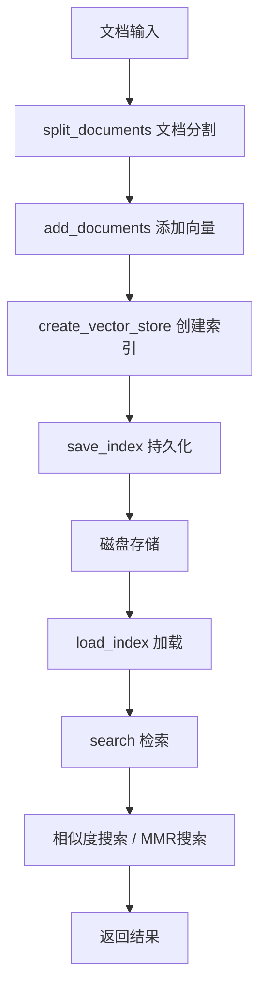

# FAISS向量存储 - 高性能检索引擎

> **本讲目标**：掌握FAISS向量数据库的使用，构建高性能的文档检索系统

## 一、为什么从ChromaDB切换到FAISS？

在前面的课程中，我们使用ChromaDB作为向量数据库。但在生产环境中，我们选择了FAISS。为什么？

**ChromaDB vs FAISS对比**：

| 维度 | ChromaDB | FAISS | 适用场景 |
|------|---------|-------|---------|
| **开发难度** | ⭐ 简单（API友好） | ⭐⭐ 中等 | ChromaDB适合快速原型 |
| **检索速度** | 中等（千级文档） | 极快（百万级文档） | FAISS适合大规模数据 |
| **内存占用** | 较高 | 可控 | FAISS可调优 |
| **持久化** | 自动持久化 | 手动保存 | ChromaDB更便捷 |
| **索引类型** | 固定 | 丰富（Flat、IVF、HNSW） | FAISS可定制 |
| **依赖** | 需要服务端 | 纯Python库 | FAISS部署简单 |

**为什么在生产环境选择FAISS？**

1. **性能**：Facebook开源，专为大规模向量搜索优化
2. **轻量**：不需要运行独立服务（ChromaDB需要）
3. **成熟**：在工业界大量使用，稳定可靠
4. **灵活**：支持多种索引类型，可根据场景调优

**学习路径**：
```
ChromaDB（教学） → FAISS（生产）
  ↓                    ↓
快速上手            性能优化
```

## 二、FAISS索引类型选择

FAISS提供多种索引类型，各有优劣：

| 索引类型 | 检索精度 | 检索速度 | 内存占用 | 适用场景 |
|---------|---------|---------|---------|---------|
| **Flat** | 100% 精确 | 慢（暴力搜索） | 高 | <1万向量 |
| **IVF** | ~95% 近似 | 快 | 中 | 1万-100万向量 |
| **HNSW** | ~99% 近似 | 极快 | 高 | 需要极速响应 |
| **PQ** | ~90% 近似 | 极快 | 极低 | 百万级+内存受限 |

**我们的选择：Flat索引**

LangChain的`FAISS.from_documents()`默认使用Flat索引（精确搜索）：
- 文档量通常在千级-万级（企业知识库规模）
- 精度优先（RAG需要准确的检索）
- 内存不是瓶颈（现代服务器）

如果未来文档量超过10万，可以切换到IVF索引：
```python
# 高级用法（本项目暂未使用）
import faiss
quantizer = faiss.IndexFlatL2(dimension)
index = faiss.IndexIVFFlat(quantizer, dimension, nlist)
```

## 三、向量存储服务架构

我们的`vector_store.py`（310行）提供完整的向量存储服务：



**核心功能**：
1. **创建与加载**：从文档创建索引，或加载已有索引
2. **检索**：相似度搜索、MMR搜索、阈值过滤
3. **文档管理**：添加、删除、清空
4. **持久化**：保存索引、文档、元数据
5. **统计**：文档数、向量数、维度信息

## 四、代码实现详解

我们将310行代码拆分成5个部分讲解。

### 第一部分：初始化和创建向量存储（1-51行）

**代码文件：** `study-agentic-rag/03-smart-qa-application/services/vector_store.py`

这部分初始化服务，并提供从文档创建向量存储的方法。

<details>
<summary>点击展开代码</summary>

```python
import os
import json
import pickle
import logging
from typing import List, Dict, Optional, Any, Tuple
from datetime import datetime
import numpy as np
import faiss
from langchain_community.vectorstores import FAISS
from langchain.schema import Document
from langchain.embeddings.base import Embeddings
from langchain.text_splitter import RecursiveCharacterTextSplitter
from config.settings import Settings
from services.llm_client import UnifiedEmbeddingClient

logger = logging.getLogger(__name__)

class VectorStoreService:
    """向量存储服务类 - 支持 Ollama 和在线 API embedding"""

    def __init__(self):
        self.settings = Settings()
        # 使用统一的嵌入客户端
        self.embedding_client = UnifiedEmbeddingClient()
        self.embeddings = self.embedding_client.get_embeddings()
        self.vector_store = None
        self.documents = []
        self.index_path = None

        logger.info(f"向量存储服务初始化成功 - 提供商: {self.settings.LLM_PROVIDER}, 嵌入模型: {self.settings.get_embedding_model()}")

    def create_vector_store(self, documents: List[Document]) -> FAISS:
        """创建向量存储"""
        try:
            logger.info(f"创建向量存储，文档数量: {len(documents)}")

            # 创建向量存储
            vector_store = FAISS.from_documents(
                documents=documents,
                embedding=self.embeddings
            )

            self.vector_store = vector_store
            self.documents = documents

            logger.info("向量存储创建成功")
            return vector_store

        except Exception as e:
            logger.error(f"创建向量存储失败: {str(e)}")
            raise
```

</details>

**为什么这么写？**

1. **为什么单独保存`self.documents`？**
   ```python
   self.vector_store = vector_store  # FAISS索引
   self.documents = documents        # 原始文档
   ```
   - **FAISS只存储向量**，不存储原始文档
   - 我们需要原始文档来显示检索结果
   - 保存`documents`用于持久化和删除操作

2. **为什么用`UnifiedEmbeddingClient`？**
   ```python
   self.embedding_client = UnifiedEmbeddingClient()
   self.embeddings = self.embedding_client.get_embeddings()
   ```
   - 支持Ollama和在线API双模式
   - 统一接口，配置驱动切换
   - 回顾第13讲的统一客户端设计

3. **为什么用`FAISS.from_documents()`？**
   ```python
   vector_store = FAISS.from_documents(
       documents=documents,
       embedding=self.embeddings
   )
   ```
   - LangChain封装的便捷方法
   - 自动处理：文档 → 嵌入 → 创建索引
   - 相比原生FAISS API，减少90%代码

### 第二部分：索引加载和保存（53-118行）

**代码文件：** `study-agentic-rag/03-smart-qa-application/services/vector_store.py`

这部分实现向量存储的持久化功能。

<details>
<summary>点击展开代码</summary>

```python
    def load_index(self, index_path: str) -> bool:
        """加载向量存储索引"""
        try:
            logger.info(f"加载向量存储索引: {index_path}")

            if not os.path.exists(index_path):
                logger.warning(f"索引路径不存在: {index_path}")
                return False

            # 加载FAISS索引
            self.vector_store = FAISS.load_local(
                index_path,
                self.embeddings,
                allow_dangerous_deserialization=True
            )

            # 加载文档（如果存在）
            docs_path = f"{index_path}_docs.pkl"
            if os.path.exists(docs_path):
                with open(docs_path, 'rb') as f:
                    self.documents = pickle.load(f)

            self.index_path = index_path
            logger.info("向量存储索引加载成功")
            return True

        except Exception as e:
            logger.error(f"加载向量存储索引失败: {str(e)}")
            return False

    def save_index(self, index_path: str) -> bool:
        """保存向量存储索引"""
        try:
            if not self.vector_store:
                logger.warning("向量存储未初始化，无法保存")
                return False

            logger.info(f"保存向量存储索引: {index_path}")

            # 保存FAISS索引
            self.vector_store.save_local(index_path)

            # 保存文档
            docs_path = f"{index_path}_docs.pkl"
            with open(docs_path, 'wb') as f:
                pickle.dump(self.documents, f)

            # 保存元数据
            metadata = {
                "created_at": datetime.now().isoformat(),
                "documents_count": len(self.documents),
                "embedding_model": self.embedding_model_name,
                "vector_dimension": self.settings.VECTOR_DIMENSION
            }

            metadata_path = f"{index_path}_metadata.json"
            with open(metadata_path, 'w', encoding='utf-8') as f:
                json.dump(metadata, f, ensure_ascii=False, indent=2)

            self.index_path = index_path
            logger.info("向量存储索引保存成功")
            return True

        except Exception as e:
            logger.error(f"保存向量存储索引失败: {str(e)}")
            return False
```

</details>

**为什么这么写？**

1. **为什么用`allow_dangerous_deserialization=True`？**
   ```python
   self.vector_store = FAISS.load_local(
       index_path,
       self.embeddings,
       allow_dangerous_deserialization=True
   )
   ```
   - FAISS使用pickle序列化（可能被恶意利用）
   - LangChain要求显式确认风险
   - **生产建议**：只加载可信来源的索引

2. **为什么保存三个文件？**
   ```python
   index_path/                    # FAISS索引文件（.faiss, .pkl）
   index_path_docs.pkl            # 原始文档
   index_path_metadata.json       # 元数据
   ```
   - **FAISS索引**：向量+索引结构（`save_local`自动生成）
   - **文档文件**：原始文档对象（用于显示检索结果）
   - **元数据文件**：时间、模型、维度（便于管理和调试）

3. **为什么用pickle保存文档？**
   ```python
   with open(docs_path, 'wb') as f:
       pickle.dump(self.documents, f)
   ```
   - Document对象包含复杂的元数据
   - pickle可以完整序列化Python对象
   - JSON只能存储简单类型（需要手动转换）
   
4. 代码通俗解释（教学版）

   > **核心概念**
   > - 向量与嵌入：把一段文本（文档、段落、知识点）用嵌入模型转成一个长度为 `VECTOR_DIMENSION` 的数字向量，用来做“相似度搜索”。
   > - 索引（Index）：把大量向量组织成适合快速相似搜索的数据结构。这里用的是 FAISS（Facebook AI Similarity Search），能在海量向量中快速找“最像”的Top-K。
   > - 向量存储（Vector Store）：不仅包含 FAISS 索引（纯向量的检索结构），还要维护原始文档列表及其元信息，做到“找到了相似向量 → 能拿到对应原文”。
   >
   > **这两个方法做什么**
   > - `load_index(index_path)`（services/vector_store.py:53-88）：从磁盘加载之前保存好的 FAISS 索引与文档列表，让当前服务能立刻进行相似搜索，不用重新嵌入和建索引。
   > - `save_index(index_path)`（services/vector_store.py:90-118）：把当前内存中的向量索引、文档列表以及一些元数据写到磁盘，以便下次直接加载复用。
   >
   > **逐步解读：load_index**
   > - 路径检查：如果 `index_path` 不存在，直接返回 `False`（services/vector_store.py:59-62）。
   > - 加载 FAISS 索引：`FAISS.load_local(index_path, self.embeddings, allow_dangerous_deserialization=True)`（services/vector_store.py:66-71）
   >   - `index_path`：索引存放的位置（通常是一个目录）。
   >   - `self.embeddings`：告诉 FAISS/封装器用哪种嵌入模型来对后续新文本做向量化，以保持同一维度与同一向量空间。
   >   - `allow_dangerous_deserialization=True`：允许反序列化可能不安全的对象（比如 pickle）。这是常见的加载开关，需确保索引文件来源可信。
   > - 加载文档列表：如果有 `"{index_path}_docs.pkl"`，用 `pickle.load` 把之前保存的文档对象列表读回来（services/vector_store.py:74-78）。
   > - 状态更新与返回：设置 `self.index_path`，日志记录成功，返回 `True`（services/vector_store.py:80-84）。异常则记录错误并返回 `False`（services/vector_store.py:86-88）。
   >
   > 通俗理解：像是把“书店的目录+书的内容列表”从硬盘搬回内存。目录（FAISS）负责快速找到相似的书，内容列表（documents）让你能读到书的原文。
   >
   > **逐步解读：save_index**
   > - 防御性检查：如果当前没有初始化好的 `self.vector_store`，就没法保存（services/vector_store.py:92-96）。
   > - 保存 FAISS 索引：`self.vector_store.save_local(index_path)`（services/vector_store.py:100-102）
   >   - 会在 `index_path` 下写出 FAISS 需要的文件（比如 `index.faiss`、`index.pkl`，具体由库管理）。
   > - 保存文档列表：把 `self.documents` 用 `pickle.dump` 写到 `"{index_path}_docs.pkl"`（services/vector_store.py:104-108）。
   > - 保存元数据：写一个 `"{index_path}_metadata.json"`（services/vector_store.py:110-117）
   >   - `created_at`：保存时间
   >   - `documents_count`：文档数量
   >   - `embedding_model`：嵌入模型名字，便于以后检查一致性
   >   - `vector_dimension`：向量维度（与嵌入模型匹配）
   > - 状态更新与返回：设置 `self.index_path`，日志记录成功，返回 `True`。异常则记录错误并返回 `False`（services/vector_store.py:118）。
   >
   > 通俗理解：把“书店当前的目录（FAISS）+所有书的列表（documents）+一些说明（metadata）”打包存到硬盘。下次启动直接加载，不用重建。
   >
   > **为什么要分“索引”和“文档列表”**
   > - FAISS 索引只关心“向量的空间结构”，能高效检索“最近邻”。
   > - 文档列表包含原始文本、标题、来源等，人类可读的信息不适合直接塞进索引。
   > - 分离保存：索引负责快、文档负责全，两者合起来才能实现“语义搜索 → 返回原文”。
   >
   > **简单类比**
   > - 索引像图书馆的卡片目录：只存“如何快速定位相似书籍”的数据。
   > - 文档列表像书架上的书：找到卡片后，还需要去书架把书拿出来看。
   > - 元数据像馆长笔记：记录这份目录是何时建立、用的什么规则、总共有多少书等。
   >
   > **常见问题与注意**
   > - 不同嵌入模型会产生不同维度与空间的向量，索引和嵌入必须一致，否则查询结果不可靠。
   > - `allow_dangerous_deserialization=True` 要确保索引文件来源安全，避免加载恶意pickle。
   > - 保存后如果你更换了嵌入模型或 `VECTOR_DIMENSION`，老索引可能需要重建。
   >
   > **在代码里用到它的典型流程**
   > - 首次构建：对文档做嵌入 → 建 FAISS 索引 → `save_index("path/to/index")`
   > - 后续使用：服务启动时调用 `load_index("path/to/index")` → 接收用户问题 → 嵌入问题 → 用 FAISS 检索最相似文档 → 返回答案与来源。
   >

### 第三部分：搜索功能（120-166行）

**代码文件：** `study-agentic-rag/03-smart-qa-application/services/vector_store.py`

这部分实现两种检索策略：相似度搜索和MMR搜索。

<details>
<summary>点击展开代码</summary>

```python
    def search(
        self,
        query: str,
        top_k: int = 3,
        search_type: str = "similarity",
        score_threshold: float = 0.5
    ) -> List[Dict[str, Any]]:
        """搜索向量存储"""
        try:
            if not self.vector_store:
                logger.warning("向量存储未初始化")
                return []

            logger.info(f"搜索查询: {query}, top_k: {top_k}, search_type: {search_type}")

            if search_type == "similarity":
                # 相似度搜索
                results = self.vector_store.similarity_search_with_score(
                    query=query,
                    k=top_k
                )
            elif search_type == "mmr":
                # MMR搜索（最大边际相关性）- 社区版不返回分数
                mmr_docs = self.vector_store.max_marginal_relevance_search(
                    query=query,
                    k=top_k,
                    fetch_k=top_k * 2
                )
                results = [(doc, 1.0) for doc in mmr_docs]
            else:
                raise ValueError(f"不支持的搜索类型: {search_type}")

            # 格式化结果
            formatted_results = []
            for doc, score in results:
                if score >= score_threshold:  # 过滤低分结果
                    formatted_results.append({
                        "content": doc.page_content,
                        "metadata": doc.metadata,
                        "score": float(score)
                    })

            logger.info(f"搜索完成，找到 {len(formatted_results)} 个结果")
            return formatted_results

        except Exception as e:
            logger.error(f"搜索失败: {str(e)}")
            return []
```

</details>

**为什么这么写？**

1. **为什么支持两种搜索类型？**

   **相似度搜索（Similarity）**：
   ```python
   results = self.vector_store.similarity_search_with_score(query, k=top_k)
   ```
   - 返回最相似的top_k个文档
   - 问题：可能返回内容重复的文档
   - 适用场景：需要最相关的结果

   **MMR搜索（Maximal Marginal Relevance）**：
   ```python
   results = self.vector_store.max_marginal_relevance_search_with_score(
       query=query,
       k=top_k,
       fetch_k=top_k * 2  # 先取2倍候选，再去重
   )
   ```
   - 平衡相关性和多样性
   - 避免返回相似的重复内容
   - 适用场景：需要多角度信息

2. **为什么用`fetch_k=top_k * 2`？**
   ```python
   fetch_k=top_k * 2
   ```
   - MMR分两步：先取`fetch_k`个候选 → 再选`k`个多样化的
   - `fetch_k`太小：多样性不足
   - `fetch_k`太大：计算开销大
   - 2倍是工程经验值

3. **为什么过滤`score_threshold`？**
   ```python
   if score >= score_threshold:
       formatted_results.append(...)
   ```
   - 相似度低的文档可能是噪音
   - 提高答案质量（宁缺毋滥）
   - 用户可配置阈值（默认0.5）
   
4. 代码解释（教学版）

   > **一句话概括**  
   > 把用户的问题转成向量，到“向量仓库”里找最像的若干条文档，再把它们按相似度打分、过滤、打包成列表返回。
   >
   > ---
   >
   > **逐句拆解（用大白话）**
   >
   > 1. `def search(self, query: str, top_k: int = 3, search_type: str = "similarity", score_threshold: float = 0.5)`  
   >    - `query`：用户的问题，比如“如何申请护照”。  
   >    - `top_k`：最多返回几条，默认 3。  
   >    - `search_type`：  
   >      - `"similarity"`：纯按“像不像”排序。  
   >      - `"mmr"`：在“像”的基础上再加点“多样性”，避免三条结果几乎一模一样。  
   >    - `score_threshold`：低于 0.5 分（相似度不到 50%）就扔掉，别拿来凑数。
   >
   > 2. `if not self.vector_store: … return []`  
   >    仓库还没建好（没加载或没索引），直接空手而归，别崩。
   >
   > 3. `logger.info(...)`  
   >    打一条日志，方便调试：搜啥、要几条、用哪种策略。
   >
   > 4. **分支 1：similarity**  
   >    `self.vector_store.similarity_search_with_score(query=query, k=top_k)`  
   >    
   > - 内部流程：把 `query` 用同样的嵌入模型变成向量 → 在 FAISS 索引里找距离最近的 `top_k` 个向量 → 返回对应的文档 + 相似度分数（0~1，越接近 1 越像）。
   >    
   > 5. **分支 2：mmr**  
   >    `self.vector_store.max_marginal_relevance_search_with_score(...)`  
   >    
   > - 先多拿一倍候选（`fetch_k=top_k*2`），再用 MMR 算法挑：既要跟问题像，又要跟已选结果差异大，避免重复。
   >    
   > 6. **格式化 & 过滤**  
   >    ```python
   >    for doc, score in results:
   >        if score >= score_threshold:
   >            formatted_results.append({
   >                "content": doc.page_content,   # 原始文本
   >                "metadata": doc.metadata,      # 来源、页码、标题等附加信息
   >                "score": float(score)          # 相似度打分
   >            })
   >    ```
   >    低于 0.5 分的直接丢掉，剩下的装进字典列表，前端或下游模块就能直接用了。
   >
   > 7. **日志 & 返回**  
   >    告诉开发者“我最终给你几条”，然后 `return formatted_results`。  
   >    如果中间抛异常，catch 住打日志，同样返回空列表，保证不崩溃。
   >
   > ---
   >
   > **类比一下**  
   > 把“向量仓库”想成“图书馆的立体仓库”：  
   > - 先给前台一句“我想看怎么申请护照” → 系统把这句话变成“坐标”。  
   > - 仓库机器人按坐标去找“离得最近”的几本书（similarity），或者“又近又不一样”的几本书（mmr）。  
   > - 最后把书的内容、书脊标签（metadata）、相似度打分一起递给你，低于 0.5 分的直接当“无关”扔掉。
   >
   > ---
   >
   > **小结**  
   > 这段代码就是“问答系统”里最核心的“搜资料”一步：  
   > 用户问 → 嵌入 → 向量检索 → 打分过滤 → 返回结构化结果。  
   > 后面的业务模块拿到 `formatted_results` 后，再让 LLM 去“读”这些内容并生成回答即可。

### 第四部分：文档管理（168-213行）

**代码文件：** `03-smart-qa-application/services/vector_store.py`

这部分实现文档的增删改功能。

<details>
<summary>点击展开代码</summary>

```python
    def add_documents(self, documents: List[Document]) -> bool:
        """添加文档到向量存储"""
        try:
            logger.info(f"添加文档到向量存储，数量: {len(documents)}")

            if not self.vector_store:
                # 如果向量存储不存在，创建新的
                self.create_vector_store(documents)
            else:
                # 添加到现有向量存储
                self.vector_store.add_documents(documents)
                self.documents.extend(documents)

            logger.info("文档添加成功")
            return True

        except Exception as e:
            logger.error(f"添加文档失败: {str(e)}")
            return False

    def delete_document(self, doc_id: str) -> bool:
        """从向量存储中删除文档"""
        try:
            logger.info(f"删除文档: {doc_id}")

            if not self.vector_store:
                logger.warning("向量存储未初始化")
                return False

            # FAISS不直接支持删除操作，需要重新创建索引
            remaining_docs = [
                doc for doc in self.documents
                if doc.metadata.get("id") != doc_id
            ]

            if len(remaining_docs) < len(self.documents):
                self.create_vector_store(remaining_docs)
                logger.info(f"文档删除成功: {doc_id}")
                return True
            else:
                logger.warning(f"未找到文档: {doc_id}")
                return False

        except Exception as e:
            logger.error(f"删除文档失败: {str(e)}")
            return False

    def clear(self):
        """清空向量存储"""
        try:
            logger.info("清空向量存储")

            self.vector_store = None
            self.documents = []
            self.index_path = None

            logger.info("向量存储已清空")

        except Exception as e:
            logger.error(f"清空向量存储失败: {str(e)}")
```

</details>

**为什么这么写？**

1. **为什么添加文档时判断是否存在？**
   ```python
   if not self.vector_store:
       self.create_vector_store(documents)  # 不存在，创建新的
   else:
       self.vector_store.add_documents(documents)  # 存在，增量添加
       self.documents.extend(documents)
   ```
   - 第一次上传文档：创建索引
   - 后续上传：增量添加（无需重建）
   - 提升性能，减少计算

2. **为什么删除文档要重建索引？**
   ```python
   # FAISS不直接支持删除操作，需要重新创建索引
   remaining_docs = [
       doc for doc in self.documents
       if doc.metadata.get("id") != doc_id
   ]
   self.create_vector_store(remaining_docs)
   ```
   - **FAISS的限制**：索引是不可变的（immutable）
   - 删除 = 过滤文档 + 重建索引
   - 频繁删除会影响性能（不推荐）

3. **为什么清空时设为`None`而不是空列表？**
   ```python
   self.vector_store = None   # 而不是 []
   self.documents = []
   ```
   - `None`明确表示"未初始化"
   - 其他方法通过`if not self.vector_store`判断状态
   - 空列表会导致判断失效

### 第五部分：辅助功能（215-310行）

**代码文件：** `study-agentic-rag/03-smart-qa-application/services/vector_store.py`

这部分提供统计、文档分割等辅助功能。

<details>
<summary>点击展开代码</summary>

```python
    def get_stats(self) -> Dict[str, Any]:
        """获取向量存储统计信息"""
        try:
            stats = {
                "documents_count": len(self.documents),
                "vector_store_initialized": self.vector_store is not None,
                "embedding_model": self.embedding_model_name,
                "index_path": self.index_path
            }

            if self.vector_store:
                # 获取索引信息
                index = self.vector_store.index
                stats.update({
                    "total_vectors": index.ntotal if hasattr(index, 'ntotal') else 0,
                    "dimension": index.d if hasattr(index, 'd') else 0
                })

            return stats

        except Exception as e:
            logger.error(f"获取统计信息失败: {str(e)}")
            return {"error": str(e)}

    def split_documents(
        self,
        documents: List[Document],
        chunk_size: int = None,
        chunk_overlap: int = None
    ) -> List[Document]:
        """分割文档"""
        try:
            chunk_size = chunk_size or self.settings.CHUNK_SIZE
            chunk_overlap = chunk_overlap or self.settings.CHUNK_OVERLAP

            logger.info(f"分割文档，chunk_size: {chunk_size}, chunk_overlap: {chunk_overlap}")

            text_splitter = RecursiveCharacterTextSplitter(
                chunk_size=chunk_size,
                chunk_overlap=chunk_overlap,
                length_function=len,
                separators=["\n\n", "\n", "。", "！", "？", "，", " ", ""]
            )

            split_docs = text_splitter.split_documents(documents)

            # 添加元数据
            for i, doc in enumerate(split_docs):
                if "chunk_id" not in doc.metadata:
                    doc.metadata["chunk_id"] = i
                if "chunk_size" not in doc.metadata:
                    doc.metadata["chunk_size"] = len(doc.page_content)

            logger.info(f"文档分割完成，片段数量: {len(split_docs)}")
            return split_docs

        except Exception as e:
            logger.error(f"文档分割失败: {str(e)}")
            return documents

    def similarity_search_with_threshold(
        self,
        query: str,
        threshold: float = 0.7,
        top_k: int = 5
    ) -> List[Dict[str, Any]]:
        """带阈值的相似度搜索"""
        try:
            results = self.search(query, top_k * 2, "similarity")  # 获取更多结果用于过滤

            # 按阈值过滤
            filtered_results = [
                result for result in results
                if result["score"] >= threshold
            ]

            # 返回前top_k个结果
            return filtered_results[:top_k]

        except Exception as e:
            logger.error(f"阈值搜索失败: {str(e)}")
            return []
```

</details>

**为什么这么写？**

1. **为什么用`index.ntotal`和`index.d`？**
   ```python
   index = self.vector_store.index  # 获取原生FAISS索引
   stats.update({
       "total_vectors": index.ntotal,  # 总向量数
       "dimension": index.d            # 向量维度
   })
   ```
   - 访问FAISS原生索引（不是LangChain封装）
   - `ntotal`：索引中的向量总数
   - `d`：向量维度（如768维）
   - 用于监控和调试

2. **为什么文档分割用中文分隔符？**
   ```python
   separators=["\n\n", "\n", "。", "！", "？", "，", " ", ""]
   ```
   - **优先级从高到低**：先按段落分 → 再按句子分 → 最后按字符分
   - 中文标点符号：`。！？，`
   - 保持语义完整性（不会在句子中间切断）

3. **为什么添加`chunk_id`和`chunk_size`元数据？**
   ```python
   doc.metadata["chunk_id"] = i
   doc.metadata["chunk_size"] = len(doc.page_content)
   ```
   - `chunk_id`：追踪文档片段顺序
   - `chunk_size`：监控分割质量（是否符合预期大小）
   - 便于调试和分析

4. **为什么`similarity_search_with_threshold`取2倍结果？**
   ```python
   results = self.search(query, top_k * 2, "similarity")
   filtered_results = [r for r in results if r["score"] >= threshold]
   return filtered_results[:top_k]
   ```
   - 先取2倍候选 → 过滤低分 → 返回top_k
   - 确保有足够的高质量结果
   - 如果直接取top_k，可能全部被过滤掉
   
5. 功能测试

1）测试代码

```python
# ==============================================================================
#  ONLINE-ONLY 快速测试
# ==============================================================================
def test_online_only():
    """
    纯在线模式功能测试
    强制使用 online / text-embedding-v1，无需本地 Ollama
    """
    import os, tempfile, json
    os.environ["LLM_PROVIDER"] = "online"          # 锁死 online
    os.environ["ONLINE_API_KEY"] = os.getenv(
        "ONLINE_API_KEY",
        "sk-abe3417c96f6441b83efed38708bcfb6"      # 默认 Demo key
    )

    print("===  VectorStoreService 在线模型功能测试  ===")
    print("LLM_PROVIDER =", os.environ["LLM_PROVIDER"])
    print("ONLINE_API_KEY =", os.environ["ONLINE_API_KEY"][:10] + "***")

    try:
        # 1. 初始化
        print("\n1. 初始化服务（online）...")
        vs = VectorStoreService()
        print("   ✓ 初始化完成，嵌入模型：", vs.settings.get_embedding_model())

        # 2. 构造测试文档
        docs = [
            Document(page_content="Python 是简洁强大的编程语言。", metadata={"id": "1"}),
            Document(page_content="机器学习无需显式编程即可学习。", metadata={"id": "2"}),
            Document(page_content="向量数据库支撑语义搜索。", metadata={"id": "3"}),
        ]

        # 3. 创建索引
        print("\n2. 创建向量索引...")
        vs.create_vector_store(docs)
        print("   ✓ 索引创建成功，文档数：", len(vs.documents))

        # 4. 搜索测试
        print("\n3. 相似度搜索...")
        res = vs.search("Python 语言特点", top_k=2, score_threshold=0.3)
        print("   返回结果数：", len(res))
        for r in res:
            print("   - score={:.3f}, content={}".format(r["score"], r["content"][:60]))

        print("\n4. MMR 搜索...")
        mmr = vs.search("机器学习", top_k=2, search_type="mmr", score_threshold=0.2)
        print("   MMR 结果数：", len(mmr))

        # 5. 保存 / 加载
        print("\n5. 保存 & 加载索引...")
        with tempfile.TemporaryDirectory() as tmp:
            idx_path = os.path.join(tmp, "online_index")
            assert vs.save_index(idx_path), "保存失败"
            print("   ✓ 保存成功")

            vs2 = VectorStoreService()              # 新实例
            assert vs2.load_index(idx_path), "加载失败"
            print("   ✓ 加载成功，文档数：", len(vs2.documents))

        # 6. 统计 & 清空
        print("\n6. 统计信息：", vs.get_stats())
        vs.clear()
        print("   ✓ 已清空，文档数：", len(vs.documents))

        print("\n===  在线模型测试全部通过  ===")
        return True

    except Exception as e:
        print("\n❌ 测试失败：", e)
        import traceback
        traceback.print_exc()
        return False


if __name__ == "__main__":
    # 直接运行即走 online 测试
    test_online_only()
```

2）运行测试

```bash
uv run python services/vector_store.py
```

3）预期效果

```bash
===  VectorStoreService 在线模型功能测试  ===
LLM_PROVIDER = online
ONLINE_API_KEY = sk-abe3417***

1. 初始化服务（online）...    
   ✓ 初始化完成，嵌入模型： text-embedding-v1

2. 创建向量索引...
   ✓ 索引创建成功，文档数： 3

3. 相似度搜索...
   返回结果数： 2
   - score=4246.515, content=Python 是简洁强大的编程语言。  
   - score=12680.070, content=机器学习无需显式编程即可学习。

4. MMR 搜索...
   MMR 结果数： 2

5. 保存 & 加载索引...
   ✓ 保存成功        
   ✓ 加载成功，文档数： 3

6. 统计信息： {'documents_count': 3, 'vector_store_initialized': True, 'embedding_model': 'text-embedding-v1', 'index_path': 'C:\\Users\\admin\\AppData\\Local\\Temp\\tmp6ag32awa\\online_index', 'total_vec6. 统计信息： {'documents_count': 3, 'vector_store_initialized': True, 'embedding_model': 'text-embedding-v1', 'index_path': 'C:\\Users\\admin\\AppData\\Local\\Temp\\tmp6ag32awa\\online_index', 'total_vectors': 3, 'dimension': 1536}
   ✓ 已清空，文档数： 0

===  在线模型测试全部通过  ===    
```

## 五、完整代码总结

上面的5个部分组成了完整的`vector_store.py`（310行）：

1. **初始化和创建**（51行）：集成嵌入客户端，创建FAISS索引
2. **加载和保存**（66行）：三文件持久化（索引、文档、元数据）
3. **搜索功能**（47行）：相似度搜索、MMR搜索、阈值过滤
4. **文档管理**（46行）：增量添加、重建删除、清空
5. **辅助功能**（96行）：统计信息、文档分割、高级搜索

**核心设计模式**：

| 模式 | 应用场景 | 代码位置 |
|------|---------|---------|
| **服务层模式** | 封装向量存储逻辑 | `VectorStoreService`类 |
| **工厂模式** | 创建或加载索引 | `create_vector_store` / `load_index` |
| **策略模式** | 切换搜索算法 | `search_type` 参数 |
| **模板方法** | 统一异常处理 | `try-except-logger` |

**持久化文件结构**：
```
data/vector_store/
├── faiss_index.faiss           # FAISS索引（向量+索引结构）
├── faiss_index.pkl             # LangChain元数据
├── faiss_index_docs.pkl        # 原始文档（自定义）
└── faiss_index_metadata.json  # 元数据（自定义）
```

## 六、实际使用示例

### 示例1：创建向量存储

```python
from services.vector_store import VectorStoreService
from langchain.schema import Document

# 创建服务
vs = VectorStoreService()

# 准备文档
documents = [
    Document(page_content="Python是一门编程语言", metadata={"source": "doc1"}),
    Document(page_content="RAG是检索增强生成技术", metadata={"source": "doc2"})
]

# 分割文档
split_docs = vs.split_documents(documents, chunk_size=500, chunk_overlap=50)

# 创建向量存储
vs.create_vector_store(split_docs)

# 保存
vs.save_index("data/vector_store/my_index")
```

### 示例2：加载和搜索

```python
# 加载已有索引
vs = VectorStoreService()
vs.load_index("data/vector_store/my_index")

# 相似度搜索
results = vs.search("什么是RAG？", top_k=3, search_type="similarity")
for result in results:
    print(f"内容: {result['content']}")
    print(f"得分: {result['score']}")
    print(f"元数据: {result['metadata']}")
    print("---")

# MMR搜索（多样化结果）
results_mmr = vs.search("编程语言", top_k=3, search_type="mmr")
```

### 示例3：增量添加文档

```python
# 加载现有索引
vs = VectorStoreService()
vs.load_index("data/vector_store/my_index")

# 新增文档
new_docs = [
    Document(page_content="LangChain是LLM开发框架", metadata={"source": "doc3"})
]
vs.add_documents(new_docs)

# 重新保存
vs.save_index("data/vector_store/my_index")
```

### 示例4：获取统计信息

```python
vs = VectorStoreService()
vs.load_index("data/vector_store/my_index")

stats = vs.get_stats()
print(stats)
# 输出：
# {
#     "documents_count": 5,
#     "vector_store_initialized": True,
#     "embedding_model": "nomic-embed-text:latest",
#     "total_vectors": 5,
#     "dimension": 768,
#     "index_path": "data/vector_store/my_index"
# }
```

## 七、ChromaDB迁移到FAISS

如果你在早期用ChromaDB开发，迁移到FAISS只需3步：

### 步骤1：导出ChromaDB文档

```python
import chromadb
from langchain.schema import Document

client = chromadb.PersistentClient(path="./chroma_db")
collection = client.get_collection("my_collection")

# 获取所有文档
results = collection.get()
documents = [
    Document(
        page_content=content,
        metadata=metadata
    )
    for content, metadata in zip(results['documents'], results['metadatas'])
]
```

### 步骤2：创建FAISS索引

```python
from services.vector_store import VectorStoreService

vs = VectorStoreService()
vs.create_vector_store(documents)
vs.save_index("data/vector_store/migrated_index")
```

### 步骤3：更新应用代码

```python
# 替换 ChromaDB 调用
# 旧代码：
# collection.query(query_texts=["问题"], n_results=3)

# 新代码：
vs = VectorStoreService()
vs.load_index("data/vector_store/migrated_index")
results = vs.search("问题", top_k=3)
```

## 八、本讲总结

我们完成了基于FAISS的向量存储服务：

1. **技术选型**：FAISS vs ChromaDB，生产环境选FAISS
2. **索引类型**：Flat（精确）vs IVF（近似）vs HNSW（极速）
3. **持久化设计**：三文件模式（索引、文档、元数据）
4. **搜索策略**：相似度搜索、MMR搜索、阈值过滤
5. **文档管理**：增量添加、重建删除、智能分割

**关键技术点**：
- FAISS不存储原始文档，需要手动管理
- 删除操作需要重建索引（FAISS限制）
- MMR搜索平衡相关性和多样性
- 中文分隔符保持语义完整
- 原生FAISS索引暴露底层统计信息

**性能优化建议**：
- 文档量<1万：使用Flat索引
- 文档量>10万：切换IVF索引
- 嵌入维度：768维（Ollama）或1536维（OpenAI）
- 分块大小：500-1000字符，重叠10-20%
