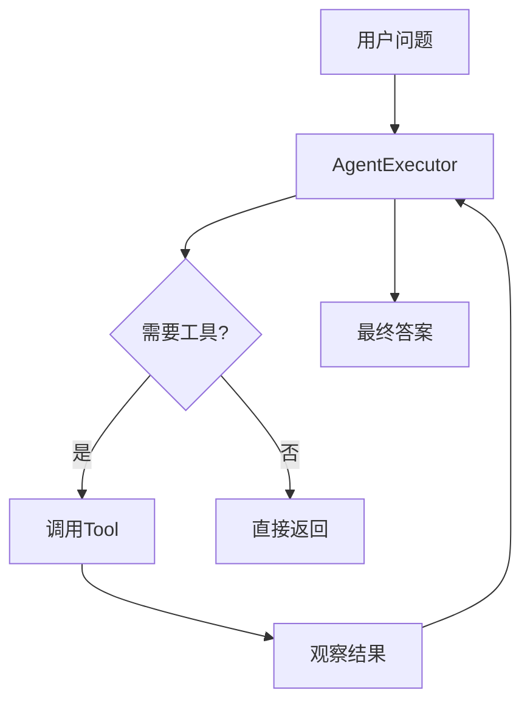
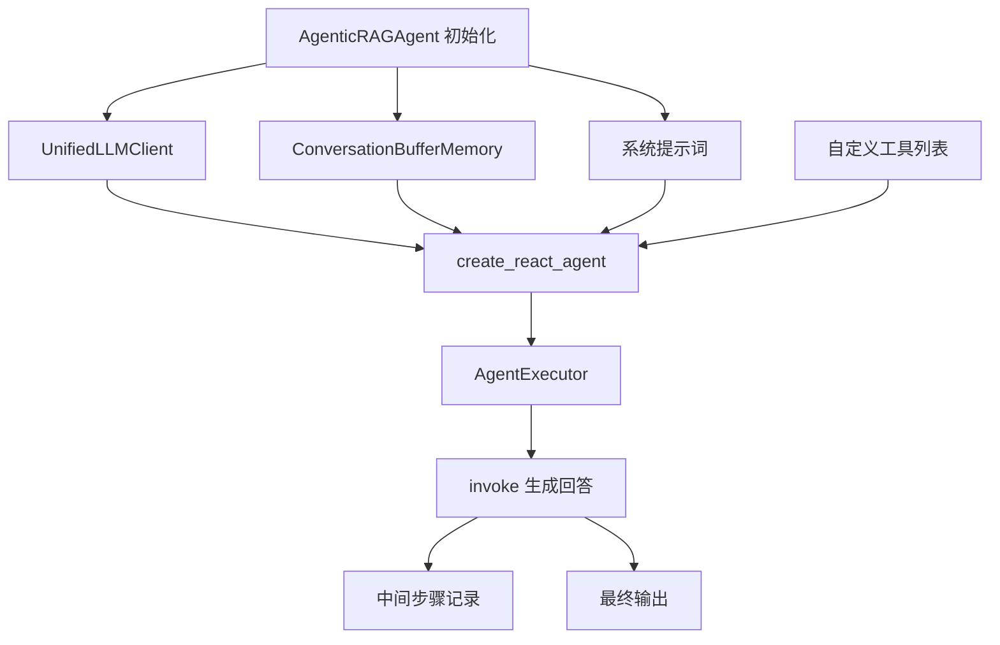

# Agent工具系统 - ReAct框架与LangChain集成

> **本讲目标**：掌握LangChain Agent的ReAct框架实现，构建完整的工具调用系统

## 一、从简单LLM到智能Agent

我们在前面的课程中实现了传统RAG和Agentic RAG的核心逻辑。现在使用LangChain框架来简化Agent开发。

**为什么需要LangChain？**

手动实现Agent（如第4讲的agentic_rag.py）vs LangChain实现对比：

| 维度 | 手动实现 | LangChain实现 | 优势 |
|------|---------|--------------|-----|
| **代码量** | 665行 | 230行 | LangChain减少65%代码 |
| **提示词管理** | 硬编码字符串 | PromptTemplate | 模板化，易维护 |
| **工具注册** | 手动if-elif | Tool类自动注册 | 扩展性强 |
| **记忆管理** | 手动拼接历史 | ConversationBufferMemory | 自动管理 |
| **错误处理** | 自己捕获 | handle_parsing_errors | 内置容错 |
| **调试** | 手动打印 | verbose=True | 自动追踪 |

**从理论到生产的演进**：
```
第2讲（理论）          第4讲（原型）          第15讲（生产）
  ↓                      ↓                      ↓
ReAct框架概念  →  手动实现Agent  →  LangChain封装
                       665行代码           230行代码
```

## 二、ReAct框架在LangChain中的体现

回顾第2讲的ReAct框架（Think-Act-Observe）：

**LangChain中的实现**：

| ReAct步骤 | 手动实现 | LangChain实现 | 代码位置 |
|----------|---------|--------------|---------|
| **Think** | `think()`方法 | `create_react_agent()` | agent.py:100 |
| **Act** | `act()`方法 | `tools`参数 | agent.py:102 |
| **Observe** | `observe()`方法 | `AgentExecutor` | agent.py:107-115 |

**关键组件**：


**核心API**：
```python
# 创建ReAct Agent
agent = create_react_agent(llm, tools, prompt)

# 执行器封装
executor = AgentExecutor(
    agent=agent,
    tools=tools,
    memory=memory,
    max_iterations=5  # 最多思考5次
)

# 运行
response = executor.invoke({"input": "问题"})
```

## 三、Agent系统架构

我们的`agent.py`（230行）实现了完整的Agent系统：



**双模式支持**：
- **有工具**：使用`AgentExecutor`（ReAct框架）
- **无工具**：直接使用LLM（普通对话）

## 四、代码实现详解

我们将230行代码拆分成5个部分讲解。

### 第一部分：Agent类初始化和LLM客户端（1-58行）
**代码文件：** `study-agentic-rag/03-smart-qa-application/models/agent.py`


这部分定义Agent类，集成双模式LLM客户端和记忆管理。

<details>
<summary>点击展开代码</summary>

```python
from typing import List, Dict, Optional, Any, Callable
import logging
from langchain.schema import BaseMessage, HumanMessage, AIMessage, SystemMessage
from langchain.agents import AgentExecutor, create_react_agent
from langchain.prompts import PromptTemplate
from langchain.tools import Tool, StructuredTool
from langchain.memory import ConversationBufferMemory
from langchain.callbacks.streaming_stdout import StreamingStdOutCallbackHandler
from config.settings import Settings
from services.llm_client import UnifiedLLMClient

logger = logging.getLogger(__name__)

class AgenticRAGAgent:
    """Agentic RAG智能问答代理 - 支持 Ollama 和在线 API"""

    def __init__(
        self,
        model_name: str = None,
        temperature: float = 0.7,
        max_tokens: int = 2048,
        tools: Optional[List[Callable]] = None,
        enable_memory: bool = True,
        system_prompt: Optional[str] = None
    ):
        self.settings = Settings()
        self.model_name = model_name or self.settings.get_default_model()
        self.temperature = temperature
        self.max_tokens = max_tokens
        self.tools = tools or []
        self.enable_memory = enable_memory
        self.system_prompt = system_prompt or self._get_default_system_prompt()

        # 初始化统一的 LLM 客户端
        self.llm_client = UnifiedLLMClient(
            model_name=self.model_name,
            temperature=self.temperature,
            max_tokens=self.max_tokens
        )

        # 获取 LangChain 兼容的 LLM 对象
        self.llm = self.llm_client.get_llm()

        # 初始化记忆
        if self.enable_memory:
            self.memory = ConversationBufferMemory(
                memory_key="chat_history",
                return_messages=True,
                output_key="output"
            )

        # 初始化代理
        self.agent = self._initialize_agent()

        # 记录初始化信息
        provider_info = self.llm_client.get_provider_info()
        logger.info(f"Agent 初始化完成 - 提供商: {provider_info['provider']}, 模型: {provider_info['model']}")
```

</details>

**为什么这么写？**

1. **为什么tools参数是`Optional[List[Callable]]`？**
   ```python
   tools: Optional[List[Callable]] = None
   ```
   - **工具是可选的**：Agent可以无工具运行（普通对话模式）
   - **Callable**：工具是可调用对象（函数）
   - 在app.py中动态传入文档搜索和天气查询工具

2. **为什么用`self.llm_client.get_llm()`？**
   ```python
   self.llm = self.llm_client.get_llm()  # 获取LangChain兼容对象
   ```
   - LangChain需要原生的`BaseLLM`对象
   - 不能直接传`UnifiedLLMClient`
   - `get_llm()`返回Ollama或ChatOpenAI实例（回顾第13讲）

3. **为什么记忆用`ConversationBufferMemory`？**
   ```python
   self.memory = ConversationBufferMemory(
       memory_key="chat_history",
       return_messages=True,
       output_key="output"
   )
   ```
   - **ConversationBufferMemory**：保存完整的对话历史
   - **memory_key**：在提示词中使用`{chat_history}`访问
   - **return_messages**：返回消息对象（不是字符串）
   - **output_key**：从Agent输出中提取哪个字段

4. **为什么在`__init__`中调用`_initialize_agent()`？**
   ```python
   self.agent = self._initialize_agent()
   ```
   - 立即创建Agent，验证配置正确性
   - 提前发现错误（如工具定义问题）
   - 后续调用只需`self.agent.invoke()`

### 第二部分：系统提示词配置（59-77行）
**代码文件：** `study-agentic-rag/03-smart-qa-application/models/agent.py`


这部分定义默认系统提示词，指导Agent行为。

<details>
<summary>点击展开代码</summary>

```python
    def _get_default_system_prompt(self) -> str:
        """获取默认系统提示词"""
        return """你是一个智能问答助手，具备以下能力：

1. 文档问答：能够基于上传的文档回答相关问题
2. 天气查询：能够查询实时天气信息和天气预报
3. 多轮对话：能够理解上下文进行连续对话

行为准则：
- 回答要准确、简洁、有用
- 如果不确定答案，请说明
- 使用工具时要明确说明
- 保持友好和专业的态度

工具使用说明：
- 当需要搜索文档时，使用document_search工具
- 当需要查询天气时，使用weather_query工具
- 根据用户问题的具体需求选择合适的工具
"""
```

</details>

**为什么这么写？**

1. **为什么系统提示词如此详细？**
   - **能力声明**：让Agent知道自己能做什么
   - **行为准则**：约束Agent的回答风格
   - **工具指南**：明确何时使用哪个工具
   - 提示词工程的最佳实践

2. **为什么可以自定义提示词？**
   ```python
   system_prompt: Optional[str] = None  # 构造函数参数
   ```
   - 不同场景需要不同的Agent人设
   - 示例：
     ```python
     # 专业版
     agent = AgenticRAGAgent(
         system_prompt="你是一个严谨的技术专家..."
     )
     # 友好版
     agent = AgenticRAGAgent(
         system_prompt="你是一个活泼可爱的助手..."
     )
     ```

3. **为什么要说明工具名称？**
   ```python
   - 当需要搜索文档时，使用document_search工具
   - 当需要查询天气时，使用weather_query工具
   ```
   - Agent需要知道工具的名称才能调用
   - ReAct框架中，Agent生成`Action: document_search`
   - 工具名和实际函数名需要匹配

### 第三部分：工具创建和代理初始化（79-124行）
**代码文件：** `study-agentic-rag/03-smart-qa-application/models/agent.py`


这部分将普通函数转换为LangChain Tool，并创建ReAct Agent。

<details>
<summary>点击展开代码</summary>

```python
    def _initialize_agent(self):
        """初始化代理"""
        try:
            # 创建工具
            langchain_tools = []
            for i, tool_func in enumerate(self.tools):
                tool = Tool(
                    name=f"tool_{i}",
                    func=tool_func,
                    description=f"工具{i+1}: {tool_func.__doc__ or '自定义工具'}"
                )
                langchain_tools.append(tool)

            # 创建提示词模板
            prompt_template = PromptTemplate(
                input_variables=["input", "chat_history", "agent_scratchpad"],
                template=self._create_agent_template()
            )

            # 创建代理
            if langchain_tools:
                agent = create_react_agent(
                    llm=self.llm,
                    tools=langchain_tools,
                    prompt=prompt_template
                )

                # 创建代理执行器
                agent_executor = AgentExecutor(
                    agent=agent,
                    tools=langchain_tools,
                    memory=self.memory if self.enable_memory else None,
                    verbose=True,
                    max_iterations=5,
                    handle_parsing_errors=True,
                    return_intermediate_steps=True
                )

                return agent_executor
            else:
                # 如果没有工具，直接返回LLM
                return self.llm

        except Exception as e:
            logger.error(f"初始化代理失败: {str(e)}")
            raise
```

</details>

**为什么这么写？**

1. **为什么要将函数包装成Tool？**
   ```python
   tool = Tool(
       name=f"tool_{i}",
       func=tool_func,
       description=f"工具{i+1}: {tool_func.__doc__ or '自定义工具'}"
   )
   ```
   - LangChain需要统一的Tool接口
   - **name**：Agent调用时使用的名称
   - **func**：实际执行的函数
   - **description**：告诉Agent这个工具的用途（从函数文档字符串读取）

2. **为什么没有工具时直接返回LLM？**
   ```python
   if langchain_tools:
       return agent_executor
   else:
       return self.llm  # 普通对话模式
   ```
   - 不是所有对话都需要工具
   - 避免ReAct框架的额外开销
   - 提升普通对话的响应速度

3. **为什么用`max_iterations=5`？**
   ```python
   max_iterations=5
   ```
   - ReAct循环次数限制：Think → Act → Observe → Think → ...
   - 防止Agent陷入无限循环
   - 5次通常足够（大部分问题1-2次就解决）

4. **为什么用`handle_parsing_errors=True`？**
   ```python
   handle_parsing_errors=True
   ```
   - Agent输出格式可能不规范（如缺少`Action:`）
   - 自动重试，提高鲁棒性
   - 生产环境必备

5. **为什么用`return_intermediate_steps=True`？**
   ```python
   return_intermediate_steps=True
   ```
   - 返回Agent的思考过程
   - 便于调试和日志记录
   - 示例输出：
     ```python
     {
         "input": "北京天气如何？",
         "output": "北京今天晴转多云，15-25度",
         "intermediate_steps": [
             ("Action: weather_query\nAction Input: 北京", "今天晴转多云，15-25度")
         ]
     }
     ```

### 第四部分：提示词模板和生成回答（126-171行）
**代码文件：** `study-agentic-rag/03-smart-qa-application/models/agent.py`


这部分定义ReAct提示词模板，并实现生成回答的核心逻辑。

<details>
<summary>点击展开代码</summary>

```python
    def _create_agent_template(self) -> str:
        """创建代理提示词模板"""
        return f"""{self.system_prompt}

可用工具:
{{tools}}

工具名称:
{{tool_names}}

当前对话历史:
{{chat_history}}

人类: {{input}}

助手: {{agent_scratchpad}}"""

    def generate_response(self, query: str) -> str:
        """生成回答"""
        try:
            logger.info(f"生成回答 - 查询: {query}")

            if isinstance(self.agent, AgentExecutor):
                # 使用代理执行器
                response = self.agent.invoke({
                    "input": query,
                    "system_prompt": self.system_prompt
                })

                output = response.get("output", "抱歉，我无法生成回答。")

                # 记录中间步骤
                if "intermediate_steps" in response:
                    for step in response["intermediate_steps"]:
                        logger.info(f"中间步骤: {step}")

            else:
                # 直接使用LLM
                messages = [
                    SystemMessage(content=self.system_prompt),
                    HumanMessage(content=query)
                ]

                output = self.agent.invoke(messages).content

            logger.info(f"生成回答成功: {output[:100]}...")
            return output

        except Exception as e:
            error_msg = f"生成回答时出错: {str(e)}"
            logger.error(error_msg)
            return f"抱歉，处理您的请求时出现了错误。{str(e)}"   
        
    def _create_agent_template(self) -> str:
        """创建代理提示词模板"""
        return f"""{self.system_prompt}

可用工具:
{{tools}}

工具名称:
{{tool_names}}

当前对话历史:
{{chat_history}}

人类: {{input}}

助手: {{agent_scratchpad}}"""

    def generate_response(self, query: str) -> str:
        """生成回答"""
        try:
            logger.info(f"生成回答 - 查询: {query}")

            if isinstance(self.agent, AgentExecutor):
                # 使用代理执行器
                response = self.agent.invoke({
                    "input": query,
                    "system_prompt": self.system_prompt
                })

                output = response.get("output", "抱歉，我无法生成回答。")

                # 记录中间步骤
                if "intermediate_steps" in response:
                    for step in response["intermediate_steps"]:
                        logger.info(f"中间步骤: {step}")

            else:
                # 直接使用LLM
                messages = [
                    SystemMessage(content=self.system_prompt),
                    HumanMessage(content=query)
                ]

                output = self.agent.invoke(messages).content

            logger.info(f"生成回答成功: {output[:100]}...")
            return output

        except Exception as e:
            error_msg = f"生成回答时出错: {str(e)}"
            logger.error(error_msg)
            return f"抱歉，处理您的请求时出现了错误。{str(e)}"        
```

</details>

**为什么这么写？**

1. **为什么提示词模板如此简洁？**
   ```python
   {system_prompt}
   {chat_history}
   人类: {input}
   助手: {agent_scratchpad}
   ```
   - `{system_prompt}`：角色和能力声明
   - `{chat_history}`：历史对话（自动填充）
   - `{input}`：用户当前问题
   - `{agent_scratchpad}`：Agent的思考空间（ReAct核心）

2. **什么是`agent_scratchpad`？**
   ```python
   助手: {agent_scratchpad}
   ```
   - ReAct框架的"草稿纸"
   - LangChain自动填充Agent的思考过程：
     ```
     Thought: 需要查询天气
     Action: weather_query
     Action Input: 北京
     Observation: 今天晴转多云，15-25度
     Thought: 有了天气信息，可以回答了
     Final Answer: 北京今天晴转多云，15-25度
     ```

3. **为什么用`isinstance(self.agent, AgentExecutor)`判断？**
   ```python
   if isinstance(self.agent, AgentExecutor):
       # ReAct模式
   else:
       # 普通对话模式
   ```
   - 有工具时，`self.agent`是`AgentExecutor`
   - 无工具时，`self.agent`是`BaseLLM`（Ollama或ChatOpenAI）
   - 区分两种调用方式

4. **为什么记录中间步骤？**
   ```python
   if "intermediate_steps" in response:
       for step in response["intermediate_steps"]:
           logger.info(f"中间步骤: {step}")
   ```
   - 调试：看到Agent的思考过程
   - 监控：统计工具调用频率
   - 优化：发现死循环或低效路径

### 第五部分：工具和记忆管理（173-230行）
**代码文件：** `study-agentic-rag/03-smart-qa-application/models/agent.py`


这部分提供工具动态添加、记忆管理、配置更新等功能。

<details>
<summary>点击展开代码</summary>

```python
    def add_tool(self, tool: Callable, name: str = None, description: str = None):
        """添加工具"""
        self.tools.append(tool)

        # 重新初始化代理
        self.agent = self._initialize_agent()

        logger.info(f"添加工具: {name or tool.__name__}")

    def clear_memory(self):
        """清空记忆"""
        if self.enable_memory and hasattr(self, 'memory'):
            self.memory.clear()
            logger.info("记忆已清空")

    def get_memory_history(self) -> List[Dict[str, str]]:
        """获取记忆历史"""
        if not self.enable_memory or not hasattr(self, 'memory'):
            return []

        try:
            messages = self.memory.chat_memory.messages
            history = []

            for message in messages:
                if isinstance(message, HumanMessage):
                    history.append({"role": "user", "content": message.content})
                elif isinstance(message, AIMessage):
                    history.append({"role": "assistant", "content": message.content})

            return history
        except Exception as e:
            logger.error(f"获取记忆历史失败: {str(e)}")
            return []

    def update_system_prompt(self, new_prompt: str):
        """更新系统提示词"""
        self.system_prompt = new_prompt

        # 重新初始化代理
        self.agent = self._initialize_agent()

        logger.info("系统提示词已更新")

    def get_model_info(self) -> Dict[str, Any]:
        """获取模型信息"""
        provider_info = self.llm_client.get_provider_info()

        return {
            "provider": provider_info.get("provider", "未知"),
            "model_name": self.model_name,
            "temperature": self.temperature,
            "max_tokens": self.max_tokens,
            "tools_count": len(self.tools),
            "memory_enabled": self.enable_memory,
            "system_prompt_length": len(self.system_prompt),
            "base_url": provider_info.get("base_url", "")
        }
```

</details>

**为什么这么写？**

1. **为什么添加工具后要重新初始化Agent？**
   ```python
   def add_tool(self, tool: Callable, name: str = None, description: str = None):
       self.tools.append(tool)
       self.agent = self._initialize_agent()  # 重新创建Agent
   ```
   - Agent初始化时固定了工具列表
   - 添加新工具需要重新创建`AgentExecutor`
   - 更新提示词中的工具说明

2. **为什么记忆历史转换为Dict？**
   ```python
   history.append({"role": "user", "content": message.content})
   ```
   - LangChain使用`BaseMessage`对象
   - 前端需要简单的JSON格式（`{"role": "user", "content": "..."}`）
   - 兼容OpenAI API格式

3. **为什么更新系统提示词也要重新初始化？**
   ```python
   def update_system_prompt(self, new_prompt: str):
       self.system_prompt = new_prompt
       self.agent = self._initialize_agent()
   ```
   - 提示词是Agent行为的核心
   - 需要重新生成`PromptTemplate`
   - 确保新提示词生效

## 五、完整代码总结

上面的5个部分组成了完整的`agent.py`（230行）：

1. **Agent初始化**（58行）：集成LLM客户端、记忆、工具
2. **系统提示词**（19行）：定义Agent能力和行为准则
3. **工具和代理创建**（46行）：Tool包装、ReAct Agent、执行器
4. **提示词模板和生成**（46行）：简洁模板、双模式生成
5. **工具和记忆管理**（58行）：动态添加工具、清空记忆、配置更新

**核心组件关系**：

| 组件 | 类型 | 作用 | 代码位置 |
|------|------|------|---------|
| **UnifiedLLMClient** | 服务 | 双模式LLM | llm_client.py |
| **ConversationBufferMemory** | LangChain | 对话记忆 | agent.py:46 |
| **Tool** | LangChain | 工具包装 | agent.py:85-90 |
| **create_react_agent** | LangChain | ReAct框架 | agent.py:100 |
| **AgentExecutor** | LangChain | 执行器 | agent.py:107 |
| **PromptTemplate** | LangChain | 提示词模板 | agent.py:93 |

**ReAct框架流程**：
```python
用户问题 → AgentExecutor
           ↓
         Thought: 需要查询天气
         Action: weather_query
         Action Input: 北京
           ↓
         调用weather_query("北京")
           ↓
         Observation: 今天晴转多云，15-25度
           ↓
         Thought: 可以回答了
         Final Answer: 北京今天晴转多云，15-25度
```

## 六、实际使用示例

### 示例1：创建带工具的Agent

```python
from models.agent import AgenticRAGAgent

# 定义工具
def search_docs(query: str) -> str:
    """搜索文档中的相关信息"""
    # ... 实际搜索逻辑
    return "找到3个相关文档..."

def get_weather(city: str) -> str:
    """查询天气信息"""
    # ... 实际天气API调用
    return f"{city}今天晴转多云，15-25度"

# 创建Agent（自动使用Ollama或在线API，取决于环境变量）
agent = AgenticRAGAgent(
    model_name="qwen2.5:7b",
    temperature=0.7,
    tools=[search_docs, get_weather],
    enable_memory=True
)

# 生成回答
response = agent.generate_response("北京天气如何？")
print(response)
# 输出：北京今天晴转多云，15-25度
```

### 示例2：查看Agent思考过程

```python
# 开启verbose查看详细日志
agent = AgenticRAGAgent(tools=[search_docs], model_name="qwen2.5:7b")

response = agent.generate_response("RAG是什么？")

# 控制台输出（verbose=True）：
"""
> Entering new AgentExecutor chain...
Thought: 用户问RAG是什么，我需要搜索文档
Action: tool_0
Action Input: RAG
Observation: RAG是检索增强生成技术...
Thought: 我有足够的信息回答了
Final Answer: RAG是检索增强生成技术，结合了信息检索和文本生成...
> Finished chain.
"""
```

### 示例3：管理对话记忆

```python
agent = AgenticRAGAgent(enable_memory=True)

# 第一轮对话
agent.generate_response("我叫张三")

# 第二轮对话（记得上文）
response = agent.generate_response("我叫什么名字？")
print(response)  # 输出：您叫张三

# 查看记忆
history = agent.get_memory_history()
print(history)
# [
#     {"role": "user", "content": "我叫张三"},
#     {"role": "assistant", "content": "好的，我记住了"},
#     {"role": "user", "content": "我叫什么名字？"},
#     {"role": "assistant", "content": "您叫张三"}
# ]

# 清空记忆
agent.clear_memory()
```

### 示例4：动态添加工具

```python
agent = AgenticRAGAgent()

# 初始没有工具

# 后来添加计算器工具
def calculator(expression: str) -> str:
    """计算数学表达式"""
    try:
        return str(eval(expression))
    except:
        return "计算错误"

agent.add_tool(calculator)

# 现在可以计算了
response = agent.generate_response("125 * 37 等于多少？")
print(response)  # 输出：125 * 37 = 4625
```

## 七、与手动实现的对比

回顾第4讲的手动实现（agentic_rag.py）：

| 功能 | 手动实现 | LangChain实现 | 代码减少 |
|------|---------|--------------|---------|
| **工具注册** | 60行if-elif | 6行Tool() | 90% |
| **提示词** | 硬编码字符串 | PromptTemplate | 更灵活 |
| **Think逻辑** | 手写think()方法 | create_react_agent | 100% |
| **Act逻辑** | 手写act()方法 | tools参数 | 100% |
| **Observe逻辑** | 手写observe()方法 | AgentExecutor | 100% |
| **记忆管理** | 手动拼接字符串 | ConversationBufferMemory | 80% |
| **错误处理** | try-except | handle_parsing_errors | 自动化 |

**学习路径价值**：
```
手动实现 → 理解原理 → 使用LangChain → 生产应用
（教学）     （深入）      （高效）        （实战）
```

## 八、本讲总结

我们完成了基于LangChain的Agent系统：

1. **框架集成**：LangChain封装ReAct框架，减少65%代码
2. **工具系统**：Tool类统一接口，自动注册和调用
3. **记忆管理**：ConversationBufferMemory自动管理历史
4. **提示词模板**：PromptTemplate灵活配置
5. **执行器**：AgentExecutor处理ReAct循环和错误

**关键技术点**：
- `create_react_agent()`创建ReAct Agent
- `AgentExecutor`封装Think-Act-Observe循环
- `Tool`类包装普通函数
- `agent_scratchpad`是ReAct的思考空间
- `max_iterations`防止无限循环
- `handle_parsing_errors`提升鲁棒性

**双模式设计**：
- 有工具：`AgentExecutor`（ReAct框架）
- 无工具：直接`LLM`（普通对话）

---

**下一讲预告**

第16讲：工具类实现 - 天气查询与文档处理

我们将学习如何实现具体的工具类：
- 天气API集成（和风天气）
- 文档处理器（PDF、TXT、MD、DOCX）
- UI组件封装
- 聊天历史管理
- 装饰器模式应用
- 完整的weather_tools.py和document_processor.py实现（约300行代码详解）
