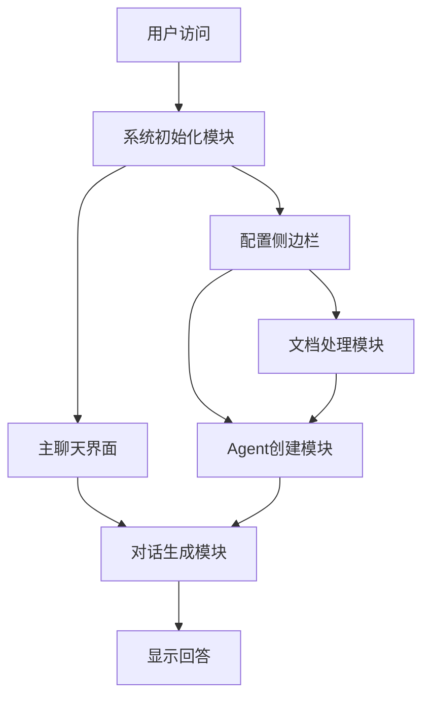

# Streamlit界面开发 - 打造友好的用户体验

> **本讲目标**：掌握Streamlit Web界面开发技巧，构建完整的智能问答交互系统

## 一、从命令行到Web界面的跨越

我们在前面的课程中构建了混合RAG系统，但都是通过命令行交互。对于真实的业务场景，我们需要一个友好的Web界面。

**为什么选择Streamlit？**

对比三种常见的Python Web框架：

| 框架 | 开发难度 | 适用场景 | 学习曲线 | 部署复杂度 |
|------|---------|---------|---------|-----------|
| **Streamlit** | ⭐ 极简 | 数据应用/AI Demo | 1天上手 | 简单 |
| Flask | ⭐⭐ 中等 | API服务/小型Web | 3-5天 | 中等 |
| Django | ⭐⭐⭐ 复杂 | 大型Web应用 | 1-2周 | 复杂 |

Streamlit最大的优势是**零前端知识即可开发**：
- 不需要写HTML/CSS/JavaScript
- Python代码就能定义界面
- 自动处理响应式布局
- 内置状态管理机制

## 二、完整Web应用的五大模块

我们的`app.py`（365行）包含5个核心模块：



**数据流向**：
1. **初始化**：配置页面 → 创建目录 → 初始化会话状态
2. **文档上传**：用户上传 → 文档处理 → 向量存储 → 工具就绪
3. **用户提问**：输入问题 → 创建Agent → 调用工具 → 生成回答 → 显示结果

## 三、代码实现详解

我们将365行代码拆分成5个部分，逐一讲解。

### 第一部分：系统初始化和页面配置（1-52行）

**代码文件：** `study-agentic-rag/03-smart-qa-application/app.py`

这部分负责创建应用类、配置页面、初始化会话状态。

<details>
<summary>点击展开代码</summary>

```python
import streamlit as st
import os
from datetime import datetime
from typing import Dict, List, Optional, Any
from config.settings import Settings
from models.agent import AgenticRAGAgent
from services.vector_store import VectorStoreService
from services.weather_tools import WeatherTools
from utils.document_processor import DocumentProcessor
from utils.ui_components import UIComponents
from utils.chat_history import ChatHistoryManager
from utils.decorators import error_handler, log_execution

class AgenticRAGSystem:
    """主应用类 - Agentic RAG智能问答系统"""

    def __init__(self):
        self.settings = Settings()
        self.vector_store = VectorStoreService()
        self.weather_tools = WeatherTools()
        self.doc_processor = DocumentProcessor()
        self.ui_components = UIComponents()
        self.chat_history = ChatHistoryManager()
        self.agent = None
        self._initialize_system()

    @error_handler
    def _initialize_system(self):
        """初始化系统组件"""
        st.set_page_config(
            page_title="Agentic RAG智能问答系统",
            page_icon="🤖",
            layout="wide",
            initial_sidebar_state="expanded"
        )

        # 初始化会话状态
        if 'initialized' not in st.session_state:
            st.session_state.initialized = True
            st.session_state.chat_history = []
            st.session_state.vector_store_ready = False
            st.session_state.current_model = self.settings.get_default_model()
            st.session_state.temperature = self.settings.DEFAULT_TEMPERATURE
            st.session_state.max_tokens = self.settings.DEFAULT_MAX_TOKENS
            st.session_state.top_k = self.settings.DEFAULT_TOP_K
            st.session_state.search_type = self.settings.DEFAULT_SEARCH_TYPE
            st.session_state.llm_provider = self.settings.LLM_PROVIDER

        # 创建必要的目录
        os.makedirs(self.settings.DATA_DIR, exist_ok=True)
        os.makedirs(self.settings.VECTOR_STORE_DIR, exist_ok=True)
        os.makedirs(self.settings.CHAT_HISTORY_DIR, exist_ok=True)
```

</details>

**为什么这么写？**

1. **为什么用`st.set_page_config()`？**
   - 必须在最开始调用（Streamlit要求）
   - `layout="wide"`：使用宽屏布局，充分利用空间
   - `initial_sidebar_state="expanded"`：默认展开侧边栏，方便配置

2. **为什么用`st.session_state`？**
   - Streamlit每次交互都会重新运行整个脚本
   - `session_state`在页面刷新之间保持数据
   - 类似Web开发中的Session机制

3. **为什么只在`'initialized' not in st.session_state`时初始化？**
   ```python
   if 'initialized' not in st.session_state:
       # 只在第一次访问时执行
   ```
   - 避免每次交互都重置数据
   - 保留用户的聊天历史和配置

4. **为什么`self.agent = None`？**
   - Agent需要根据用户配置动态创建
   - 延迟初始化，等配置完成后再创建

### 第二部分：Agent创建和工具配置（54-118行）

**代码文件：** `study-agentic-rag/03-smart-qa-application/app.py`

这部分动态创建Agent，并根据向量存储状态决定加载哪些工具。

<details>
<summary>点击展开代码</summary>

```python
    @error_handler
    def _create_agent(self):
        """创建Agent实例"""
        tools = []

        # 如果向量存储已准备，添加文档搜索工具
        if st.session_state.vector_store_ready:
            tools.append(self._create_document_search_tool())

        # 添加天气查询工具
        tools.append(self._create_weather_tool())

        self.agent = AgenticRAGAgent(
            model_name=st.session_state.current_model,
            temperature=st.session_state.temperature,
            max_tokens=st.session_state.max_tokens,
            tools=tools if tools else None
        )

    def _create_document_search_tool(self):
        """创建文档搜索工具"""
        def document_search(query: str, top_k: Optional[int] = None) -> str:
            """搜索文档中的相关信息"""
            try:
                if not st.session_state.vector_store_ready:
                    return "向量存储未准备好，请先上传文档。"

                top_k = top_k or st.session_state.top_k
                results = self.vector_store.search(
                    query=query,
                    top_k=top_k,
                    search_type=st.session_state.search_type
                )

                if not results:
                    return "未找到相关文档信息。"

                # 格式化搜索结果
                formatted_results = []
                for i, result in enumerate(results, 1):
                    formatted_results.append(
                        f"【文档{i}】\n内容: {result['content']}\n"
                        f"相似度: {result['score']:.3f}\n"
                    )

                return "\n".join(formatted_results)

            except Exception as e:
                return f"文档搜索出错: {str(e)}"

        return document_search

    def _create_weather_tool(self):
        """创建天气查询工具"""
        def weather_query(city: str, forecast_days: int = 1) -> str:
            """查询天气信息"""
            try:
                if forecast_days == 1:
                    return self.weather_tools.get_current_weather(city)
                else:
                    return self.weather_tools.get_weather_forecast(city, forecast_days)
            except Exception as e:
                return f"天气查询出错: {str(e)}"

        return weather_query
```

</details>

**为什么这么写？**

1. **为什么工具是动态添加的？**
   ```python
   if st.session_state.vector_store_ready:
       tools.append(self._create_document_search_tool())
   ```
   - 用户可能还没上传文档
   - 避免Agent调用不存在的工具
   - 实现渐进式功能开放

2. **为什么返回函数而不是直接定义工具？**
   ```python
   def _create_document_search_tool(self):
       def document_search(query: str, top_k: Optional[int] = None):
           # ...
       return document_search  # 返回函数对象
   ```
   - 闭包捕获`self`，工具函数可以访问类的实例变量
   - 符合LangChain的工具定义规范
   - 每次创建Agent时生成新的工具实例

3. **为什么格式化搜索结果？**
   ```python
   formatted_results.append(
       f"【文档{i}】\n内容: {result['content']}\n"
       f"相似度: {result['score']:.3f}\n"
   )
   ```
   - 让Agent更容易理解检索结果
   - 相似度得分帮助Agent判断可信度
   - 结构化输出提升答案质量

### 第三部分：文档处理流程（120-164行）

**代码文件：** `study-agentic-rag/03-smart-qa-application/app.py`

这部分处理用户上传的文件，显示处理进度，构建向量存储。

<details>
<summary>点击展开代码</summary>

```python
    @error_handler
    def process_uploaded_files(self, uploaded_files):
        """处理上传的文件"""
        if not uploaded_files:
            return 0

        progress_bar = st.progress(0)
        status_text = st.empty()

        try:
            all_documents = []
            total_files = len(uploaded_files)

            for i, file in enumerate(uploaded_files):
                status_text.text(f"正在处理文件: {file.name} ({i+1}/{total_files})")

                # 处理文档
                documents = self.doc_processor.process_uploaded_file(file)
                if documents:
                    all_documents.extend(documents)

                progress_bar.progress((i + 1) / total_files)

            if all_documents:
                status_text.text("正在构建向量存储...")

                # 添加到向量存储
                self.vector_store.add_documents(all_documents)

                # 保存向量存储
                self.vector_store.save_index(self.settings.VECTOR_STORE_PATH)

                st.session_state.vector_store_ready = True
                status_text.text(f"✅ 成功处理 {len(all_documents)} 个文档片段")

                return len(all_documents)
            else:
                status_text.text("⚠️ 没有有效的文档被处理")
                return 0

        except Exception as e:
            status_text.text(f"❌ 处理文件时出错: {str(e)}")
            return 0
        finally:
            progress_bar.empty()
```

</details>

**为什么这么写？**

1. **为什么用`st.progress()`和`st.empty()`？**
   ```python
   progress_bar = st.progress(0)
   status_text = st.empty()
   ```
   - `progress()`：显示进度条，提升用户体验
   - `empty()`：创建占位符，可以动态更新文本
   - 处理大文件时，让用户看到实时进度

2. **为什么`finally: progress_bar.empty()`？**
   ```python
   finally:
       progress_bar.empty()
   ```
   - 无论成功或失败，都清除进度条
   - 避免界面残留组件
   - `finally`确保一定执行

3. **为什么先收集所有文档，再批量添加？**
   ```python
   for i, file in enumerate(uploaded_files):
       documents = self.doc_processor.process_uploaded_file(file)
       all_documents.extend(documents)  # 先收集

   self.vector_store.add_documents(all_documents)  # 再批量添加
   ```
   - 批量添加更高效（一次性构建索引）
   - 避免多次重建向量存储
   - 减少磁盘I/O操作

### 第四部分：对话生成逻辑（166-180行）

**代码文件：** `study-agentic-rag/03-smart-qa-application/app.py`

这部分是核心业务逻辑，调用Agent生成回答。

<details>
<summary>点击展开代码</summary>

```python
    @error_handler
    def generate_response(self, query: str) -> str:
        """生成回答"""
        try:
            # 创建Agent（如果需要）
            if not self.agent:
                self._create_agent()

            # 生成回答
            response = self.agent.generate_response(query)

            return response

        except Exception as e:
            return f"生成回答时出错: {str(e)}"
```

</details>

**为什么这么写？**

1. **为什么每次检查`if not self.agent`？**
   ```python
   if not self.agent:
       self._create_agent()
   ```
   - 用户可能修改了模型配置（温度、模型名称等）
   - 第一次提问时才创建Agent
   - 延迟初始化节省资源

2. **为什么用`@error_handler`装饰器？**
   - 统一捕获异常，避免应用崩溃
   - 返回友好的错误信息给用户
   - 记录日志便于调试

### 第五部分：主界面布局（182-365行）

**代码文件：** `study-agentic-rag/03-smart-qa-application/app.py`

这是最复杂的部分，包含侧边栏配置和主聊天界面。

<details>
<summary>点击展开代码</summary>

```python
    def run(self):
        """运行应用"""
        # 标题
        st.title("🤖 基于LangChain+Agentic RAG技术实现的智能问答系统")
        st.markdown("---")

        # 侧边栏
        with st.sidebar:
            st.header("⚙️ 系统配置")

            # LLM 提供商信息
            provider_info = self.settings.get_provider_info()
            st.info(f"🔧 **LLM 提供商**: {provider_info['provider']}\n\n"
                   f"📡 **服务地址**: {provider_info['base_url']}\n\n"
                   f"🎯 **嵌入模型**: {provider_info['embedding']}")

            st.markdown("---")

            # 模型设置
            st.subheader("模型设置")

            # 获取可用模型列表
            available_models = self.settings.get_available_models()

            # 确保当前模型在列表中
            if st.session_state.current_model not in available_models:
                st.session_state.current_model = self.settings.get_default_model()

            st.session_state.current_model = st.selectbox(
                "选择模型:",
                available_models,
                index=available_models.index(st.session_state.current_model) if st.session_state.current_model in available_models else 0
            )

            st.session_state.temperature = st.slider(
                "温度系数:",
                min_value=0.0,
                max_value=1.0,
                value=st.session_state.temperature,
                step=0.1
            )

            st.session_state.max_tokens = st.slider(
                "最大token数:",
                min_value=100,
                max_value=4000,
                value=st.session_state.max_tokens,
                step=100
            )

            # RAG设置
            st.subheader("RAG设置")
            st.session_state.top_k = st.slider(
                "检索数量:",
                min_value=1,
                max_value=10,
                value=st.session_state.top_k,
                step=1
            )

            st.session_state.search_type = st.selectbox(
                "搜索类型:",
                ["similarity", "mmr"],
                index=0 if st.session_state.search_type == "similarity" else 1
            )

            # 文档上传
            st.subheader("📄 文档上传")
            uploaded_files = st.file_uploader(
                "上传文档:",
                type=['pdf', 'txt', 'md', 'docx'],
                accept_multiple_files=True
            )

            if st.button("🔄 处理文档") and uploaded_files:
                with st.spinner("正在处理文档..."):
                    doc_count = self.process_uploaded_files(uploaded_files)
                    if doc_count > 0:
                        st.success(f"成功处理 {doc_count} 个文档片段")
                        st.rerun()

            # 向量存储状态
            st.subheader("📊 向量存储状态")
            if st.session_state.vector_store_ready:
                st.success("✅ 向量存储已准备")
                if st.button("🗑️ 清空向量存储"):
                    self.vector_store.clear()
                    st.session_state.vector_store_ready = False
                    st.rerun()
            else:
                st.warning("⚠️ 向量存储未准备")

                # 加载已有向量存储
                if os.path.exists(self.settings.VECTOR_STORE_PATH):
                    if st.button("📂 加载已有向量存储"):
                        try:
                            self.vector_store.load_index(self.settings.VECTOR_STORE_PATH)
                            st.session_state.vector_store_ready = True
                            st.success("✅ 向量存储加载成功")
                            st.rerun()
                        except Exception as e:
                            st.error(f"加载向量存储失败: {str(e)}")

            # 聊天记录管理
            st.subheader("💬 聊天记录")

            # 导出聊天记录
            if st.session_state.chat_history:
                if st.button("📥 导出聊天记录"):
                    csv_content = self.chat_history.export_to_csv()
                    st.download_button(
                        label="下载CSV文件",
                        data=csv_content,
                        file_name=f"chat_history_{datetime.now().strftime('%Y%m%d_%H%M%S')}.csv",
                        mime="text/csv"
                    )

            # 清空聊天记录
            if st.button("🗑️ 清空聊天记录"):
                st.session_state.chat_history = []
                self.chat_history.clear()
                st.rerun()

        # 主界面
        col1, col2 = st.columns([3, 1])

        with col1:
            # 聊天界面
            st.header("💬 智能问答")

            # 显示聊天记录
            for message in st.session_state.chat_history:
                with st.chat_message(message["role"]):
                    st.markdown(message["content"])

            # 用户输入
            if prompt := st.chat_input("请输入您的问题..."):
                # 添加用户消息
                st.session_state.chat_history.append({"role": "user", "content": prompt})

                # 显示用户消息
                with st.chat_message("user"):
                    st.markdown(prompt)

                # 生成回答
                with st.chat_message("assistant"):
                    with st.spinner("正在思考..."):
                        response = self.generate_response(prompt)
                        st.markdown(response)

                        # 保存回答到聊天记录
                        st.session_state.chat_history.append({"role": "assistant", "content": response})

                        # 保存聊天记录到文件
                        self.chat_history.add_message("user", prompt)
                        self.chat_history.add_message("assistant", response)

        with col2:
            # 聊天统计
            st.header("📊 聊天统计")

            if st.session_state.chat_history:
                total_messages = len(st.session_state.chat_history)
                user_messages = len([m for m in st.session_state.chat_history if m["role"] == "user"])
                assistant_messages = len([m for m in st.session_state.chat_history if m["role"] == "assistant"])

                st.metric("总消息数", total_messages)
                st.metric("用户消息", user_messages)
                st.metric("助手消息", assistant_messages)

                # 显示最近的消息
                st.subheader("最近消息")
                recent_messages = st.session_state.chat_history[-5:]
                for msg in recent_messages:
                    role_icon = "👤" if msg["role"] == "user" else "🤖"
                    content = msg["content"][:100] + "..." if len(msg["content"]) > 100 else msg["content"]
                    st.text(f"{role_icon}: {content}")
            else:
                st.info("暂无聊天记录")


if __name__ == "__main__":
    app = AgenticRAGSystem()
    app.run()
```

</details>

**为什么这么写？**

1. **为什么用`with st.sidebar:`？**
   ```python
   with st.sidebar:
       # 所有侧边栏组件
   ```
   - 上下文管理器自动管理布局
   - 代码更清晰，避免嵌套
   - 所有组件自动放入侧边栏

2. **为什么用`st.rerun()`？**
   ```python
   if doc_count > 0:
       st.success(f"成功处理 {doc_count} 个文档片段")
       st.rerun()  # 重新运行应用
   ```
   - 更新`session_state`后需要刷新界面
   - 重新创建Agent以加载文档搜索工具
   - 相当于刷新页面

3. **为什么用`:=`（海象运算符）？**
   ```python
   if prompt := st.chat_input("请输入您的问题..."):
       # 使用prompt
   ```
   - 赋值的同时进行条件判断
   - 避免写两行代码：
     ```python
     prompt = st.chat_input("...")
     if prompt:
     ```

4. **为什么用`st.columns([3, 1])`？**
   ```python
   col1, col2 = st.columns([3, 1])
   ```
   - 创建3:1的两列布局
   - 左侧75%放聊天界面
   - 右侧25%放统计信息
   - 充分利用宽屏空间

5. **为什么同时保存到`session_state`和文件？**
   ```python
   st.session_state.chat_history.append(...)  # 保存到内存
   self.chat_history.add_message(...)         # 保存到文件
   ```
   - `session_state`：当前会话使用，刷新页面会丢失
   - 文件：持久化存储，可以导出和分析
   - 双保险机制

## 四、完整代码总结

上面的5个部分组成了完整的`app.py`（365行）：

1. **系统初始化**（52行）：配置页面、初始化状态、创建目录
2. **Agent创建**（65行）：动态工具加载、闭包工具函数
3. **文档处理**（45行）：进度显示、批量处理、向量存储
4. **对话生成**（15行）：延迟初始化、异常处理
5. **主界面**（188行）：侧边栏配置、聊天界面、统计面板

**核心设计模式**：

| 模式 | 应用场景 | 代码位置 |
|------|---------|---------|
| **延迟初始化** | Agent创建 | `generate_response()` |
| **装饰器模式** | 异常处理 | `@error_handler` |
| **上下文管理器** | 布局管理 | `with st.sidebar:` |
| **状态管理** | 会话数据 | `st.session_state` |
| **闭包** | 工具函数 | `_create_document_search_tool()` |

**Streamlit关键API汇总**：

```python
# 页面配置
st.set_page_config(title, icon, layout)

# 布局组件
st.sidebar          # 侧边栏
st.columns([3, 1])  # 多列布局
st.container()      # 容器

# 输入组件
st.file_uploader()  # 文件上传
st.selectbox()      # 下拉选择
st.slider()         # 滑块
st.button()         # 按钮
st.chat_input()     # 聊天输入

# 显示组件
st.title()          # 标题
st.header()         # 二级标题
st.subheader()      # 三级标题
st.markdown()       # Markdown
st.chat_message()   # 聊天消息
st.metric()         # 指标卡片
st.progress()       # 进度条
st.spinner()        # 加载动画
st.empty()          # 占位符

# 状态提示
st.success()        # 成功提示
st.info()           # 信息提示
st.warning()        # 警告提示
st.error()          # 错误提示

# 状态管理
st.session_state    # 会话状态
st.rerun()          # 重新运行
```

## 五、实际运行效果

启动应用：
```bash
cd agentic_rag_smart_qa_project
uv run streamlit run app.py
```

**界面布局**：
```
┌─────────────────────────────────────────────────────────────┐
│ 🤖 Agentic RAG智能问答系统                                   │
├──────────┬──────────────────────────────────────────────────┤
│ 侧边栏   │ 主界面                                            │
│          │                                                  │
│ ⚙️ 配置   │ 💬 智能问答              📊 统计               │
│          │ ┌───────────────┐       ┌──────┐               │
│ 模型设置 │ │ 👤: 你好      │       │总消息│               │
│ RAG设置  │ │ 🤖: 您好！    │       │ 2    │               │
│ 文档上传 │ │               │       └──────┘               │
│ 向量存储 │ │ 输入框 _______ │                              │
│ 聊天记录 │ └───────────────┘                              │
└──────────┴──────────────────────────────────────────────────┘
```

**用户操作流程**：
1. 打开页面 → 自动初始化
2. 侧边栏上传PDF文档 → 点击"处理文档" → 看到进度条
3. 主界面输入问题 → 看到"正在思考..."
4. Agent调用文档搜索工具 → 生成回答
5. 聊天记录自动保存 → 可导出CSV

## 六、本讲总结

我们完成了完整的Streamlit Web界面开发：

1. **页面配置**：宽屏布局、侧边栏、会话状态
2. **动态工具**：根据向量存储状态加载工具
3. **文档处理**：进度显示、批量处理、持久化存储
4. **聊天界面**：消息显示、实时生成、历史记录
5. **配置面板**：模型选择、参数调节、状态监控

**关键技术点**：
- `st.session_state`保持会话数据
- `st.rerun()`刷新界面
- `st.columns()`响应式布局
- `st.chat_message()`聊天UI
- 装饰器异常处理

---

**下一讲预告**

第13讲：双模式LLM集成 - 本地与云端的灵活切换

我们将深入学习如何实现Ollama（本地）和阿里云百炼（在线）的双模式支持：
- LLM统一接口设计
- 环境变量配置管理
- 自动fallback机制
- API兼容性处理
- 完整的llm_client.py实现（约180行代码详解）
