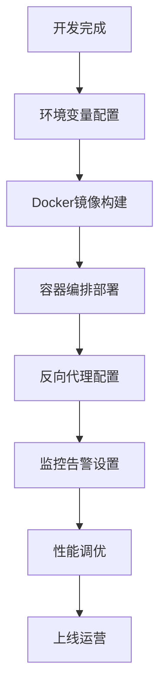

# 第18讲：生产环境部署与性能调优 - 完整项目总结

> **本讲目标**：掌握生产环境部署方法、性能调优技巧，回顾完整Agentic RAG项目

## 一、从开发到生产的跨越

我们已经完成了一个功能完整的Agentic RAG智能问答系统（11-17讲）。但开发环境和生产环境有很大不同：

**开发vs生产对比**：

| 维度 | 开发环境 | 生产环境 |
|------|---------|---------|
| **运行方式** | `streamlit run app.py` | Docker容器 + 进程守护 |
| **配置管理** | 硬编码/本地.env | 环境变量/配置中心 |
| **LLM提供商** | Ollama本地（免费测试） | 阿里云百炼（稳定服务） |
| **数据库** | 临时文件 | 持久化存储/云存储 |
| **日志** | 控制台输出 | 文件日志/日志平台 |
| **监控** | 无 | Prometheus/Grafana |
| **错误处理** | 直接显示堆栈 | 友好提示+日志记录 |
| **性能** | 无要求 | 响应时间<3秒 |

**生产环境部署流程**：


## 二、Docker容器化部署

**为什么使用Docker？**
- **环境一致性**：开发、测试、生产环境完全一致
- **快速部署**：一条命令启动应用
- **资源隔离**：多个应用互不干扰
- **易于扩展**：水平扩展只需启动更多容器

### 2.1 Dockerfile示例

```dockerfile
# 使用官方Python基础镜像
FROM python:3.10-slim

# 设置工作目录
WORKDIR /app

# 安装系统依赖
RUN apt-get update && apt-get install -y \
    build-essential \
    curl \
    && rm -rf /var/lib/apt/lists/*

# 复制依赖文件
COPY requirements.txt .

# 安装Python依赖
RUN pip install --no-cache-dir -r requirements.txt

# 复制应用代码
COPY . .

# 创建数据目录
RUN mkdir -p /app/data /app/logs

# 暴露端口
EXPOSE 8501

# 健康检查
HEALTHCHECK --interval=30s --timeout=10s --start-period=5s --retries=3 \
    CMD curl -f http://localhost:8501/_stcore/health || exit 1

# 启动命令
CMD ["streamlit", "run", "app.py", \
     "--server.port=8501", \
     "--server.address=0.0.0.0", \
     "--server.headless=true", \
     "--server.enableCORS=false", \
     "--server.enableXsrfProtection=false"]
```

### 2.2 docker-compose.yml示例

```yaml
version: '3.8'

services:
  # Agentic RAG应用
  agentic-rag:
    build: .
    container_name: agentic_rag_app
    ports:
      - "8501:8501"
    volumes:
      - ./data:/app/data
      - ./logs:/app/logs
    environment:
      # LLM配置
      - LLM_PROVIDER=online  # 生产环境使用在线API
      - ONLINE_API_KEY=${ONLINE_API_KEY}
      - ONLINE_BASE_URL=https://dashscope.aliyuncs.com/compatible-mode/v1

      # 日志配置
      - LOG_LEVEL=INFO
      - LOG_FILE=/app/logs/app.log

      # 缓存配置
      - CACHE_ENABLED=true
      - CACHE_EXPIRE_TIME=86400

      # 性能配置
      - MAX_FILE_SIZE=10485760  # 10MB
      - CHUNK_SIZE=800
      - CHUNK_OVERLAP=100

    restart: unless-stopped

    healthcheck:
      test: ["CMD", "curl", "-f", "http://localhost:8501/_stcore/health"]
      interval: 30s
      timeout: 10s
      retries: 3
      start_period: 40s

  # Nginx反向代理（可选）
  nginx:
    image: nginx:alpine
    container_name: agentic_rag_nginx
    ports:
      - "80:80"
      - "443:443"
    volumes:
      - ./nginx.conf:/etc/nginx/nginx.conf
      - ./ssl:/etc/nginx/ssl
    depends_on:
      - agentic-rag
    restart: unless-stopped
```

### 2.3 部署命令

```bash
# 构建镜像
docker-compose build

# 启动服务
docker-compose up -d

# 查看日志
docker-compose logs -f agentic-rag

# 停止服务
docker-compose down

# 重启服务
docker-compose restart agentic-rag
```

## 三、环境变量管理

**生产环境必须使用环境变量管理配置**，不能硬编码API密钥等敏感信息。

### 3.1 .env.example（模板文件）

```bash
# LLM提供商配置
LLM_PROVIDER=online  # ollama 或 online
ONLINE_API_KEY=sk-xxxxxxxxxxxxxxxx
ONLINE_BASE_URL=https://dashscope.aliyuncs.com/compatible-mode/v1
OLLAMA_BASE_URL=http://localhost:11434

# 模型配置
OLLAMA_LLM_MODEL=qwen2.5:7b
OLLAMA_EMBEDDING_MODEL=nomic-embed-text:latest
ONLINE_LLM_MODEL=qwen-plus
ONLINE_EMBEDDING_MODEL=text-embedding-v1

# 天气API配置
WEATHER_API_KEY=your_weather_api_key
WEATHER_API_URL=https://restapi.amap.com/v3/weather/weatherInfo
WEATHER_CITY_URL=https://restapi.amap.com/v3/config/district

# 数据目录配置
DATA_DIR=/app/data
VECTOR_STORE_DIR=/app/data/vector_store
CHAT_HISTORY_DIR=/app/data/chat_history

# 日志配置
LOG_LEVEL=INFO  # DEBUG, INFO, WARNING, ERROR
LOG_FILE=/app/logs/app.log

# 性能配置
MAX_FILE_SIZE=10485760  # 10MB
CHUNK_SIZE=800
CHUNK_OVERLAP=100
CACHE_ENABLED=true
CACHE_EXPIRE_TIME=86400  # 24小时

# Streamlit配置
STREAMLIT_SERVER_PORT=8501
STREAMLIT_SERVER_ADDRESS=0.0.0.0
STREAMLIT_SERVER_HEADLESS=true
```

### 3.2 安全建议

```bash
# 1. 永远不要提交.env文件到Git
echo ".env" >> .gitignore

# 2. 使用强密码/API密钥
ONLINE_API_KEY=sk-$(openssl rand -hex 32)

# 3. 定期轮换密钥（每30-90天）

# 4. 生产环境使用配置中心（如Vault、AWS Secrets Manager）

# 5. 限制环境变量权限
chmod 600 .env
```

## 四、性能优化建议

### 4.1 LLM调用优化

```python
# 1. 缓存LLM响应
@cache_result(expire_time=3600)
def call_llm(prompt: str) -> str:
    return llm.invoke(prompt)

# 2. 批量嵌入（而不是逐个）
# 慢：
embeddings = [embedding_model.embed_query(text) for text in texts]

# 快：
embeddings = embedding_model.embed_documents(texts)

# 3. 控制上下文长度
# 太长：Token消耗大，响应慢
# 太短：上下文不足，回答质量差
# 建议：最近5-10轮对话

# 4. 使用流式输出（Streamlit支持）
with st.chat_message("assistant"):
    st.write_stream(agent.stream(query))
```

### 4.2 向量存储优化

```python
# 1. 选择合适的索引类型
# <1万向量：Flat索引（精确搜索）
# 1万-100万：IVF索引（近似搜索，快10-100倍）
# >100万：HNSW索引（极速搜索）

# 2. 批量添加文档
# 慢：
for doc in documents:
    vector_store.add_documents([doc])

# 快：
vector_store.add_documents(documents)  # 一次性添加

# 3. 设置合理的top_k
# top_k=3  适合大多数场景
# top_k=5  复杂问题
# top_k=10 过多会增加LLM处理负担

# 4. 使用MMR搜索（去重）
results = vector_store.search(query, search_type="mmr")
```

### 4.3 文档处理优化

```python
# 1. 启用缓存
CACHE_ENABLED=true

# 2. 合理设置分块大小
# 太小（<300）：上下文丢失
# 太大（>1500）：检索不精准
# 推荐：500-1000，重叠10-20%

# 3. 并行处理多个文件
from concurrent.futures import ThreadPoolExecutor

with ThreadPoolExecutor(max_workers=4) as executor:
    results = list(executor.map(process_file, uploaded_files))

# 4. 限制文件大小
MAX_FILE_SIZE=10MB  # 防止大文件拖慢系统
```

### 4.4 Streamlit性能优化

```python
# 1. 使用@st.cache_data缓存数据
@st.cache_data
def load_vector_store():
    return VectorStoreService()

# 2. 使用@st.cache_resource缓存资源
@st.cache_resource
def load_agent():
    return AgenticRAGAgent(model_name="qwen2.5:7b")

# 3. 避免重复计算
# 慢：
if st.button("查询"):
    result = expensive_operation()  # 每次点击都执行

# 快：
if st.button("查询"):
    if "result" not in st.session_state:
        st.session_state.result = expensive_operation()
    result = st.session_state.result

# 4. 使用st.spinner显示进度
with st.spinner("正在处理..."):
    result = long_running_operation()
```

## 五、监控和日志

### 5.1 日志配置

```python
# logging_config.py
import logging
import sys
from pathlib import Path

def setup_logging(log_level: str = "INFO", log_file: str = None):
    """配置日志"""
    # 创建日志格式
    log_format = "%(asctime)s - %(name)s - %(levelname)s - %(message)s"
    date_format = "%Y-%m-%d %H:%M:%S"

    # 配置根日志器
    logging.basicConfig(
        level=getattr(logging, log_level.upper()),
        format=log_format,
        datefmt=date_format,
        handlers=[]
    )

    logger = logging.getLogger()

    # 控制台输出
    console_handler = logging.StreamHandler(sys.stdout)
    console_handler.setFormatter(logging.Formatter(log_format, date_format))
    logger.addHandler(console_handler)

    # 文件输出（如果指定）
    if log_file:
        log_path = Path(log_file)
        log_path.parent.mkdir(parents=True, exist_ok=True)

        file_handler = logging.FileHandler(log_file, encoding='utf-8')
        file_handler.setFormatter(logging.Formatter(log_format, date_format))
        logger.addHandler(file_handler)

    return logger
```

### 5.2 性能监控指标

```python
# metrics.py
import time
import psutil
import logging

logger = logging.getLogger(__name__)

class PerformanceMetrics:
    """性能指标收集"""

    @staticmethod
    def log_system_metrics():
        """记录系统指标"""
        cpu_percent = psutil.cpu_percent(interval=1)
        memory = psutil.virtual_memory()
        disk = psutil.disk_usage('/')

        logger.info(f"系统指标 - CPU: {cpu_percent}%, "
                   f"内存: {memory.percent}%, "
                   f"磁盘: {disk.percent}%")

    @staticmethod
    def log_request_metrics(endpoint: str, duration: float, status: str):
        """记录请求指标"""
        logger.info(f"请求指标 - 端点: {endpoint}, "
                   f"耗时: {duration:.3f}秒, "
                   f"状态: {status}")
```

## 六、安全注意事项

### 6.1 输入验证

```python
# 防止注入攻击
def validate_user_input(user_input: str) -> bool:
    """验证用户输入"""
    # 1. 长度限制
    if len(user_input) > 5000:
        return False

    # 2. 危险字符检测
    dangerous_patterns = [
        "<script>", "javascript:", "onerror=",
        "'; DROP TABLE", "UNION SELECT"
    ]
    for pattern in dangerous_patterns:
        if pattern.lower() in user_input.lower():
            return False

    return True

# 3. 文件上传验证
def validate_uploaded_file(file):
    """验证上传文件"""
    # 文件大小
    if file.size > 10 * 1024 * 1024:  # 10MB
        raise ValueError("文件过大")

    # 文件类型
    allowed_types = ['.pdf', '.txt', '.md', '.docx']
    file_ext = Path(file.name).suffix.lower()
    if file_ext not in allowed_types:
        raise ValueError("不支持的文件类型")

    return True
```

### 6.2 API密钥保护

```python
# 1. 永远不要硬编码API密钥
# 错误：
API_KEY = "sk-xxxxxxxx"

# 正确：
API_KEY = os.getenv("ONLINE_API_KEY")
if not API_KEY:
    raise ValueError("未设置ONLINE_API_KEY环境变量")

# 2. 日志中隐藏敏感信息
def mask_api_key(api_key: str) -> str:
    """隐藏API密钥"""
    if len(api_key) > 8:
        return api_key[:4] + "****" + api_key[-4:]
    return "****"

logger.info(f"使用API密钥: {mask_api_key(API_KEY)}")
```

## 七、完整项目回顾

我们从第11讲到第18讲，完成了一个生产级的Agentic RAG智能问答系统：

**项目架构总览**：
```
agentic_rag_smart_qa_project/
├── app.py                    # 主应用（365行）
├── config/
│   └── settings.py           # 配置管理（211行）
├── models/
│   └── agent.py              # Agent系统（230行）
├── services/
│   ├── llm_client.py         # 双模式LLM（216行）
│   ├── vector_store.py       # FAISS向量存储（310行）
│   └── weather_tools.py      # 天气查询（310行）
└── utils/
    ├── document_processor.py # 文档处理（343行）
    ├── chat_history.py       # 聊天历史（379行）
    ├── decorators.py         # 装饰器（334行）
    └── ui_components.py      # UI组件（384行）

总计：2,082行代码
```

**核心技术栈**：

| 层次 | 技术 | 作用 |
|------|------|------|
| **前端** | Streamlit | Web界面 |
| **框架** | LangChain | Agent和ReAct框架 |
| **LLM** | Ollama + 阿里云百炼 | 双模式LLM支持 |
| **向量数据库** | FAISS | 高性能向量检索 |
| **文档处理** | LangChain Loaders | PDF/TXT/MD/DOCX |
| **外部API** | 高德天气API | 工具调用示例 |
| **部署** | Docker | 容器化部署 |

**功能清单**：

✅ 双模式LLM支持（Ollama本地 + 阿里云百炼在线）
✅ ReAct Agent框架（Think-Act-Observe循环）
✅ 多工具集成（文档搜索 + 天气查询）
✅ FAISS向量存储（相似度搜索 + MMR搜索）
✅ 多格式文档处理（PDF/TXT/MD/DOCX）
✅ 文档缓存机制（MD5哈希 + 过期时间）
✅ 聊天历史管理（持久化 + CSV/JSON导出）
✅ 装饰器工具集（错误处理 + 日志 + 性能监控）
✅ 统一UI组件（Streamlit封装）
✅ 生产级配置（环境变量 + 双模式切换）

**学习路径回顾**：

```
第1-2讲（理论）      → RAG演进 + ReAct框架
第3-5讲（基础实践）  → 传统RAG + Agentic RAG + 性能对比
第6-10讲（进阶实践） → 混合RAG系统（智能路由 + 数据处理）
第11-18讲（生产实践）→ Web应用 + 完整工具链 + 部署
```

## 八、下一步学习建议

**1. 深入学习**：
- LangChain官方文档：https://python.langchain.com/
- FAISS性能调优：https://github.com/facebookresearch/faiss/wiki
- Streamlit高级特性：https://docs.streamlit.io/

**2. 功能扩展**：
- 添加更多工具（计算器、数据库查询、网页搜索）
- 实现多轮对话上下文管理
- 集成更多LLM提供商（OpenAI、Anthropic、本地模型）
- 添加用户认证和权限管理

**3. 性能优化**：
- 使用Redis缓存LLM响应
- 实现请求队列（处理高并发）
- 使用GPU加速嵌入计算
- 优化向量索引（IVF/HNSW）

**4. 生产部署**：
- Kubernetes集群部署
- 配置自动扩容（HPA）
- 接入ELK日志平台
- 配置Prometheus + Grafana监控

## 九、本讲总结

我们完成了Agentic RAG系统的生产部署学习：

1. **Docker容器化**：Dockerfile + docker-compose配置
2. **环境变量管理**：安全配置管理最佳实践
3. **性能优化**：LLM、向量存储、文档处理、Streamlit优化
4. **监控日志**：日志配置 + 性能指标收集
5. **安全注意**：输入验证 + API密钥保护
6. **项目回顾**：完整架构 + 技术栈 + 功能清单

**关键要点**：
- 生产环境使用Docker容器化部署
- 环境变量管理敏感配置（永远不要硬编码）
- 性能优化：缓存、批量操作、合理参数
- 安全第一：输入验证、密钥保护、日志脱敏
- 监控告警：日志文件、系统指标、请求追踪

---

**教程系列完结**

恭喜！您已经完成了《Agentic RAG实战教程》的全部18讲：

- **Part 1（2讲）**：理论基础篇 - RAG演进 + ReAct框架
- **Part 2（3讲）**：基础实践篇 - RAG原理对比实现
- **Part 3（5讲）**：进阶实践篇 - 混合RAG系统
- **Part 4（8讲）**：生产实践篇 - 智能问答Web应用

从理论到实践，从原型到生产，您已经掌握了构建生产级Agentic RAG系统的完整技能！

**祝您在AI应用开发的道路上越走越远！** 🎉
