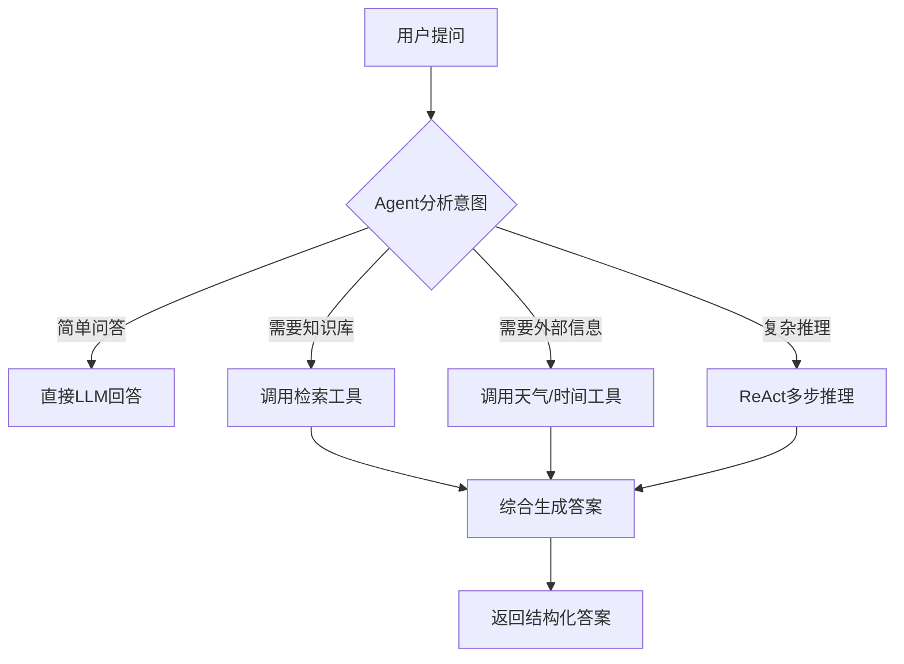
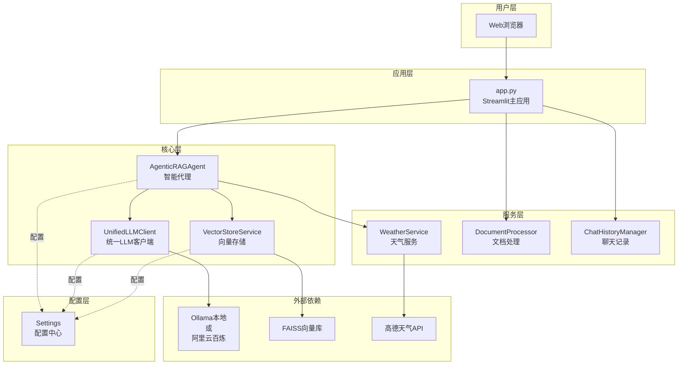

# 第01章：项目架构设计与环境搭建 - 从零构建生产级RAG系统

在这一章，我们将从零开始搭建一个生产级的智能问答系统。不同于简单的Demo，这个系统能够真正用于实际场景，支持文档上传、知识库检索、多轮对话，并且可以灵活切换本地模型和云端API。

## 一、什么是Agentic RAG？

### 1.1 传统RAG的局限

传统的RAG（Retrieval-Augmented Generation，检索增强生成）系统工作流程很简单：

```
用户提问 → 向量检索 → 拼接上下文 → LLM生成答案
```

**存在的问题**：
- ❌ 只能做简单的问答，无法处理复杂任务
- ❌ 不能调用外部工具（如查天气、计算等）
- ❌ 缺乏推理能力，无法多步思考
- ❌ 检索策略单一，可能遗漏关键信息

### 1.2 Agentic RAG的进化

Agentic RAG引入了**Agent（智能代理）**的概念，让系统具备**自主决策**和**工具调用**能力：



**Agentic RAG的核心优势**：
- ✅ **智能路由**：根据问题复杂度选择最优处理路径
- ✅ **工具调用**：可以查天气、搜索文档、获取时间等
- ✅ **多步推理**：使用ReAct框架进行思考→行动→观察循环
- ✅ **多策略检索**：similarity、mmr、random等多种检索策略
- ✅ **结构化输出**：答案包含结论、依据、推理过程、建议

## 二、项目技术栈选型

### 2.1 为什么选择这些技术？

| 技术栈 | 作用 | 为什么选它？ |
|--------|------|-------------|
| **Python 3.11+** | 开发语言 | AI生态最成熟，库最丰富 |
| **Streamlit** | Web框架 | 纯Python开发，无需前端知识，快速上线 |
| **LangChain** | AI框架 | Agent、Tool、Memory等开箱即用 |
| **FAISS** | 向量数据库 | Facebook出品，性能强悍，免费开源 |
| **Ollama / 阿里云百炼** | LLM提供商 | 双模式：本地开发+云端生产 |
| **Sentence Transformers** | 嵌入模型 | 支持中文语义理解 |

### 2.2 双模式设计的价值

我们的系统支持两种LLM模式，可通过环境变量一键切换：

**本地模式（Ollama）**：
```bash
LLM_PROVIDER=ollama
```
- 💰 **成本**：完全免费，无API调用费用
- 🏃 **速度**：本地推理，延迟低
- 🔒 **隐私**：数据不出本地，符合合规要求
- 📦 **使用场景**：开发调试、敏感数据、离线演示

**在线模式（阿里云百炼）**：
```bash
LLM_PROVIDER=online
```
- 🚀 **性能**：云端GPU集群，速度快
- 🔄 **稳定**：无需本地部署维护
- 📈 **扩展**：支持高并发，弹性扩容
- 🎯 **使用场景**：生产环境、高并发、对外服务

## 三、项目目录结构设计

在开始写代码前，我们先规划好项目的目录结构。一个清晰的结构能让代码更易维护：

```
smart-qa-application/
├── config/                 # 配置模块
│   ├── __init__.py
│   └── settings.py        # 统一配置管理
├── models/                 # 模型模块
│   ├── __init__.py
│   └── agent.py           # Agentic RAG核心
├── services/               # 服务模块
│   ├── __init__.py
│   ├── llm_client.py      # 统一LLM客户端
│   ├── vector_store.py    # FAISS向量存储
│   └── weather_tools.py   # 天气查询服务
├── utils/                  # 工具模块
│   ├── __init__.py
│   ├── decorators.py      # 装饰器工具
│   ├── chat_history.py    # 聊天记录管理
│   ├── document_processor.py  # 文档处理器
│   └── ui_components.py   # UI组件
├── data/                   # 数据目录（运行时生成）
│   ├── temp/              # 临时文件
│   └── document_cache/    # 文档缓存
├── vector_store/           # 向量索引目录（运行时生成）
├── chat_history/           # 聊天记录目录（运行时生成）
├── logs/                   # 日志目录（运行时生成）
├── app.py                  # 主应用入口
├── pyproject.toml          # 项目配置和依赖
├── .env                    # 环境变量配置（需手动创建）
└── README.md               # 项目说明
```

**设计原则**：
- **分层清晰**：config、models、services、utils各司其职
- **可扩展性**：新增功能只需在对应模块添加文件
- **易测试**：每个模块可独立测试
- **运行时目录**：data、logs等目录由程序自动创建

## 四、创建项目骨架

### 4.1 创建项目根目录

在你的工作目录下执行：

```bash
# 创建项目目录
mkdir smart-qa-application
cd smart-qa-application

# 创建代码模块目录
mkdir -p config models services utils

# 创建 __init__.py 文件（让目录成为Python包）
touch config/__init__.py
touch models/__init__.py
touch services/__init__.py
touch utils/__init__.py
```

### 4.2 配置项目依赖

项目使用 `pyproject.toml` 管理依赖（现代Python项目的标准做法）。创建该文件：

**文件路径**：`pyproject.toml`

```toml
[project]
name = "agentic-rag-smart-qa"
version = "2.0.0"
description = "Agentic RAG智能问答系统 - 生产级Web应用，支持双模式LLM（Ollama本地 + 在线API）"
readme = "README.md"
requires-python = ">=3.11"
license = "MIT"
authors = [
    {name = "fwytech", email = "fwytech@126.com"}
]

dependencies = [
    # Web 框架
    "streamlit>=1.29.0",
    # AI 框架
    "langchain>=0.2.0",
    "langchain-community>=0.2.0",
    "langchain-core>=0.1.0",
    # 向量数据库
    "faiss-cpu>=1.8.0",
    # LLM 客户端
    "ollama==0.1.7",
    "openai>=1.0.0",
    # 文档处理
    "pypdf==3.17.0",
    "python-docx==1.1.0",
    "unstructured>=0.12.0",
    # HTTP 请求
    "requests==2.31.0",
    "urllib3==2.1.0",
    # 数据处理
    "numpy>=1.27.0",
    "pandas>=2.2.0",
    # 可视化
    "plotly==5.18.0",
    # 机器学习
    "sentence-transformers>=2.0.0",
    "torch>=2.2.0",
    "transformers>=4.36.0",
    # 浏览器自动化
    "selenium>=4.15.0,<5.0.0",
    "webdriver-manager>=4.0.0,<5.0.0",
    # 其他工具
    "python-dotenv>=1.0.0,<2.0.0",
    "json5>=0.9.0,<1.0.0",
    "markdown>=3.5.0,<4.0.0",
    "tiktoken>=0.12.0",
]

[build-system]
requires = ["setuptools>=68.0.0", "wheel"]
build-backend = "setuptools.build_meta"

[tool.setuptools.packages.find]
include = ["config*", "services*", "utils*"]
exclude = ["data*", "files*"]

[[tool.uv.index]]
url = "https://pypi.tuna.tsinghua.edu.cn/simple"
default = true
```

**依赖说明**：

**核心框架**：
- `streamlit`：Web界面框架，纯Python开发
- `langchain`：AI应用框架，提供Agent、Tool、Memory等
- `faiss-cpu`：Facebook的向量搜索库

**LLM集成**：
- `ollama`：本地模型客户端
- `openai`：OpenAI兼容接口（用于阿里云百炼）

**文档处理**：
- `pypdf`：PDF文件解析
- `python-docx`：Word文档解析
- `unstructured`：通用文档处理

**嵌入模型**：
- `sentence-transformers`：文本嵌入模型
- `torch`：深度学习框架
- `transformers`：Hugging Face模型库

**其他工具**：
- `requests`：HTTP请求（天气API等）
- `python-dotenv`：环境变量管理
- `tiktoken`：Token计数

### 4.3 安装依赖

**方式一：使用 uv（推荐，速度快）**

```bash
# 安装 uv（如果还没安装）
curl -LsSf https://astral.sh/uv/install.sh | sh

# 使用 uv 安装依赖
uv pip install -e .
```

**方式二：使用传统 pip**

```bash
pip install -e .
```

安装过程可能需要几分钟，因为包含深度学习相关的大型依赖（如torch、transformers）。

## 五、环境变量配置

### 5.1 创建 .env 文件

环境变量用于存储敏感配置（如API密钥）和运行时配置（如LLM提供商选择）。

创建文件：`.env`

```bash
# ==================== LLM 提供商配置 ====================
# 可选值: "ollama" 或 "online"
# ollama: 本地Ollama模式
# online: 在线API模式（阿里云百炼）
LLM_PROVIDER=online

# ==================== Ollama 配置（本地模式） ====================
OLLAMA_BASE_URL=http://localhost:11434

# ==================== 在线 API 配置（阿里云百炼） ====================
# 阿里云百炼 API Key（需要注册获取）
# 注册地址：https://dashscope.aliyun.com/
ONLINE_API_KEY=sk-abe3417c96f6441b83efed38708bcfb6
ONLINE_BASE_URL=https://dashscope.aliyuncs.com/compatible-mode/v1

# ==================== 天气 API 配置 ====================
# 高德地图 API Key（免费额度足够使用）
# 注册地址：https://console.amap.com/dev/key/app
WEATHER_API_KEY=73053d990f2e27ad6e600344eee77866

# ==================== 日志配置 ====================
# 日志级别: DEBUG, INFO, WARNING, ERROR
LOG_LEVEL=INFO
```

**配置说明**：

1. **LLM_PROVIDER**：控制使用哪种模式
   - `ollama`：本地Ollama，需要先安装Ollama并下载模型
   - `online`：阿里云百炼，需要API Key

2. **ONLINE_API_KEY**：阿里云百炼的API密钥
   - 示例中的key是演示用，请替换为你自己的
   - 免费额度：新用户有一定免费调用量
   - 获取方式：访问 https://dashscope.aliyun.com/ 注册

3. **WEATHER_API_KEY**：高德地图天气API密钥
   - 示例中的key是演示用，建议替换为自己的
   - 免费额度：每日5000次调用（个人使用足够）
   - 获取方式：访问 https://console.amap.com/dev/key/app 注册

### 5.2 Ollama 本地模式配置（可选）

如果选择使用本地Ollama模式，需要先安装Ollama并下载模型：

```bash
# 1. 安装 Ollama（macOS/Linux）
curl -fsSL https://ollama.com/install.sh | sh

# 2. 下载中文模型
ollama pull qwen:7b

# 3. 验证模型是否可用
ollama run qwen:7b "你好"

# 4. 下载嵌入模型
ollama pull nomic-embed-text
```

**Windows用户**：
访问 https://ollama.com/download 下载安装包

### 5.3 验证环境配置

创建一个简单的测试脚本验证环境是否正确配置：

**文件路径**：`test_env.py`

```python
"""环境配置验证脚本"""
import os
from dotenv import load_dotenv

# 加载环境变量
load_dotenv()

print("=" * 50)
print("环境配置检查")
print("=" * 50)

# 检查 LLM 提供商
llm_provider = os.getenv("LLM_PROVIDER", "online")
print(f"\n✅ LLM提供商: {llm_provider}")

if llm_provider == "ollama":
    ollama_url = os.getenv("OLLAMA_BASE_URL", "http://localhost:11434")
    print(f"   Ollama地址: {ollama_url}")
    print("   ⚠️  请确保Ollama服务已启动，并已下载模型")
elif llm_provider == "online":
    api_key = os.getenv("ONLINE_API_KEY", "")
    if api_key:
        print(f"   API Key: {api_key[:10]}...***")
    else:
        print("   ❌ 未配置 ONLINE_API_KEY")

# 检查天气API
weather_key = os.getenv("WEATHER_API_KEY", "")
if weather_key:
    print(f"\n✅ 天气API Key: {weather_key[:10]}...***")
else:
    print("\n⚠️  未配置 WEATHER_API_KEY（可选）")

# 检查日志级别
log_level = os.getenv("LOG_LEVEL", "INFO")
print(f"\n✅ 日志级别: {log_level}")

print("\n" + "=" * 50)
print("环境配置检查完成！")
print("=" * 50)
```

运行测试：

```bash
python test_env.py
```

预期输出：

```
==================================================
环境配置检查
==================================================

✅ LLM提供商: online
   API Key: sk-abe3417...***

✅ 天气API Key: 73053d990f...***

✅ 日志级别: INFO

==================================================
环境配置检查完成！
==================================================
```

## 六、项目架构设计图

让我们用架构图理解整个系统的模块关系：



**数据流向**：
1. 用户在浏览器输入问题
2. Streamlit应用接收请求
3. AgenticRAGAgent分析意图并路由
4. 根据需要调用向量检索、LLM生成、工具调用
5. 整合结果返回用户

## 七、下一步计划

环境搭建完成！在下一章，我们将编写**配置中心（Settings）**，实现：

- ✅ 统一的配置管理
- ✅ 双模式LLM参数配置
- ✅ 向量存储参数配置
- ✅ 动态配置切换

配置中心是整个项目的基础，所有模块都会依赖它获取配置信息。

---

## 本章总结

在本章中，我们完成了：

1. ✅ 理解了Agentic RAG的核心概念
2. ✅ 明确了项目技术栈选型理由
3. ✅ 设计了清晰的项目目录结构
4. ✅ 配置了 `pyproject.toml` 依赖管理
5. ✅ 创建了 `.env` 环境变量配置
6. ✅ 验证了开发环境是否正确配置

**关键要点**：
- Agentic RAG = 传统RAG + Agent能力（智能路由、工具调用、多步推理）
- 双模式设计让系统既能本地开发，又能云端部署
- 清晰的目录结构是可维护性的基础
- 环境变量配置让敏感信息与代码分离

## 下节预告

**第02章：配置中心 - 双模式LLM的统一管理与灵活切换**

我们将编写 `config/settings.py`（216行），实现：
- 双模式LLM配置管理
- 模型参数配置
- 向量存储参数配置
- 配置验证与默认值处理

让我们继续前进！🚀
