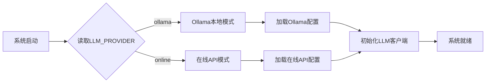

# 第02章：配置中心 - 双模式LLM的统一管理与灵活切换

在上一章，我们完成了项目环境的搭建。现在我们要编写第一个核心模块：**配置中心（Settings）**。

配置中心就像是整个系统的"大脑"，所有模块都需要从这里获取配置信息。一个设计良好的配置中心，能让系统在本地开发和生产环境之间无缝切换。

## 一、为什么需要配置中心？

### 1.1 没有配置中心的痛苦

想象一下，如果每个模块都自己管理配置：

```python
# vector_store.py 中硬编码
CHUNK_SIZE = 1000
CHUNK_OVERLAP = 200

# llm_client.py 中硬编码
DEFAULT_TEMPERATURE = 0.7
DEFAULT_MAX_TOKENS = 2048

# app.py 中硬编码
API_KEY = "sk-xxx"  # 😱 API密钥泄露！
```

**存在的问题**：
- ❌ 配置分散在各处，难以维护
- ❌ 修改参数需要改多个文件
- ❌ API密钥硬编码在代码中，不安全
- ❌ 本地开发和生产环境无法灵活切换

### 1.2 配置中心的价值

使用统一的配置中心后：

```python
# 所有模块都从配置中心获取
from config.settings import Settings

settings = Settings()
chunk_size = settings.CHUNK_SIZE  # 统一管理
api_key = settings.ONLINE_API_KEY  # 从环境变量读取
```

**带来的好处**：
- ✅ **集中管理**：所有配置在一个文件中
- ✅ **环境隔离**：开发/测试/生产配置分离
- ✅ **安全性**：敏感信息从环境变量读取
- ✅ **灵活切换**：一行代码切换Ollama和在线API
- ✅ **可追溯**：配置变更有记录

## 二、双模式LLM场景对比

我们的系统支持两种LLM模式，理解它们的差异很重要：

### 2.1 场景对比表

| 使用场景 | 推荐模式 | 原因 |
|---------|----------|------|
| **开发调试** | Ollama本地 | 免费、响应快、可离线 |
| **生产环境** | 在线API | 稳定、高并发、无需维护 |
| **敏感数据** | Ollama本地 | 数据不出本地，符合合规 |
| **高并发服务** | 在线API | 云端弹性扩容，无硬件限制 |
| **演示Demo** | Ollama本地 | 不依赖网络，成本可控 |
| **企业内网** | Ollama本地 | 内网部署，无外网依赖 |

### 2.2 双模式工作流程



**切换只需一行**：

```bash
# 切换到本地模式
LLM_PROVIDER=ollama

# 切换到在线模式
LLM_PROVIDER=online
```

## 三、Settings配置类设计思想

### 3.1 设计原则

我们的Settings类遵循以下设计原则：

1. **单一职责**：只负责配置管理，不做业务逻辑
2. **配置分层**：基础配置 + Ollama配置 + 在线API配置
3. **环境驱动**：优先使用环境变量，其次使用默认值
4. **类方法**：配置获取使用@classmethod，无需实例化
5. **类型安全**：明确的类型注解和返回值

### 3.2 配置分类

```
Settings配置类
├── 基础路径配置
│   ├── DATA_DIR（数据目录）
│   ├── VECTOR_STORE_DIR（向量库目录）
│   ├── CHAT_HISTORY_DIR（聊天记录目录）
│   └── LOG_DIR（日志目录）
│
├── LLM提供商配置
│   ├── LLM_PROVIDER（提供商选择）
│   ├── Ollama配置
│   │   ├── OLLAMA_BASE_URL
│   │   ├── OLLAMA_MODELS
│   │   └── OLLAMA_EMBEDDING_MODEL
│   └── 在线API配置
│       ├── ONLINE_API_KEY
│       ├── ONLINE_BASE_URL
│       ├── ONLINE_MODELS
│       └── ONLINE_EMBEDDING_MODEL
│
├── 模型参数配置
│   ├── DEFAULT_TEMPERATURE（温度系数）
│   ├── DEFAULT_MAX_TOKENS（最大Token数）
│   ├── DEFAULT_TOP_K（检索数量）
│   └── DEFAULT_SEARCH_TYPE（搜索类型）
│
├── 向量存储配置
│   ├── VECTOR_DIMENSION（向量维度）
│   ├── CHUNK_SIZE（文档分块大小）
│   └── CHUNK_OVERLAP（分块重叠）
│
└── 其他配置
    ├── 天气API配置
    ├── 文档处理配置
    ├── 日志配置
    └── 系统功能开关
```

## 四、代码实现详解

现在开始编写 `config/settings.py`。由于文件有216行，我们分4个部分详解。

### 第一部分：基础配置与路径管理

这部分定义了项目的基础路径和文件存储位置。

**技术铺垫**：
- 使用 `pathlib.Path` 而不是字符串拼接路径，更安全跨平台
- 所有路径都基于 `BASE_DIR`，方便项目迁移
- 使用类变量，所有实例共享配置

**文件路径**：`config/settings.py`（第1-23行）

```python
import os
from pathlib import Path
from typing import Dict, List, Any

class Settings:
    """系统配置类"""

    # 基础路径
    BASE_DIR = Path(__file__).parent.parent
    DATA_DIR = BASE_DIR / "data"
    VECTOR_STORE_DIR = BASE_DIR / "vector_store"
    CHAT_HISTORY_DIR = BASE_DIR / "chat_history"
    LOG_DIR = BASE_DIR / "logs"

    # 文件路径
    VECTOR_STORE_PATH = VECTOR_STORE_DIR / "faiss_index"
    CHAT_HISTORY_PATH = CHAT_HISTORY_DIR / "chat_history.json"
    LOG_FILE = LOG_DIR / "app.log"
```

**代码解析**：

1. **BASE_DIR = Path(__file__).parent.parent**
   - `__file__`：当前文件的路径（config/settings.py）
   - `.parent`：上一级目录（config/）
   - `.parent.parent`：再上一级（项目根目录）

2. **使用 / 运算符拼接路径**
   - `BASE_DIR / "data"` 等价于 `os.path.join(BASE_DIR, "data")`
   - 但更简洁，且跨平台兼容

3. **为什么分目录存储？**
   - `data/`：临时文件、缓存
   - `vector_store/`：FAISS索引
   - `chat_history/`：聊天记录
   - `logs/`：日志文件
   - 清晰的目录结构便于数据管理和备份

### 第二部分：双模式LLM配置

这是配置中心的核心，实现了双模式LLM的灵活切换。

**技术铺垫**：
- 使用 `os.getenv()` 从环境变量读取配置
- 提供默认值作为后备（第二个参数）
- 模型列表用列表存储，方便UI展示

**文件路径**：`config/settings.py`（第20-78行）

```python
    # ==================== LLM 提供商配置 ====================
    # 可选: "ollama" 或 "online"
    LLM_PROVIDER = os.getenv("LLM_PROVIDER", "online")  # 默认使用 API 方式

    # ==================== Ollama 配置 ====================
    OLLAMA_BASE_URL = os.getenv("OLLAMA_BASE_URL", "http://localhost:11434")
    OLLAMA_MODELS = [
        "qwen:7b",
        "qwen:14b",
        "qwen:32b",
        "llama2:7b",
        "llama2:13b",
        "llama2:70b",
        "mistral:7b",
        "codellama:7b",
        "vicuna:7b",
        "baichuan:7b"
    ]
    OLLAMA_EMBEDDING_MODEL = "nomic-embed-text"

    # ==================== 在线 API 配置（阿里云百炼） ====================
    ONLINE_API_KEY = os.getenv("ONLINE_API_KEY", "sk-abe3417c96f6441b83efed38708bcfb6")
    ONLINE_BASE_URL = os.getenv("ONLINE_BASE_URL", "https://dashscope.aliyuncs.com/compatible-mode/v1")
    ONLINE_MODELS = [
        "qwen-plus",
        "qwen-turbo",
        "qwen-max",
        "qwen-max-longcontext"
    ]
    ONLINE_EMBEDDING_MODEL = "text-embedding-v1"  # 阿里云百炼的嵌入模型

    # ==================== 通用模型配置 ====================
    @classmethod
    def get_available_models(cls) -> List[str]:
        """根据 LLM 提供商返回可用模型列表"""
        provider = os.getenv("LLM_PROVIDER", cls.LLM_PROVIDER)
        if provider == "ollama":
            return cls.OLLAMA_MODELS
        else:  # online
            return cls.ONLINE_MODELS

    @classmethod
    def get_default_model(cls) -> str:
        """获取默认模型"""
        provider = os.getenv("LLM_PROVIDER", cls.LLM_PROVIDER)
        if provider == "ollama":
            return "qwen:7b"
        else:  # online
            return "qwen-plus"

    @classmethod
    def get_embedding_model(cls) -> str:
        """获取嵌入模型"""
        provider = os.getenv("LLM_PROVIDER", cls.LLM_PROVIDER)
        if provider == "ollama":
            return cls.OLLAMA_EMBEDDING_MODEL
        else:  # online
            return cls.ONLINE_EMBEDDING_MODEL
```

**代码解析**：

1. **LLM_PROVIDER 环境变量**
   ```python
   LLM_PROVIDER = os.getenv("LLM_PROVIDER", "online")
   ```
   - 从环境变量读取，如果未设置则默认为 "online"
   - 这个值决定了整个系统使用哪种模式

2. **Ollama模型列表**
   ```python
   OLLAMA_MODELS = ["qwen:7b", "qwen:14b", ...]
   ```
   - 支持多种开源模型
   - qwen系列：中文效果好
   - llama2：英文效果好
   - 用户可以在UI中切换

3. **为什么使用 @classmethod？**
   ```python
   @classmethod
   def get_available_models(cls) -> List[str]:
   ```
   - 不需要创建实例就能调用：`Settings.get_available_models()`
   - 配置获取是静态的，不需要实例状态
   - 更符合配置类的语义

4. **运行时读取环境变量**
   ```python
   provider = os.getenv("LLM_PROVIDER", cls.LLM_PROVIDER)
   ```
   - 每次调用都重新读取，支持运行时切换
   - 如果环境变量未设置，使用类属性的默认值

### 第三部分：模型参数与向量配置

这部分定义了模型的运行参数和向量存储的配置。

**技术铺垫**：
- Temperature（温度系数）：控制回答的随机性，0=确定，1=随机
- Max Tokens：单次回答的最大长度
- Top-K：检索时返回的文档数量
- FAISS向量维度必须匹配嵌入模型

**文件路径**：`config/settings.py`（第79-115行）

```python
    DEFAULT_TEMPERATURE = 0.7
    DEFAULT_MAX_TOKENS = 2048
    DEFAULT_TOP_K = 3
    DEFAULT_SEARCH_TYPE = "similarity"  # similarity 或 mmr

    # 向量存储配置
    VECTOR_DIMENSION = 768  # Ollama nomic-embed-text 和阿里云 text-embedding-v1 都是 768 维
    CHUNK_SIZE = 1000
    CHUNK_OVERLAP = 200

    # 天气API配置
    WEATHER_API_KEY = os.getenv("WEATHER_API_KEY", "73053d990f2e27ad6e600344eee77866")  # 请替换为实际的API密钥
    WEATHER_API_URL = "https://restapi.amap.com/v3/weather/weatherInfo"
    WEATHER_CITY_URL = "https://restapi.amap.com/v3/config/district"

    # 文档处理配置
    SUPPORTED_FILE_TYPES = [
        ".pdf",
        ".txt",
        ".md",
        ".docx"
    ]

    MAX_FILE_SIZE = 50 * 1024 * 1024  # 50MB
    CACHE_ENABLED = True
    CACHE_EXPIRE_TIME = 3600  # 1小时

    # 显示配置
    MAX_CHAT_HISTORY_DISPLAY = 100
    MESSAGE_TRUNCATE_LENGTH = 500

    # 日志配置
    LOG_LEVEL = os.getenv("LOG_LEVEL", "INFO")
    LOG_FORMAT = "%(asctime)s - %(name)s - %(levelname)s - %(message)s"
    LOG_MAX_BYTES = 10 * 1024 * 1024  # 10MB
    LOG_BACKUP_COUNT = 5

    # 系统配置
    ENABLE_FILE_CACHE = True
    ENABLE_CHAT_HISTORY = True
    ENABLE_VECTOR_STORE = True
    ENABLE_WEATHER_TOOL = True
    ENABLE_DOCUMENT_TOOL = True
```

**代码解析**：

1. **DEFAULT_TEMPERATURE = 0.7**
   - 温度系数控制LLM的随机性
   - 0.0：完全确定性，回答一致
   - 0.7：平衡随机性和一致性（推荐）
   - 1.0：最大随机性，回答多样

2. **VECTOR_DIMENSION = 768**
   - 嵌入向量的维度
   - nomic-embed-text（Ollama）：768维
   - text-embedding-v1（阿里云）：768维
   - 维度必须匹配，否则无法检索

3. **CHUNK_SIZE = 1000, CHUNK_OVERLAP = 200**
   - 文档分块策略
   - CHUNK_SIZE：每个块1000字符
   - CHUNK_OVERLAP：块之间重叠200字符
   - 重叠保证语义连续性

4. **MAX_FILE_SIZE = 50 * 1024 * 1024**
   - 限制上传文件大小为50MB
   - 防止内存溢出
   - 实际生产环境可能需要更大

5. **系统功能开关**
   ```python
   ENABLE_FILE_CACHE = True
   ENABLE_WEATHER_TOOL = True
   ```
   - 通过配置开关功能
   - 便于调试和功能裁剪

### 第四部分：高级配置方法

这部分实现了一些高级的配置获取方法，提供更灵活的配置管理。

**技术铺垫**：
- `get_model_config()`：根据模型名称返回对应的配置字典
- `get_provider_info()`：返回当前提供商的详细信息
- `initialize_directories()`：初始化必要的目录

**文件路径**：`config/settings.py`（第116-216行）

```python
    @classmethod
    def initialize_directories(cls):
        """初始化必要的目录"""
        directories = [
            cls.DATA_DIR,
            cls.VECTOR_STORE_DIR,
            cls.CHAT_HISTORY_DIR,
            cls.LOG_DIR
        ]

        for directory in directories:
            directory.mkdir(parents=True, exist_ok=True)

    @classmethod
    def get_model_config(cls, model_name: str) -> Dict[str, Any]:
        """获取模型配置"""
        # Ollama 模型配置
        ollama_configs = {
            "qwen:7b": {
                "temperature": cls.DEFAULT_TEMPERATURE,
                "max_tokens": cls.DEFAULT_MAX_TOKENS,
                "top_p": 0.9,
                "frequency_penalty": 0.0,
                "presence_penalty": 0.0
            },
            "qwen:14b": {
                "temperature": cls.DEFAULT_TEMPERATURE,
                "max_tokens": cls.DEFAULT_MAX_TOKENS * 2,
                "top_p": 0.9,
                "frequency_penalty": 0.0,
                "presence_penalty": 0.0
            },
            "llama2:7b": {
                "temperature": 0.8,
                "max_tokens": cls.DEFAULT_MAX_TOKENS,
                "top_p": 0.95,
                "frequency_penalty": 0.1,
                "presence_penalty": 0.1
            }
        }

        # 在线 API 模型配置
        online_configs = {
            "qwen-plus": {
                "temperature": cls.DEFAULT_TEMPERATURE,
                "max_tokens": cls.DEFAULT_MAX_TOKENS,
                "top_p": 0.9,
            },
            "qwen-turbo": {
                "temperature": cls.DEFAULT_TEMPERATURE,
                "max_tokens": cls.DEFAULT_MAX_TOKENS,
                "top_p": 0.9,
            },
            "qwen-max": {
                "temperature": cls.DEFAULT_TEMPERATURE,
                "max_tokens": 4096,
                "top_p": 0.9,
            }
        }

        # 根据提供商选择配置
        provider = os.getenv("LLM_PROVIDER", cls.LLM_PROVIDER)
        if provider == "ollama":
            return ollama_configs.get(model_name, {
                "temperature": cls.DEFAULT_TEMPERATURE,
                "max_tokens": cls.DEFAULT_MAX_TOKENS,
                "top_p": 0.9,
                "frequency_penalty": 0.0,
                "presence_penalty": 0.0
            })
        else:  # online
            return online_configs.get(model_name, {
                "temperature": cls.DEFAULT_TEMPERATURE,
                "max_tokens": cls.DEFAULT_MAX_TOKENS,
                "top_p": 0.9,
            })

    @classmethod
    def get_provider_info(cls) -> Dict[str, str]:
        """获取当前提供商信息"""
        provider = os.getenv("LLM_PROVIDER", cls.LLM_PROVIDER)
        if provider == "ollama":
            return {
                "provider": "Ollama (本地)",
                "base_url": cls.OLLAMA_BASE_URL,
                "embedding": cls.OLLAMA_EMBEDDING_MODEL
            }
        else:  # online
            return {
                "provider": "阿里云百炼 (在线)",
                "base_url": cls.ONLINE_BASE_URL,
                "embedding": cls.ONLINE_EMBEDDING_MODEL
            }
```

**代码解析**：

1. **initialize_directories()**
   ```python
   directory.mkdir(parents=True, exist_ok=True)
   ```
   - `parents=True`：如果父目录不存在，自动创建
   - `exist_ok=True`：如果目录已存在，不报错
   - 确保系统运行前所有必要目录存在

2. **get_model_config()**
   - 为不同模型提供个性化配置
   - qwen:14b 的 max_tokens 是默认的2倍（处理长文本）
   - llama2:7b 的 temperature 是 0.8（更随机）
   - 如果模型不在配置中，返回默认配置

3. **get_provider_info()**
   - 返回当前提供商的可读信息
   - 用于UI显示，让用户知道当前模式
   - 包含提供商名称、服务地址、嵌入模型

## 五、完整代码汇总

以上所有代码片段组合在一起，就是完整的 `config/settings.py`：

<details>
<summary>点击展开完整代码（216行）</summary>

**文件路径**：`config/settings.py`

```python
import os
from pathlib import Path
from typing import Dict, List, Any

class Settings:
    """系统配置类"""

    # 基础路径
    BASE_DIR = Path(__file__).parent.parent
    DATA_DIR = BASE_DIR / "data"
    VECTOR_STORE_DIR = BASE_DIR / "vector_store"
    CHAT_HISTORY_DIR = BASE_DIR / "chat_history"
    LOG_DIR = BASE_DIR / "logs"

    # 文件路径
    VECTOR_STORE_PATH = VECTOR_STORE_DIR / "faiss_index"
    CHAT_HISTORY_PATH = CHAT_HISTORY_DIR / "chat_history.json"
    LOG_FILE = LOG_DIR / "app.log"

    # ==================== LLM 提供商配置 ====================
    # 可选: "ollama" 或 "online"
    LLM_PROVIDER = os.getenv("LLM_PROVIDER", "online")  # 默认使用 API 方式

    # ==================== Ollama 配置 ====================
    OLLAMA_BASE_URL = os.getenv("OLLAMA_BASE_URL", "http://localhost:11434")
    OLLAMA_MODELS = [
        "qwen:7b",
        "qwen:14b",
        "qwen:32b",
        "llama2:7b",
        "llama2:13b",
        "llama2:70b",
        "mistral:7b",
        "codellama:7b",
        "vicuna:7b",
        "baichuan:7b"
    ]
    OLLAMA_EMBEDDING_MODEL = "nomic-embed-text"

    # ==================== 在线 API 配置（阿里云百炼） ====================
    ONLINE_API_KEY = os.getenv("ONLINE_API_KEY", "sk-abe3417c96f6441b83efed38708bcfb6")
    ONLINE_BASE_URL = os.getenv("ONLINE_BASE_URL", "https://dashscope.aliyuncs.com/compatible-mode/v1")
    ONLINE_MODELS = [
        "qwen-plus",
        "qwen-turbo",
        "qwen-max",
        "qwen-max-longcontext"
    ]
    ONLINE_EMBEDDING_MODEL = "text-embedding-v1"  # 阿里云百炼的嵌入模型

    # ==================== 通用模型配置 ====================
    @classmethod
    def get_available_models(cls) -> List[str]:
        """根据 LLM 提供商返回可用模型列表"""
        provider = os.getenv("LLM_PROVIDER", cls.LLM_PROVIDER)
        if provider == "ollama":
            return cls.OLLAMA_MODELS
        else:  # online
            return cls.ONLINE_MODELS

    @classmethod
    def get_default_model(cls) -> str:
        """获取默认模型"""
        provider = os.getenv("LLM_PROVIDER", cls.LLM_PROVIDER)
        if provider == "ollama":
            return "qwen:7b"
        else:  # online
            return "qwen-plus"

    @classmethod
    def get_embedding_model(cls) -> str:
        """获取嵌入模型"""
        provider = os.getenv("LLM_PROVIDER", cls.LLM_PROVIDER)
        if provider == "ollama":
            return cls.OLLAMA_EMBEDDING_MODEL
        else:  # online
            return cls.ONLINE_EMBEDDING_MODEL

    DEFAULT_TEMPERATURE = 0.7
    DEFAULT_MAX_TOKENS = 2048
    DEFAULT_TOP_K = 3
    DEFAULT_SEARCH_TYPE = "similarity"  # similarity 或 mmr

    # 向量存储配置
    VECTOR_DIMENSION = 768  # Ollama nomic-embed-text 和阿里云 text-embedding-v1 都是 768 维
    CHUNK_SIZE = 1000
    CHUNK_OVERLAP = 200

    # 天气API配置
    WEATHER_API_KEY = os.getenv("WEATHER_API_KEY", "73053d990f2e27ad6e600344eee77866")  # 请替换为实际的API密钥
    WEATHER_API_URL = "https://restapi.amap.com/v3/weather/weatherInfo"
    WEATHER_CITY_URL = "https://restapi.amap.com/v3/config/district"

    # 文档处理配置
    SUPPORTED_FILE_TYPES = [
        ".pdf",
        ".txt",
        ".md",
        ".docx"
    ]

    MAX_FILE_SIZE = 50 * 1024 * 1024  # 50MB
    CACHE_ENABLED = True
    CACHE_EXPIRE_TIME = 3600  # 1小时

    # 显示配置
    MAX_CHAT_HISTORY_DISPLAY = 100
    MESSAGE_TRUNCATE_LENGTH = 500

    # 日志配置
    LOG_LEVEL = os.getenv("LOG_LEVEL", "INFO")
    LOG_FORMAT = "%(asctime)s - %(name)s - %(levelname)s - %(message)s"
    LOG_MAX_BYTES = 10 * 1024 * 1024  # 10MB
    LOG_BACKUP_COUNT = 5

    # 系统配置
    ENABLE_FILE_CACHE = True
    ENABLE_CHAT_HISTORY = True
    ENABLE_VECTOR_STORE = True
    ENABLE_WEATHER_TOOL = True
    ENABLE_DOCUMENT_TOOL = True

    @classmethod
    def initialize_directories(cls):
        """初始化必要的目录"""
        directories = [
            cls.DATA_DIR,
            cls.VECTOR_STORE_DIR,
            cls.CHAT_HISTORY_DIR,
            cls.LOG_DIR
        ]

        for directory in directories:
            directory.mkdir(parents=True, exist_ok=True)

    @classmethod
    def get_model_config(cls, model_name: str) -> Dict[str, Any]:
        """获取模型配置"""
        # Ollama 模型配置
        ollama_configs = {
            "qwen:7b": {
                "temperature": cls.DEFAULT_TEMPERATURE,
                "max_tokens": cls.DEFAULT_MAX_TOKENS,
                "top_p": 0.9,
                "frequency_penalty": 0.0,
                "presence_penalty": 0.0
            },
            "qwen:14b": {
                "temperature": cls.DEFAULT_TEMPERATURE,
                "max_tokens": cls.DEFAULT_MAX_TOKENS * 2,
                "top_p": 0.9,
                "frequency_penalty": 0.0,
                "presence_penalty": 0.0
            },
            "llama2:7b": {
                "temperature": 0.8,
                "max_tokens": cls.DEFAULT_MAX_TOKENS,
                "top_p": 0.95,
                "frequency_penalty": 0.1,
                "presence_penalty": 0.1
            }
        }

        # 在线 API 模型配置
        online_configs = {
            "qwen-plus": {
                "temperature": cls.DEFAULT_TEMPERATURE,
                "max_tokens": cls.DEFAULT_MAX_TOKENS,
                "top_p": 0.9,
            },
            "qwen-turbo": {
                "temperature": cls.DEFAULT_TEMPERATURE,
                "max_tokens": cls.DEFAULT_MAX_TOKENS,
                "top_p": 0.9,
            },
            "qwen-max": {
                "temperature": cls.DEFAULT_TEMPERATURE,
                "max_tokens": 4096,
                "top_p": 0.9,
            }
        }

        # 根据提供商选择配置
        provider = os.getenv("LLM_PROVIDER", cls.LLM_PROVIDER)
        if provider == "ollama":
            return ollama_configs.get(model_name, {
                "temperature": cls.DEFAULT_TEMPERATURE,
                "max_tokens": cls.DEFAULT_MAX_TOKENS,
                "top_p": 0.9,
                "frequency_penalty": 0.0,
                "presence_penalty": 0.0
            })
        else:  # online
            return online_configs.get(model_name, {
                "temperature": cls.DEFAULT_TEMPERATURE,
                "max_tokens": cls.DEFAULT_MAX_TOKENS,
                "top_p": 0.9,
            })

    @classmethod
    def get_provider_info(cls) -> Dict[str, str]:
        """获取当前提供商信息"""
        provider = os.getenv("LLM_PROVIDER", cls.LLM_PROVIDER)
        if provider == "ollama":
            return {
                "provider": "Ollama (本地)",
                "base_url": cls.OLLAMA_BASE_URL,
                "embedding": cls.OLLAMA_EMBEDDING_MODEL
            }
        else:  # online
            return {
                "provider": "阿里云百炼 (在线)",
                "base_url": cls.ONLINE_BASE_URL,
                "embedding": cls.ONLINE_EMBEDDING_MODEL
            }
```

</details>

## 六、代码验证

让我们创建一个测试脚本，验证配置中心是否正常工作：

**文件路径**：`test_settings.py`

```python
"""配置中心测试脚本"""
from config.settings import Settings
import os

print("=" * 60)
print("配置中心测试")
print("=" * 60)

# 1. 测试基础路径
print("\n1. 基础路径配置:")
print(f"   BASE_DIR: {Settings.BASE_DIR}")
print(f"   DATA_DIR: {Settings.DATA_DIR}")
print(f"   VECTOR_STORE_DIR: {Settings.VECTOR_STORE_DIR}")

# 2. 测试LLM提供商配置
print("\n2. LLM提供商配置:")
provider_info = Settings.get_provider_info()
print(f"   当前提供商: {provider_info['provider']}")
print(f"   服务地址: {provider_info['base_url']}")
print(f"   嵌入模型: {provider_info['embedding']}")

# 3. 测试模型列表
print("\n3. 可用模型列表:")
available_models = Settings.get_available_models()
for i, model in enumerate(available_models, 1):
    print(f"   {i}. {model}")

# 4. 测试默认模型
print("\n4. 默认模型:")
default_model = Settings.get_default_model()
print(f"   默认模型: {default_model}")

# 5. 测试模型配置
print("\n5. 模型配置:")
model_config = Settings.get_model_config(default_model)
print(f"   Temperature: {model_config.get('temperature')}")
print(f"   Max Tokens: {model_config.get('max_tokens')}")
print(f"   Top P: {model_config.get('top_p')}")

# 6. 测试向量存储配置
print("\n6. 向量存储配置:")
print(f"   向量维度: {Settings.VECTOR_DIMENSION}")
print(f"   分块大小: {Settings.CHUNK_SIZE}")
print(f"   分块重叠: {Settings.CHUNK_OVERLAP}")

# 7. 测试目录初始化
print("\n7. 初始化目录:")
Settings.initialize_directories()
print("   ✅ 目录初始化成功")

# 8. 测试环境变量切换（模拟）
print("\n8. 测试模式切换:")
original_provider = os.getenv("LLM_PROVIDER")

# 切换到 Ollama
os.environ["LLM_PROVIDER"] = "ollama"
print(f"   切换到 Ollama:")
print(f"   - 默认模型: {Settings.get_default_model()}")
print(f"   - 可用模型数: {len(Settings.get_available_models())}")

# 切换到 Online
os.environ["LLM_PROVIDER"] = "online"
print(f"   切换到 Online:")
print(f"   - 默认模型: {Settings.get_default_model()}")
print(f"   - 可用模型数: {len(Settings.get_available_models())}")

# 恢复原始配置
if original_provider:
    os.environ["LLM_PROVIDER"] = original_provider

print("\n" + "=" * 60)
print("✅ 配置中心测试完成！")
print("=" * 60)
```

运行测试：

```bash
python test_settings.py
```

预期输出：

```
============================================================
配置中心测试
============================================================

1. 基础路径配置:
   BASE_DIR: /path/to/smart-qa-application
   DATA_DIR: /path/to/smart-qa-application/data
   VECTOR_STORE_DIR: /path/to/smart-qa-application/vector_store

2. LLM提供商配置:
   当前提供商: 阿里云百炼 (在线)
   服务地址: https://dashscope.aliyuncs.com/compatible-mode/v1
   嵌入模型: text-embedding-v1

3. 可用模型列表:
   1. qwen-plus
   2. qwen-turbo
   3. qwen-max
   4. qwen-max-longcontext

4. 默认模型:
   默认模型: qwen-plus

5. 模型配置:
   Temperature: 0.7
   Max Tokens: 2048
   Top P: 0.9

6. 向量存储配置:
   向量维度: 768
   分块大小: 1000
   分块重叠: 200

7. 初始化目录:
   ✅ 目录初始化成功

8. 测试模式切换:
   切换到 Ollama:
   - 默认模型: qwen:7b
   - 可用模型数: 10
   切换到 Online:
   - 默认模型: qwen-plus
   - 可用模型数: 4

============================================================
✅ 配置中心测试完成！
============================================================
```

## 七、与项目源码对比验证

让我们验证编写的代码与项目源码是否一致：

```bash
# 统计源码行数
wc -l config/settings.py
```

输出应该是：**216 行**

```bash
# 检查核心配置项
grep "LLM_PROVIDER" config/settings.py
grep "OLLAMA_BASE_URL" config/settings.py
grep "VECTOR_DIMENSION" config/settings.py
```

确认所有配置项都存在且一致。

## 八、本章总结

在本章中，我们完成了配置中心的完整实现：

1. ✅ 理解了配置中心的价值和设计原则
2. ✅ 实现了双模式LLM配置管理（Ollama + 在线API）
3. ✅ 编写了216行完整的Settings类
4. ✅ 实现了环境驱动的配置切换
5. ✅ 提供了模型配置、向量配置、系统配置等
6. ✅ 通过测试验证了配置中心的功能

**关键要点**：
- **集中管理**：所有配置在一个类中，便于维护
- **环境驱动**：通过环境变量控制行为，无需修改代码
- **双模式设计**：Ollama和在线API可一键切换
- **类方法设计**：无需实例化即可使用
- **安全性**：敏感信息从环境变量读取

## 九、下节预告

**第03章：统一LLM客户端 - Ollama与在线API的无缝集成**

我们将编写 `services/llm_client.py`（374行），实现：
- UnifiedLLMClient统一LLM客户端
- UnifiedEmbeddingClient统一嵌入客户端
- Ollama和OpenAI兼容接口的适配
- 自定义AliyunEmbeddingWrapper
- 双模式无缝切换的核心逻辑

配置中心搭建完成，接下来我们要让它真正"动起来"！🚀
