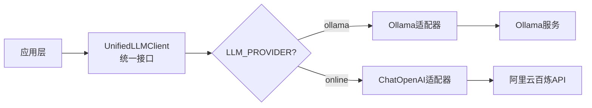

# 第03章：统一LLM客户端 - Ollama与在线API的无缝集成

在上一章，我们完成了配置中心。现在我们要实现系统的核心组件之一：**统一LLM客户端**。

这个模块的作用是：无论底层使用Ollama还是在线API，上层代码都用同样的方式调用。这就是设计模式中的**适配器模式（Adapter Pattern）**。

## 一、为什么需要统一接口？

### 1.1 问题场景

假设没有统一接口，代码会是这样：

```python
# Agent中需要判断使用哪种LLM
if llm_provider == "ollama":
    from langchain.llms import Ollama
    llm = Ollama(model="qwen:7b")
    response = llm(prompt)  # Ollama用法
elif llm_provider == "online":
    from langchain.chat_models import ChatOpenAI
    llm = ChatOpenAI(model="qwen-plus")
    messages = [HumanMessage(content=prompt)]
    response = llm.invoke(messages)  # ChatOpenAI用法不同
```

**问题**：
- ❌ 每个使用LLM的地方都要写if-else
- ❌ Ollama和ChatOpenAI的API不同，难以切换
- ❌ 代码重复，难以维护

### 1.2 统一接口的价值

使用统一接口后：

```python
# 上层代码完全一致
llm_client = UnifiedLLMClient(model_name="qwen-plus")
response = llm_client.invoke("你好")  # 统一的调用方式
```



## 二、架构设计

我们的`llm_client.py`包含3个核心类：

```
services/llm_client.py (373行)
├── UnifiedLLMClient (30-155行)
│   ├── _initialize_llm()
│   ├── _initialize_ollama()
│   ├── _initialize_online_api()
│   ├── invoke()
│   └── get_provider_info()
│
├── AliyunEmbeddingWrapper (157-186行)
│   ├── embed_query()
│   └── embed_documents()
│
└── UnifiedEmbeddingClient (189-279行)
    ├── _initialize_embeddings()
    ├── _initialize_ollama_embeddings()
    ├── _initialize_online_embeddings()
    ├── embed_query()
    └── embed_documents()
```

## 三、核心代码实现

### 第一部分：导入与配置（1-28行）

```python
"""
统一的 LLM 客户端包装类
支持 Ollama 本地模型和在线 API (阿里云百炼)
"""

import logging
import os
from typing import List, Optional, Any, Dict
from langchain.llms.base import BaseLLM
from langchain.embeddings.base import Embeddings
try:
    # 尝试使用新的导入方式
    from langchain_community.llms import Ollama
    from langchain_community.chat_models import ChatOpenAI
except ImportError:
    # 回退到旧的导入方式
    from langchain.llms import Ollama
    from langchain.chat_models import ChatOpenAI
from langchain.schema import BaseMessage, HumanMessage, AIMessage, SystemMessage
from config.settings import Settings

# 屏蔽LangChain弃用警告
import warnings
warnings.filterwarnings("ignore", category=DeprecationWarning, module="langchain")
warnings.filterwarnings("ignore", message=".*was deprecated.*LangChain.*")

logger = logging.getLogger(__name__)
```

### 第二部分：UnifiedLLMClient（30-155行）

这是LLM客户端的核心类，负责根据配置初始化Ollama或在线API。

```python
class UnifiedLLMClient:
    """统一的 LLM 客户端，支持 Ollama 和在线 API"""

    def __init__(
        self,
        model_name: str,
        temperature: float = 0.7,
        max_tokens: int = 2048,
        **kwargs
    ):
        """初始化 LLM 客户端"""
        self.settings = Settings()
        self.model_name = model_name
        self.temperature = temperature
        self.max_tokens = max_tokens
        self.provider = self.settings.LLM_PROVIDER
        self.llm = self._initialize_llm(**kwargs)

    def _initialize_llm(self, **kwargs) -> BaseLLM:
        """根据配置初始化 LLM"""
        try:
            if self.provider == "ollama":
                return self._initialize_ollama(**kwargs)
            else:  # online
                return self._initialize_online_api(**kwargs)
        except Exception as e:
            logger.error(f"初始化 LLM 失败: {str(e)}")
            raise

    def _initialize_ollama(self, **kwargs) -> Ollama:
        """初始化 Ollama 本地模型"""
        logger.info(f"初始化 Ollama 模型: {self.model_name}")

        llm = Ollama(
            base_url=self.settings.OLLAMA_BASE_URL,
            model=self.model_name,
            temperature=self.temperature,
            num_predict=self.max_tokens,
            **kwargs
        )

        logger.info("Ollama 模型初始化成功")
        return llm

    def _initialize_online_api(self, **kwargs) -> ChatOpenAI:
        """初始化在线 API（阿里云百炼，兼容 OpenAI 接口）"""
        logger.info(f"初始化在线 API 模型: {self.model_name}")

        # 尝试使用新的 langchain-openai 包
        try:
            from langchain_openai import ChatOpenAI as NewChatOpenAI
            llm = NewChatOpenAI(
                openai_api_base=self.settings.ONLINE_BASE_URL,
                openai_api_key=self.settings.ONLINE_API_KEY,
                model_name=self.model_name,
                temperature=self.temperature,
                max_tokens=self.max_tokens,
                **kwargs
            )
        except ImportError:
            # 回退到旧的实现
            llm = ChatOpenAI(
                openai_api_base=self.settings.ONLINE_BASE_URL,
                openai_api_key=self.settings.ONLINE_API_KEY,
                model_name=self.model_name,
                temperature=self.temperature,
                max_tokens=self.max_tokens,
                **kwargs
            )

        logger.info("在线 API 模型初始化成功")
        return llm

    def invoke(self, prompt: str) -> str:
        """调用 LLM 生成回答（统一接口）"""
        try:
            if self.provider == "ollama":
                # Ollama 使用字符串提示
                response = self.llm.invoke(prompt)
                return response
            else:  # online
                # 在线 API 使用消息格式
                messages = [HumanMessage(content=prompt)]
                response = self.llm.invoke(messages)
                return response.content if hasattr(response, 'content') else str(response)

        except Exception as e:
            logger.error(f"LLM 调用失败: {str(e)}")
            raise

    def get_llm(self) -> BaseLLM:
        """获取底层 LLM 对象（用于 LangChain Agent）"""
        return self.llm

    def get_provider_info(self) -> Dict[str, str]:
        """获取提供商信息"""
        info = {
            "provider": self.provider,
            "model": self.model_name,
            "temperature": str(self.temperature),
            "max_tokens": str(self.max_tokens)
        }

        if self.provider == "ollama":
            info["base_url"] = self.settings.OLLAMA_BASE_URL
        else:
            info["base_url"] = self.settings.ONLINE_BASE_URL

        return info
```

**关键点**：
- `_initialize_llm()`：根据provider选择初始化方法
- `invoke()`：统一调用接口，内部处理Ollama和在线API的差异
- `get_llm()`：返回LangChain兼容的LLM对象，供Agent使用

### 第三部分：AliyunEmbeddingWrapper（157-186行）

阿里云百炼的嵌入模型需要特殊适配。

```python
class AliyunEmbeddingWrapper(Embeddings):
    """阿里云百炼嵌入模型的 LangChain 兼容包装器"""

    def __init__(self, openai_client, model_name):
        self.openai_client = openai_client
        self.model_name = model_name
        self.embedding_model_name = model_name

    def embed_query(self, text: str) -> List[float]:
        """嵌入单个查询文本"""
        response = self.openai_client.embeddings.create(
            model=self.model_name,
            input=text,
            encoding_format="float"
        )
        return response.data[0].embedding

    def embed_documents(self, texts: List[str]) -> List[List[float]]:
        """嵌入多个文档（分批，满足API批量<=25的限制）"""
        batch_size = 25
        all_embeddings: List[List[float]] = []
        for i in range(0, len(texts), batch_size):
            batch = texts[i:i+batch_size]
            response = self.openai_client.embeddings.create(
                model=self.model_name,
                input=batch,
                encoding_format="float"
            )
            all_embeddings.extend([data.embedding for data in response.data])
        return all_embeddings
```

**为什么需要Wrapper？**
- 阿里云百炼的嵌入API与LangChain标准不完全一致
- 批量嵌入有25条的限制，需要分批处理
- 包装后可无缝集成到LangChain生态

### 第四部分：UnifiedEmbeddingClient（189-279行）

统一的嵌入模型客户端。

```python
class UnifiedEmbeddingClient:
    """统一的嵌入模型客户端"""

    def __init__(self):
        """初始化嵌入模型客户端"""
        self.settings = Settings()
        self.provider = os.getenv("LLM_PROVIDER", self.settings.LLM_PROVIDER)
        self.embedding_model = self.settings.get_embedding_model()
        self.embeddings = self._initialize_embeddings()

    def _initialize_embeddings(self):
        """根据配置初始化嵌入模型"""
        try:
            if self.provider == "ollama":
                return self._initialize_ollama_embeddings()
            else:  # online
                return self._initialize_online_embeddings()
        except Exception as e:
            logger.error(f"初始化嵌入模型失败: {str(e)}")
            raise

    def _initialize_ollama_embeddings(self):
        """初始化 Ollama 嵌入模型"""
        from langchain_community.embeddings import OllamaEmbeddings

        logger.info(f"初始化 Ollama 嵌入模型: {self.embedding_model}")

        embeddings = OllamaEmbeddings(
            base_url=self.settings.OLLAMA_BASE_URL,
            model=self.embedding_model
        )

        logger.info("Ollama 嵌入模型初始化成功")
        return embeddings

    def _initialize_online_embeddings(self):
        """初始化在线 API 嵌入模型（阿里云百炼）"""
        try:
            from openai import OpenAI
        except ImportError:
            logger.error("openai 包未安装，无法使用在线嵌入模型")
            raise ImportError("请安装 openai 包: pip install openai")

        logger.info(f"初始化在线嵌入模型: {self.embedding_model}")

        # 使用原生 OpenAI 客户端
        openai_client = OpenAI(
            api_key=self.settings.ONLINE_API_KEY,
            base_url=self.settings.ONLINE_BASE_URL
        )

        logger.info("在线嵌入模型初始化成功")
        return AliyunEmbeddingWrapper(openai_client, self.embedding_model)

    def embed_query(self, text: str) -> List[float]:
        """嵌入单个查询文本"""
        try:
            return self.embeddings.embed_query(text)
        except Exception as e:
            logger.error(f"查询嵌入失败: {str(e)}")
            raise

    def embed_documents(self, texts: List[str]) -> List[List[float]]:
        """嵌入多个文档"""
        try:
            return self.embeddings.embed_documents(texts)
        except Exception as e:
            logger.error(f"文档嵌入失败: {str(e)}")
            raise

    def get_embeddings(self):
        """获取嵌入模型对象"""
        return self.embeddings
```

## 四、完整代码汇总

<details>
<summary>点击查看完整代码（373行）</summary>

**文件路径**：`services/llm_client.py`

```python
"""
统一的 LLM 客户端包装类
支持 Ollama 本地模型和在线 API (阿里云百炼)
"""

import logging
import os
from typing import List, Optional, Any, Dict
from langchain.llms.base import BaseLLM
from langchain.embeddings.base import Embeddings
try:
    # 尝试使用新的导入方式
    from langchain_community.llms import Ollama
    from langchain_community.chat_models import ChatOpenAI
except ImportError:
    # 回退到旧的导入方式
    from langchain.llms import Ollama
    from langchain.chat_models import ChatOpenAI
from langchain.schema import BaseMessage, HumanMessage, AIMessage, SystemMessage
from config.settings import Settings

# 屏蔽LangChain弃用警告
import warnings
warnings.filterwarnings("ignore", category=DeprecationWarning, module="langchain")
warnings.filterwarnings("ignore", message=".*was deprecated.*LangChain.*")

logger = logging.getLogger(__name__)


class UnifiedLLMClient:
    """统一的 LLM 客户端，支持 Ollama 和在线 API"""

    def __init__(
        self,
        model_name: str,
        temperature: float = 0.7,
        max_tokens: int = 2048,
        **kwargs
    ):
        """
        初始化 LLM 客户端

        Args:
            model_name: 模型名称
            temperature: 温度系数
            max_tokens: 最大token数
            **kwargs: 其他参数
        """
        self.settings = Settings()
        self.model_name = model_name
        self.temperature = temperature
        self.max_tokens = max_tokens
        self.provider = self.settings.LLM_PROVIDER
        self.llm = self._initialize_llm(**kwargs)

    def _initialize_llm(self, **kwargs) -> BaseLLM:
        """根据配置初始化 LLM"""
        try:
            if self.provider == "ollama":
                return self._initialize_ollama(**kwargs)
            else:  # online
                return self._initialize_online_api(**kwargs)
        except Exception as e:
            logger.error(f"初始化 LLM 失败: {str(e)}")
            raise

    def _initialize_ollama(self, **kwargs) -> Ollama:
        """初始化 Ollama 本地模型"""
        logger.info(f"初始化 Ollama 模型: {self.model_name}")

        llm = Ollama(
            base_url=self.settings.OLLAMA_BASE_URL,
            model=self.model_name,
            temperature=self.temperature,
            num_predict=self.max_tokens,
            **kwargs
        )

        logger.info("Ollama 模型初始化成功")
        return llm

    def _initialize_online_api(self, **kwargs) -> ChatOpenAI:
        """初始化在线 API（阿里云百炼，兼容 OpenAI 接口）"""
        logger.info(f"初始化在线 API 模型: {self.model_name}")

        # 尝试使用新的 langchain-openai 包，如果不可用则回退到旧的
        try:
            from langchain_openai import ChatOpenAI as NewChatOpenAI
            llm = NewChatOpenAI(
                openai_api_base=self.settings.ONLINE_BASE_URL,
                openai_api_key=self.settings.ONLINE_API_KEY,
                model_name=self.model_name,
                temperature=self.temperature,
                max_tokens=self.max_tokens,
                **kwargs
            )
        except ImportError:
            # 回退到旧的实现
            llm = ChatOpenAI(
                openai_api_base=self.settings.ONLINE_BASE_URL,
                openai_api_key=self.settings.ONLINE_API_KEY,
                model_name=self.model_name,
                temperature=self.temperature,
                max_tokens=self.max_tokens,
                **kwargs
            )

        logger.info("在线 API 模型初始化成功")
        return llm


    def invoke(self, prompt: str) -> str:
        """
        调用 LLM 生成回答

        Args:
            prompt: 提示词

        Returns:
            生成的回答
        """
        try:
            if self.provider == "ollama":
                # Ollama 使用字符串提示
                response = self.llm.invoke(prompt)
                return response
            else:  # online
                # 在线 API 使用消息格式
                messages = [HumanMessage(content=prompt)]
                response = self.llm.invoke(messages)
                return response.content if hasattr(response, 'content') else str(response)

        except Exception as e:
            logger.error(f"LLM 调用失败: {str(e)}")
            raise

    def get_llm(self) -> BaseLLM:
        """获取底层 LLM 对象（用于 LangChain Agent）"""
        return self.llm

    def get_provider_info(self) -> Dict[str, str]:
        """获取提供商信息"""
        info = {
            "provider": self.provider,
            "model": self.model_name,
            "temperature": str(self.temperature),
            "max_tokens": str(self.max_tokens)
        }

        if self.provider == "ollama":
            info["base_url"] = self.settings.OLLAMA_BASE_URL
        else:
            info["base_url"] = self.settings.ONLINE_BASE_URL

        return info

class AliyunEmbeddingWrapper(Embeddings):
    """阿里云百炼嵌入模型的 LangChain 兼容包装器"""

    def __init__(self, openai_client, model_name):
        self.openai_client = openai_client
        self.model_name = model_name
        self.embedding_model_name = model_name

    def embed_query(self, text: str) -> List[float]:
        """嵌入单个查询文本"""
        response = self.openai_client.embeddings.create(
            model=self.model_name,
            input=text,
            encoding_format="float"
        )
        return response.data[0].embedding

    def embed_documents(self, texts: List[str]) -> List[List[float]]:
        """嵌入多个文档（分批，满足API批量<=25的限制）"""
        batch_size = 25
        all_embeddings: List[List[float]] = []
        for i in range(0, len(texts), batch_size):
            batch = texts[i:i+batch_size]
            response = self.openai_client.embeddings.create(
                model=self.model_name,
                input=batch,
                encoding_format="float"
            )
            all_embeddings.extend([data.embedding for data in response.data])
        return all_embeddings


class UnifiedEmbeddingClient:
    """统一的嵌入模型客户端"""

    def __init__(self):
        """初始化嵌入模型客户端"""
        self.settings = Settings()
        # 优先读取最新环境变量，确保运行期切换生效
        self.provider = os.getenv("LLM_PROVIDER", self.settings.LLM_PROVIDER)
        self.embedding_model = self.settings.get_embedding_model()
        self.embeddings = self._initialize_embeddings()

    def _initialize_embeddings(self):
        """根据配置初始化嵌入模型"""
        try:
            if self.provider == "ollama":
                return self._initialize_ollama_embeddings()
            else:  # online
                return self._initialize_online_embeddings()
        except Exception as e:
            logger.error(f"初始化嵌入模型失败: {str(e)}")
            raise

    def _initialize_ollama_embeddings(self):
        """初始化 Ollama 嵌入模型"""
        from langchain_community.embeddings import OllamaEmbeddings

        logger.info(f"初始化 Ollama 嵌入模型: {self.embedding_model}")

        embeddings = OllamaEmbeddings(
            base_url=self.settings.OLLAMA_BASE_URL,
            model=self.embedding_model
        )

        logger.info("Ollama 嵌入模型初始化成功")
        return embeddings

    def _initialize_online_embeddings(self):
        """初始化在线 API 嵌入模型（阿里云百炼）"""
        try:
            from openai import OpenAI
        except ImportError:
            logger.error("openai 包未安装，无法使用在线嵌入模型")
            raise ImportError("请安装 openai 包: pip install openai")

        logger.info(f"初始化在线嵌入模型: {self.embedding_model}")

        # 使用原生 OpenAI 客户端，但包装成 LangChain 兼容接口
        openai_client = OpenAI(
            api_key=self.settings.ONLINE_API_KEY,
            base_url=self.settings.ONLINE_BASE_URL
        )

        # 返回兼容 LangChain 接口的包装器
        logger.info("在线嵌入模型初始化成功")
        return AliyunEmbeddingWrapper(openai_client, self.embedding_model)

    def embed_query(self, text: str) -> List[float]:
        """
        嵌入单个查询文本

        Args:
            text: 查询文本

        Returns:
            嵌入向量
        """
        try:
            return self.embeddings.embed_query(text)
        except Exception as e:
            logger.error(f"查询嵌入失败: {str(e)}")
            raise

    def embed_documents(self, texts: List[str]) -> List[List[float]]:
        """
        嵌入多个文档

        Args:
            texts: 文档列表

        Returns:
            嵌入向量列表
        """
        try:
            return self.embeddings.embed_documents(texts)
        except Exception as e:
            logger.error(f"文档嵌入失败: {str(e)}")
            raise

    def get_embeddings(self):
        """获取嵌入模型对象"""
        return self.embeddings


if __name__ == "__main__":
    """简单的测试代码，验证 LLM 客户端核心功能（仅测试 online 模式）"""
    import os

    print("=== 开始测试 LLM 客户端 (Online 模式) ===")

    # 测试配置加载
    try:
        settings = Settings()
        print(f"✅ 配置加载成功 - 提供商: {settings.LLM_PROVIDER}")

        # 获取当前模型名称
        current_model = settings.get_default_model()
        print(f"   模型: {current_model}")
        print(f"   嵌入模型: {settings.get_embedding_model()}")

        # 确保是在 online 模式下测试
        if settings.LLM_PROVIDER != "online":
            print(f"⚠️  当前配置为 {settings.LLM_PROVIDER} 模式，仅测试 online 模式相关功能")
            print("   跳过 Ollama 相关测试")
            print("\n=== 测试完成 ===")
            exit(0)

    except Exception as e:
        print(f"❌ 配置加载失败: {e}")
        exit(1)

    # 测试 UnifiedLLMClient (仅 online 模式)
    try:
        llm_client = UnifiedLLMClient(
            model_name=current_model,
            temperature=0.1,
            max_tokens=100
        )
        print(f"✅ LLM 客户端初始化成功 - 提供商: {llm_client.provider}")

        # 获取提供商信息
        info = llm_client.get_provider_info()
        print(f"   提供商信息: {info}")

    except Exception as e:
        print(f"❌ LLM 客户端初始化失败: {e}")
        exit(1)

    # 测试 UnifiedEmbeddingClient (仅 online 模式)
    try:
        embedding_client = UnifiedEmbeddingClient()
        print(f"✅ 嵌入客户端初始化成功 - 提供商: {embedding_client.provider}")
        print(f"   嵌入模型: {embedding_client.embedding_model}")

    except Exception as e:
        print(f"❌ 嵌入客户端初始化失败: {e}")
        exit(1)

    # 测试嵌入模型（仅 online 模式）
    try:
        print("正在测试嵌入模型...")
        test_text = "这是一个测试文本"
        embeddings = embedding_client.embed_query(test_text)
        print(f"✅ 嵌入模型测试成功")
        print(f"   嵌入维度: {len(embeddings)}")

    except Exception as e:
        # 简化错误信息
        error_msg = str(e)
        if "400" in error_msg:
            print(f"⚠️  嵌入模型测试失败（API 格式问题）")
            print("   提示：阿里云百炼嵌入模型可能需要特殊配置")
        elif "API key" in error_msg or "authentication" in error_msg.lower():
            print(f"⚠️  嵌入模型测试失败（API 密钥问题）")
        else:
            print(f"⚠️  嵌入模型测试失败: {error_msg[:50]}...")

    # 测试 LLM 调用（仅 online 模式）
    try:
        print("正在测试 LLM 调用...")
        test_prompt = "用一句话介绍你自己"
        response = llm_client.invoke(test_prompt)
        print(f"✅ LLM 调用成功")
        print(f"   回答: {response[:50]}...")

    except Exception as e:
        # 简化错误信息
        error_msg = str(e)
        if "API key" in error_msg or "authentication" in error_msg.lower():
            print(f"⚠️  LLM 调用测试失败（API 密钥问题）")
        elif "network" in error_msg.lower() or "connection" in error_msg.lower():
            print(f"⚠️  LLM 调用测试失败（网络连接问题）")
        else:
            print(f"⚠️  LLM 调用测试失败: {error_msg[:50]}...")

    print("\n=== 测试完成 ===")
```

</details>

## 五、测试验证

创建测试脚本：

```bash
python -c "from services.llm_client import UnifiedLLMClient, UnifiedEmbeddingClient; print('✅ 导入成功')"
```

运行完整测试（如果配置了API Key）：

```bash
python services/llm_client.py
```

## 六、本章总结

✅ 实现了UnifiedLLMClient统一LLM接口
✅ 实现了UnifiedEmbeddingClient统一嵌入接口
✅ 使用适配器模式屏蔽底层差异
✅ 支持Ollama和阿里云百炼无缝切换

**核心技术**：
- 适配器模式
- 策略模式
- 自定义Wrapper适配LangChain

## 七、下节预告

**第04章：FAISS向量存储 - 构建高性能语义检索引擎**

将编写 `services/vector_store.py`（477行），实现向量存储的完整功能。
