# 第04章：FAISS向量存储 - 构建高性能语义检索引擎

> **本章目标**：实现基于FAISS的向量存储服务，这是RAG系统的核心组件，负责将文档转换为向量并支持高效的语义检索。

---

## 一、为什么需要向量存储？传统检索 vs 语义检索

在实现RAG系统之前，我们先理解**为什么需要向量存储**。

### 1.1 传统关键词检索的局限

假设知识库中有这样一段文本：
```
"Python 是一种解释型、面向对象、动态数据类型的高级程序设计语言"
```

**传统关键词搜索**（如Elasticsearch）：
- 用户查询："Python 特点" → ❌ 匹配失败（没有"特点"关键词）
- 用户查询："Python 是什么" → ❌ 匹配失败（没有"是什么"关键词）
- 用户查询："Python 语言" → ✅ 部分匹配（有"Python"关键词）

**问题本质**：传统搜索基于**字面匹配**，无法理解语义相似性。

### 1.2 向量检索如何解决问题

**向量检索**将文本转换为高维向量（如768维），通过向量相似度计算找到语义相关的内容：

```python
# 伪代码示意
embedding("Python 是一种解释型语言")    → [0.23, -0.45, 0.78, ...] (768维向量)
embedding("Python 特点")               → [0.21, -0.43, 0.76, ...] (语义相似，向量接近)
embedding("今天天气不错")              → [-0.88, 0.12, -0.33, ...] (语义不同，向量远离)

# 通过余弦相似度计算
cosine_similarity(vec1, vec2) = 0.95  ← 高相似度！
cosine_similarity(vec1, vec3) = 0.12  ← 低相似度
```

**优势**：
- ✅ 语义理解：查询"Python 特点"能找到"Python 是一种解释型语言"
- ✅ 跨语言：英文查询可以匹配中文答案（如果模型支持多语言）
- ✅ 同义词：查询"机器学习"能找到"AI"、"人工智能"

---

## 二、FAISS：Facebook开源的向量检索利器

### 2.1 什么是FAISS？

**FAISS** (Facebook AI Similarity Search) 是Meta开源的向量相似度搜索库，专为**高效的向量检索**设计。

**核心特点**：
| 特性 | 说明 |
|------|------|
| ⚡ 高性能 | 百万级向量毫秒级检索（单机CPU可处理） |
| 💾 本地部署 | 无需外部服务（如Pinecone、Weaviate），降低成本 |
| 🔧 灵活索引 | 支持IndexFlatL2、IndexIVFFlat、HNSW等多种索引类型 |
| 📦 易于集成 | Python接口简单，LangChain原生支持 |

### 2.2 FAISS vs 其他向量数据库

| 对比项 | FAISS | Pinecone | Milvus | Weaviate |
|--------|-------|----------|--------|----------|
| **部署方式** | 本地文件 | 云服务 | 自托管/云 | 自托管/云 |
| **成本** | 免费 | 按量付费 | 免费（需自己运维） | 免费（需自己运维） |
| **适用场景** | 中小规模 | 大规模分布式 | 大规模分布式 | 大规模分布式 |
| **学习成本** | 低 | 低 | 中 | 中 |

**我们为什么选择FAISS？**
- 项目初期无需大规模分布式能力
- 本地部署降低成本和复杂度
- LangChain生态完美集成

### 2.3 FAISS工作原理（简化版）

```mermaid
graph LR
    A[原始文档] -->|1. 文档分割| B[文本片段]
    B -->|2. Embedding模型| C[768维向量]
    C -->|3. FAISS索引| D[向量索引文件]

    E[用户查询] -->|4. Embedding| F[查询向量]
    F -->|5. 相似度搜索| D
    D -->|6. 返回Top-K| G[相关文档片段]

    style D fill:#e1f5ff
    style C fill:#fff4e1
    style G fill:#e7f9e7
```



**关键步骤**：
1. **文档向量化**：将知识库文档通过Embedding模型转换为向量
2. **构建索引**：FAISS将向量组织成高效的索引结构（如聚类树）
3. **查询匹配**：用户查询也转换为向量，FAISS快速找到最相似的K个向量
4. **返回结果**：根据相似度分数排序，返回对应的文档片段

---

## 三、VectorStoreService架构设计

我们的 `VectorStoreService` 类封装了完整的向量存储功能，总共**476行代码**，分为以下几个核心模块：

```
VectorStoreService 功能模块
├── 🏗️ 初始化与加载
│   ├── __init__()            - 初始化embedding客户端，自动加载已有索引
│   └── load_index()          - 从磁盘加载FAISS索引
│
├── 🔨 向量存储创建
│   └── create_vector_store() - 从文档列表创建新的FAISS索引
│
├── 🔍 文档检索
│   ├── search()              - 核心搜索方法（支持similarity和mmr）
│   └── similarity_search_with_threshold() - 带阈值的相似度搜索
│
├── 💾 索引管理
│   ├── save_index()          - 保存索引到磁盘（含元数据）
│   └── clear()               - 清空内存和磁盘索引
│
├── 📄 文档管理
│   ├── add_documents()       - 向现有索引添加新文档
│   ├── delete_document()     - 删除指定文档（重建索引实现）
│   └── split_documents()     - 文档智能分割
│
├── 🧹 数据清洗
│   └── _sanitize_documents() - 过滤空内容、裁剪超长文本
│
└── 📊 统计信息
    ├── get_stats()           - 获取索引统计信息
    └── get_document_list()   - 获取知识库文档列表
```

---

## 四、代码实现详解

> **说明**：源代码共476行，我们将其拆分为7个部分逐一讲解，每部分代码均来自 `services/vector_store.py`。

### 4.1 第一部分：导入模块与初始化（1-40行）

```python
import os
import json
import pickle
import logging
from typing import List, Dict, Optional, Any, Tuple
from datetime import datetime
import numpy as np
import faiss
from langchain_community.vectorstores import FAISS
from langchain.schema import Document
from langchain.embeddings.base import Embeddings
from langchain.text_splitter import RecursiveCharacterTextSplitter
from config.settings import Settings
from services.llm_client import UnifiedEmbeddingClient

logger = logging.getLogger(__name__)

class VectorStoreService:
    """向量存储服务类 - 支持 Ollama 和在线 API embedding"""

    def __init__(self):
        self.settings = Settings()
        # 使用统一的嵌入客户端
        self.embedding_client = UnifiedEmbeddingClient()
        self.embeddings = self.embedding_client.get_embeddings()
        self.vector_store = None
        self.documents = []
        self.index_path = None

        logger.info(f"向量存储服务初始化成功 - 提供商: {self.settings.LLM_PROVIDER}, 嵌入模型: {self.settings.get_embedding_model()}")

        # 尝试自动加载已存在的索引，避免运行期间状态丢失
        try:
            idx_path = str(self.settings.VECTOR_STORE_PATH)
            if os.path.exists(idx_path):
                loaded = self.load_index(idx_path)
                if loaded:
                    logger.info("检测到已有向量索引，已自动加载")
        except Exception as e:
            logger.warning(f"自动加载向量索引失败: {str(e)}")
```

**技术要点**：

1. **依赖导入**：
   - `faiss`：原生FAISS库（用于底层索引操作）
   - `langchain_community.vectorstores.FAISS`：LangChain封装的FAISS（简化接口）
   - `UnifiedEmbeddingClient`：第03章实现的统一Embedding客户端

2. **初始化逻辑**：
   ```python
   self.embeddings = self.embedding_client.get_embeddings()
   ```
   - 根据 `LLM_PROVIDER` 自动选择Ollama或在线API的Embedding模型
   - 无需手动切换代码

3. **自动加载机制**：
   ```python
   if os.path.exists(idx_path):
       loaded = self.load_index(idx_path)
   ```
   - **为什么需要**？Streamlit应用在用户交互时可能重新初始化对象，如果不自动加载已有索引，会导致"知识库丢失"
   - **实现方式**：检查 `VECTOR_STORE_PATH` 路径是否存在索引文件，若存在则自动加载

---

### 4.2 第二部分：创建向量存储（42-103行）

```python
    def create_vector_store(self, documents: List[Document]) -> FAISS:
        """创建向量存储"""
        try:
            logger.info(f"创建向量存储，文档数量: {len(documents)}")

            # 清洗文档，避免空片段和超长内容
            documents = self._sanitize_documents(documents)

            # 创建向量存储
            vector_store = FAISS.from_documents(
                documents=documents,
                embedding=self.embeddings
            )

            self.vector_store = vector_store
            self.documents = documents

            logger.info("向量存储创建成功")
            return vector_store

        except Exception as e:
            logger.error(f"创建向量存储失败: {str(e)}")
            raise
```

**核心方法解析**：

1. **FAISS.from_documents()**：
   ```python
   vector_store = FAISS.from_documents(
       documents=documents,      # LangChain Document对象列表
       embedding=self.embeddings # Embedding模型实例
   )
   ```
   - LangChain提供的便捷方法，内部自动执行：
     1. 遍历所有文档的 `page_content`
     2. 调用 `embedding.embed_documents()` 批量转换为向量
     3. 创建FAISS索引（默认使用 `IndexFlatL2`，即暴力搜索）
     4. 将向量插入索引

2. **文档清洗**：
   ```python
   documents = self._sanitize_documents(documents)
   ```
   - **必要性**：Embedding模型通常有长度限制（如text-embedding-v1限制2048 tokens）
   - **实现**：见第6部分详解

3. **状态管理**：
   ```python
   self.vector_store = vector_store
   self.documents = documents
   ```
   - 保存到实例变量供后续搜索/保存使用

---

### 4.3 第三部分：索引持久化（105-170行）

```python
    def load_index(self, index_path: str) -> bool:
        """加载向量存储索引"""
        try:
            logger.info(f"加载向量存储索引: {index_path}")

            if not os.path.exists(index_path):
                logger.warning(f"索引路径不存在: {index_path}")
                return False

            # 加载FAISS索引
            self.vector_store = FAISS.load_local(
                index_path,
                self.embeddings,
                allow_dangerous_deserialization=True
            )

            # 加载文档（如果存在）
            docs_path = f"{index_path}_docs.pkl"
            if os.path.exists(docs_path):
                with open(docs_path, 'rb') as f:
                    self.documents = pickle.load(f)

            self.index_path = index_path
            logger.info("向量存储索引加载成功")
            return True

        except Exception as e:
            logger.error(f"加载向量存储索引失败: {str(e)}")
            return False

    def save_index(self, index_path: str) -> bool:
        """保存向量存储索引"""
        try:
            if not self.vector_store:
                logger.warning("向量存储未初始化，无法保存")
                return False

            logger.info(f"保存向量存储索引: {index_path}")

            # 保存FAISS索引
            self.vector_store.save_local(index_path)

            # 保存文档
            docs_path = f"{index_path}_docs.pkl"
            with open(docs_path, 'wb') as f:
                pickle.dump(self.documents, f)

            # 保存元数据
            metadata = {
                "created_at": datetime.now().isoformat(),
                "documents_count": len(self.documents),
                "embedding_model": self.embedding_model_name,
                "vector_dimension": self.settings.VECTOR_DIMENSION
            }

            metadata_path = f"{index_path}_metadata.json"
            with open(metadata_path, 'w', encoding='utf-8') as f:
                json.dump(metadata, f, ensure_ascii=False, indent=2)

            self.index_path = index_path
            logger.info("向量存储索引保存成功")
            return True

        except Exception as e:
            logger.error(f"保存向量存储索引失败: {str(e)}")
            return False
```

**持久化策略**：

1. **三文件存储结构**：
   ```
   data/vector_store/              ← index_path
   ├── index.faiss                 ← FAISS索引（向量和索引结构）
   ├── index.pkl                   ← FAISS元数据（docstore、index_to_docstore_id）
   ├── data/vector_store_docs.pkl  ← 原始文档对象（Document列表）
   └── data/vector_store_metadata.json ← 索引元信息（创建时间、文档数等）
   ```

2. **为什么需要单独保存documents？**
   - FAISS索引只存储向量和ID映射，但LangChain的 `docstore` 可能在某些情况下不完整
   - 单独用pickle保存完整的 `Document` 对象，确保元数据不丢失

3. **allow_dangerous_deserialization=True**：
   - FAISS使用pickle反序列化，存在安全风险（恶意文件可能执行任意代码）
   - 项目环境可控时设置为True，生产环境需评估风险

4. **元数据作用**：
   ```json
   {
     "created_at": "2024-01-15T10:30:00",
     "documents_count": 150,
     "embedding_model": "text-embedding-v1",
     "vector_dimension": 1536
   }
   ```
   - 用于调试和版本管理（不同embedding模型的向量不兼容）

---

### 4.4 第四部分：核心搜索方法（172-232行）

```python
    def search(
        self,
        query: str,
        top_k: int = 5,
        search_type: str = "similarity",
        score_threshold: float = 0.2
    ) -> List[Dict[str, Any]]:
        """搜索向量存储"""
        try:
            if not self.vector_store:
                logger.warning("向量存储未初始化")
                return []

            logger.info(f"搜索查询: {query}, top_k: {top_k}, search_type: {search_type}")

            if search_type == "similarity":
                # 相似度搜索
                results = self.vector_store.similarity_search_with_score(
                    query=query,
                    k=top_k
                )
            elif search_type == "mmr":
                # MMR搜索（最大边际相关性）- 社区版不返回分数
                mmr_docs = self.vector_store.max_marginal_relevance_search(
                    query=query,
                    k=top_k,
                    fetch_k=top_k * 2
                )
                results = [(doc, 1.0) for doc in mmr_docs]
            else:
                raise ValueError(f"不支持的搜索类型: {search_type}")

            # 格式化结果
            formatted_results = []
            for doc, score in results:
                if score >= score_threshold:  # 过滤低分结果
                    formatted_results.append({
                        "content": doc.page_content,
                        "metadata": doc.metadata,
                        "score": float(score)
                    })

            # 如果相似度搜索没有命中，自动回退到MMR提高召回
            if not formatted_results and search_type == "similarity":
                mmr_docs = self.vector_store.max_marginal_relevance_search(
                    query=query,
                    k=top_k,
                    fetch_k=top_k * 2
                )
                formatted_results = [{
                    "content": doc.page_content,
                    "metadata": doc.metadata,
                    "score": 1.0
                } for doc in mmr_docs]

            logger.info(f"搜索完成，找到 {len(formatted_results)} 个结果")
            return formatted_results

        except Exception as e:
            logger.error(f"搜索失败: {str(e)}")
            return []
```

**两种搜索策略对比**：

| 策略 | 原理 | 优势 | 劣势 | 适用场景 |
|------|------|------|------|----------|
| **similarity** | 纯余弦相似度排序 | 精准匹配相关内容 | 可能返回重复/冗余结果 | 问答、精确检索 |
| **mmr** | 在相关性和多样性之间平衡 | 结果覆盖面更广 | 可能牺牲部分精度 | 需要多角度信息的场景 |

**MMR（Maximum Marginal Relevance）详解**：

```python
mmr_docs = self.vector_store.max_marginal_relevance_search(
    query=query,
    k=top_k,          # 最终返回K个结果
    fetch_k=top_k * 2 # 先取2K个候选（在这些候选中做多样性筛选）
)
```

**MMR算法流程**：
1. 先用相似度搜索找到 `fetch_k` 个相关文档（如10个）
2. 选择相似度最高的第1个文档
3. 后续每次选择时，计算：
   ```
   MMR分数 = λ * 与查询的相似度 - (1-λ) * 与已选文档的最大相似度
   ```
   - `λ=1`：完全看相似度（退化为similarity搜索）
   - `λ=0.5`：平衡相关性和多样性（LangChain默认值）
4. 重复步骤3，直到选出 `k` 个文档

**自动回退机制**：
```python
if not formatted_results and search_type == "similarity":
    # 自动切换到MMR提高召回
```
- **为什么需要**？当相似度搜索因阈值过高导致无结果时，自动尝试MMR增加召回率
- **生产经验**：避免"一问三不知"的尴尬

---

### 4.5 第五部分：文档管理（234-296行）

```python
    def add_documents(self, documents: List[Document]) -> bool:
        """添加文档到向量存储"""
        try:
            logger.info(f"添加文档到向量存储，数量: {len(documents)}")

            documents = self._sanitize_documents(documents)

            if not self.vector_store:
                # 如果向量存储不存在，创建新的
                self.create_vector_store(documents)
            else:
                # 添加到现有向量存储
                self.vector_store.add_documents(documents)
                self.documents.extend(documents)

            logger.info("文档添加成功")
            return True

        except Exception as e:
            logger.error(f"添加文档失败: {str(e)}")
            return False

    def delete_document(self, doc_id: str) -> bool:
        """从向量存储中删除文档"""
        try:
            logger.info(f"删除文档: {doc_id}")

            if not self.vector_store:
                logger.warning("向量存储未初始化")
                return False

            # FAISS不直接支持删除操作，需要重新创建索引
            remaining_docs = [
                doc for doc in self.documents
                if doc.metadata.get("id") != doc_id
            ]

            if len(remaining_docs) < len(self.documents):
                self.create_vector_store(remaining_docs)
                logger.info(f"文档删除成功: {doc_id}")
                return True
            else:
                logger.warning(f"未找到文档: {doc_id}")
                return False

        except Exception as e:
            logger.error(f"删除文档失败: {str(e)}")
            return False

    def clear(self):
        """清空向量存储"""
        try:
            logger.info("清空向量存储")

            # 同时清理磁盘索引文件，避免自动加载旧索引
            idx_path = self.index_path or str(self.settings.VECTOR_STORE_PATH)
            try:
                if idx_path and os.path.exists(idx_path):
                    import shutil
                    shutil.rmtree(idx_path, ignore_errors=True)
                # 删除附加的docs与metadata文件
                docs_path = f"{idx_path}_docs.pkl"
                meta_path = f"{idx_path}_metadata.json"
                if os.path.exists(docs_path):
                    os.remove(docs_path)
                if os.path.exists(meta_path):
                    os.remove(meta_path)
            except Exception as e:
                logger.warning(f"删除索引文件失败: {str(e)}")

            # 清理内存状态
            self.vector_store = None
            self.documents = []
            self.index_path = None

            logger.info("向量存储已清空（内存与磁盘）")

        except Exception as e:
            logger.error(f"清空向量存储失败: {str(e)}")
```

**关键设计决策**：

1. **FAISS不支持直接删除向量**：
   ```python
   remaining_docs = [doc for doc in self.documents if doc.metadata.get("id") != doc_id]
   self.create_vector_store(remaining_docs)  # 重新构建索引
   ```
   - **原因**：FAISS索引是紧凑的向量数组，删除需要重建
   - **替代方案**：如果需要频繁删除，考虑使用Milvus等支持删除的向量库

2. **clear()同时清理内存和磁盘**：
   ```python
   shutil.rmtree(idx_path, ignore_errors=True)  # 删除索引目录
   self.vector_store = None                      # 清空内存
   ```
   - **为什么**？避免自动加载机制加载已删除的索引

---

### 4.6 第六部分：文档分割与清洗（256-406行）

```python
    def _sanitize_documents(self, documents: List[Document]) -> List[Document]:
        """清洗文档内容，过滤空内容并裁剪过长文本以满足嵌入长度限制"""
        cleaned: List[Document] = []
        # 近似字符上限，避免超过 2048 token（中文场景下字符与token近似）
        max_chars = 2000
        for doc in documents:
            content = (doc.page_content or "").strip()
            if not content:
                continue
            if len(content) > max_chars:
                content = content[:max_chars]
            cleaned.append(Document(page_content=content, metadata=doc.metadata))
        logger.info(f"清洗后文档数量: {len(cleaned)}")
        return cleaned

    def split_documents(
        self,
        documents: List[Document],
        chunk_size: int = None,
        chunk_overlap: int = None
    ) -> List[Document]:
        """分割文档"""
        try:
            chunk_size = chunk_size or self.settings.CHUNK_SIZE
            chunk_overlap = chunk_overlap or self.settings.CHUNK_OVERLAP

            logger.info(f"分割文档，chunk_size: {chunk_size}, chunk_overlap: {chunk_overlap}")

            text_splitter = RecursiveCharacterTextSplitter(
                chunk_size=chunk_size,
                chunk_overlap=chunk_overlap,
                length_function=len,
                separators=["\n\n", "\n", "。", "！", "？", "，", " ", ""]
            )

            split_docs = text_splitter.split_documents(documents)

            # 添加元数据
            for i, doc in enumerate(split_docs):
                if "chunk_id" not in doc.metadata:
                    doc.metadata["chunk_id"] = i
                if "chunk_size" not in doc.metadata:
                    doc.metadata["chunk_size"] = len(doc.page_content)

            logger.info(f"文档分割完成，片段数量: {len(split_docs)}")
            return split_docs

        except Exception as e:
            logger.error(f"文档分割失败: {str(e)}")
            return documents
```

**文档分割策略详解**：

1. **为什么需要分割？**
   - Embedding模型有长度限制（如2048 tokens）
   - 检索粒度过粗会降低精度（如整篇文档vs段落）

2. **RecursiveCharacterTextSplitter原理**：
   ```python
   separators=["\n\n", "\n", "。", "！", "？", "，", " ", ""]
   ```
   - **递归策略**：优先用 `\n\n` 分割，如果chunk仍超长，则用 `\n` 分割，依此类推
   - **中文优化**：添加 `。！？，` 等中文标点，避免在词语中间截断

3. **chunk_overlap的作用**：
   ```python
   chunk_overlap=100  # 相邻chunk之间重叠100个字符
   ```
   - **问题**：如果关键信息恰好在chunk边界，会被截断
   - **解决**：相邻chunk有重叠，确保上下文连贯

   **示例**：
   ```
   原文："Python是编程语言。它支持面向对象。"

   不重叠：
   Chunk1: "Python是编程语言。"
   Chunk2: "它支持面向对象。"  ← "它"指代不明

   重叠100字符：
   Chunk1: "Python是编程语言。它支持面向对象。"
   Chunk2: "Python是编程语言。它支持面向对象。" ← 保留上下文
   ```

4. **元数据增强**：
   ```python
   doc.metadata["chunk_id"] = i
   doc.metadata["chunk_size"] = len(doc.page_content)
   ```
   - 用于调试和溯源（知道是哪个chunk匹配成功）

---

### 4.7 第七部分：统计与辅助方法（298-437行）

```python
    def get_stats(self) -> Dict[str, Any]:
        """获取向量存储统计信息"""
        try:
            stats = {
                "documents_count": len(self.documents),
                "vector_store_initialized": self.vector_store is not None,
                "embedding_model": self.embedding_model_name,
                "index_path": self.index_path
            }

            if self.vector_store:
                # 获取索引信息
                index = self.vector_store.index
                stats.update({
                    "total_vectors": index.ntotal if hasattr(index, 'ntotal') else 0,
                    "dimension": index.d if hasattr(index, 'd') else 0
                })

            return stats

        except Exception as e:
            logger.error(f"获取统计信息失败: {str(e)}")
            return {"error": str(e)}

    def get_document_list(self) -> List[Dict[str, Any]]:
        """获取知识库中的文档列表及统计信息"""
        try:
            docs = self.documents or []
            by_source: Dict[str, Dict[str, Any]] = {}
            for d in docs:
                meta = d.metadata or {}
                src = meta.get("source", "未知来源")
                ftype = meta.get("file_type", "")
                by_source.setdefault(src, {"文件名": src, "文件类型": ftype, "片段数": 0})
                by_source[src]["片段数"] += 1
            # 转为列表并按文件名排序
            result = list(by_source.values())
            result.sort(key=lambda x: x["文件名"].lower())
            return result
        except Exception as e:
            logger.error(f"获取文档列表失败: {str(e)}")
            return []

    def similarity_search_with_threshold(
        self,
        query: str,
        threshold: float = 0.7,
        top_k: int = 5
    ) -> List[Dict[str, Any]]:
        """带阈值的相似度搜索"""
        try:
            results = self.search(query, top_k * 2, "similarity")  # 获取更多结果用于过滤

            # 按阈值过滤
            filtered_results = [
                result for result in results
                if result["score"] >= threshold
            ]

            # 返回前top_k个结果
            return filtered_results[:top_k]

        except Exception as e:
            logger.error(f"阈值搜索失败: {str(e)}")
            return []

    @property
    def embedding_model_name(self) -> str:
        """获取嵌入模型名称"""
        if hasattr(self.embeddings, 'embedding_model_name'):
            return self.embeddings.embedding_model_name
        return self.settings.get_embedding_model()
```

**关键功能说明**：

1. **get_stats()统计信息**：
   ```python
   index.ntotal  # FAISS索引中向量总数
   index.d       # 向量维度（如768或1536）
   ```
   - 用于监控和调试（如检查索引是否正常加载）

2. **get_document_list()聚合显示**：
   ```python
   by_source.setdefault(src, {"文件名": src, "文件类型": ftype, "片段数": 0})
   ```
   - **效果**：将同一文件的多个chunk聚合显示
   - **示例输出**：
     ```python
     [
       {"文件名": "Python教程.pdf", "文件类型": "pdf", "片段数": 45},
       {"文件名": "机器学习.md", "文件类型": "markdown", "片段数": 23}
     ]
     ```

3. **similarity_search_with_threshold()高阈值搜索**：
   ```python
   results = self.search(query, top_k * 2, "similarity")  # 先取2K个候选
   filtered_results = [r for r in results if r["score"] >= threshold]  # 过滤低分
   ```
   - **用途**：对精度要求高的场景（如法律、医疗），只返回高相似度结果
   - **技巧**：先取更多候选，再过滤，避免因过滤导致结果不足

---

## 五、完整代码

<details>
<summary>点击查看 services/vector_store.py 完整代码（476行）</summary>

```python
import os
import json
import pickle
import logging
from typing import List, Dict, Optional, Any, Tuple
from datetime import datetime
import numpy as np
import faiss
from langchain_community.vectorstores import FAISS
from langchain.schema import Document
from langchain.embeddings.base import Embeddings
from langchain.text_splitter import RecursiveCharacterTextSplitter
from config.settings import Settings
from services.llm_client import UnifiedEmbeddingClient

logger = logging.getLogger(__name__)

class VectorStoreService:
    """向量存储服务类 - 支持 Ollama 和在线 API embedding"""

    def __init__(self):
        self.settings = Settings()
        # 使用统一的嵌入客户端
        self.embedding_client = UnifiedEmbeddingClient()
        self.embeddings = self.embedding_client.get_embeddings()
        self.vector_store = None
        self.documents = []
        self.index_path = None

        logger.info(f"向量存储服务初始化成功 - 提供商: {self.settings.LLM_PROVIDER}, 嵌入模型: {self.settings.get_embedding_model()}")

        # 尝试自动加载已存在的索引，避免运行期间状态丢失
        try:
            idx_path = str(self.settings.VECTOR_STORE_PATH)
            if os.path.exists(idx_path):
                loaded = self.load_index(idx_path)
                if loaded:
                    logger.info("检测到已有向量索引，已自动加载")
        except Exception as e:
            logger.warning(f"自动加载向量索引失败: {str(e)}")

    def create_vector_store(self, documents: List[Document]) -> FAISS:
        """创建向量存储"""
        try:
            logger.info(f"创建向量存储，文档数量: {len(documents)}")

            # 清洗文档，避免空片段和超长内容
            documents = self._sanitize_documents(documents)

            # 创建向量存储
            vector_store = FAISS.from_documents(
                documents=documents,
                embedding=self.embeddings
            )

            self.vector_store = vector_store
            self.documents = documents

            logger.info("向量存储创建成功")
            return vector_store

        except Exception as e:
            logger.error(f"创建向量存储失败: {str(e)}")
            raise

    def load_index(self, index_path: str) -> bool:
        """加载向量存储索引"""
        try:
            logger.info(f"加载向量存储索引: {index_path}")

            if not os.path.exists(index_path):
                logger.warning(f"索引路径不存在: {index_path}")
                return False

            # 加载FAISS索引
            self.vector_store = FAISS.load_local(
                index_path,
                self.embeddings,
                allow_dangerous_deserialization=True
            )

            # 加载文档（如果存在）
            docs_path = f"{index_path}_docs.pkl"
            if os.path.exists(docs_path):
                with open(docs_path, 'rb') as f:
                    self.documents = pickle.load(f)

            self.index_path = index_path
            logger.info("向量存储索引加载成功")
            return True

        except Exception as e:
            logger.error(f"加载向量存储索引失败: {str(e)}")
            return False

    def save_index(self, index_path: str) -> bool:
        """保存向量存储索引"""
        try:
            if not self.vector_store:
                logger.warning("向量存储未初始化，无法保存")
                return False

            logger.info(f"保存向量存储索引: {index_path}")

            # 保存FAISS索引
            self.vector_store.save_local(index_path)

            # 保存文档
            docs_path = f"{index_path}_docs.pkl"
            with open(docs_path, 'wb') as f:
                pickle.dump(self.documents, f)

            # 保存元数据
            metadata = {
                "created_at": datetime.now().isoformat(),
                "documents_count": len(self.documents),
                "embedding_model": self.embedding_model_name,
                "vector_dimension": self.settings.VECTOR_DIMENSION
            }

            metadata_path = f"{index_path}_metadata.json"
            with open(metadata_path, 'w', encoding='utf-8') as f:
                json.dump(metadata, f, ensure_ascii=False, indent=2)

            self.index_path = index_path
            logger.info("向量存储索引保存成功")
            return True

        except Exception as e:
            logger.error(f"保存向量存储索引失败: {str(e)}")
            return False

    def search(
        self,
        query: str,
        top_k: int = 5,
        search_type: str = "similarity",
        score_threshold: float = 0.2
    ) -> List[Dict[str, Any]]:
        """搜索向量存储"""
        try:
            if not self.vector_store:
                logger.warning("向量存储未初始化")
                return []

            logger.info(f"搜索查询: {query}, top_k: {top_k}, search_type: {search_type}")

            if search_type == "similarity":
                # 相似度搜索
                results = self.vector_store.similarity_search_with_score(
                    query=query,
                    k=top_k
                )
            elif search_type == "mmr":
                # MMR搜索（最大边际相关性）- 社区版不返回分数
                mmr_docs = self.vector_store.max_marginal_relevance_search(
                    query=query,
                    k=top_k,
                    fetch_k=top_k * 2
                )
                results = [(doc, 1.0) for doc in mmr_docs]
            else:
                raise ValueError(f"不支持的搜索类型: {search_type}")

            # 格式化结果
            formatted_results = []
            for doc, score in results:
                if score >= score_threshold:  # 过滤低分结果
                    formatted_results.append({
                        "content": doc.page_content,
                        "metadata": doc.metadata,
                        "score": float(score)
                    })

            # 如果相似度搜索没有命中，自动回退到MMR提高召回
            if not formatted_results and search_type == "similarity":
                mmr_docs = self.vector_store.max_marginal_relevance_search(
                    query=query,
                    k=top_k,
                    fetch_k=top_k * 2
                )
                formatted_results = [{
                    "content": doc.page_content,
                    "metadata": doc.metadata,
                    "score": 1.0
                } for doc in mmr_docs]

            logger.info(f"搜索完成，找到 {len(formatted_results)} 个结果")
            return formatted_results

        except Exception as e:
            logger.error(f"搜索失败: {str(e)}")
            return []

    def add_documents(self, documents: List[Document]) -> bool:
        """添加文档到向量存储"""
        try:
            logger.info(f"添加文档到向量存储，数量: {len(documents)}")

            documents = self._sanitize_documents(documents)

            if not self.vector_store:
                # 如果向量存储不存在，创建新的
                self.create_vector_store(documents)
            else:
                # 添加到现有向量存储
                self.vector_store.add_documents(documents)
                self.documents.extend(documents)

            logger.info("文档添加成功")
            return True

        except Exception as e:
            logger.error(f"添加文档失败: {str(e)}")
            return False

    def _sanitize_documents(self, documents: List[Document]) -> List[Document]:
        """清洗文档内容，过滤空内容并裁剪过长文本以满足嵌入长度限制"""
        cleaned: List[Document] = []
        # 近似字符上限，避免超过 2048 token（中文场景下字符与token近似）
        max_chars = 2000
        for doc in documents:
            content = (doc.page_content or "").strip()
            if not content:
                continue
            if len(content) > max_chars:
                content = content[:max_chars]
            cleaned.append(Document(page_content=content, metadata=doc.metadata))
        logger.info(f"清洗后文档数量: {len(cleaned)}")
        return cleaned

    def delete_document(self, doc_id: str) -> bool:
        """从向量存储中删除文档"""
        try:
            logger.info(f"删除文档: {doc_id}")

            if not self.vector_store:
                logger.warning("向量存储未初始化")
                return False

            # FAISS不直接支持删除操作，需要重新创建索引
            remaining_docs = [
                doc for doc in self.documents
                if doc.metadata.get("id") != doc_id
            ]

            if len(remaining_docs) < len(self.documents):
                self.create_vector_store(remaining_docs)
                logger.info(f"文档删除成功: {doc_id}")
                return True
            else:
                logger.warning(f"未找到文档: {doc_id}")
                return False

        except Exception as e:
            logger.error(f"删除文档失败: {str(e)}")
            return False

    def clear(self):
        """清空向量存储"""
        try:
            logger.info("清空向量存储")

            # 同时清理磁盘索引文件，避免自动加载旧索引
            idx_path = self.index_path or str(self.settings.VECTOR_STORE_PATH)
            try:
                if idx_path and os.path.exists(idx_path):
                    import shutil
                    shutil.rmtree(idx_path, ignore_errors=True)
                # 删除附加的docs与metadata文件
                docs_path = f"{idx_path}_docs.pkl"
                meta_path = f"{idx_path}_metadata.json"
                if os.path.exists(docs_path):
                    os.remove(docs_path)
                if os.path.exists(meta_path):
                    os.remove(meta_path)
            except Exception as e:
                logger.warning(f"删除索引文件失败: {str(e)}")

            # 清理内存状态
            self.vector_store = None
            self.documents = []
            self.index_path = None

            logger.info("向量存储已清空（内存与磁盘）")

        except Exception as e:
            logger.error(f"清空向量存储失败: {str(e)}")

    def get_stats(self) -> Dict[str, Any]:
        """获取向量存储统计信息"""
        try:
            stats = {
                "documents_count": len(self.documents),
                "vector_store_initialized": self.vector_store is not None,
                "embedding_model": self.embedding_model_name,
                "index_path": self.index_path
            }

            if self.vector_store:
                # 获取索引信息
                index = self.vector_store.index
                stats.update({
                    "total_vectors": index.ntotal if hasattr(index, 'ntotal') else 0,
                    "dimension": index.d if hasattr(index, 'd') else 0
                })

            return stats

        except Exception as e:
            logger.error(f"获取统计信息失败: {str(e)}")
            return {"error": str(e)}

    def get_document_list(self) -> List[Dict[str, Any]]:
        """获取知识库中的文档列表及统计信息"""
        try:
            docs = self.documents or []
            by_source: Dict[str, Dict[str, Any]] = {}
            for d in docs:
                meta = d.metadata or {}
                src = meta.get("source", "未知来源")
                ftype = meta.get("file_type", "")
                by_source.setdefault(src, {"文件名": src, "文件类型": ftype, "片段数": 0})
                by_source[src]["片段数"] += 1
            # 转为列表并按文件名排序
            result = list(by_source.values())
            result.sort(key=lambda x: x["文件名"].lower())
            return result
        except Exception as e:
            logger.error(f"获取文档列表失败: {str(e)}")
            return []

    def split_documents(
        self,
        documents: List[Document],
        chunk_size: int = None,
        chunk_overlap: int = None
    ) -> List[Document]:
        """分割文档"""
        try:
            chunk_size = chunk_size or self.settings.CHUNK_SIZE
            chunk_overlap = chunk_overlap or self.settings.CHUNK_OVERLAP

            logger.info(f"分割文档，chunk_size: {chunk_size}, chunk_overlap: {chunk_overlap}")

            text_splitter = RecursiveCharacterTextSplitter(
                chunk_size=chunk_size,
                chunk_overlap=chunk_overlap,
                length_function=len,
                separators=["\n\n", "\n", "。", "！", "？", "，", " ", ""]
            )

            split_docs = text_splitter.split_documents(documents)

            # 添加元数据
            for i, doc in enumerate(split_docs):
                if "chunk_id" not in doc.metadata:
                    doc.metadata["chunk_id"] = i
                if "chunk_size" not in doc.metadata:
                    doc.metadata["chunk_size"] = len(doc.page_content)

            logger.info(f"文档分割完成，片段数量: {len(split_docs)}")
            return split_docs

        except Exception as e:
            logger.error(f"文档分割失败: {str(e)}")
            return documents

    def similarity_search_with_threshold(
        self,
        query: str,
        threshold: float = 0.7,
        top_k: int = 5
    ) -> List[Dict[str, Any]]:
        """带阈值的相似度搜索"""
        try:
            results = self.search(query, top_k * 2, "similarity")  # 获取更多结果用于过滤

            # 按阈值过滤
            filtered_results = [
                result for result in results
                if result["score"] >= threshold
            ]

            # 返回前top_k个结果
            return filtered_results[:top_k]

        except Exception as e:
            logger.error(f"阈值搜索失败: {str(e)}")
            return []

    @property
    def embedding_model_name(self) -> str:
        """获取嵌入模型名称"""
        if hasattr(self.embeddings, 'embedding_model_name'):
            return self.embeddings.embedding_model_name
        return self.settings.get_embedding_model()


# ==============================================================================
#  ONLINE-ONLY 快速测试
# ==============================================================================
def test_online_only():
    """
    纯在线模式功能测试
    强制使用 online / text-embedding-v1，无需本地 Ollama
    """
    import os, tempfile, json
    os.environ["LLM_PROVIDER"] = "online"          # 锁死 online
    os.environ["ONLINE_API_KEY"] = os.getenv(
        "ONLINE_API_KEY",
        "sk-abe3417c96f6441b83efed38708bcfb6"      # 默认 Demo key
    )

    print("===  VectorStoreService 在线模型功能测试  ===")
    print("LLM_PROVIDER =", os.environ["LLM_PROVIDER"])
    print("ONLINE_API_KEY =", os.environ["ONLINE_API_KEY"][:10] + "***")

    try:
        # 1. 初始化
        print("\n1. 初始化服务（online）...")
        vs = VectorStoreService()
        print("   ✓ 初始化完成，嵌入模型：", vs.settings.get_embedding_model())

        # 2. 构造测试文档
        docs = [
            Document(page_content="Python 是简洁强大的编程语言。", metadata={"id": "1"}),
            Document(page_content="机器学习无需显式编程即可学习。", metadata={"id": "2"}),
            Document(page_content="向量数据库支撑语义搜索。", metadata={"id": "3"}),
        ]

        # 3. 创建索引
        print("\n2. 创建向量索引...")
        vs.create_vector_store(docs)
        print("   ✓ 索引创建成功，文档数：", len(vs.documents))

        # 4. 搜索测试
        print("\n3. 相似度搜索...")
        res = vs.search("Python 语言特点", top_k=2, score_threshold=0.3)
        print("   返回结果数：", len(res))
        for r in res:
            print("   - score={:.3f}, content={}".format(r["score"], r["content"][:60]))

        print("\n4. MMR 搜索...")
        mmr = vs.search("机器学习", top_k=2, search_type="mmr", score_threshold=0.2)
        print("   MMR 结果数：", len(mmr))

        # 5. 保存 / 加载
        print("\n5. 保存 & 加载索引...")
        with tempfile.TemporaryDirectory() as tmp:
            idx_path = os.path.join(tmp, "online_index")
            assert vs.save_index(idx_path), "保存失败"
            print("   ✓ 保存成功")

            vs2 = VectorStoreService()              # 新实例
            assert vs2.load_index(idx_path), "加载失败"
            print("   ✓ 加载成功，文档数：", len(vs2.documents))

        # 6. 统计 & 清空
        print("\n6. 统计信息：", vs.get_stats())
        vs.clear()
        print("   ✓ 已清空，文档数：", len(vs.documents))

        print("\n===  在线模型测试全部通过  ===")
        return True

    except Exception as e:
        print("\n❌ 测试失败：", e)
        import traceback
        traceback.print_exc()
        return False


if __name__ == "__main__":
    # 直接运行即走 online 测试
    test_online_only()
```

</details>

---

## 六、功能测试与验证

### 6.1 快速测试脚本

代码末尾提供了 `test_online_only()` 测试函数，直接运行即可验证：

```bash
# 设置环境变量（使用在线API）
export LLM_PROVIDER=online
export ONLINE_API_KEY=your_key_here

# 运行测试
python services/vector_store.py
```

**预期输出**：
```
===  VectorStoreService 在线模型功能测试  ===
LLM_PROVIDER = online
ONLINE_API_KEY = sk-abe3417***

1. 初始化服务（online）...
   ✓ 初始化完成，嵌入模型： text-embedding-v1

2. 创建向量索引...
   ✓ 索引创建成功，文档数： 3

3. 相似度搜索...
   返回结果数： 2
   - score=0.892, content=Python 是简洁强大的编程语言。
   - score=0.765, content=向量数据库支撑语义搜索。

4. MMR 搜索...
   MMR 结果数： 2

5. 保存 & 加载索引...
   ✓ 保存成功
   ✓ 加载成功，文档数： 3

6. 统计信息： {'documents_count': 3, 'total_vectors': 3, 'dimension': 1536}
   ✓ 已清空，文档数： 0

===  在线模型测试全部通过  ===
```

### 6.2 源代码对比验证

确保教程代码与项目源代码一致：

```bash
# 对比文件行数
wc -l services/vector_store.py
# 输出：476 services/vector_store.py

# 检查关键方法是否存在
grep -n "def create_vector_store" services/vector_store.py
grep -n "def search" services/vector_store.py
grep -n "def _sanitize_documents" services/vector_store.py
```

### 6.3 集成测试

在完整项目中测试向量存储：

```python
# test_vector_integration.py
from services.vector_store import VectorStoreService
from langchain.schema import Document

# 1. 创建服务实例
vs = VectorStoreService()

# 2. 准备测试文档
docs = [
    Document(page_content="RAG系统结合检索和生成", metadata={"source": "test.txt"}),
    Document(page_content="FAISS适用于中小规模向量检索", metadata={"source": "test.txt"})
]

# 3. 创建索引
vs.create_vector_store(docs)

# 4. 搜索测试
results = vs.search("什么是RAG", top_k=1)
print("搜索结果：", results[0]["content"])

# 5. 保存索引
vs.save_index("data/test_index")

# 6. 清理
vs.clear()
print("测试通过！")
```

---

## 七、本章总结

### 7.1 核心要点回顾

✅ **理论基础**：
- 向量检索通过语义相似度解决传统关键词搜索的局限
- FAISS提供本地高性能向量检索能力

✅ **架构设计**：
- `VectorStoreService` 封装完整的向量存储生命周期
- 支持初始化、创建、搜索、持久化、管理等全流程

✅ **关键实现**：
- **搜索策略**：similarity（精准）vs MMR（多样性）
- **文档分割**：RecursiveCharacterTextSplitter + chunk_overlap
- **数据清洗**：_sanitize_documents 避免超长内容
- **持久化**：三文件结构（index + docs + metadata）

✅ **生产经验**：
- 自动加载机制避免Streamlit重启丢失索引
- 自动回退策略提高召回率
- 元数据增强便于调试溯源

### 7.2 与前三章的关联

| 章节 | 核心组件 | 在第04章中的应用 |
|------|----------|------------------|
| 第01章 | 项目架构 | VectorStoreService是RAG系统核心组件 |
| 第02章 | Settings配置 | 读取CHUNK_SIZE、VECTOR_STORE_PATH等配置 |
| 第03章 | UnifiedEmbeddingClient | 初始化时注入统一的Embedding客户端 |

---

## 八、下一章预告

**第05章：辅助工具类 - 装饰器与文档处理器的工程化实践**

在第05章中，我们将实现：
- ✨ **装饰器模块** (`utils/decorators.py`)：错误处理、日志记录、性能监控
- 📄 **文档处理器** (`utils/document_processor.py`)：支持PDF、Word、Markdown等多格式解析
- 🧪 **完整测试**：每个工具类的独立测试用例

这些工具类虽然"不起眼"，但对系统稳定性和可维护性至关重要。

---

**版本信息**：
- 教程版本：v1.0
- 对应源码：`services/vector_store.py`（476行）
- 最后更新：2024-01-15
