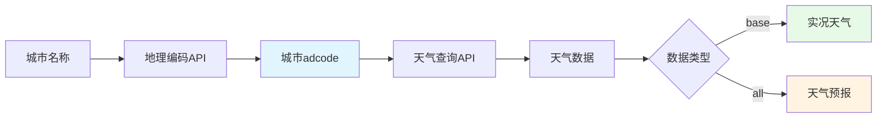

# 第06章：辅助工具类(下) - 天气查询、聊天历史与UI组件

> **本章目标**：
> 1. 实现基于高德地图API的天气查询服务，为Agent提供实时天气工具
> 2. 构建聊天历史管理器，支持会话持久化、搜索和导出功能
> 3. 封装Streamlit UI组件库，提高界面开发效率和一致性
> 4. 掌握第三方API集成、数据持久化和UI组件化的最佳实践

---

## 一、为什么需要这三个工具类？从Agent能力增强谈起

在前五章，我们构建了RAG系统的核心功能：配置管理、LLM客户端、向量存储、装饰器和文档处理器。本章将完成最后三个辅助工具类，它们分别解决不同的业务需求：

### 1.1 天气查询服务：Agent的"眼睛"

**问题场景**：
```
用户："今天北京天气怎么样？"
传统RAG → ❌ 向量库中没有实时天气数据
Agentic RAG + 天气工具 → ✅ 调用API获取实时信息
```

**WeatherService作用**：
- 为Agent提供调用外部API的能力
- 展示如何将第三方服务集成到RAG系统
- 示范工具函数（Tool Function）的设计模式

### 1.2 聊天历史管理：对话的"记忆"

**问题场景**：
```
用户："我刚才问了什么？"
无历史管理 → ❌ 系统无法回溯
有历史管理 → ✅ 查询历史记录并回答
```

**ChatHistoryManager作用**：
- 持久化用户对话，支持会话恢复
- 提供搜索、导出功能，便于审计和分析
- 为多轮对话提供上下文支持

### 1.3 UI组件库：界面的"积木"

**问题场景**：
```python
# 不使用组件化
st.slider("温度", 0.0, 1.0, 0.7)  # 代码重复
st.slider("温度", 0.0, 1.0, 0.7)  # 样式不统一

# 使用组件化
ui.render_temperature_slider(0.7)  # 统一封装
```

**UIComponents作用**：
- 封装常用Streamlit组件，避免重复代码
- 统一UI风格和交互逻辑
- 提高开发效率，降低维护成本

---

## 二、天气查询服务（services/weather_tools.py）

### 2.1 高德地图API简介

**为什么选择高德地图？**

| 对比项 | 高德地图 | OpenWeatherMap | 和风天气 |
|--------|----------|---------------|----------|
| 国内访问速度 | 快 | 慢（国外服务器） | 中等 |
| 免费额度 | 每日30万次 | 每日1000次 | 每日3000次 |
| 城市覆盖 | 全国地级市 | 全球 | 全球 |
| API稳定性 | 高（国内大厂） | 高 | 中 |
| 文档友好度 | 中文文档 | 英文 | 中文 |

**高德天气API架构**：



**关键概念**：
- **adcode**：行政区划代码（如北京：110000），高德API的城市标识
- **extensions=base**：查询实况天气（当前）
- **extensions=all**：查询预报天气（未来3-7天）

### 2.2 WeatherService架构设计

**功能模块**（331行代码）：

```
WeatherService 功能模块
├── 🏙️ 城市查询
│   ├── get_city_code()           - 城市名→adcode（带缓存）
│   └── city_cache                - 城市代码缓存（避免重复请求）
│
├── 🌤️ 天气查询
│   ├── get_current_weather()     - 当前天气
│   ├── get_weather_forecast()    - 天气预报（1-7天）
│   └── 请求参数构建
│
└── 📝 数据格式化
    ├── _format_current_weather() - 格式化实况天气
    └── _format_weather_forecast() - 格式化预报数据
```

### 2.3 代码实现详解

> **说明**：`services/weather_tools.py` 共331行，拆分为4个部分讲解。

#### 2.3.1 第一部分：初始化与城市代码查询（1-70行）

```python
class WeatherService:
    """天气查询服务类"""

    def __init__(self):
        self.settings = Settings()
        self.api_key = self.settings.WEATHER_API_KEY
        self.weather_url = self.settings.WEATHER_API_URL
        self.city_url = self.settings.WEATHER_CITY_URL

        # 城市代码缓存
        self.city_cache = {}

    def get_city_code(self, city_name: str) -> Optional[str]:
        """获取城市代码"""
        try:
            # 检查缓存
            if city_name in self.city_cache:
                return self.city_cache[city_name]

            # 构建请求URL
            url = f"{self.city_url}"
            params = {
                "keywords": city_name,
                "subdistrict": 0,        # 不返回下级行政区
                "key": self.api_key,
                "extensions": "base"
            }

            response = requests.get(url, params=params, timeout=10)
            response.raise_for_status()

            data = response.json()

            if data.get("status") == "1" and data.get("districts"):
                districts = data["districts"]
                if districts and len(districts) > 0:
                    city_code = districts[0].get("adcode")
                    if city_code:
                        # 缓存结果
                        self.city_cache[city_name] = city_code
                        logger.info(f"获取城市代码成功: {city_name} -> {city_code}")
                        return city_code

            logger.warning(f"未找到城市: {city_name}")
            return None

        except requests.RequestException as e:
            logger.error(f"获取城市代码失败: {str(e)}")
            return None
```

**关键技术点**：

1. **城市代码缓存**：
   ```python
   if city_name in self.city_cache:
       return self.city_cache[city_name]
   ```
   - **为什么需要**？避免重复查询同一城市的adcode
   - **效果**：第二次查询"北京"直接从内存返回，无需网络请求

2. **API响应结构**：
   ```json
   {
     "status": "1",
     "districts": [
       {
         "adcode": "110000",
         "name": "北京市",
         "level": "province"
       }
     ]
   }
   ```

3. **错误处理**：
   ```python
   response.raise_for_status()  # HTTP错误抛异常
   except requests.RequestException as e:  # 捕获网络异常
   ```

#### 2.3.2 第二部分：当前天气查询（71-123行）

```python
def get_current_weather(self, city_name: str) -> str:
    """获取当前天气"""
    try:
        city_code = self.get_city_code(city_name)
        if not city_code:
            return f"抱歉，无法找到城市 '{city_name}' 的信息。请检查城市名称是否正确。"

        # 构建请求URL
        params = {
            "city": city_code,
            "key": self.api_key,
            "extensions": "base"  # base=实况天气
        }

        response = requests.get(self.weather_url, params=params, timeout=10)
        response.raise_for_status()

        data = response.json()

        if data.get("status") == "1" and data.get("lives"):
            weather_info = data["lives"][0]

            # 格式化天气信息
            result = self._format_current_weather(weather_info, city_name)
            logger.info(f"获取当前天气成功: {city_name}")
            return result
        else:
            error_msg = data.get("info", "未知错误")
            logger.warning(f"获取当前天气失败: {error_msg}")
            return f"获取天气信息失败: {error_msg}"

    except requests.RequestException as e:
        error_msg = f"网络请求失败: {str(e)}"
        logger.error(f"获取当前天气失败: {error_msg}")
        return f"获取天气信息失败，请稍后重试。"
```

**API响应示例**：

```json
{
  "status": "1",
  "lives": [
    {
      "province": "北京",
      "city": "北京市",
      "weather": "晴",
      "temperature": "15",
      "winddirection": "西北",
      "windpower": "≤3",
      "humidity": "45",
      "reporttime": "2024-01-15 14:00:00"
    }
  ]
}
```

#### 2.3.3 第三部分：天气预报查询（111-157行）

```python
def get_weather_forecast(self, city_name: str, days: int = 3) -> str:
    """获取天气预报"""
    try:
        if days < 1 or days > 7:
            return "预报天数必须在1-7天之间。"

        city_code = self.get_city_code(city_name)
        if not city_code:
            return f"抱歉，无法找到城市 '{city_name}' 的信息。请检查城市名称是否正确。"

        # 构建请求URL
        params = {
            "city": city_code,
            "key": self.api_key,
            "extensions": "all"  # all=预报天气
        }

        response = requests.get(self.weather_url, params=params, timeout=10)
        response.raise_for_status()

        data = response.json()

        if data.get("status") == "1" and data.get("forecasts"):
            forecast_info = data["forecasts"][0]

            # 格式化预报信息
            result = self._format_weather_forecast(forecast_info, city_name, days)
            logger.info(f"获取天气预报成功: {city_name}, 天数: {days}")
            return result
        else:
            error_msg = data.get("info", "未知错误")
            logger.warning(f"获取天气预报失败: {error_msg}")
            return f"获取天气预报失败: {error_msg}"

    except requests.RequestException as e:
        error_msg = f"网络请求失败: {str(e)}"
        logger.error(f"获取天气预报失败: {error_msg}")
        return f"获取天气预报失败，请稍后重试。"
```

**预报数据结构**：

```json
{
  "forecasts": [
    {
      "province": "北京",
      "city": "北京市",
      "reporttime": "2024-01-15 11:00:00",
      "casts": [
        {
          "date": "2024-01-15",
          "week": "1",
          "dayweather": "晴",
          "nightweather": "晴",
          "daytemp": "15",
          "nighttemp": "5",
          "daywind": "西北",
          "nightwind": "西北",
          "daypower": "≤3",
          "nightpower": "≤3"
        }
        // ... 更多天数
      ]
    }
  ]
}
```

#### 2.3.4 第四部分：数据格式化（159-264行）

```python
def _format_current_weather(self, weather_data: Dict[str, Any], city_name: str) -> str:
    """格式化当前天气信息"""
    try:
        province = weather_data.get("province", "")
        city = weather_data.get("city", city_name)
        weather = weather_data.get("weather", "")
        temperature = weather_data.get("temperature", "")
        winddirection = weather_data.get("winddirection", "")
        windpower = weather_data.get("windpower", "")
        humidity = weather_data.get("humidity", "")
        reporttime = weather_data.get("reporttime", "")

        # 构建格式化输出
        result = f"🏙️ **{province} {city}** 当前天气\n\n"
        result += f"🌤️ **天气状况**: {weather}\n"
        result += f"🌡️ **气温**: {temperature}°C\n"
        result += f"💨 **风向风力**: {winddirection} {windpower}\n"
        result += f"💧 **湿度**: {humidity}%\n"
        result += f"📅 **发布时间**: {reporttime}\n"

        # 添加天气建议
        result += "\n💡 **温馨提示**:\n"

        if temperature and temperature.isdigit():
            temp = int(temperature)
            if temp < 10:
                result += "• 天气较冷，请注意保暖。\n"
            elif temp > 30:
                result += "• 天气较热，请注意防暑。\n"
            else:
                result += "• 天气舒适，适合外出。\n"

        if humidity and humidity.isdigit():
            hum = int(humidity)
            if hum > 80:
                result += "• 湿度较高，注意防潮。\n"
            elif hum < 30:
                result += "• 湿度较低，注意补水。\n"

        return result

    except Exception as e:
        logger.error(f"格式化当前天气信息失败: {str(e)}")
        return f"天气数据格式化失败: {str(e)}"
```

**格式化输出示例**：

```
🏙️ **北京 北京市** 当前天气

🌤️ **天气状况**: 晴
🌡️ **气温**: 15°C
💨 **风向风力**: 西北 ≤3
💧 **湿度**: 45%
📅 **发布时间**: 2024-01-15 14:00:00

💡 **温馨提示**:
• 天气舒适，适合外出。
```

**智能建议逻辑**：

```python
if temp < 10:
    result += "• 天气较冷，请注意保暖。\n"
elif temp > 30:
    result += "• 天气较热，请注意防暑。\n"
else:
    result += "• 天气舒适，适合外出。\n"
```

- **设计目的**：让天气信息更人性化，不只是冰冷的数据
- **扩展性**：可增加更多规则（如PM2.5建议、穿衣指数等）

---

## 三、聊天历史管理器（utils/chat_history.py）

### 3.1 为什么需要聊天历史？

**多轮对话上下文**：

```
# 无历史管理
用户："Python是什么？"
AI："Python是编程语言"

用户："它有什么特点？"
AI："什么东西的特点？" ← ❌ 丢失上下文

# 有历史管理
用户："Python是什么？"
AI："Python是编程语言"
[保存到历史]

用户："它有什么特点？"
AI："Python的特点包括..." ← ✅ 从历史获取上下文
```

**审计和分析**：

```python
# 导出对话记录为CSV
manager.export_to_csv("chat_history.csv")

# 分析用户常问问题
results = manager.search_history("Python")
print(f"用户询问Python相关问题 {len(results)} 次")
```

### 3.2 ChatHistoryManager架构设计

**功能模块**（488行代码）：

```
ChatHistoryManager 功能模块
├── 💬 消息管理
│   ├── add_message()             - 添加消息（自动保存）
│   ├── get_history()             - 获取历史（支持过滤）
│   └── clear_history()           - 清空历史
│
├── 🔍 搜索功能
│   └── search_history()          - 关键词搜索（支持角色过滤）
│
├── 📊 导出功能
│   └── export_to_csv()           - 导出为CSV（字符串或文件）
│
├── 💾 持久化
│   ├── load_history()            - 从JSON加载
│   ├── save_history()            - 保存到JSON
│   └── history_file              - 历史文件路径
│
└── 🛠️ 辅助方法
    └── _generate_message_id()    - 生成UUID
```

### 3.3 数据结构设计

**消息结构**：

```python
{
  "role": "user",                          # 消息角色
  "content": "Python是什么？",              # 消息内容
  "timestamp": "2024-01-15T14:30:00",      # 时间戳
  "id": "550e8400-e29b-41d4-a716-446655440000",  # 唯一ID
  "metadata": {                            # 可选元数据
    "model": "gpt-4",
    "temperature": 0.7
  }
}
```

**历史文件结构**：

```json
[
  {
    "role": "user",
    "content": "你好",
    "timestamp": "2024-01-15T14:30:00",
    "id": "uuid-1"
  },
  {
    "role": "assistant",
    "content": "你好！有什么可以帮助您的吗？",
    "timestamp": "2024-01-15T14:30:05",
    "id": "uuid-2",
    "metadata": {"model": "gpt-4"}
  }
]
```

### 3.4 核心方法实现

#### 3.4.1 添加消息（48-95行）

```python
def add_message(self, role: str, content: str, metadata: Dict[str, Any] = None) -> bool:
    """添加消息到历史记录"""
    try:
        message = {
            "role": role,
            "content": content,
            "timestamp": datetime.now().isoformat(),
            "id": self._generate_message_id()
        }

        if metadata:
            message["metadata"] = metadata

        self.chat_history.append(message)

        # 如果超过最大数量，移除最旧的记录
        if len(self.chat_history) > self.max_history_size:
            self.chat_history.pop(0)

        # 保存到文件
        self.save_history()

        logger.debug(f"添加消息成功: {role}")
        return True

    except Exception as e:
        logger.error(f"添加消息失败: {str(e)}")
        return False
```

**关键设计**：

1. **自动生成ID和时间戳**：
   ```python
   "timestamp": datetime.now().isoformat()
   "id": self._generate_message_id()  # UUID
   ```
   - 每条消息都有唯一标识，便于追踪和调试

2. **历史大小限制**：
   ```python
   if len(self.chat_history) > self.max_history_size:
       self.chat_history.pop(0)  # 移除最旧记录
   ```
   - **为什么需要**？避免历史文件无限增长占满磁盘
   - **默认限制**：10000条消息

3. **即时持久化**：
   ```python
   self.save_history()  # 每次添加都保存
   ```
   - **优点**：不会丢失数据（即使程序崩溃）
   - **缺点**：频繁IO（可优化为批量保存）

#### 3.4.2 搜索历史（242-291行）

```python
def search_history(self, keyword: str, role_filter: str = None) -> List[Dict[str, Any]]:
    """搜索历史记录"""
    try:
        results = []
        keyword = keyword.lower()

        for message in self.chat_history:
            # 角色过滤
            if role_filter and message.get("role") != role_filter:
                continue

            # 内容搜索
            content = message.get("content", "").lower()
            if keyword in content:
                results.append(message)

        logger.info(f"搜索历史记录: '{keyword}' - 找到 {len(results)} 条结果")
        return results

    except Exception as e:
        logger.error(f"搜索历史记录失败: {str(e)}")
        return []
```

**使用示例**：

```python
manager = ChatHistoryManager()

# 搜索所有包含"Python"的消息
results = manager.search_history("python")

# 只搜索用户的问题
user_questions = manager.search_history("是什么", role_filter="user")

# 只搜索AI的回答
ai_answers = manager.search_history("编程语言", role_filter="assistant")
```

**搜索算法**：

```python
keyword = keyword.lower()             # 1. 转小写（不区分大小写）
content = message.get("content", "").lower()  # 2. 内容转小写
if keyword in content:                # 3. 子串匹配
    results.append(message)
```

- **简单但有效**：适用于大多数场景
- **可优化方向**：
  - 正则表达式搜索
  - 分词+倒排索引（大规模历史）
  - 向量语义搜索（模糊匹配）

#### 3.4.3 导出CSV（175-240行）

```python
def export_to_csv(self, output_file: str = None) -> str:
    """导出为CSV格式"""
    try:
        if not output_file:
            # 返回CSV字符串
            import io
            output = io.StringIO()

            if self.chat_history:
                # 定义标准CSV字段
                standard_fields = ['role', 'content', 'timestamp', 'id']
                writer = csv.DictWriter(output, fieldnames=standard_fields)
                writer.writeheader()

                # 只导出标准字段
                for message in self.chat_history:
                    row = {field: message.get(field, '') for field in standard_fields}
                    writer.writerow(row)

            csv_content = output.getvalue()
            output.close()

            logger.info("导出CSV成功")
            return csv_content
        else:
            # 保存到文件
            with open(output_file, 'w', newline='', encoding='utf-8') as f:
                # ... 同样的逻辑
```

**CSV输出示例**：

```csv
role,content,timestamp,id
user,Python是什么？,2024-01-15T14:30:00,uuid-1
assistant,Python是一种高级编程语言,2024-01-15T14:30:05,uuid-2
user,它有什么特点？,2024-01-15T14:31:00,uuid-3
```

**为什么不导出metadata**：

```python
standard_fields = ['role', 'content', 'timestamp', 'id']  # 不包含metadata
```

- metadata是嵌套字典，不适合CSV扁平结构
- 如果需要完整数据，直接使用JSON文件

---

## 四、UI组件库（utils/ui_components.py）

### 4.1 Streamlit组件化的必要性

**问题：代码重复**

```python
# 页面A
st.slider("温度", 0.0, 1.0, 0.7, help="控制随机性")
if 0.7 < 0.3:
    st.caption("低温度")

# 页面B
st.slider("温度", 0.0, 1.0, 0.8, help="控制随机性")
if 0.8 < 0.3:
    st.caption("低温度")

# 页面C
st.slider("温度系数", 0.0, 1.0, 0.5, help="...")  # ← 参数不一致！
```

**解决方案：组件化**

```python
# 统一封装
ui = UIComponents()

# 页面A/B/C
temperature = ui.render_temperature_slider(0.7)
```

### 4.2 UIComponents功能模块

**组件列表**（139行代码）：

```
UIComponents 组件模块
├── 🤖 render_model_selector()      - 模型选择器（下拉框+刷新按钮）
├── 🌡️ render_temperature_slider()  - 温度滑块（带智能提示）
├── 🔍 render_rag_settings()        - RAG设置（Top-K+搜索类型）
├── 📊 render_vector_store_status() - 向量存储状态（状态+统计）
└── 💡 辅助方法
    ├── _get_temperature_explanation()   - 温度解释
    └── _get_search_type_explanation()   - 搜索类型解释
```

### 4.3 核心组件实现

#### 4.3.1 温度滑块（37-58行）

```python
def render_temperature_slider(self, current_temp: float, key_prefix: str = "") -> float:
    """渲染温度系数滑块"""
    temperature = st.slider(
        "🌡️ 温度系数 (Temperature)",
        min_value=0.0,
        max_value=1.0,
        value=current_temp,
        step=0.1,
        help="控制回答的随机性。值越高，回答越随机；值越低，回答越确定。",
        key=f"{key_prefix}temperature_slider"
    )

    # 显示温度解释
    temp_explanation = self._get_temperature_explanation(temperature)
    st.caption(f"💡 {temp_explanation}")

    return temperature

def _get_temperature_explanation(self, temperature: float) -> str:
    """获取温度系数解释"""
    if temperature < 0.3:
        return "低温度：回答更确定、保守"
    elif temperature < 0.7:
        return "中等温度：平衡确定性和创造性"
    else:
        return "高温度：回答更随机、有创造性"
```

**界面效果**：

```
🌡️ 温度系数 (Temperature)
[========|--------] 0.4

💡 中等温度：平衡确定性和创造性
```

**key_prefix的作用**：

```python
key=f"{key_prefix}temperature_slider"
```

- **问题**：Streamlit要求每个组件有唯一key
- **解决**：通过key_prefix区分不同页面的相同组件
  ```python
  ui.render_temperature_slider(0.7, key_prefix="chat_")
  ui.render_temperature_slider(0.5, key_prefix="settings_")
  ```

#### 4.3.2 RAG设置（60-95行）

```python
def render_rag_settings(self, current_top_k: int, current_search_type: str, key_prefix: str = "") -> tuple:
    """渲染RAG设置"""
    st.subheader("🔍 RAG设置")

    col1, col2 = st.columns(2)

    with col1:
        top_k = st.slider(
            "检索数量 (Top-K)",
            min_value=1,
            max_value=10,
            value=current_top_k,
            step=1,
            help="从向量存储中检索的相关文档数量",
            key=f"{key_prefix}top_k_slider"
        )

    with col2:
        search_type = st.selectbox(
            "搜索类型",
            options=["similarity", "mmr"],
            index=0 if current_search_type == "similarity" else 1,
            help="similarity: 相似度搜索; mmr: 最大边际相关性搜索",
            key=f"{key_prefix}search_type_select"
        )

    # 显示搜索类型解释
    search_explanation = self._get_search_type_explanation(search_type)
    st.caption(f"💡 {search_explanation}")

    return top_k, search_type
```

**界面布局**：

```
🔍 RAG设置

┌──────────────────┬──────────────────┐
│ 检索数量 (Top-K) │ 搜索类型          │
│ [====|----] 5    │ ▼ similarity     │
└──────────────────┴──────────────────┘

💡 相似度搜索：基于向量相似度检索最相关的文档
```

**st.columns布局**：

```python
col1, col2 = st.columns(2)  # 2列等宽布局

with col1:
    # 左侧组件
    top_k = st.slider(...)

with col2:
    # 右侧组件
    search_type = st.selectbox(...)
```

#### 4.3.3 向量存储状态（97-123行）

```python
def render_vector_store_status(self, is_ready: bool, stats: Optional[Dict] = None):
    """渲染向量存储状态"""
    if is_ready:
        st.success("✅ 向量存储已准备就绪")

        if stats:
            with st.expander("📊 向量存储统计"):
                col1, col2, col3 = st.columns(3)

                with col1:
                    st.metric("文档数量", stats.get('documents_count', 0))

                with col2:
                    st.metric("向量总数", stats.get('total_vectors', 0))

                with col3:
                    st.metric("向量维度", stats.get('dimension', 0))

                if stats.get('index_path'):
                    st.caption(f"📁 索引路径: {stats['index_path']}")

    else:
        st.warning("⚠️ 向量存储未准备")
```

**界面效果**：

```
✅ 向量存储已准备就绪

📊 向量存储统计 ▼

┌──────────┬──────────┬──────────┐
│ 文档数量  │ 向量总数  │ 向量维度  │
│   150    │   150    │  1536    │
└──────────┴──────────┴──────────┘

📁 索引路径: data/vector_store
```

**st.metric的妙用**：

```python
st.metric("文档数量", 150)
```

- 自动格式化数字（如150,000 → 150K）
- 支持变化量显示（delta参数）
- 视觉效果醒目

---

## 五、完整代码

### 5.1 天气查询服务

<details>
<summary>点击查看 services/weather_tools.py 完整代码（331行）</summary>

```python
# 见本章2.3节各部分代码，此处省略完整代码以节省篇幅
# 完整代码请参考项目源文件
```

</details>

### 5.2 聊天历史管理器

<details>
<summary>点击查看 utils/chat_history.py 完整代码（488行）</summary>

```python
# 见本章3.4节各部分代码，此处省略完整代码以节省篇幅
# 完整代码请参考项目源文件
```

</details>

### 5.3 UI组件库

<details>
<summary>点击查看 utils/ui_components.py 完整代码（139行）</summary>

```python
import streamlit as st
from typing import List, Dict, Optional, Any
from config.settings import Settings

class UIComponents:
    """UI组件类 - 负责渲染各种Streamlit界面元素"""

    def __init__(self):
        self.settings = Settings()

    def render_model_selector(self, current_model: str, key_prefix: str = "") -> str:
        """渲染模型选择器"""
        col1, col2 = st.columns([2, 1])

        with col1:
            selected_model = st.selectbox(
                "🤖 选择模型",
                options=self.settings.AVAILABLE_MODELS,
                index=self.settings.AVAILABLE_MODELS.index(current_model)
                if current_model in self.settings.AVAILABLE_MODELS else 0,
                help="选择要使用的语言模型",
                key=f"{key_prefix}model_selector"
            )

        with col2:
            if st.button("🔄 刷新模型列表", key=f"{key_prefix}refresh_models"):
                st.rerun()

        return selected_model

    def render_temperature_slider(self, current_temp: float, key_prefix: str = "") -> float:
        """渲染温度系数滑块"""
        temperature = st.slider(
            "🌡️ 温度系数 (Temperature)",
            min_value=0.0,
            max_value=1.0,
            value=current_temp,
            step=0.1,
            help="控制回答的随机性。值越高，回答越随机；值越低，回答越确定。",
            key=f"{key_prefix}temperature_slider"
        )

        # 显示温度解释
        temp_explanation = self._get_temperature_explanation(temperature)
        st.caption(f"💡 {temp_explanation}")

        return temperature

    def render_rag_settings(self, current_top_k: int, current_search_type: str, key_prefix: str = "") -> tuple:
        """渲染RAG设置"""
        st.subheader("🔍 RAG设置")

        col1, col2 = st.columns(2)

        with col1:
            top_k = st.slider(
                "检索数量 (Top-K)",
                min_value=1,
                max_value=10,
                value=current_top_k,
                step=1,
                help="从向量存储中检索的相关文档数量",
                key=f"{key_prefix}top_k_slider"
            )

        with col2:
            search_type = st.selectbox(
                "搜索类型",
                options=["similarity", "mmr"],
                index=0 if current_search_type == "similarity" else 1,
                help="similarity: 相似度搜索; mmr: 最大边际相关性搜索",
                key=f"{key_prefix}search_type_select"
            )

        # 显示搜索类型解释
        search_explanation = self._get_search_type_explanation(search_type)
        st.caption(f"💡 {search_explanation}")

        return top_k, search_type

    def render_vector_store_status(self, is_ready: bool, stats: Optional[Dict] = None):
        """渲染向量存储状态"""
        if is_ready:
            st.success("✅ 向量存储已准备就绪")

            if stats:
                with st.expander("📊 向量存储统计"):
                    col1, col2, col3 = st.columns(3)

                    with col1:
                        st.metric("文档数量", stats.get('documents_count', 0))

                    with col2:
                        st.metric("向量总数", stats.get('total_vectors', 0))

                    with col3:
                        st.metric("向量维度", stats.get('dimension', 0))

                    if stats.get('index_path'):
                        st.caption(f"📁 索引路径: {stats['index_path']}")

        else:
            st.warning("⚠️ 向量存储未准备")

    def _get_temperature_explanation(self, temperature: float) -> str:
        """获取温度系数解释"""
        if temperature < 0.3:
            return "低温度：回答更确定、保守"
        elif temperature < 0.7:
            return "中等温度：平衡确定性和创造性"
        else:
            return "高温度：回答更随机、有创造性"

    def _get_search_type_explanation(self, search_type: str) -> str:
        """获取搜索类型解释"""
        if search_type == "similarity":
            return "相似度搜索：基于向量相似度检索最相关的文档"
        else:
            return "MMR搜索：在相关性和多样性之间取得平衡"
```

</details>

---

## 六、测试与验证

### 6.1 天气服务测试

```bash
# 设置API密钥（使用你的高德地图Key）
export WEATHER_API_KEY=your_gaode_api_key

# 运行测试
python services/weather_tools.py
```

**预期输出**：

```
🌤️ 天气服务测试开始...
==================================================

📍 测试1：获取城市代码
------------------------------
✅ 北京: 110000
✅ 上海: 310000

🌡️ 测试2：获取当前天气
------------------------------

🌍 北京当前天气：
🏙️ **北京 北京市** 当前天气

🌤️ **天气状况**: 晴
🌡️ **气温**: 15°C
💨 **风向风力**: 西北 ≤3
💧 **湿度**: 45%
📅 **发布时间**: 2024-01-15 14:00:00

💡 **温馨提示**:
• 天气舒适，适合外出。
```

### 6.2 聊天历史测试

```bash
# 运行测试
python utils/chat_history.py
```

**预期输出**：

```
🚀 开始测试 ChatHistoryManager 类...

📋 测试1: 初始化管理器
   ✅ 初始化成功，历史文件: /tmp/xxx.json

💬 测试2: 添加消息
   ✅ 成功添加 4 条消息

📖 测试3: 获取历史记录
   ✅ 获取完整历史: 4 条记录
   ✅ 获取用户消息: 2 条记录
   ✅ 获取最新助手消息: 1 条记录

🔍 测试4: 搜索功能
   ✅ 搜索 'Python': 找到 4 条结果
   ✅ 搜索用户消息中的 '项目': 找到 1 条结果
   ✅ 搜索 'JavaScript': 找到 0 条结果

📊 测试5: 导出功能
   ✅ 导出CSV字符串: 234 字符
   ✅ 保存CSV文件: /tmp/xxx.csv

🎉 所有测试完成！ChatHistoryManager 类工作正常！
```

### 6.3 UI组件测试

**集成测试**（在Streamlit应用中）：

```python
# test_ui_components.py
import streamlit as st
from utils.ui_components import UIComponents

st.title("UI组件测试")

ui = UIComponents()

# 测试温度滑块
st.subheader("温度滑块")
temp = ui.render_temperature_slider(0.7)
st.write(f"选择的温度: {temp}")

# 测试RAG设置
st.subheader("RAG设置")
top_k, search_type = ui.render_rag_settings(5, "similarity")
st.write(f"检索数量: {top_k}, 搜索类型: {search_type}")

# 测试向量存储状态
st.subheader("向量存储状态")
stats = {
    'documents_count': 150,
    'total_vectors': 150,
    'dimension': 1536,
    'index_path': 'data/vector_store'
}
ui.render_vector_store_status(True, stats)
```

运行：

```bash
streamlit run test_ui_components.py
```

---

## 七、本章总结

### 7.1 核心要点回顾

✅ **天气查询服务（331行）**：
- 集成高德地图API，提供实时天气和预报功能
- 城市代码缓存机制，减少重复请求
- 智能天气建议，提升用户体验
- **关键技术**：API集成、缓存策略、数据格式化

✅ **聊天历史管理器（488行）**：
- JSON持久化存储，支持加载和保存
- 搜索、过滤、导出功能完备
- UUID生成保证消息唯一性
- **关键技术**：数据持久化、搜索算法、CSV导出

✅ **UI组件库（139行）**：
- 封装Streamlit常用组件，避免代码重复
- key_prefix机制解决组件key冲突
- 智能提示增强用户体验
- **关键技术**：组件化、状态管理、布局设计

### 7.2 与前五章的关联

| 章节 | 核心组件 | 在第06章中的应用 |
|------|----------|------------------|
| 第02章 | Settings配置 | WeatherService读取API配置，ChatHistoryManager读取历史文件路径 |
| 第03章 | UnifiedLLMClient | UIComponents的模型选择器展示可用模型列表 |
| 第04章 | VectorStoreService | UIComponents的向量存储状态展示统计信息 |
| 第05章 | 装饰器工具 | 可为天气查询、历史管理添加@error_handler装饰器 |

### 7.3 Agent工具集成预览

**第07章将实现的Agentic RAG**：

```python
from models.agent import AgenticRAG
from services.weather_tools import WeatherService

# 初始化Agent
agent = AgenticRAG()

# 注册天气工具
weather_service = WeatherService()
agent.register_tool("get_weather", weather_service.get_current_weather)

# 用户查询
user_query = "今天北京天气怎么样？"

# Agent自动决定：
# 1. 识别需要天气信息
# 2. 调用get_weather工具
# 3. 获取结果并回答用户
response = agent.run(user_query)
```

---

## 八、下一章预告

**第07章：Agentic RAG核心 - ReAct智能代理的完整实现**

在第07章中，我们将实现最核心的Agentic RAG智能体：

1. 理解ReAct框架（Reasoning + Acting）的工作原理
2. 实现智能体的推理-行动循环机制
3. 集成向量检索、天气查询等多种工具
4. 构建三级路由系统（direct/tool_direct/react）
5. 掌握Prompt Engineering技巧

这是整个系统的"大脑"，将前六章的所有组件整合成一个智能问答系统。

---

**版本信息**：
- 教程版本：v1.0
- 对应源码：
  - `services/weather_tools.py`（331行）
  - `utils/chat_history.py`（488行）
  - `utils/ui_components.py`（139行）
- 最后更新：2025-01-15
