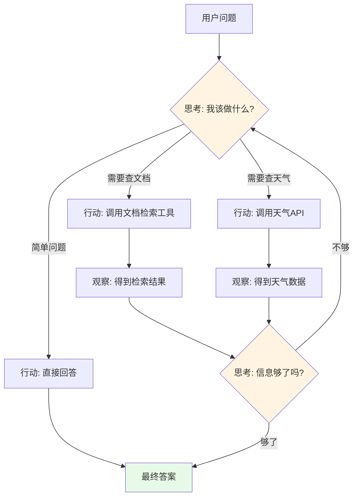
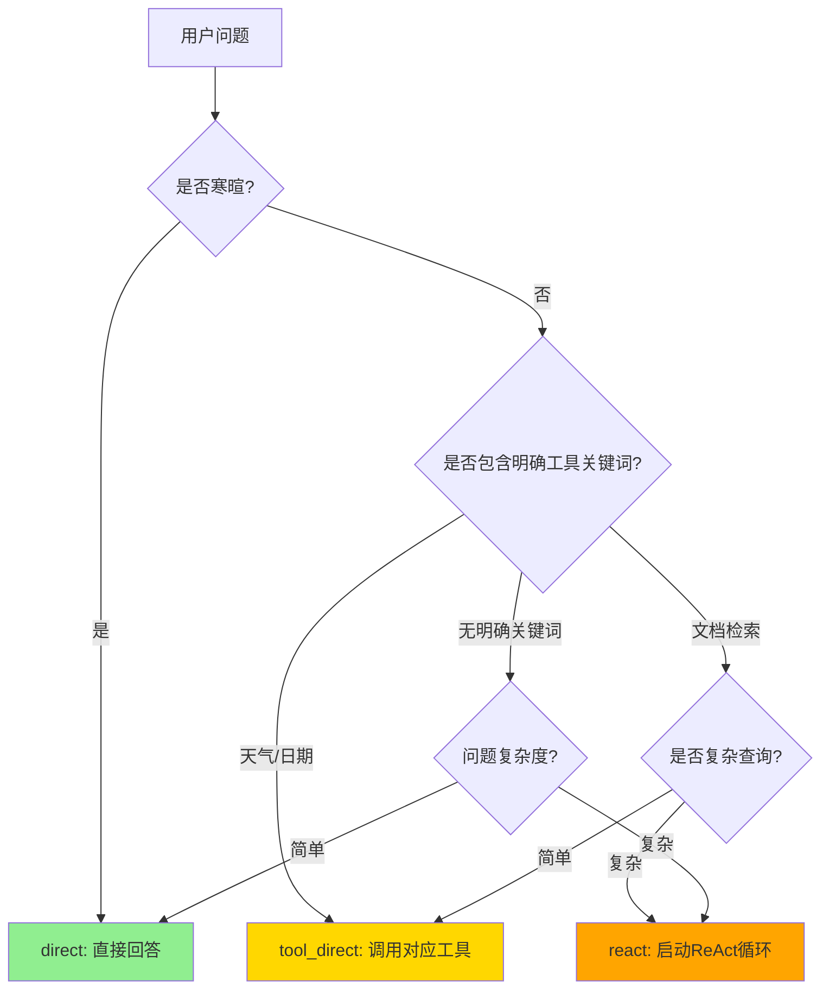
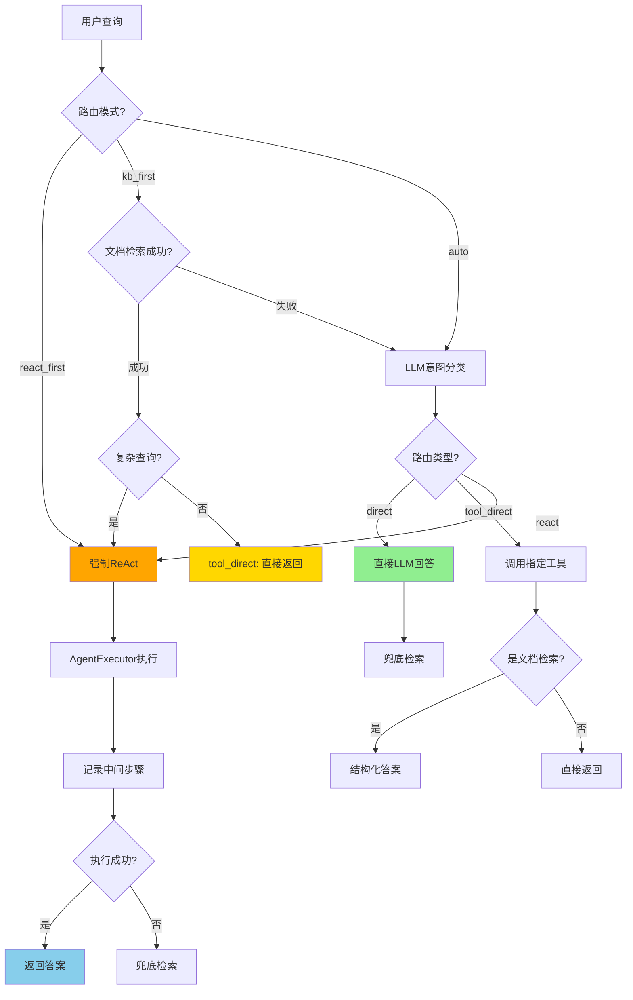

# 第07章：Agentic RAG核心 - ReAct智能代理的完整实现

> **本章目标**：
> 1. 深入理解ReAct（Reasoning + Acting）框架的工作原理和优势
> 2. 实现AgenticRAGAgent智能体（629行），整合向量检索、天气查询等多种工具
> 3. 构建三级路由系统（direct/tool_direct/react），智能选择问答策略
> 4. 掌握LangChain Agent、Prompt Engineering和工具注册的核心技术

---

## 一、什么是Agentic RAG？从传统RAG到智能Agent

### 1.1 传统RAG的局限

**传统RAG工作流程**：

```
用户问题 → 向量检索 → 拼接Prompt → LLM生成答案
```

**局限性**：
- ❌ 只能回答知识库内的问题（如"今天北京天气"无法回答）
- ❌ 无法执行动作（如"帮我发邮件"）
- ❌ 缺乏推理能力（简单检索+生成）
- ❌ 无法处理复杂的多步骤问题

**实际案例**：

```
用户："今天北京天气怎么样？明天适合爬山吗？"

传统RAG：
1. 检索向量库 → 找到历史天气知识
2. 回答："根据历史数据，北京..." ← ❌ 不是实时信息

Agentic RAG：
1. 识别需要实时天气数据
2. 调用天气API获取今天和明天的天气
3. 分析天气是否适合爬山
4. 生成综合建议 ← ✅ 准确、实时、智能
```

### 1.2 ReAct框架：让AI像人一样思考和行动

**ReAct = Reasoning（推理） + Acting（行动）**

这是一个由Google Research和Princeton University在2022年提出的框架，核心思想是让LLM交替进行推理和行动。



**ReAct循环示例**：

```
用户："北京今天天气怎么样？明天的Python培训还举办吗？"

Thought 1: 我需要先查询北京今天的天气
Action 1: weather_query("北京")
Observation 1: 北京今天晴，15°C

Thought 2: 我需要查询明天的天气预报
Action 2: weather_forecast("北京", days=1)
Observation 2: 北京明天多云，温度12-18°C

Thought 3: 我还需要从知识库中查找Python培训的相关信息
Action 3: document_search("Python培训")
Observation 3: Python培训将于明天下午2点在XX地点举行

Thought 4: 我已经获得足够信息，可以给出综合建议了
Final Answer: 北京今天天气晴朗，气温15°C。明天多云，温度12-18°C，
天气状况良好，Python培训将正常举办，地点在XX，时间下午2点。建议您
准备一件外套应对温差。
```

### 1.3 为什么需要Agentic RAG？

| 对比维度 | 传统RAG | Agentic RAG |
|---------|---------|------------|
| **信息来源** | 仅限知识库 | 知识库 + 外部API + 实时数据 |
| **处理能力** | 单次检索+生成 | 多步推理+多工具协同 |
| **适用场景** | 简单问答 | 复杂推理、比较、规划 |
| **实时性** | 依赖知识库更新 | 可调用实时API |
| **灵活性** | 固定流程 | 动态规划执行路径 |

---

## 二、AgenticRAGAgent架构设计

### 2.1 系统整体架构（629行代码）

```
models/agent.py (629行)
├── 🧠 核心类：AgenticRAGAgent
│   ├── __init__() - 初始化Agent和所有组件
│   ├── generate_response() - 主入口，生成回答
│   └── _initialize_agent() - 创建LangChain Agent
│
├── 🔀 三级路由系统
│   ├── _classify_intent() - 意图分类（direct/tool_direct/react）
│   ├── _is_small_talk() - 判断是否寒暄
│   ├── _is_complex_query() - 判断是否复杂查询
│   └── _assess_complexity() - 评估复杂度
│
├── 🛠️ 工具调用层
│   ├── _fallback_document_search() - 兜底文档检索
│   ├── _compose_answer() - 结构化答案合成
│   └── _format_citations() - 格式化引用
│
├── 📝 Prompt工程
│   ├── _get_default_system_prompt() - 默认系统提示词
│   ├── _create_agent_template() - ReAct提示词模板
│   └── _rewrite_query_for_retrieval() - 查询改写
│
└── 🔧 工具方法
    ├── add_tool() - 动态添加工具
    ├── clear_memory() - 清空对话记忆
    ├── update_system_prompt() - 更新提示词
    └── get_model_info() - 获取模型信息
```

### 2.2 三级路由系统详解

**为什么需要路由？**

不是所有问题都需要ReAct的完整推理循环。根据问题复杂度选择最优策略可以：
- 提升响应速度（简单问题直接回答）
- 降低API成本（减少不必要的工具调用）
- 提高准确性（复杂问题使用多步推理）

| 路由策略 | 适用场景 | 示例问题 | 处理流程 | 成本 |
|---------|---------|---------|---------|-----|
| **direct_answer** | 寒暄、常识 | "你好"、"谢谢" | LLM直接回答 | 低 |
| **tool_direct** | 明确单工具 | "北京天气"、"搜索Python" | 直接调用对应工具 | 中 |
| **react_loop** | 复杂推理 | "比较两个方案"、"规划步骤" | 完整ReAct循环 | 高 |

**路由决策流程图**：



---

## 三、核心代码实现（分段详解）

### 第一部分：初始化与配置（第1-63行）

```python
from typing import List, Dict, Optional, Any, Callable
import re
import json
import logging
from langchain.schema import BaseMessage, HumanMessage, AIMessage, SystemMessage
from langchain.agents import AgentExecutor, create_react_agent
from langchain.prompts import PromptTemplate
from langchain.tools import Tool, StructuredTool
from langchain.memory import ConversationBufferMemory
from langchain.callbacks.streaming_stdout import StreamingStdOutCallbackHandler
from config.settings import Settings
from services.llm_client import UnifiedLLMClient

logger = logging.getLogger(__name__)

class AgenticRAGAgent:
    """Agentic RAG智能问答代理 - 支持 Ollama 和在线 API"""

    def __init__(
        self,
        model_name: str = None,
        temperature: float = 0.7,
        max_tokens: int = 2048,
        tools: Optional[List[Callable]] = None,
        enable_memory: bool = True,
        system_prompt: Optional[str] = None,
        route_mode: str = "auto"
    ):
        # 1. 加载配置
        self.settings = Settings()
        self.model_name = model_name or self.settings.get_default_model()
        self.temperature = temperature
        self.max_tokens = max_tokens

        # 2. 工具注册
        self.tools = tools or []
        # 构建工具字典，方便快速查找
        self.tool_funcs = {
            getattr(t, "__name__", f"tool_{i}"): t
            for i, t in enumerate(self.tools)
        }

        # 3. 配置选项
        self.enable_memory = enable_memory
        self.system_prompt = system_prompt or self._get_default_system_prompt()
        self.route_mode = route_mode  # auto | kb_first | react_first

        # 4. 初始化统一的 LLM 客户端
        self.llm_client = UnifiedLLMClient(
            model_name=self.model_name,
            temperature=self.temperature,
            max_tokens=self.max_tokens
        )

        # 5. 获取 LangChain 兼容的 LLM 对象
        self.llm = self.llm_client.get_llm()

        # 6. 初始化记忆
        if self.enable_memory:
            self.memory = ConversationBufferMemory(
                memory_key="chat_history",
                return_messages=True,
                output_key="output"
            )

        # 7. 初始化代理
        self.agent = self._initialize_agent()

        # 8. 记录初始化信息
        provider_info = self.llm_client.get_provider_info()
        logger.info(f"Agent 初始化完成 - 提供商: {provider_info['provider']}, 模型: {provider_info['model']}")
```

**技术要点**：

1. **工具字典（第34-37行）**：
   ```python
   self.tool_funcs = {getattr(t, "__name__", f"tool_{i}"): t for i, t in enumerate(self.tools)}
   ```
   - 将工具列表转换为字典，key是工具名称，value是工具函数
   - 用于路由阶段快速定位和调用特定工具
   - `getattr(t, "__name__", f"tool_{i}")` 优先使用函数名，否则用索引

2. **路由模式（第44行）**：
   - `auto`: 自动根据问题选择路由（默认）
   - `kb_first`: 知识库优先，尽量先检索文档
   - `react_first`: 深度思考优先，总是使用ReAct循环

3. **ConversationBufferMemory（第51-55行）**：
   ```python
   self.memory = ConversationBufferMemory(
       memory_key="chat_history",  # 在Prompt中的变量名
       return_messages=True,       # 返回消息对象而非字符串
       output_key="output"         # Agent输出的key
   )
   ```

---

### 第二部分：系统提示词（第64-84行）

```python
def _get_default_system_prompt(self) -> str:
    """获取默认系统提示词"""
    return """你是一个智能问答助手，具备以下能力：

1. 文档问答：能够基于上传的文档回答相关问题
2. 天气查询：能够查询实时天气信息和天气预报
3. 多轮对话：能够理解上下文进行连续对话

行为准则：
- 回答要准确、简洁、有用
- 如果不确定答案，请说明
- 使用工具时要明确说明
- 保持友好和专业的态度
- 对于寒暄或一般性问题，请直接回答，不要使用任何工具

工具使用说明：
- 当需要搜索文档时，使用document_search工具
- 当需要查询天气时，使用weather_query工具
- 根据用户问题的具体需求选择合适的工具
"""
```

**Prompt Engineering技巧**：

1. **能力声明**：明确告诉LLM它能做什么
2. **行为准则**：规范LLM的回答风格
3. **工具使用说明**：引导LLM何时使用工具
4. **关键提示**："对于寒暄或一般性问题，请直接回答，不要使用任何工具" ← 避免过度调用工具

---

### 第三部分：Agent初始化（第85-134行）

```python
def _initialize_agent(self):
    """初始化代理"""
    try:
        # 1. 创建工具（使用StructuredTool并保持语义化名称）
        langchain_tools = []
        for i, tool_func in enumerate(self.tools):
            tool_name = getattr(tool_func, "__name__", f"tool_{i}")
            tool = StructuredTool.from_function(
                func=tool_func,
                name=tool_name,
                description=tool_func.__doc__ or tool_name
            )
            langchain_tools.append(tool)

        # 2. 创建提示词模板
        prompt_template = PromptTemplate(
            input_variables=["input", "chat_history", "agent_scratchpad", "tools", "tool_names"],
            template=self._create_agent_template()
        )

        # 3. 创建代理
        if langchain_tools:
            agent = create_react_agent(
                llm=self.llm,
                tools=langchain_tools,
                prompt=prompt_template
            )

            # 4. 创建代理执行器
            agent_executor = AgentExecutor(
                agent=agent,
                tools=langchain_tools,
                memory=self.memory if self.enable_memory else None,
                verbose=True,
                max_iterations=8,
                max_execution_time=30,
                early_stopping_method="force",
                handle_parsing_errors="请严格在Thought后输出Action或Final Answer，并包含Action Input。",
                return_intermediate_steps=True
            )

            return agent_executor
        else:
            # 如果没有工具，直接返回LLM
            return self.llm

    except Exception as e:
        logger.error(f"初始化代理失败: {str(e)}")
        raise
```

**关键参数解析**：

1. **StructuredTool.from_function（第92-96行）**：
   ```python
   tool = StructuredTool.from_function(
       func=tool_func,                          # 工具函数
       name=tool_name,                          # 工具名称
       description=tool_func.__doc__ or tool_name  # 工具描述（来自docstring）
   )
   ```
   - `StructuredTool` 支持带参数验证的工具
   - `from_function` 自动从函数签名推断参数类型
   - `description` 非常重要！LLM靠这个决定何时使用工具

2. **AgentExecutor参数（第114-124行）**：

| 参数 | 值 | 作用 |
|------|---|------|
| `verbose` | True | 打印推理过程（调试必备） |
| `max_iterations` | 8 | 最多8轮Thought→Action循环 |
| `max_execution_time` | 30 | 超时30秒强制停止 |
| `early_stopping_method` | "force" | 超时时强制返回当前结果 |
| `handle_parsing_errors` | 提示文本 | 解析错误时的提示 |
| `return_intermediate_steps` | True | 返回中间步骤（用于调试） |

---

### 第四部分：ReAct提示词模板（第135-181行）

这是整个Agent最核心的部分！

```python
def _create_agent_template(self) -> str:
    """创建代理提示词模板"""
    return f"""{self.system_prompt}

可用工具:
{{tools}}

工具名称:
{{tool_names}}

输出规则（必须严格遵循，英文关键词保留原样）：
1) 在每一步输出中，必须先写 Thought:，随后要么写 Action: 与 Action Input:，要么直接写 Final Answer: 结束。
2) Action 只能从工具名称中选择且一次仅一个；Action Input 必须是简短的一行字符串。
3) 当你不需要工具时，直接输出 Final Answer: 给出最终答案。
4) 当问题属于复杂查询（比较/推理/规划/跨片段综合/评价分析/场景迁移），必须在给出 Final Answer 前至少进行三次 Thought→Action→Action Input 循环，并依次执行：
   - 第1轮：Action=document_search_similarity（基于similarity检索）
   - 第2轮：Action=document_search_mmr（基于mmr检索）
   - 第3轮：Action=document_search_random（随机选择一种检索策略）
   在完成上述三轮检索并合并依据后，才可输出 Final Answer。
5) 当问题可能依赖外部知识或文档信息时，不要直接输出 Final Answer，先使用检索类工具获取依据，再综合回答。

示例：
Thought: 我需要从知识库检索本周OKR
Action: document_search_similarity
Action Input: 本周 OKR 周报 上线 课程

（收到工具结果后）
Thought: 为提高覆盖面，我需要用不同策略再次检索
Action: document_search_mmr
Action Input: 本周 OKR 周报 上线 课程

（收到工具结果后）
Thought: 再做一次随机策略检索以避免遗漏
Action: document_search_random
Action Input: 本周 OKR 周报 上线 课程

（合并三轮结果后）
Thought: 我已汇总检索片段并可以给出结构化答案（结论/依据/推理/建议）
Final Answer: 本周上线课程为……

当前对话历史:
{{chat_history}}

人类: {{input}}

助手: {{agent_scratchpad}}"""
```

**Prompt设计精髓**：

1. **格式规范（第147-149行）**：
   - `Thought:` → 思考下一步
   - `Action:` + `Action Input:` → 执行工具
   - `Final Answer:` → 结束并输出答案

2. **复杂查询强制三轮检索（第150-155行）**：
   ```
   为什么需要三轮？
   - similarity: 找最相似的片段
   - mmr: 最大边际相关性，增加多样性
   - random: 随机策略，避免遗漏
   ```

3. **Few-Shot示例（第157-176行）**：
   - 通过示例教会LLM正确的输出格式
   - 展示完整的Thought→Action→Observation循环
   - 这是Prompt Engineering的经典技巧

---

### 第五部分：意图分类（第332-379行）

这是三级路由的核心！

```python
def _classify_intent(self, query: str) -> Dict[str, Any]:
    """意图判断：决定走 direct / tool_direct / react，并给出工具及输入"""
    try:
        tool_names = list(self.tool_funcs.keys()) or ["document_search", "weather_query"]
        system = (
            "你是一个智能路由器，任务是为用户问题选择最合适的处理路径。"
            "可选 route: direct(直接用LLM回答)、tool_direct(直接调用某个工具)、react(交给Agent执行ReAct多步推理)。"
            "输出必须是严格的单行 JSON，且只包含指定字段。"
        )
        instruction = (
            "决策标准：\n"
            "1) direct：寒暄/一般性问答/纯主观表达/明确不需外部信息。\n"
            "2) tool_direct（RAG-first）：除上述特定需求外，默认优先选择 document_search，将核心关键词作为 tool_input。\n"
            "   - 日期/时间：必须选 datetime_now\n"
            "   - 天气：必须选 weather_query\n"
            "3) react：复杂问题(比较/推理/规划/多条件/跨片段综合/角色映射/评价分析/行业应用迁移)。\n"
            "   包括含'最…'、'谁更…'、排名/评估/比较、需要依据与论证的主观判断等，一律选 react。即使存在知识库，也应选择 react，在链中结合检索与推理生成更精准答案。\n"
            f"工具可选: {tool_names}。\n"
            "输出格式(仅此JSON，不能包含注释/Markdown/额外文本)："
            "{\"route\":<direct|tool_direct|react>, \"tool\":<工具名或null>, \"tool_input\":<字符串或null>, \"reason\":<中文简要理由>}\n"
            "字段要求：route 必填且为三选一；当 route=tool_direct 时 tool 必须取自工具列表且非空，tool_input 为提取的简短关键词；其余情况 tool 与 tool_input 置为 null。\n"
            "示例：\n"
            "- 用户：你好 → {\"route\":\"direct\", \"tool\":null, \"tool_input\":null, \"reason\":\"寒暄直答\"}\n"
            "- 用户：今天是周几 → {\"route\":\"tool_direct\", \"tool\":\"datetime_now\", \"tool_input\":\"\", \"reason\":\"需要系统时间\"}\n"
            "- 用户：查询上海当前天气 → {\"route\":\"tool_direct\", \"tool\":\"weather_query\", \"tool_input\":\"上海\", \"reason\":\"天气查询\"}\n"
            "- 用户：根据OKR周报总结本周上线课程 → {\"route\":\"tool_direct\", \"tool\":\"document_search\", \"tool_input\":\"本周 上线 课程 OKR\", \"reason\":\"RAG优先\"}\n"
            "- 用户：比较两套架构的优缺点并给出实施步骤 → {\"route\":\"react\", \"tool\":null, \"tool_input\":null, \"reason\":\"复杂多步推理\"}\n"
            "- 用户：西游记中最厉害的神仙是哪位 → {\"route\":\"react\", \"tool\":null, \"tool_input\":null, \"reason\":\"评估/比较类，需依据与论证\"}"
        )

        messages = [
            SystemMessage(content=system),
            HumanMessage(content=f"{instruction}\n\n用户问题: {query}")
        ]

        # 调用LLM进行意图分类
        result = self.llm.invoke(messages) if hasattr(self.llm, "invoke") else self.llm(messages)
        content = getattr(result, "content", None) or str(result)
        content = content.strip().splitlines()[-1]  # 取最后一行（防止LLM输出多余内容）
        data = json.loads(content)

        route = str(data.get("route", "react")).lower()
        tool = data.get("tool")
        tool_input = data.get("tool_input") or query

        return {"route": route, "tool": tool, "tool_input": tool_input, "raw": data}
    except Exception:
        # 兜底：走 direct
        return {"route": "direct", "tool": None, "tool_input": query}
```

**设计亮点**：

1. **JSON输出格式**：
   ```json
   {
     "route": "tool_direct",
     "tool": "document_search",
     "tool_input": "本周 上线 课程",
     "reason": "RAG优先"
   }
   ```

2. **Few-Shot示例（第356-361行）**：
   - 覆盖所有三种路由类型
   - 包含正反例
   - 帮助LLM理解决策逻辑

3. **错误兜底（第376-378行）**：
   ```python
   except Exception:
       return {"route": "direct", "tool": None, "tool_input": query}
   ```
   - 任何错误都返回direct路由
   - 确保系统不会崩溃

---

### 第六部分：核心生成逻辑（第418-566行）

这是整个Agent的主入口！

```python
def generate_response(self, query: str) -> str:
    """生成回答"""
    try:
        logger.info(f"生成回答 - 查询: {query}")

        if isinstance(self.agent, AgentExecutor):
            # 路由模式覆盖：kb_first / react_first / auto
            if self.route_mode == "react_first":
                logger.info("路由模式: react_first")
                decision = {"route": "react", "tool": None, "tool_input": None}
            elif self.route_mode == "kb_first" and not self._is_small_talk(query):
                logger.info("路由模式: kb_first")
                # 知识库优先：先尝试检索
                rewritten = self._rewrite_query_for_retrieval(query) or query
                func = self.tool_funcs.get("document_search")
                if callable(func):
                    text = str(func(rewritten))
                    if text.strip() and "未找到" not in text:
                        # 根据复杂度选择：simple -> 直接RAG合成；complex -> 走ReAct
                        level = self._assess_complexity(query)
                        if level == "complex":
                            decision = {"route": "react", "tool": None, "tool_input": None}
                        else:
                            decision = {"route": "tool_direct", "tool": "document_search", "tool_input": rewritten}
                    else:
                        decision = self._classify_intent(query)
                else:
                    decision = self._classify_intent(query)
            # 默认自动模式：由LLM意图识别
            if 'decision' not in locals():
                decision = self._classify_intent(query)

            route = decision.get("route", "react")

            # ========== 路由1：direct_answer ==========
            if route == "direct":
                logger.info("路由: direct - 直接调用LLM生成答案")
                messages = [
                    SystemMessage(content=self.system_prompt),
                    HumanMessage(content=query)
                ]
                output = self.llm.invoke(messages)
                final = output.content if hasattr(output, "content") else str(output)

                # 兜底：即使选择direct，也尝试检索（如果不是寒暄）
                if not self._is_small_talk(query):
                    rewritten = self._rewrite_query_for_retrieval(query) or query
                    func = self.tool_funcs.get("document_search")
                    if callable(func):
                        text = str(func(rewritten))
                        if text.strip() and "未找到" not in text:
                            return self._compose_answer(query, text)
                return final

            # ========== 路由2：tool_direct ==========
            elif route == "tool_direct":
                tool_name = decision.get("tool")
                tool_input = decision.get("tool_input") or (self._rewrite_query_for_retrieval(query) or query)
                logger.info(f"路由: tool_direct - 工具={tool_name}, 输入={tool_input}")

                func = self.tool_funcs.get(tool_name)
                if callable(func):
                    result_text = func(tool_input)
                    text = str(result_text)

                    if tool_name == "document_search":
                        if not text.strip() or "未找到" in text:
                            return self._friendly_tip_no_kb()
                        return self._compose_answer(query, text)
                    return text

                # 如果未找到匹配工具，回退
                return self._friendly_tip_no_kb()

            # ========== 路由3：react_loop ==========
            else:
                logger.info("路由: react - 启动AgentExecutor进行ReAct推理")
                response = self.agent.invoke({"input": query})

                # 记录中间步骤
                if "intermediate_steps" in response:
                    for action, observation in response["intermediate_steps"]:
                        try:
                            logger.info(f"ReAct Thought/Action:\n{action.log}")
                        except Exception:
                            logger.info(f"ReAct Action: 工具={getattr(action,'tool',None)}, 输入={getattr(action,'tool_input',None)}")
                        obs_preview = str(observation)[:500]
                        logger.info(f"ReAct Observation: {obs_preview}")

                output = response.get("output", "抱歉，我无法生成回答。")

                # 兜底：如果迭代停止或解析异常，优先尝试文档检索
                if isinstance(output, str) and "Agent stopped due to iteration limit" in output:
                    fallback = self._fallback_document_search(query)
                    if fallback:
                        return self._compose_answer(query, fallback)
                    return self._friendly_tip_no_kb()

                logger.info(f"生成回答成功: {output[:100]}...")
                return output

        else:
            # 直接使用LLM
            messages = [
                SystemMessage(content=self.system_prompt),
                HumanMessage(content=query)
            ]
            output = self.agent.invoke(messages).content
            return output

    except Exception as e:
        error_msg = f"生成回答时出错: {str(e)}"
        logger.error(error_msg)
        return f"抱歉，处理您的请求时出现了错误。{str(e)}"
```

**执行流程图**：



---

## 四、辅助方法详解

### 4.1 查询改写（第300-312行）

```python
def _rewrite_query_for_retrieval(self, query: str) -> Optional[str]:
    """将用户问题改写为用于知识库检索的简短关键词"""
    try:
        sys = "请将用户问题改写为用于知识库检索的简短关键词，使用空格分隔，保留核心名词、人物、事件、书名等，用中文。只输出关键词一行。"
        messages = [
            SystemMessage(content=sys),
            HumanMessage(content=query)
        ]
        result = self.llm.invoke(messages)
        content = getattr(result, "content", None) or str(result)
        return content.strip()
    except Exception:
        return None
```

**作用**：

```
用户问题："请问文档中提到的Python培训具体在什么时候举办？"
↓ 改写后
关键词："Python 培训 时间 举办"
```

- 去除疑问词、语气词
- 保留核心名词
- 提高检索召回率

### 4.2 答案结构化合成（第201-217行）

```python
def _compose_answer(self, query: str, kb_text: str) -> str:
    """基于检索结果生成结构化答案"""
    system = (
        "你将基于提供的知识库检索结果回答用户问题。请结构化输出：\n"
        "1) 结论：直接明确回答问题；\n"
        "2) 依据与引用：列出关键片段的要点，并标注引用编号或关键词；\n"
        "3) 推理过程：说明如何从片段推理到结论（包含比较/归纳/映射等必要步骤）；\n"
        "4) 限制与建议：如有不确定或缺失信息，指出并给出后续建议。"
    )
    messages = [
        SystemMessage(content=system),
        HumanMessage(content=f"问题: {query}\n\n检索结果:\n{kb_text}")
    ]
    result = self.llm.invoke(messages)
    answer = result.content if hasattr(result, "content") else str(result)
    citations_html = self._format_citations(kb_text)
    return f"{answer}\n\n{citations_html}" if citations_html else answer
```

**输出示例**：

```
1) 结论：Python培训将于2025年1月20日下午2点举办。

2) 依据与引用：
   - 【文档1】提到"Python基础培训定于1月20日14:00开始"
   - 【文档2】补充"地点在A座301会议室"

3) 推理过程：
   从文档1直接获取时间信息，文档2提供地点细节，两者结合得到完整答案。

4) 限制与建议：
   文档未提及培训讲师信息，建议联系HR确认。

<details>
<summary>引用（点击展开）</summary>
<ul>
  <li>【文档1】 相关度: 95% 片段: Python基础培训定于...</li>
  <li>【文档2】 相关度: 87% 片段: 地点在A座301会议室...</li>
</ul>
</details>
```

### 4.3 引用格式化（第218-299行）

```python
def _format_citations(self, kb_text: str) -> Optional[str]:
    """格式化引用为可折叠的HTML"""
    try:
        blocks: List[Dict[str, str]] = []

        # 解析格式：【文档1】\n内容: ...\n相关度: 95%（原始分数：0.123）\n来源: test.pdf
        for m in re.finditer(
            r"【文档(\d+)】[\s\S]*?内容:\s*([\s\S]*?)\n\s*相关度:\s*([0-9]+)%（原始分数：\s*([0-9.]+)）(?:\n\s*来源:\s*([^\n]+))?",
            kb_text
        ):
            blocks.append({
                "id": m.group(1),
                "percent": m.group(3),
                "raw": m.group(4),
                "content": m.group(2).strip(),
                "source": (m.group(5).strip() if m.group(5) else None)
            })

        if not blocks:
            return None

        # 生成HTML
        items_html = "".join(
            f"<li><div>【文档{b['id']}】 相关度: {b['percent']}%（原始分数：{b['raw']}）</div>"
            f"<div>来源: {b['source']}</div>"
            f"<div>片段: {b['content']}</div></li>"
            for b in blocks
        )

        details = (
            "<details><summary>引用（点击展开）</summary>"
            f"<ul>{items_html}</ul></details>"
        )
        return details
    except Exception:
        return None
```

**作用**：
- 提取检索结果中的引用信息
- 格式化为可折叠的HTML
- 提高答案可信度和可追溯性

---

## 五、完整代码汇总

<details>
<summary>点击查看完整代码（629行）</summary>

```python
# models/agent.py 完整代码请参考源文件
# 由于篇幅限制，这里省略
# 完整代码位于：models/agent.py
```

**对比源码命令**：
```bash
# 查看源码
cat models/agent.py

# 统计行数
wc -l models/agent.py
# 输出：629 models/agent.py
```

</details>

---

## 六、测试与验证

### 6.1 基础功能测试

```python
# test_agent_basic.py
from models.agent import AgenticRAGAgent
from services.weather_tools import WeatherService

# 1. 初始化天气工具
weather_service = WeatherService()

def weather_query(city: str) -> str:
    """查询指定城市的实时天气信息"""
    return weather_service.get_current_weather(city)

# 2. 创建Agent（只有天气工具）
agent = AgenticRAGAgent(
    tools=[weather_query],
    temperature=0.7
)

# 3. 测试寒暄（应走direct路由）
response = agent.generate_response("你好")
print("寒暄测试:", response)

# 4. 测试天气查询（应走tool_direct路由）
response = agent.generate_response("北京今天天气怎么样？")
print("天气查询:", response)

# 5. 测试复杂查询（应走react路由）
response = agent.generate_response("比较北京和上海今天的天气，哪个更适合户外运动？")
print("复杂查询:", response)
```

### 6.2 RAG功能测试

```python
# test_agent_rag.py
from models.agent import AgenticRAGAgent
from services.vector_store import VectorStoreService
from langchain.schema import Document

# 1. 创建向量存储
vector_store = VectorStoreService()
docs = [
    Document(page_content="Python是一种解释型、面向对象的编程语言", metadata={"source": "test"}),
    Document(page_content="Python由Guido van Rossum于1991年创建", metadata={"source": "test"}),
]
vector_store.create_vector_store(docs)

# 2. 定义文档搜索工具
def document_search(query: str) -> str:
    """搜索知识库中与查询相关的文档"""
    results = vector_store.search(query, top_k=3)
    return "\n".join([f"【文档{i+1}】{r['content']}" for i, r in enumerate(results)])

# 3. 创建Agent
agent = AgenticRAGAgent(
    tools=[document_search],
    temperature=0.7
)

# 4. 测试简单查询
response = agent.generate_response("Python是什么？")
print("简单查询:", response)

# 5. 测试复杂查询
response = agent.generate_response("谁创建了Python？在哪一年？")
print("复杂查询:", response)
```

### 6.3 路由模式测试

```python
# test_routing_modes.py
from models.agent import AgenticRAGAgent

# 测试1：auto模式（默认）
agent_auto = AgenticRAGAgent(route_mode="auto", tools=[document_search])
response = agent_auto.generate_response("Python的创始人是谁？")
print("Auto模式:", response)

# 测试2：kb_first模式（知识库优先）
agent_kb = AgenticRAGAgent(route_mode="kb_first", tools=[document_search])
response = agent_kb.generate_response("Python的创始人是谁？")
print("KB-First模式:", response)

# 测试3：react_first模式（深度思考优先）
agent_react = AgenticRAGAgent(route_mode="react_first", tools=[document_search])
response = agent_react.generate_response("Python的创始人是谁？")
print("React-First模式:", response)
```

**预期输出对比**：

| 模式 | 路由决策 | 工具调用次数 | 响应时间 |
|------|---------|------------|---------|
| auto | tool_direct | 1次 | 快 |
| kb_first | tool_direct | 1次 | 快 |
| react_first | react | 3次+ | 慢（但更准确） |

---

## 七、本章总结

### 7.1 核心要点回顾

✅ **ReAct框架（629行）**：
- Thought（思考）→ Action（行动）→ Observation（观察）循环
- 让AI具备推理和执行能力
- 适用于需要多步骤解决的复杂问题

✅ **三级路由系统**：
- `direct_answer`: 寒暄等简单问题直接回答（省时省钱）
- `tool_direct`: 单一工具需求直达调用（RAG优先）
- `react_loop`: 复杂问题使用完整推理循环（准确但慢）

✅ **Agent核心组件**：
- LangChain Agent Executor：执行推理循环
- Tool Registration：注册向量检索、天气查询等工具
- Memory Management：维护多轮对话上下文
- Prompt Engineering：精心设计的ReAct模板

✅ **关键技术点**：
- StructuredTool.from_function() 自动推断工具参数
- ConversationBufferMemory 保持对话上下文
- 意图分类用LLM输出JSON
- 查询改写提高检索召回率
- 引用格式化提升答案可信度

### 7.2 实战技巧

1. **调试技巧**：
   ```python
   agent = AgenticRAGAgent(verbose=True)  # 打印推理过程
   ```

2. **性能优化**：
   - 简单问题走direct，避免工具调用
   - 使用kb_first模式提高知识库利用率
   - 限制max_iterations避免无限循环

3. **错误处理**：
   - 所有关键方法都有try-except
   - 兜底逻辑确保系统稳定
   - 日志记录帮助排查问题

---

## 八、下一章预告

**第08章：Streamlit Web应用 - 打造生产级智能问答界面**

在第08章中，我们将：

1. 使用Streamlit构建完整的Web界面（693行代码）
2. 集成前七章的所有组件（Agent、向量存储、聊天历史等）
3. 实现文档上传、知识库管理、对话交互等功能
4. 优化用户体验（流式输出、加载动画、错误提示）
5. 实现两列布局、侧边栏配置、聊天统计等UI功能

---

**版本信息**：
- 教程版本：v1.0
- 对应源码：`models/agent.py`（629行）
- 最后更新：2025-01-15
