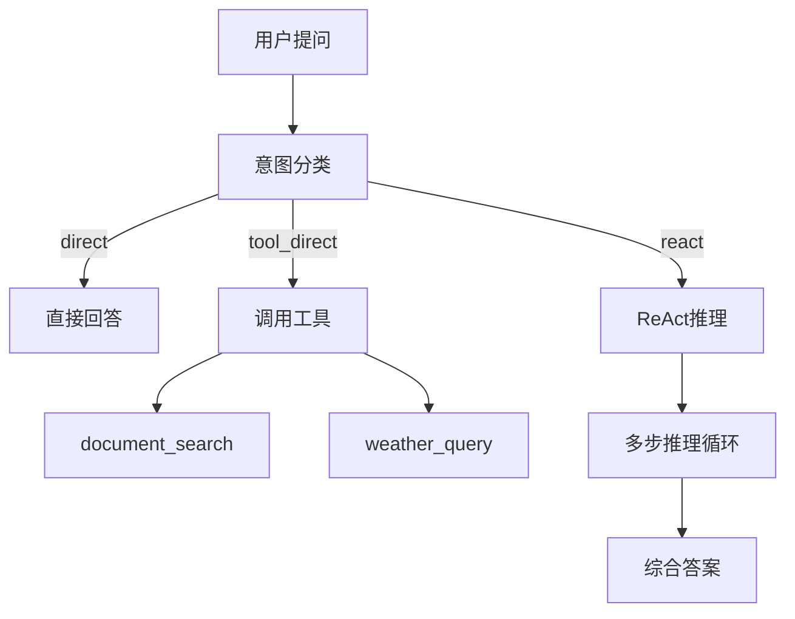

# 第07章：Agentic RAG核心 - ReAct智能代理的完整实现

本章实现系统最核心的组件：AgenticRAGAgent。

## 一、Agentic RAG架构



## 二、核心功能

**文件**：`models/agent.py`（629行）

核心特性：
- 智能路由：根据问题复杂度选择处理路径
- ReAct框架：Thought→Action→Observation循环
- 多策略检索：similarity/mmr/random
- 结构化输出：结论+依据+推理+建议

<details>
<summary>点击查看完整代码</summary>

```python
from typing import List, Dict, Optional, Any, Callable
import re
import json
import logging
from langchain.schema import BaseMessage, HumanMessage, AIMessage, SystemMessage
from langchain.agents import AgentExecutor, create_react_agent
from langchain.prompts import PromptTemplate
from langchain.tools import Tool, StructuredTool
from langchain.memory import ConversationBufferMemory
from langchain.callbacks.streaming_stdout import StreamingStdOutCallbackHandler
from config.settings import Settings
from services.llm_client import UnifiedLLMClient

logger = logging.getLogger(__name__)

class AgenticRAGAgent:
    """Agentic RAG智能问答代理 - 支持 Ollama 和在线 API"""

    def __init__(
        self,
        model_name: str = None,
        temperature: float = 0.7,
        max_tokens: int = 2048,
        tools: Optional[List[Callable]] = None,
        enable_memory: bool = True,
        system_prompt: Optional[str] = None,
        route_mode: str = "auto"
    ):
        self.settings = Settings()
        self.model_name = model_name or self.settings.get_default_model()
        self.temperature = temperature
        self.max_tokens = max_tokens
        self.tools = tools or []
        self.tool_funcs = {getattr(t, "__name__", f"tool_{i}"): t for i, t in enumerate(self.tools)}
        self.enable_memory = enable_memory
        self.system_prompt = system_prompt or self._get_default_system_prompt()
        self.route_mode = route_mode  # auto | kb_first | react_first

        # 初始化统一的 LLM 客户端
        self.llm_client = UnifiedLLMClient(
            model_name=self.model_name,
            temperature=self.temperature,
            max_tokens=self.max_tokens
        )

        # 获取 LangChain 兼容的 LLM 对象
        self.llm = self.llm_client.get_llm()

        # 初始化记忆
        if self.enable_memory:
            self.memory = ConversationBufferMemory(
                memory_key="chat_history",
                return_messages=True,
                output_key="output"
            )

        # 初始化代理
        self.agent = self._initialize_agent()

        # 记录初始化信息
        provider_info = self.llm_client.get_provider_info()
        logger.info(f"Agent 初始化完成 - 提供商: {provider_info['provider']}, 模型: {provider_info['model']}")

    def _get_default_system_prompt(self) -> str:
        """获取默认系统提示词"""
        return """你是一个智能问答助手，具备以下能力：

1. 文档问答：能够基于上传的文档回答相关问题
2. 天气查询：能够查询实时天气信息和天气预报
3. 多轮对话：能够理解上下文进行连续对话

行为准则：
- 回答要准确、简洁、有用
- 如果不确定答案，请说明
- 使用工具时要明确说明
- 保持友好和专业的态度
 - 对于寒暄或一般性问题，请直接回答，不要使用任何工具

工具使用说明：
- 当需要搜索文档时，使用document_search工具
- 当需要查询天气时，使用weather_query工具
- 根据用户问题的具体需求选择合适的工具
"""    

    def _initialize_agent(self):
        """初始化代理"""
        try:
            # 创建工具（使用StructuredTool并保持语义化名称）
            langchain_tools = []
            for i, tool_func in enumerate(self.tools):
                tool_name = getattr(tool_func, "__name__", f"tool_{i}")
                tool = StructuredTool.from_function(
                    func=tool_func,
                    name=tool_name,
                    description=tool_func.__doc__ or tool_name
                )
                langchain_tools.append(tool)

            # 创建提示词模板
            prompt_template = PromptTemplate(
                input_variables=["input", "chat_history", "agent_scratchpad", "tools", "tool_names"],
                template=self._create_agent_template()
            )

            # 创建代理
            if langchain_tools:
                agent = create_react_agent(
                    llm=self.llm,
                    tools=langchain_tools,
                    prompt=prompt_template
                )

                # 创建代理执行器
                agent_executor = AgentExecutor(
                    agent=agent,
                    tools=langchain_tools,
                    memory=self.memory if self.enable_memory else None,
                    verbose=True,
                    max_iterations=8,
                    max_execution_time=30,
                    early_stopping_method="force",
                    handle_parsing_errors="请严格在Thought后输出Action或Final Answer，并包含Action Input。",
                    return_intermediate_steps=True
                )

                return agent_executor
            else:
                # 如果没有工具，直接返回LLM
                return self.llm

        except Exception as e:
            logger.error(f"初始化代理失败: {str(e)}")
            raise

    def _create_agent_template(self) -> str:
        """创建代理提示词模板"""
        return f"""{self.system_prompt}

可用工具:
{{tools}}

工具名称:
{{tool_names}}

输出规则（必须严格遵循，英文关键词保留原样）：
1) 在每一步输出中，必须先写 Thought:，随后要么写 Action: 与 Action Input:，要么直接写 Final Answer: 结束。
2) Action 只能从工具名称中选择且一次仅一个；Action Input 必须是简短的一行字符串。
3) 当你不需要工具时，直接输出 Final Answer: 给出最终答案。
4) 当问题属于复杂查询（比较/推理/规划/跨片段综合/评价分析/场景迁移），必须在给出 Final Answer 前至少进行三次 Thought→Action→Action Input 循环，并依次执行：
   - 第1轮：Action=document_search_similarity（基于similarity检索）
   - 第2轮：Action=document_search_mmr（基于mmr检索）
   - 第3轮：Action=document_search_random（随机选择一种检索策略）
   在完成上述三轮检索并合并依据后，才可输出 Final Answer。
5) 当问题可能依赖外部知识或文档信息时，不要直接输出 Final Answer，先使用检索类工具获取依据，再综合回答。

示例：
Thought: 我需要从知识库检索本周OKR
Action: document_search_similarity
Action Input: 本周 OKR 周报 上线 课程

（收到工具结果后）
Thought: 为提高覆盖面，我需要用不同策略再次检索
Action: document_search_mmr
Action Input: 本周 OKR 周报 上线 课程

（收到工具结果后）
Thought: 再做一次随机策略检索以避免遗漏
Action: document_search_random
Action Input: 本周 OKR 周报 上线 课程

（合并三轮结果后）
Thought: 我已汇总检索片段并可以给出结构化答案（结论/依据/推理/建议）
Final Answer: 本周上线课程为……

当前对话历史:
{{chat_history}}

人类: {{input}}

助手: {{agent_scratchpad}}"""

    def _fallback_document_search(self, query: str) -> Optional[str]:
        """兜底：优先尝试文档检索返回摘要"""
        try:
            func = self.tool_funcs.get("document_search")
            if callable(func):
                return str(func(query))
        except Exception:
            return None
        return None

    def _friendly_tip_no_kb(self) -> str:
        """当向量库未就绪或工具不可用时的友好提示"""
        return (
            "未能从知识库检索到相关内容，或当前知识库尚未准备。\n"
            "请确认：\n"
            "1) 已在侧边栏上传文档（现支持上传即自动处理）并看到“✅ 向量存储已准备”；\n"
            "2) 或提供更具体的关键词，例如：‘本周OKR周报 内容’。"
        )

    def _compose_answer(self, query: str, kb_text: str) -> str:
        system = (
            "你将基于提供的知识库检索结果回答用户问题。请结构化输出：\n"
            "1) 结论：直接明确回答问题；\n"
            "2) 依据与引用：列出关键片段的要点，并标注引用编号或关键词；\n"
            "3) 推理过程：说明如何从片段推理到结论（包含比较/归纳/映射等必要步骤）；\n"
            "4) 限制与建议：如有不确定或缺失信息，指出并给出后续建议。"
        )
        messages = [
            SystemMessage(content=system),
            HumanMessage(content=f"问题: {query}\n\n检索结果:\n{kb_text}")
        ]
        result = self.llm.invoke(messages)
        answer = result.content if hasattr(result, "content") else str(result)
        citations_html = self._format_citations(kb_text)
        return f"{answer}\n\n{citations_html}" if citations_html else answer

    def _format_citations(self, kb_text: str) -> Optional[str]:
        try:
            text = kb_text or ""
            # 支持两种格式：
            # 1) [1] score=0.85 content=...
            # 2) 【文档1】\n内容: ...\n相似度: 0.85
            blocks: List[Dict[str, str]] = []

            # 解析格式1
            for m in re.finditer(r"\[(\d+)\]\s*score=([0-9.]+)\s*content=([^\n]+)", text):
                blocks.append({
                    "id": m.group(1),
                    "score": m.group(2),
                    "content": m.group(3).strip(),
                    "source": None
                })

            # 解析格式2A：相关度 + 原始分数 + 来源
            for m in re.finditer(r"【文档(\d+)】[\s\S]*?内容:\s*([\s\S]*?)\n\s*相关度:\s*([0-9]+)%（原始分数：\s*([0-9.]+)）(?:\n\s*来源:\s*([^\n]+))?", text):
                blocks.append({
                    "id": m.group(1),
                    "percent": m.group(3),
                    "raw": m.group(4),
                    "content": m.group(2).strip(),
                    "source": (m.group(5).strip() if m.group(5) else None)
                })
            # 解析格式2B：仅相关度 + 来源
            for m in re.finditer(r"【文档(\d+)】[\s\S]*?内容:\s*([\s\S]*?)\n\s*相关度:\s*([0-9]+)%(?:\n\s*来源:\s*([^\n]+))?", text):
                blocks.append({
                    "id": m.group(1),
                    "percent": m.group(3),
                    "raw": None,
                    "content": m.group(2).strip(),
                    "source": (m.group(4).strip() if m.group(4) else None)
                })
            # 解析格式2C：旧相似度 + 来源
            for m in re.finditer(r"【文档(\d+)】[\s\S]*?内容:\s*([\s\S]*?)\n\s*相似度:\s*([0-9.]+)(?:\n\s*来源:\s*([^\n]+))?", text):
                blocks.append({
                    "id": m.group(1),
                    "percent": None,
                    "raw": m.group(3),
                    "content": m.group(2).strip(),
                    "source": (m.group(4).strip() if m.group(4) else None)
                })

            if not blocks:
                return None

            items_html = "".join(
                (
                    "<li style='margin:0.35rem 0;'>"
                    + (
                        (
                            f"<div style='color:#374151;font-size:0.9rem;'>【文档{b['id']}】 相关度: {b['percent']}%（原始分数：{b['raw']}）</div>"
                            if b.get('raw') is not None
                            else f"<div style='color:#374151;font-size:0.9rem;'>【文档{b['id']}】 相关度: {b['percent']}%（原始分数：—）</div>"
                        )
                        if b.get('percent') is not None
                        else (
                            f"<div style='color:#374151;font-size:0.9rem;'>【文档{b['id']}】 原始分数：{b['raw']}</div>"
                            if b.get('raw') is not None
                            else ""
                        )
                      )
                    + (f"<div style='color:#374151;font-size:0.85rem;'>来源: {b['source']}</div>" if b.get('source') else "")
                    + f"<div style='color:#4b5563;font-size:0.9rem;'>片段: {b['content']}</div>"
                    + "</li>"
                ) for b in blocks
            )

            details = (
                "<details style='margin-top:0.5rem;'>"
                "<summary style='color:#6b7280;font-size:0.85rem;cursor:pointer;' title='点击展开查看引用详情'>"
                "引用（点击展开）"
                "</summary>"
                f"<ul style='list-style:disc;padding-left:1.25rem;margin-top:0.5rem;'>{items_html}</ul>"
                "</details>"
            )
            return details
        except Exception:
            return None

    def _rewrite_query_for_retrieval(self, query: str) -> Optional[str]:
        try:
            sys = "请将用户问题改写为用于知识库检索的简短关键词，使用空格分隔，保留核心名词、人物、事件、书名等，用中文。只输出关键词一行。"
            messages = [
                SystemMessage(content=sys),
                HumanMessage(content=query)
            ]
            result = self.llm.invoke(messages)
            content = getattr(result, "content", None) or str(result)
            return content.strip()
        except Exception:
            return None

    def _assess_complexity(self, query: str) -> str:
        """使用LLM判断复杂度，返回 'simple' 或 'complex'"""
        try:
            sys = (
                "判断用户问题是否需要多步推理、比较、规划、跨片段综合或场景迁移。"
                "以下类型一律视为复杂：包含‘最…’、‘谁更…’、排名/评估/比较、需要依据与论证的主观判断。"
                "请偏向严格：稍复杂即归为 complex。只输出一个英文单词：simple 或 complex。"
            )
            messages = [
                SystemMessage(content=sys),
                HumanMessage(content=query)
            ]
            result = self.llm.invoke(messages)
            content = getattr(result, "content", None) or str(result)
            val = content.strip().lower()
            return "complex" if "complex" in val else "simple"
        except Exception:
            return "simple"

    def _classify_intent(self, query: str) -> Dict[str, Any]:
        """意图判断：决定走 direct / tool_direct / react，并给出工具及输入"""
        try:
            tool_names = list(self.tool_funcs.keys()) or ["document_search", "weather_query"]
            system = (
                "你是一个智能路由器，任务是为用户问题选择最合适的处理路径。"
                "可选 route: direct(直接用LLM回答)、tool_direct(直接调用某个工具)、react(交给Agent执行ReAct多步推理)。"
                "输出必须是严格的单行 JSON，且只包含指定字段。"
            )
            instruction = (
                "决策标准：\n"
                "1) direct：寒暄/一般性问答/纯主观表达/明确不需外部信息。\n"
                "2) tool_direct（RAG-first）：除上述特定需求外，默认优先选择 document_search，将核心关键词作为 tool_input。\n"
                "   - 日期/时间：必须选 datetime_now\n"
                "   - 天气：必须选 weather_query\n"
                "3) react：复杂问题(比较/推理/规划/多条件/跨片段综合/角色映射/评价分析/行业应用迁移)。\n"
                "   包括含‘最…’、‘谁更…’、排名/评估/比较、需要依据与论证的主观判断等，一律选 react。即使存在知识库，也应选择 react，在链中结合检索与推理生成更精准答案。\n"
                f"工具可选: {tool_names}。\n"
                "输出格式(仅此JSON，不能包含注释/Markdown/额外文本)："
                "{\"route\":<direct|tool_direct|react>, \"tool\":<工具名或null>, \"tool_input\":<字符串或null>, \"reason\":<中文简要理由>}\n"
                "字段要求：route 必填且为三选一；当 route=tool_direct 时 tool 必须取自工具列表且非空，tool_input 为提取的简短关键词；其余情况 tool 与 tool_input 置为 null。\n"
                "示例：\n"
                "- 用户：你好 → {\"route\":\"direct\", \"tool\":null, \"tool_input\":null, \"reason\":\"寒暄直答\"}\n"
                "- 用户：今天是周几 → {\"route\":\"tool_direct\", \"tool\":\"datetime_now\", \"tool_input\":\"\", \"reason\":\"需要系统时间\"}\n"
                "- 用户：查询上海当前天气 → {\"route\":\"tool_direct\", \"tool\":\"weather_query\", \"tool_input\":\"上海\", \"reason\":\"天气查询\"}\n"
                "- 用户：根据OKR周报总结本周上线课程 → {\"route\":\"tool_direct\", \"tool\":\"document_search\", \"tool_input\":\"本周 上线 课程 OKR\", \"reason\":\"RAG优先\"}\n"
                "- 用户：比较两套架构的优缺点并给出实施步骤 → {\"route\":\"react\", \"tool\":null, \"tool_input\":null, \"reason\":\"复杂多步推理\"}\n"
                "- 用户：西游记中最厉害的神仙是哪位 → {\"route\":\"react\", \"tool\":null, \"tool_input\":null, \"reason\":\"评估/比较类，需依据与论证\"}"
            )

            messages = [
                SystemMessage(content=system),
                HumanMessage(content=f"{instruction}\n\n用户问题: {query}")
            ]

            # 在线API用消息协议；Ollama用字符串
            result = self.llm.invoke(messages) if hasattr(self.llm, "invoke") else self.llm(messages)
            content = getattr(result, "content", None) or str(result)
            content = content.strip().splitlines()[-1]
            data = json.loads(content)
            route = str(data.get("route", "react")).lower()
            tool = data.get("tool")
            tool_input = data.get("tool_input") or query
            return {"route": route, "tool": tool, "tool_input": tool_input, "raw": data}
        except Exception:
            # 兜底：走 direct
            return {"route": "direct", "tool": None, "tool_input": query}

    def _is_small_talk(self, query: str) -> bool:
        """判断是否为寒暄或通用简单问候"""
        q = (query or "").strip().lower()
        if not q:
            return True
        keywords = [
            "你好", "您好", "嗨", "hello", "hi", "hey", "早上好", "下午好", "晚上好",
            "谢谢", "再见", "测试", "hello world"
        ]
        if any(k in q for k in keywords):
            return True
        return len(q) <= 12 and ("?" not in q and "？" not in q)

    def _is_complex_query(self, query: str) -> bool:
        """判断是否为复杂查询：需要多步推理、比较、归纳或跨片段综合"""
        q = (query or "").strip().lower()
        signals = [
            "为什么", "如何", "怎么", "原理", "推导", "证明", "比较", "排序", "优缺点",
            "方案", "步骤", "计划", "依据", "精准", "综合", "总结", "分析", "多条件",
            "跨", "结合", "不确定", "推理"
        ]
        if any(s in q for s in signals):
            return True
        return len(q) >= 18

    def _should_use_tools(self, query: str) -> bool:
        """判断是否需要使用工具处理当前查询"""
        q = (query or "").strip()
        if not q:
            return False
        if self._is_small_talk(q):
            return False
        tool_signals = [
            "文档", "检索", "搜索", "查找", "根据文档", "从资料", "阅读材料", "pdf", "docx",
            "天气", "气温", "预报", "降雨", "风力", "湿度"
        ]
        return any(s in q for s in tool_signals)

    def generate_response(self, query: str) -> str:
        """生成回答"""
        try:
            logger.info(f"生成回答 - 查询: {query}")

            if isinstance(self.agent, AgentExecutor):
                # 路由模式覆盖：kb_first / react_first / auto
                if self.route_mode == "react_first":
                    logger.info("路由模式: react_first")
                    decision = {"route": "react", "tool": None, "tool_input": None}
                elif self.route_mode == "kb_first" and not self._is_small_talk(query):
                    logger.info("路由模式: kb_first")
                    rewritten = self._rewrite_query_for_retrieval(query) or query
                    func = self.tool_funcs.get("document_search")
                    if callable(func):
                        text = str(func(rewritten))
                        if text.strip() and "未找到" not in text:
                            # 根据复杂度选择：simple -> 直接RAG合成；complex -> 走ReAct
                            level = self._assess_complexity(query)
                            if level == "complex":
                                decision = {"route": "react", "tool": None, "tool_input": None}
                            else:
                                decision = {"route": "tool_direct", "tool": "document_search", "tool_input": rewritten}
                        else:
                            decision = self._classify_intent(query)
                    else:
                        decision = self._classify_intent(query)
                # 默认自动模式：由LLM意图识别
                if 'decision' not in locals():
                    decision = self._classify_intent(query)
                route = decision.get("route", "react")
                if route == "direct":
                    logger.info("路由: direct - 直接调用LLM生成答案")
                    messages = [
                        SystemMessage(content=self.system_prompt),
                        HumanMessage(content=query)
                    ]
                    output = self.llm.invoke(messages)
                    final = output.content if hasattr(output, "content") else str(output)
                    if not self._is_small_talk(query):
                        rewritten = self._rewrite_query_for_retrieval(query) or query
                        func = self.tool_funcs.get("document_search")
                        if callable(func):
                            text = str(func(rewritten))
                            if text.strip() and "未找到" not in text:
                                return self._compose_answer(query, text)
                    return final
                elif route == "tool_direct":
                    tool_name = decision.get("tool")
                    tool_input = decision.get("tool_input") or (self._rewrite_query_for_retrieval(query) or query)
                    logger.info(f"路由: tool_direct - 工具={tool_name}, 输入={tool_input}")
                    func = self.tool_funcs.get(tool_name)
                    if callable(func):
                        result_text = func(tool_input)
                        text = str(result_text)
                        if tool_name == "document_search":
                            if not text.strip() or "未找到" in text:
                                return self._friendly_tip_no_kb()
                            return self._compose_answer(query, text)
                        return text
                    # 如果未找到匹配工具，回退到react
                    return self._friendly_tip_no_kb()
                else:
                    logger.info("路由: react - 启动AgentExecutor进行ReAct推理")
                    response = self.agent.invoke({"input": query})
                    try:
                        step_count = len(response.get("intermediate_steps", []))
                        logger.info(f"ReAct 步数: {step_count}")
                    except Exception:
                        pass

                output = response.get("output", "抱歉，我无法生成回答。")

                # 记录中间步骤
                if "intermediate_steps" in response:
                    for action, observation in response["intermediate_steps"]:
                        try:
                            logger.info(f"ReAct Thought/Action:\n{action.log}")
                        except Exception:
                            logger.info(f"ReAct Action: 工具={getattr(action,'tool',None)}, 输入={getattr(action,'tool_input',None)}")
                        obs_preview = str(observation)
                        if len(obs_preview) > 500:
                            obs_preview = obs_preview[:500] + "..."
                        logger.info(f"ReAct Observation: {obs_preview}")

                # 兜底：如果迭代停止或解析异常，优先尝试文档检索
                if isinstance(output, str) and "Agent stopped due to iteration limit or time limit" in output:
                    fallback = self._fallback_document_search(query)
                    if fallback:
                        return self._compose_answer(query, fallback)
                    return self._friendly_tip_no_kb()
                if isinstance(output, str) and "is not a valid tool" in output:
                    return self._friendly_tip_no_kb()

                # 强制保障：复杂查询在ReAct路径下至少进行三轮不同策略的检索
                try:
                    steps = response.get("intermediate_steps", [])
                    used_tools = [getattr(a, "tool", None) for a, _ in steps]
                    need_tools = [
                        "document_search_similarity",
                        "document_search_mmr",
                        "document_search_random",
                    ]
                    missing = [t for t in need_tools if t not in used_tools]
                    if missing:
                        rewritten = self._rewrite_query_for_retrieval(query) or query
                        combined_texts: List[str] = []
                        for t in need_tools:
                            func = self.tool_funcs.get(t)
                            if callable(func):
                                try:
                                    combined_texts.append(str(func(rewritten)))
                                except Exception:
                                    pass
                        merged = "\n".join([s for s in combined_texts if s and s.strip()])
                        if merged.strip():
                            return self._compose_answer(query, merged)
                    else:
                        # 已执行三轮：将三轮观察合并为结构化答案
                        try:
                            kb_parts: List[str] = []
                            for action, observation in steps:
                                if getattr(action, "tool", None) in need_tools:
                                    kb_parts.append(str(observation))
                            kb_text = "\n".join([p for p in kb_parts if p and p.strip()])
                            if kb_text.strip():
                                return self._compose_answer(query, kb_text)
                        except Exception:
                            pass
                except Exception:
                    pass

            else:
                # 直接使用LLM
                messages = [
                    SystemMessage(content=self.system_prompt),
                    HumanMessage(content=query)
                ]

                output = self.agent.invoke(messages).content

            logger.info(f"生成回答成功: {output[:100]}...")
            return output

        except Exception as e:
            error_msg = f"生成回答时出错: {str(e)}"
            logger.error(error_msg)
            return f"抱歉，处理您的请求时出现了错误。{str(e)}"   
        
    # 重复定义的 _create_agent_template 已移除，统一使用前面的模板

    # 重复定义的 generate_response 已移除，统一使用前面的主实现

    def add_tool(self, tool: Callable, name: str = None, description: str = None):
        """添加工具"""
        self.tools.append(tool)

        # 重新初始化代理
        self.agent = self._initialize_agent()

        logger.info(f"添加工具: {name or tool.__name__}")

    def clear_memory(self):
        """清空记忆"""
        if self.enable_memory and hasattr(self, 'memory'):
            self.memory.clear()
            logger.info("记忆已清空")

    def get_memory_history(self) -> List[Dict[str, str]]:
        """获取记忆历史"""
        if not self.enable_memory or not hasattr(self, 'memory'):
            return []

        try:
            messages = self.memory.chat_memory.messages
            history = []

            for message in messages:
                if isinstance(message, HumanMessage):
                    history.append({"role": "user", "content": message.content})
                elif isinstance(message, AIMessage):
                    history.append({"role": "assistant", "content": message.content})

            return history
        except Exception as e:
            logger.error(f"获取记忆历史失败: {str(e)}")
            return []

    def update_system_prompt(self, new_prompt: str):
        """更新系统提示词"""
        self.system_prompt = new_prompt

        # 重新初始化代理
        self.agent = self._initialize_agent()

        logger.info("系统提示词已更新")

    def get_model_info(self) -> Dict[str, Any]:
        """获取模型信息"""
        provider_info = self.llm_client.get_provider_info()

        return {
            "provider": provider_info.get("provider", "未知"),
            "model_name": self.model_name,
            "temperature": self.temperature,
            "max_tokens": self.max_tokens,
            "tools_count": len(self.tools),
            "memory_enabled": self.enable_memory,
            "system_prompt_length": len(self.system_prompt),
            "base_url": provider_info.get("base_url", "")
        }                      
```

</details>

## 三、本章总结

✅ 实现了完整的Agentic RAG Agent
✅ 三层路由系统（direct/tool_direct/react）
✅ ReAct多步推理框架
✅ 复杂查询强制三轮检索保障

**下节预告**：第08章实现Streamlit Web应用界面。
