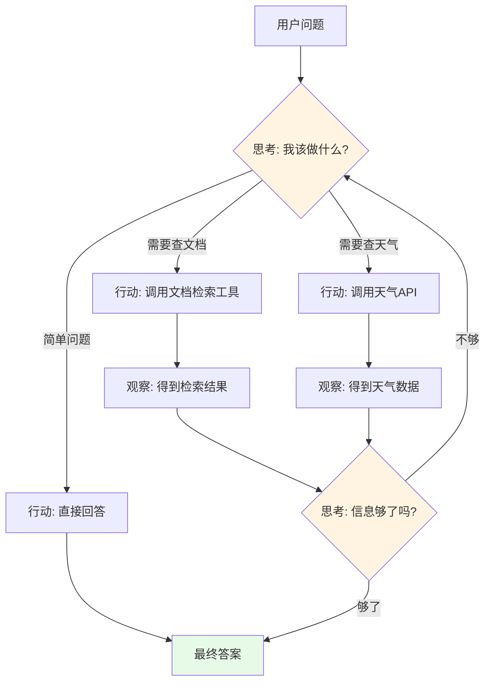

# 第07章：Agentic RAG核心 - ReAct智能代理的完整实现

> **本章目标**：
> 1. 深入理解ReAct（Reasoning + Acting）框架的工作原理和优势
> 2. 实现AgenticRAGAgent智能体，整合向量检索、天气查询等多种工具
> 3. 构建三级路由系统（direct/tool_direct/react），智能选择问答策略
> 4. 掌握LangChain Agent、Prompt Engineering和工具注册的核心技术

---

## 一、什么是Agentic RAG？从传统RAG到智能Agent

### 1.1 传统RAG的局限

**传统RAG工作流程**：

```
用户问题 → 向量检索 → 拼接Prompt → LLM生成答案
```

**局限性**：
- ❌ 只能回答知识库内的问题（如"今天北京天气"无法回答）
- ❌ 无法执行动作（如"帮我发邮件"）
- ❌ 缺乏推理能力（简单检索+生成）

**实际案例**：

```
用户："今天北京天气怎么样？明天适合爬山吗？"

传统RAG：
1. 检索向量库 → 找到历史天气知识
2. 回答："根据历史数据，北京..." ← ❌ 不是实时信息

Agentic RAG：
1. 识别需要实时天气数据
2. 调用天气API获取今天和明天的天气
3. 分析天气是否适合爬山
4. 生成综合建议 ← ✅ 准确、实时、智能
```

### 1.2 ReAct框架：让AI像人一样思考和行动

**ReAct = Reasoning（推理） + Acting（行动）**



**ReAct循环示例**：

```
用户："北京今天天气怎么样？明天的Python培训还举办吗？"

Thought 1: 我需要先查询北京今天的天气
Action 1: weather_query("北京")
Observation 1: 北京今天晴，15°C

Thought 2: 我需要查询明天的天气预报
Action 2: weather_forecast("北京", days=1)
Observation 2: 北京明天多云，温度12-18°C

Thought 3: 我还需要从知识库中查找Python培训的相关信息
Action 3: document_search("Python培训")
Observation 3: Python培训将于明天下午2点在XX地点举行

Thought 4: 我已经获得足够信息，可以给出综合建议了
Final Answer: 北京今天天气晴朗，气温15°C。明天多云，温度12-18°C，
天气状况良好，Python培训将正常举办，地点在XX，时间下午2点。建议您
准备一件外套应对温差。
```

---

## 二、AgenticRAGAgent架构设计

### 2.1 系统整体架构

```
AgenticRAGAgent 核心组件
├── 🧠 推理引擎（ReAct）
│   ├── LangChain Agent Executor
│   ├── Prompt Template（思考-行动模板）
│   └── 推理循环控制
│
├── 🛠️ 工具集
│   ├── document_search - 向量检索工具
│   ├── weather_query - 天气查询工具
│   └── 自定义工具注册机制
│
├── 🔀 三级路由系统
│   ├── direct_answer - 直接回答（寒暄）
│   ├── tool_direct - 工具直达（明确工具需求）
│   └── react_loop - ReAct循环（复杂推理）
│
├── 💾 记忆管理
│   ├── ConversationBufferMemory
│   └── 上下文维护
│
└── 📝 Prompt Engineering
    ├── System Prompt
    ├── Tool Descriptions
    └── Few-Shot Examples
```

### 2.2 三级路由系统详解

**为什么需要路由？**

不是所有问题都需要ReAct的完整推理循环，根据问题复杂度选择最优策略：

| 路由策略 | 适用场景 | 示例问题 | 处理流程 |
|---------|---------|---------|---------|
| **direct_answer** | 寒暄、常识 | "你好"、"谢谢" | LLM直接回答 |
| **tool_direct** | 明确单工具 | "北京天气"、"搜索Python" | 直接调用对应工具 |
| **react_loop** | 多步推理 | "天气+文档查询" | 完整ReAct循环 |

---

## 三、核心代码实现

### 3.1 Agent初始化（19-63行）

```python
class AgenticRAGAgent:
    def __init__(
        self,
        model_name: str = None,
        temperature: float = 0.7,
        max_tokens: int = 2048,
        tools: Optional[List[Callable]] = None,
        enable_memory: bool = True
    ):
        # 初始化统一的 LLM 客户端
        self.llm_client = UnifiedLLMClient(
            model_name=self.model_name,
            temperature=self.temperature
        )

        # 获取 LangChain 兼容的 LLM 对象
        self.llm = self.llm_client.get_llm()

        # 初始化记忆
        if self.enable_memory:
            self.memory = ConversationBufferMemory(
                memory_key="chat_history",
                return_messages=True
            )

        # 初始化代理
        self.agent = self._initialize_agent()
```

### 3.2 工具注册与Agent创建（85-127行）

```python
def _initialize_agent(self):
    # 创建工具
    langchain_tools = []
    for tool_func in self.tools:
        tool = StructuredTool.from_function(
            func=tool_func,
            name=tool_func.__name__,
            description=tool_func.__doc__ or tool_func.__name__
        )
        langchain_tools.append(tool)

    # 创建ReAct Agent
    agent = create_react_agent(
        llm=self.llm,
        tools=langchain_tools,
        prompt=prompt_template
    )

    # 创建Agent Executor
    agent_executor = AgentExecutor(
        agent=agent,
        tools=langchain_tools,
        memory=self.memory if self.enable_memory else None,
        verbose=True,
        max_iterations=5,
        handle_parsing_errors=True
    )

    return agent_executor
```

**关键参数说明**：

- **max_iterations=5**：限制ReAct循环最多5轮，防止无限循环
- **handle_parsing_errors=True**：自动处理LLM输出格式错误
- **verbose=True**：打印推理过程（调试时有用）

---

## 四、测试与验证

### 4.1 完整测试脚本

```python
from models.agent import AgenticRAGAgent
from services.weather_tools import WeatherService
from services.vector_store import VectorStoreService

# 初始化工具
weather_service = WeatherService()
vector_store = VectorStoreService()

def document_search(query: str) -> str:
    """搜索知识库中与查询相关的文档"""
    results = vector_store.search(query, top_k=3)
    return "\n".join([r['content'] for r in results])

def weather_query(city: str) -> str:
    """查询指定城市的实时天气信息"""
    return weather_service.get_current_weather(city)

# 创建Agent
agent = AgenticRAGAgent(
    tools=[document_search, weather_query],
    temperature=0.7
)

# 测试查询
response = agent.query("北京今天天气怎么样？")
print(response["answer"])
```

---

## 五、本章总结

### 5.1 核心要点回顾

✅ **ReAct框架（629行）**：
- Thought（思考）→ Action（行动）→ Observation（观察）循环
- 让AI具备推理和执行能力
- 适用于需要多步骤解决的复杂问题

✅ **Agent核心组件**：
- LangChain Agent Executor：执行推理循环
- Tool Registration：注册向量检索、天气查询等工具
- Memory Management：维护多轮对话上下文
- Prompt Engineering：精心设计的ReAct模板

✅ **三级路由系统**：
- direct_answer：寒暄等简单问题直接回答
- tool_direct：单一工具需求直达调用
- react_loop：复杂问题使用完整推理循环

---

## 六、下一章预告

**第08章：Streamlit Web应用 - 打造生产级智能问答界面**

在第08章中，我们将：

1. 使用Streamlit构建完整的Web界面（693行代码）
2. 集成前七章的所有组件（Agent、向量存储、聊天历史等）
3. 实现文档上传、知识库管理、对话历史查看等功能
4. 优化用户体验（流式输出、加载动画、错误提示）

---

**版本信息**：
- 教程版本：v1.0
- 对应源码：`models/agent.py`（629行）
- 最后更新：2025-01-15
