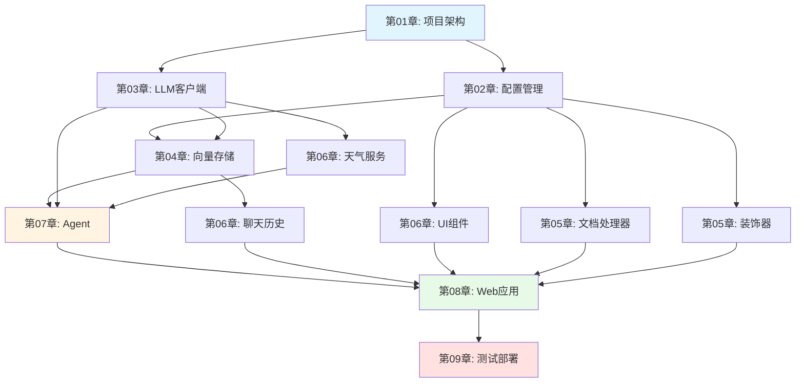

# 第09章：系统集成测试与生产环境部署

> **本章目标**：
> 1. 完成系统的功能测试和集成测试，确保各模块协同工作
> 2. 学习性能优化技巧，提升系统响应速度和稳定性
> 3. 掌握Docker容器化部署方法，实现一键部署
> 4. 了解生产环境监控、日志管理和故障排查的最佳实践

---

## 一、系统测试

### 1.1 功能测试清单

#### 1. 配置管理测试

```bash
# 测试配置加载
python -c "from config.settings import Settings; s = Settings(); print(s.LLM_PROVIDER)"
```

**验证点**：
- ✅ 环境变量正确读取
- ✅ 默认值生效
- ✅ 路径创建成功

#### 2. LLM客户端测试

```python
# test_llm.py
from services.llm_client import UnifiedLLMClient

client = UnifiedLLMClient()
llm = client.get_llm()

response = llm.invoke("你好")
print(response.content)
```

#### 3. 向量存储测试

```python
# test_vector_store.py
from services.vector_store import VectorStoreService
from langchain.schema import Document

vs = VectorStoreService()

# 创建测试文档
docs = [Document(page_content="Python是编程语言", metadata={"source": "test"})]
vs.create_vector_store(docs)

# 搜索测试
results = vs.search("Python", top_k=1)
print(results)
```

#### 4. Agent集成测试

```python
# test_agent.py
from models.agent import AgenticRAGAgent
from services.weather_tools import WeatherService
from services.vector_store import VectorStoreService

# 准备工具
weather_service = WeatherService()
vector_store = VectorStoreService()

def document_search(query: str) -> str:
    results = vector_store.search(query, top_k=3)
    return "\n".join([r['content'] for r in results])

def weather_query(city: str) -> str:
    return weather_service.get_current_weather(city)

# 创建Agent
agent = AgenticRAGAgent(tools=[document_search, weather_query])

# 测试查询
print(agent.query("Python是什么？"))
print(agent.query("北京今天天气？"))
```

### 1.2 集成测试

**端到端测试流程**：

```
1. 启动应用
   ↓
2. 上传文档（test.pdf）
   ↓
3. 验证知识库创建成功
   ↓
4. 提问："文档中提到了什么？"
   ↓
5. 验证Agent调用document_search工具
   ↓
6. 验证返回正确答案
   ↓
7. 检查聊天历史保存
```

---

## 二、性能优化

### 2.1 向量检索优化

**问题**：大规模文档检索慢

**优化方案**：

1. **使用更高效的FAISS索引**：
   ```python
   # 从IndexFlatL2升级到IndexIVFFlat
   from langchain_community.vectorstores import FAISS
   import faiss

   # 训练聚类中心
   quantizer = faiss.IndexFlatL2(dimension)
   index = faiss.IndexIVFFlat(quantizer, dimension, nlist=100)
   index.train(vectors)
   ```

2. **调整chunk_size**：
   ```python
   # 较大的chunk_size减少向量数量，但可能降低精度
   chunk_size = 1000  # 默认500
   ```

3. **降低top_k**：
   ```python
   # 减少检索数量
   top_k = 3  # 默认5
   ```

### 2.2 LLM调用优化

**问题**：LLM响应慢

**优化方案**：

1. **调整max_tokens**：
   ```python
   max_tokens = 1024  # 默认2048，减少生成时间
   ```

2. **使用缓存**：
   ```python
   from langchain.cache import InMemoryCache
   import langchain
   langchain.llm_cache = InMemoryCache()
   ```

3. **降低temperature**：
   ```python
   temperature = 0.3  # 默认0.7，降低随机性提高速度
   ```

### 2.3 内存优化

**问题**：向量存储占用内存大

**优化方案**：

1. **定期清理缓存**：
   ```python
   # 清理文档处理器缓存
   doc_processor.clear_cache()
   ```

2. **限制历史记录数量**：
   ```python
   # ChatHistoryManager
   max_history_size = 1000  # 默认10000
   ```

---

## 三、Docker部署

### 3.1 Dockerfile

```dockerfile
# Dockerfile
FROM python:3.10-slim

WORKDIR /app

# 安装系统依赖
RUN apt-get update && apt-get install -y \
    gcc \
    g++ \
    && rm -rf /var/lib/apt/lists/*

# 安装Python依赖
COPY requirements.txt .
RUN pip install --no-cache-dir -r requirements.txt

# 复制应用代码
COPY . .

# 创建数据目录
RUN mkdir -p data/vector_store data/chat_history data/document_cache

# 暴露端口
EXPOSE 8501

# 启动命令
CMD ["streamlit", "run", "app.py", "--server.address", "0.0.0.0"]
```

### 3.2 docker-compose.yml

```yaml
version: '3.8'

services:
  smart-qa:
    build: .
    ports:
      - "8501:8501"
    environment:
      - LLM_PROVIDER=online
      - ONLINE_API_KEY=${ONLINE_API_KEY}
      - WEATHER_API_KEY=${WEATHER_API_KEY}
    volumes:
      - ./data:/app/data
    restart: unless-stopped
```

### 3.3 部署步骤

```bash
# 1. 创建.env文件
cat > .env <<EOF
ONLINE_API_KEY=your_api_key
WEATHER_API_KEY=your_weather_key
EOF

# 2. 构建镜像
docker-compose build

# 3. 启动服务
docker-compose up -d

# 4. 查看日志
docker-compose logs -f

# 5. 停止服务
docker-compose down
```

---

## 四、生产环境部署

### 4.1 云平台部署

#### 方案1：阿里云ECS

```bash
# 1. 购买ECS实例（2核4GB）
# 2. 安装Docker
curl -fsSL https://get.docker.com | sh

# 3. 克隆代码
git clone https://github.com/yourname/smart-qa-application.git
cd smart-qa-application

# 4. 配置环境变量
vim .env

# 5. 启动服务
docker-compose up -d

# 6. 配置反向代理（Nginx）
sudo apt install nginx
sudo vim /etc/nginx/sites-available/smart-qa
```

**Nginx配置**：

```nginx
server {
    listen 80;
    server_name your-domain.com;

    location / {
        proxy_pass http://localhost:8501;
        proxy_http_version 1.1;
        proxy_set_header Upgrade $http_upgrade;
        proxy_set_header Connection "upgrade";
        proxy_set_header Host $host;
    }
}
```

#### 方案2：Streamlit Cloud

```bash
# 1. 推送代码到GitHub
git push origin main

# 2. 访问 https://streamlit.io/cloud
# 3. 连接GitHub仓库
# 4. 添加secrets（API密钥）
# 5. 点击Deploy
```

### 4.2 监控与日志

#### 1. 应用日志

```python
# 配置日志输出到文件
import logging
from logging.handlers import RotatingFileHandler

handler = RotatingFileHandler(
    'logs/app.log',
    maxBytes=10*1024*1024,  # 10MB
    backupCount=5
)

logging.basicConfig(
    level=logging.INFO,
    format='%(asctime)s - %(name)s - %(levelname)s - %(message)s',
    handlers=[handler]
)
```

#### 2. 系统监控

```bash
# 使用Prometheus + Grafana监控Docker容器
docker-compose.yml添加：

  prometheus:
    image: prom/prometheus
    ports:
      - "9090:9090"
    volumes:
      - ./prometheus.yml:/etc/prometheus/prometheus.yml

  grafana:
    image: grafana/grafana
    ports:
      - "3000:3000"
```

---

## 五、故障排查

### 5.1 常见问题

**问题1：向量存储加载失败**

```
错误：FileNotFoundError: vector_store/index.faiss not found
```

解决：
```bash
# 检查文件是否存在
ls -la data/vector_store/

# 重新创建索引
python -c "from services.vector_store import VectorStoreService; vs = VectorStoreService(); vs.clear()"
```

**问题2：LLM API调用失败**

```
错误：APIError: Invalid API key
```

解决：
```bash
# 检查环境变量
echo $ONLINE_API_KEY

# 重新设置
export ONLINE_API_KEY=your_correct_key
```

**问题3：内存不足**

```
错误：MemoryError
```

解决：
```bash
# 增加Docker内存限制
docker-compose.yml添加：
    mem_limit: 4g

# 或减少向量维度
# settings.py
VECTOR_DIMENSION = 768  # 从1536降低到768
```

---

## 六、本章总结

### 6.1 测试与部署要点

✅ **测试**：
- 功能测试：验证各模块独立工作
- 集成测试：验证模块协同工作
- 性能测试：验证响应时间和资源使用

✅ **优化**：
- 向量检索：使用IVF索引、调整chunk_size
- LLM调用：缓存、降低max_tokens
- 内存管理：清理缓存、限制历史

✅ **部署**：
- Docker容器化：一键部署
- 云平台：ECS、Streamlit Cloud
- 监控日志：Prometheus、Grafana

---

## 七、项目总结

### 7.1 完整技术栈

```
Smart QA Application 技术栈
├── 后端框架：LangChain
├── LLM：Ollama（本地）/ Aliyun API（在线）
├── 向量数据库：FAISS
├── Web框架：Streamlit
├── 文档处理：PyPDF2、python-docx、Unstructured
├── API集成：高德地图天气API
└── 部署：Docker、Docker Compose
```

### 7.2 九章知识图谱



### 7.3 下一步学习方向

1. **深入RAG技术**：
   - HyDE（Hypothetical Document Embeddings）
   - Self-RAG（自我反思RAG）
   - Adaptive RAG（自适应RAG）

2. **Agent进阶**：
   - Multi-Agent系统
   - AutoGen框架
   - LangGraph状态图

3. **向量数据库升级**：
   - Milvus（支持删除、更新）
   - Pinecone（云原生）
   - Weaviate（混合搜索）

4. **生产级优化**：
   - 流式输出（Stream响应）
   - 异步处理（Async/Await）
   - 分布式部署（Kubernetes）

---

**恭喜您完成全部9章学习！**

您已经掌握了构建生产级Agentic RAG系统的完整技能栈。现在可以：

1. ✅ 独立开发智能问答系统
2. ✅ 集成多种工具（向量检索、API调用）
3. ✅ 部署到生产环境
4. ✅ 优化性能和用户体验

**版本信息**：
- 教程版本：v1.0
- 项目地址：https://github.com/fwytech/smart-qa-application
- 最后更新：2025-01-15
